# GitHub是啥玩意？

当然是全球最大同性交友平台

> Git 是由 Linux 之父 Linus Tovalds 为了更好地管理linux内核开发而创立的分布式版本控制／软件配置管理软件。

简单来说，Git 是一个管理你的「代码的历史记录」的工具。

~~什么？代码？溜了溜了。。。。。~~

诶兄弟别急，GitHub的强大之处可不仅仅可以管理代码，我觉得人人都应该会这个！

# 开始GitHub之旅

## 一、 注册登录

**第一步：打开官网**：[https://github.com](https://github.com/)

注册一个帐户。

登录你的账号

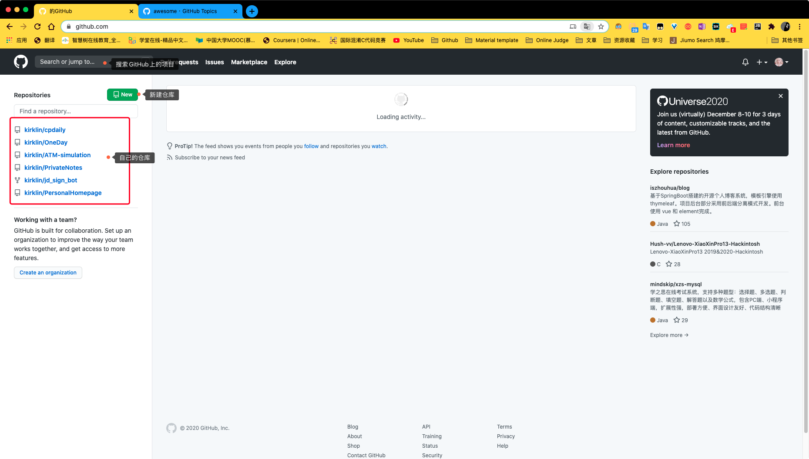

## 二、Repository介绍

「repositories」就是你的仓库们。你只需知道 Repository 是个放项目的地方就行。有时候会出现 Repositories，是多个 Repository 的意思。

我们先点击New构建一个Repository

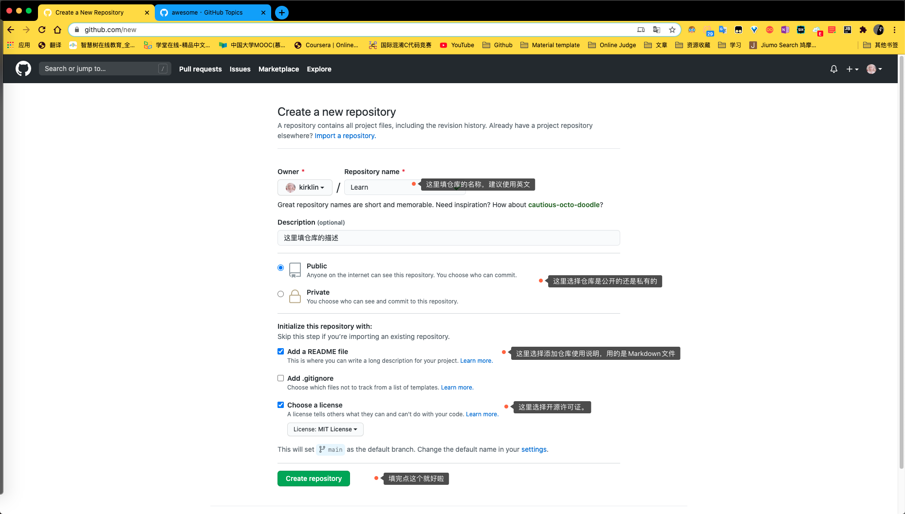

填写仓库的名字和描述

点create Repository 就可以创建你的仓库

创建完就会出现下面的界面

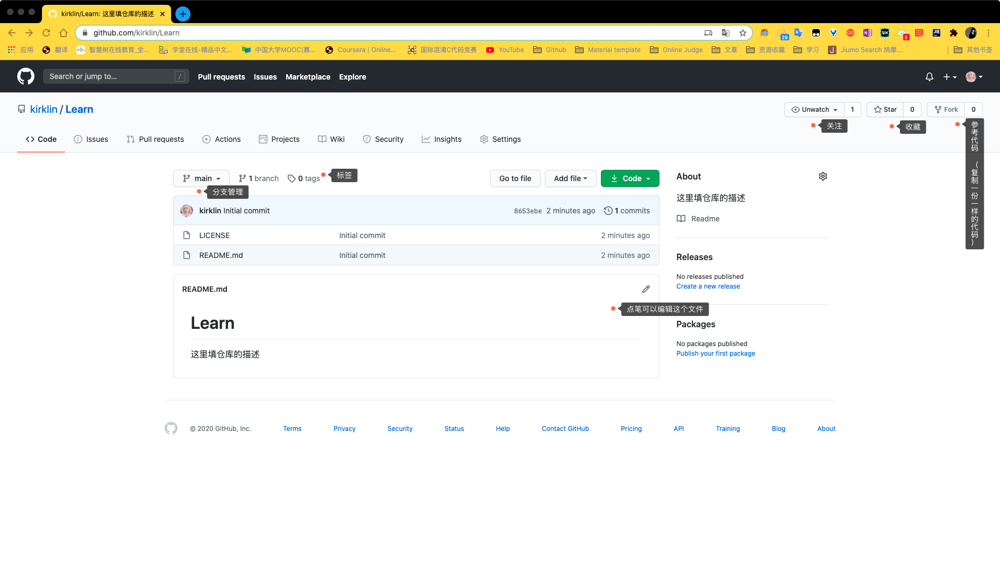

## 三、Fork

## 四、Git分支

Git的精髓就在分支管理，可以把Git的分支理解成拍照，新建一个分支就是拍了一张照片，你所做的所有操作都是在这张照片上，分支可以进行合并。

相当于你把对照片的更改还原为了现实世界。听上去是不是很神奇。每个人都可以进行分支的创建与合并。

**接下来用图片演示如何进行GitHub的分支创建及修改分支上的内容：**

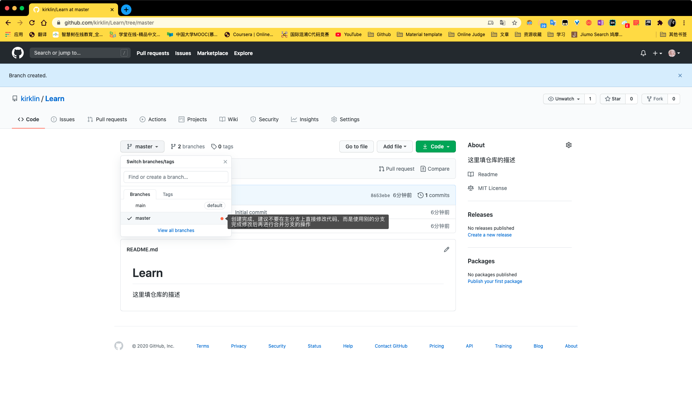

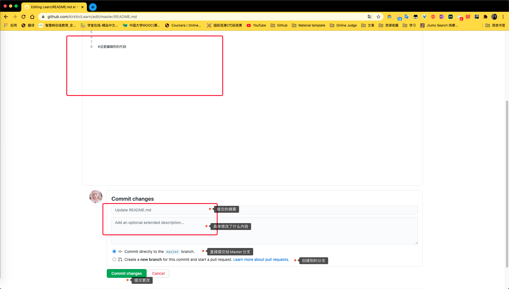

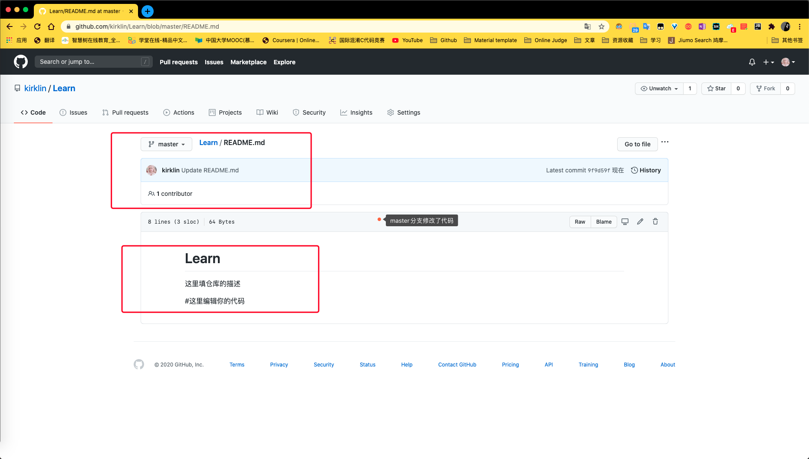

## 五、分支合并

相当于使用滤镜，别人可以把滤镜应用到你的照片上，你也可以自己对照片进行调色。

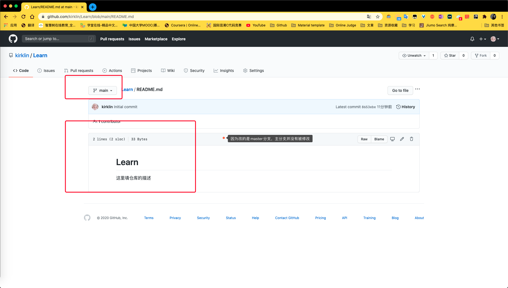

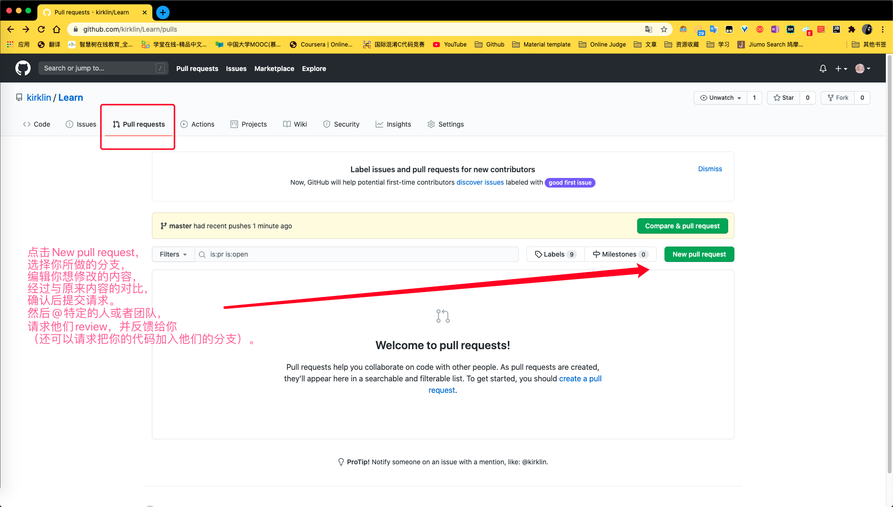

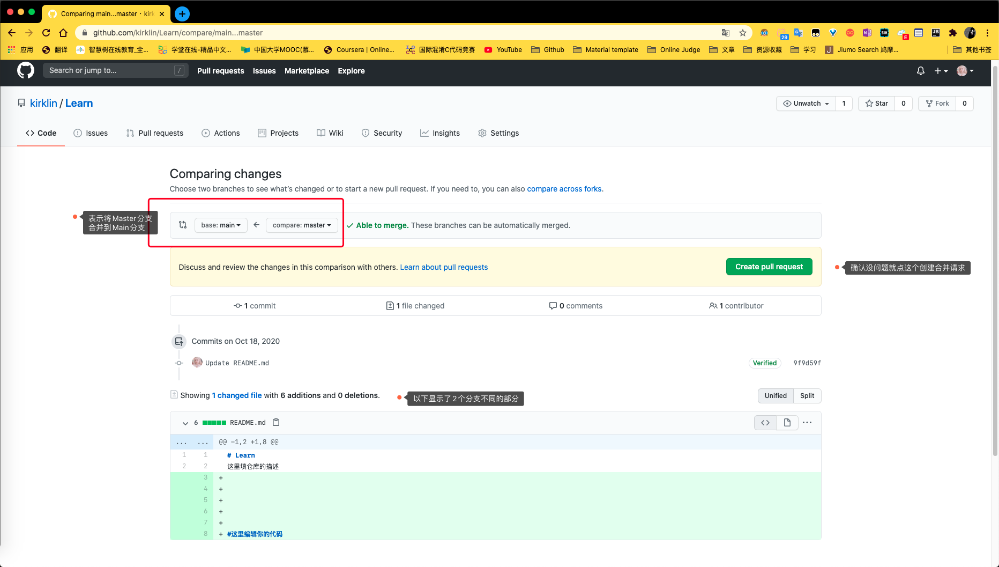

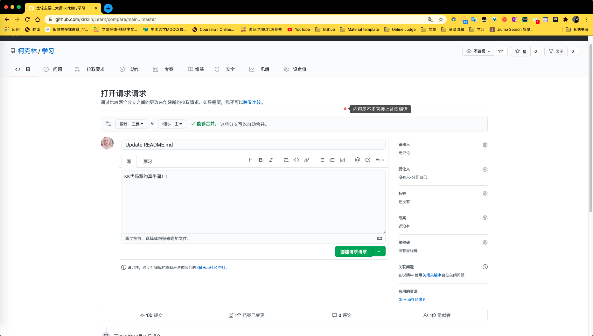

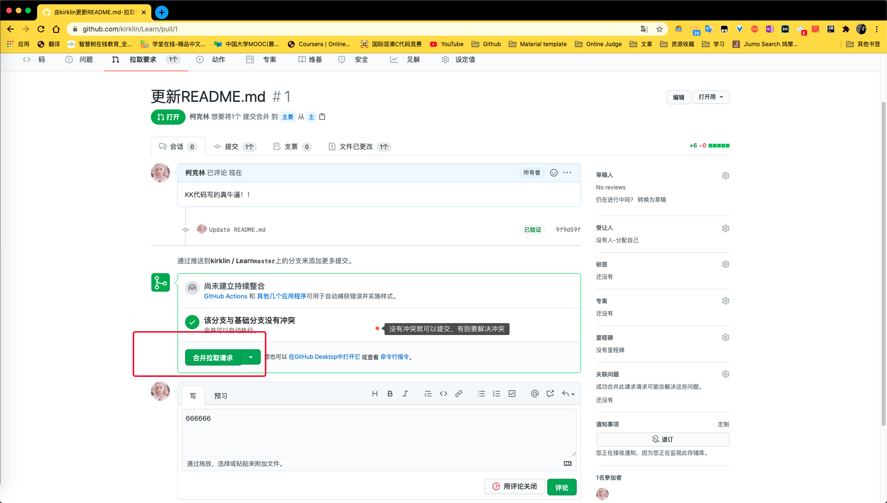

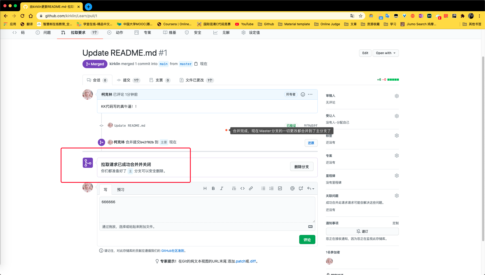

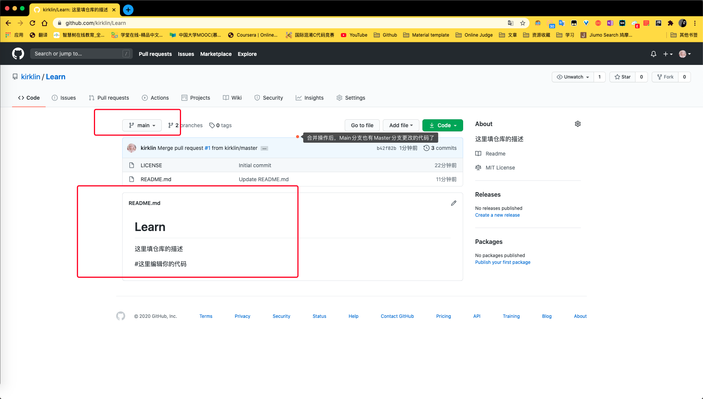

## 六、探索GitHub

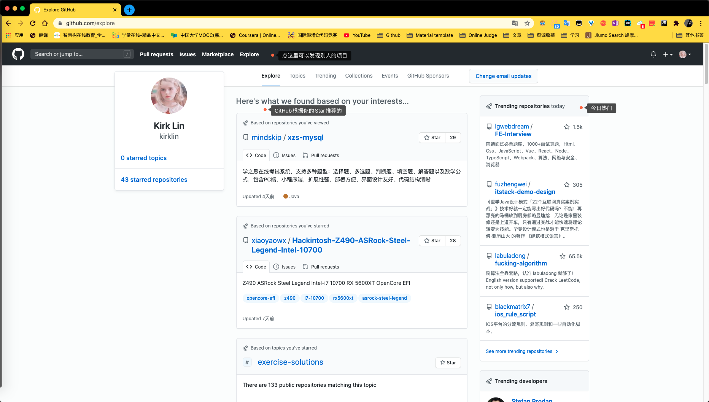

## 七、Clone项目

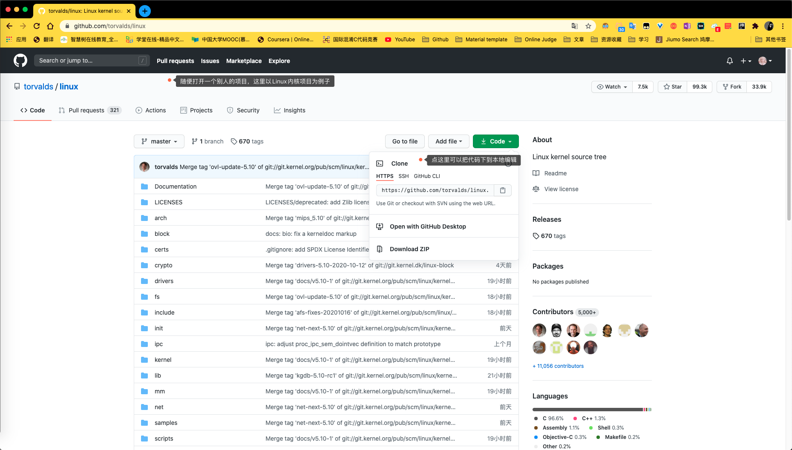

## 八、GitHub骚操作

### 所以不是程序猿可以用这个来做什么呢？

**1、写书**

几个人你一章我一章共同修改一本书，或是几个出版社的编辑对新书进行校对，利用这个神器就可以随时看到哪里出现了问题和更改。

**2、写文档神器**

> 身为科研狗、产品狗、射鸡湿的你，是不是经常写文档？一个成熟的文档可能会有好几个版本，需要不断地迭代，然后不断提交给老板看哪里需要修改。在不同版本间自如切换就要用到git branch和git rebase了。

想想看，用 git 的分支管理不比拷贝粘贴更方便吗？

**3、健身**

激励自己健身把每日计划放上去，还可以邀请其他人一起来相互监督！

**4、找男/女票**

**5、用GitHub搭建博客、个人网站或者公司官网**

一个有自己域名的网站

> GitHub本身提供免费的托管服务，又提供了贴心的 Pages 功能，可以绑定你自己的域名，免费、高效、不限流量，做静态页面绰绰有余。

**6、用GitHub协作翻译**

**7、项目管理**

> GitHub最初是为了开发的管理而生，当然也就具备了项目管理的潜质，特别是与开发密切联系的项目中，它的优势尽显。

**8、科研项目及数据**

**9、个人简历**

GitHub上的代码无法造假，也容易通过你关注的项目来了解你的知识面的宽度与深度。现在越来越多知名公司活跃在GitHub，发布开源库并招募各类人才，

**10、设计资源库**

**11、更多好玩的内容等你自己发现哦**

# Git命令使用

挖坑