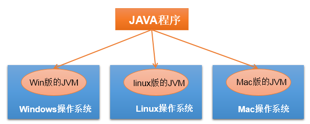
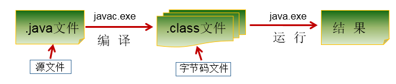
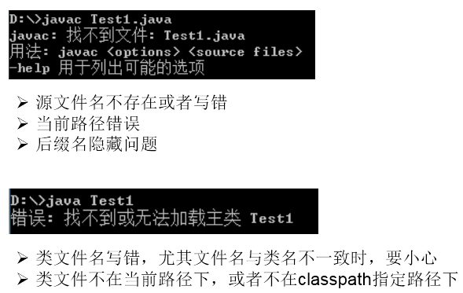
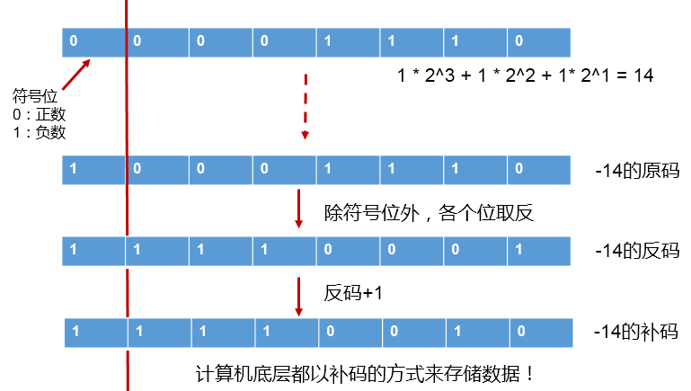
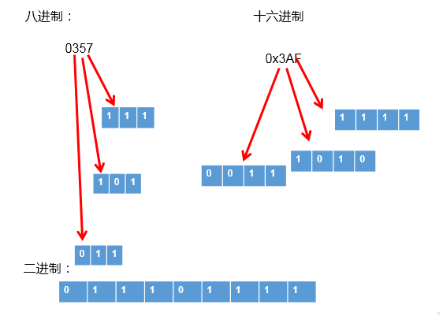

[TOC]


# Java 之基本语法 


### 整体语言概述


### （一）Java 语言概述

#### 1. 基础常识

软件：即一系列按照特定顺序组织的计算机数据和指令的集合。分为：系统软件 和 应用软件

系统软件：windows , mac os , linux ,unix,android,ios,....

应用软件：word ,ppt, 画图板,... 人机交互方式： 图形化界面 vs 命令行方式 应用程序 = 算法 + 数据结构

#### 2. 计算机语言的发展迭代史

第一代：机器语言

第二代：汇编语言

第三代：高级语言

- 面向过程：C,Pascal、Fortran
- 面向对象：Java,JS,Python,Scala,...

#### 3. Java 语言版本迭代概述

1991 年 Green 项目，开发语言最初命名为 Oak (橡树)

1994 年，开发组意识到 Oak 非常适合于互联网

1996 年，发布 JDK 1.0，约 8.3 万个网页应用 Java 技术来制作

1997 年，发布 JDK 1.1，JavaOne 会议召开，创当时全球同类会议规模之最

1998 年，发布 JDK 1.2，同年发布企业平台 J2EE

1999 年，Java 分成 J2SE、J2EE 和 J2ME，JSP/Servlet 技术诞生

2004 年，发布里程碑式版本：JDK 1.5，为突出此版本的重要性，更名为 JDK 5.0

2005 年，J2SE -> JavaSE，J2EE -> JavaEE，J2ME -> JavaME

2009 年，Oracle 公司收购 SUN，交易价格 74 亿美元

2011 年，发布 JDK 7.0

2014 年，发布 JDK 8.0，是继 JDK 5.0 以来变化最大的版本

2017 年，发布 JDK 9.0，最大限度实现模块化

2018 年 3 月，发布 JDK 10.0，版本号也称为 18.3

2018 年 9 月，发布 JDK 11.0，版本号也称为 18.9

#### 3. Java 语言应用的领域：

- Java Web 开发：后台开发
- 大数据开发：
- Android 应用程序开发：客户端开发

#### 4. Java 语言的特点

- 面向对象性：
  - 两个要素：类、对象
  - 三个特征：封装、继承、多态
- 健壮性：① 去除了 C 语言中的指针 ②自动的垃圾回收机制 --> 仍然会出现内存溢出、内存泄漏
- 跨平台型：write once,run anywhere: 一次编译，到处运行
- 功劳归功于：JVM





### （二）开发环境搭建

#### 1.1 JDK、JRE、JVM 的关系


#### 1.2 JDK 的下载、安装

下载：官网，github

安装：傻瓜式安装：JDK 、JRE

注意问题：安装软件的路径中不能包含中文、空格。

#### 1.3 path 环境变量的配置

1.3.1 为什么配置 path 环境变量？

path 环境变量：windows 操作系统执行命令时所要搜寻的路径

为什么要配置 path: 希望 java 的开发工具（javac.exe,java.exe) 在任何的文件路径下都可以执行成功。

1.3.2 如何配置？


### （三）第一个 Java 程序

#### 1. 开发体验——Hello World





1.1 编写:

```java
//创建一个java源文件：HelloWorld.java
class HelloChina{
	public static void main(String[] args){
		System.out.println("Hello,World!");
	}
}
```

1.2 编译：

```shell
javac HelloWorld.java
```

1.3 运行：

```shell
java HelloWord
```

#### 2. 常见问题的解决





#### 3. 总结第一个程序

1. java 程序编写 - 编译 - 运行的过程

- 编写：我们将编写的 java 代码保存在以 ".java" 结尾的源文件中
- 编译：使用 javac.exe 命令编译我们的 java 源文件。格式：javac 源文件名. java
- 运行：使用 java.exe 命令解释运行我们的字节码文件。 格式：java 类名

1. 在一个 java 源文件中可以声明多个 class。但是，只能最多有一个类声明为 public 的。 而且要求声明为 public 的类的类名必须与源文件名相同。
2. 程序的入口是 main() 方法。格式是固定的。
3. 输出语句：

- System.out.println(): 先输出数据，然后换行
- System.out.print(): 只输出数据

1. 每一行执行语句都以 ";" 结束。
2. 编译的过程：编译以后，会生成一个或多个字节码文件。字节码文件的文件名与 java 源文件中的类名相同。

### （四）注释与 API 文档

#### 1. 注释: Comment

**分类**： 单行注释：// 多行注释：/* */ 文档注释：/** */

**作用**：

① 对所写的程序进行解释说明，增强可读性。方便自己，方便别人

② 调试所写的代码

**特点**：

①单行注释和多行注释，注释了的内容不参与编译。 换句话说，编译以后生成的. class 结尾的字节码文件中不包含注释掉的信息

② 注释内容可以被 JDK 提供的工具 javadoc 所解析，生成一套以网页文件形式体现的该程序的说明文档。

③ 多行注释不可以嵌套使用

#### 2. Java API 文档：

- API: application programming interface。习惯上：将语言提供的类库，都称为 API.
- API 文档：针对于提供的类库如何使用，给的一个说明书。类似于《新华字典》

#### 3. 良好的编程风格

3.1 正确的注释和注释风格

- 使用文档注释来注释整个类或整个方法
- 如果注释方法中的某一个步骤，使用单行或多行注释。

3.2 正确的缩进和空白

- 使用一次 tab 操作，实现缩进
- 运算符两边习惯性各加一个空格。比如：2 + 4 * 5。

3.3 块的风格

行尾风格（Java API 源码选择的风格）

```java
public class Test{
    public static void main (String args){
        System.out.print("Hello");
    }
}
```

次行风格

```java
public class Test
{
    public static void main (String args)
    {
        System.out.print("Hello");
    }
}
```

3.4 命名风格：

- 包名：多单词组成时所有字母都小写：xxxyyyzzz
- 类名、接口名：多单词组成时，所有单词的首字母大写： XxxYyyZzz(大驼峰式)
- 变量名、方法名：多单词组成时，第一个单词首字母小写，第二个单词开始每个单词首字母大写： xxxYyyZzz(小驼峰式)
- 常量名：所有字母都大写。多单词时每个单词用下划线连接： XXX_YYY_ZZZ

## 二、基本语法

### （一）关键字与标识符

#### 1. Java 关键字的使用

定义：被 Java 语言赋予了特殊含义，用做专门用途的字符串（单词） 特点：关键字中所字母都为小写 具体关键字：


#### 2. 保留字：

现 Java 版本尚未使用，但以后版本可能会作为关键字使用。 具体哪些保留字：goto 、const 注意：自己命名标识符时要避免使用这些保留字

#### 3. 标识符的使用

3.1 定义：

凡是自己可以起名字的地方都叫标识符。

3.2 涉及到的结构：

包名、类名、接口名、变量名、方法名、常量名

3.3 规则：

(必须要遵守。否则，编译不通过)

- 由 26 个英文字母大小写，0-9, _或 $ 组成。
- 数字不可以开头。
- 不可以使用关键字和保留字，但能包含关键字和保留字。
- Java 中严格区分大小写，长度无限制。
- 标识符不能包含空格。

3.4 规范：

（可以不遵守，不影响编译和运行。但是要求大家遵守）

- 包名：多单词组成时所有字母都小写：xxxyyyzzz
- 类名、接口名：多单词组成时，所有单词的首字母大写： XxxYyyZzz(小驼峰式)
- 变量名、方法名：多单词组成时，第一个单词首字母小写，第二个单词开始每个单词首字母大写： xxxYyyZzz(大驼峰式)
- 常量名：所有字母都大写。多单词时每个单词用下划线连接： XXX_YYY_ZZZ

注意点： 在起名字时，为了提高阅读性，要尽量意义，“见名知意”。

>
> 有意义的命名
> 1.介绍
> 软件中随处可见命名。我们给变量、函数、参数、类和包命名。我们给源代码及源代码所在目录命名。
> 这么多命名要做，不妨做好它。下文列出了取个好名字的几条简单规则。
>
> 2.名副其实,见名知意
>      变量名太随意，haha、list1、ok、theList 这些都没啥意义
>
> 3.避免误导
>      包含List、import、java等类名、关键字或特殊字；
>      字母o与数字0，字母l与数字1等
>      提防使用不同之处较小的名称。比如：XYZControllerForEfficientHandlingOfStrings与XYZControllerForEfficientStorageOfStrings
>
> 4.做有意义的区分
>      反面教材，变量名：a1、a2、a3
>      避免冗余，不要出现Variable、表字段中避免出现table、字符串避免出现nameString，直接name就行，知道是字符串类型
>      再比如：定义了两个类：Customer类和CustomerObject类，如何区分？
> 	     定义了三个方法：getActiveAccount()、getActiveAccounts()、getActiveAccountInfo()，如何区分？
>
> 5.使用读得出来的名称
>      不要使用自己拼凑出来的单词，比如：xsxm(学生姓名)；genymdhms(生成日期，年、月、日、时、分、秒)
>      所谓的驼峰命名法，尽量使用完整的单词
>
> 6.使用可搜索的名称
>      一些常量，最好不直接使用数字，而指定一个变量名，这个变量名可以便于搜索到.
>      比如：找MAX_CLASSES_PER_STUDENT很容易，但想找数字7就麻烦了。
>
> 7.避免使用编码
>      7.1.匈牙利语标记法
>            即变量名表明该变量数据类型的小写字母开始。例如，szCmdLine的前缀sz表示“以零结束的字符串”。
>      7.2.成员前缀
>           避免使用前缀，但是Android中一个比较好的喜欢用m表示私有等，个人感觉比较好
>      7.3.接口和实现
>           作者不喜欢把接口使用I来开头，实现也希望只是在后面添加Imp
>
> 8.避免思维映射
>      比如传统上惯用单字母名称做循环计数器。所以就不要给一些非计数器的变量命名为：i、j、k等
>
> 9.类名
>      类名与对象名应该是名词与名词短语。如Customer、WikiPage、Account和AddressParser。避免使用Data或Info这样的类名。
>      不能使动词。比如：Manage、Process
>
> 10.方法名
>      方法名应当是动词或者动词短语。如postPayment、deletePage或save
>
> 11.别扮可爱
>      有的变量名叫haha、banana
>      别用eatMyShorts()表示abort()
>
> 12.每个概念对应一个词
>      项目中同时出现controllers与managers，为什么不统一使用其中一种？
>      对于那些会用到你代码的程序员，一以贯之的命名法简直就是天降福音。
>
> 13.别用双关语
>      有时可能使用add并不合适，比例insert、append。add表示完整的新添加的含义。     
>
> 14.使用解决方案领域名称
>      看代码的都是程序员，所以尽量用那些计算机科学术语、算法名、模式名、数学术语，
>      依据问题所涉领域来命名不算是聪明的做法。
>
> 15.使用源自所涉问题领域的名称
>      如果不能用程序员熟悉的术语来给手头的工作命名，就采用从所涉问题领域而来的名称吧。
>      至少，负责维护代码的程序员就能去请教领域专家了。
>
> 16.添加有意义的语境
>      可以把相关的变量放到一个类中，使用这个类来表明语境。
>     
> 17.不要添加没用的语境
>      名字中带有项目的缩写，这样完全没有必要。比如有一个名为“加油站豪华版”（Gas Station Deluxe）的项目，
>      在其中给每个类添加GSD前缀就不是什么好策略。
>
> 18.最后的话
>      取好名字最难的地方在于需要良好的描述技巧和共有文化背景。


### （二）变量的使用

#### 1. 变量的分类

1.1 按数据类型分类


**详细说明：**

整型：byte(1 字节 = 8bit) \ short(2 字节) \ int(4 字节) \ long(8 字节)

① byte 范围：-128 ~ 127

② 声明 long 型变量，必须以 "l" 或 "L" 结尾

③ 通常，定义整型变量时，使用 int 型。

④ 整型的常量，默认类型是：int 型

浮点型：float(4 字节) \ double(8 字节)

① 浮点型，表示带小数点的数值

② float 表示数值的范围比 long 还大

③ 定义 float 类型变量时，变量要以 "f" 或 "F" 结尾

④ 通常，定义浮点型变量时，使用 double 型。

⑤ 浮点型的常量，默认类型为：double

字符型：char (1 字符 = 2 字节)

① 定义 char 型变量，通常使用一对'', 内部只能写一个字符

② 表示方式：1. 声明一个字符 2. 转义字符 3. 直接使用 Unicode 值来表示字符型常量

布尔型：boolean

① 只能取两个值之一：true 、 false

② 常常在条件判断、循环结构中使用

1.2 按照声明位置分类


#### 2. 定义变量的格式：

- 数据类型 变量名 = 变量值;
- 数据类型 变量名;
- 变量名 = 变量值;

#### 3. 变量使用的注意点：

① 变量必须先声明，后使用

② 变量都定义在其作用域内。在作用域内，它是有效的。换句话说，出了作用域，就失效了

③ 同一个作用域内，不可以声明两个同名的变量

#### 4. 基本数据类型变量间运算规则

4.1 涉及到的基本数据类型：

除了 boolean 之外的其他 7 种

4.2 自动类型转换

(只涉及 7 种基本数据类型）

- 结论：当容量小的数据类型的变量与容量大的数据类型的变量做运算时，结果自动提升为容量大的数据类型。
- byte 、char 、short --> int --> long --> float --> double
- 特别的：当 byte、char、short 三种类型的变量做运算时，结果为 int 型
- 说明：此时的容量大小指的是，表示数的范围的大和小。比如：float 容量要大于 long 的容量

4.3 强制类型转换

(只涉及 7 种基本数据类型）：自动类型提升运算的逆运算。

- 需要使用强转符：()
- 注意点：强制类型转换，可能导致精度损失。

4.4 String 与 8 种基本数据类型间的运算

1. String 属于引用数据类型, 翻译为：字符串
2. 声明 String 类型变量时，使用一对 ""
3. String 可以和 8 种基本数据类型变量做运算，且运算只能是连接运算：+
4. 运算的结果仍然是 String 类型

注意：

```
String s = 123;//编译错误
String s1 = "123";
int i = (int)s1;//编译错误
```

### （三）进制的转化

#### 1. 编程中涉及的进制及表示方式：

- 二进制 (binary)： 0,1，满 2 进 1 以 0b 或 0B 开头。
- 十进制 (decimal)：0-9，满 10 进 1。
- 八进制 (octal)：0-7，满 8 进 1，以数字 0 开头表示。
- 十六进制 (hex)：0-9 及 A-F，满 16 进 1，以 0x 或 0X 开头表示。此处的 A-F 不区分大小写如：0x21AF+1=0X21B0

#### 2. 二进制的使用说明：

2.1 计算机底层的存储方式：

所有数字在计算机底层都以二进制形式存在。

2.2 二进制数据的存储方式：

所有的数值，不管正负，底层都以补码的方式存储。

2.3 原码、反码、补码的说明：

- 正数：三码合一
- 负数：
  - 负数的原码：直接将一个数值换成二进制数。最高位是符号位。
  - 负数的反码：是对原码按位取反，只是最高位（符号位）确定为 1。
  - 负数的补码：其反码加 1。

#### 3. 进制之间的转化：

3.1 图示：


3.2 图示二进制转化为十进制：





-69 补码 --> 原码


127 原码 --> 补码


3.3 图示十进制转化为二进制：


3.4 二进制与八进制、十六进制之间的转化：





### （四）运算符

#### 1. 算术运算符

算术运算符： + - + - * / % (前)++ (后)++ (前)-- (后)-- +

**【典型代码】**

```java
//除号：/
int num1 = 12;
int num2 = 5;
int result1 = num1 / num2;
System.out.println(result1);//2
// %:取余运算
//结果的符号与被模数的符号相同
//开发中，经常使用%来判断能否被除尽的情况。
int m1 = 12;
int n1 = 5;
System.out.println("m1 % n1 = " + m1 % n1);

int m2 = -12;
int n2 = 5;
System.out.println("m2 % n2 = " + m2 % n2);

int m3 = 12;
int n3 = -5;
System.out.println("m3 % n3 = " + m3 % n3);

int m4 = -12;
int n4 = -5;
System.out.println("m4 % n4 = " + m4 % n4);
//(前)++ :先自增1，后运算
//(后)++ :先运算，后自增1
int a1 = 10;
int b1 = ++a1;
System.out.println("a1 = " + a1 + ",b1 = " + b1);

int a2 = 10;
int b2 = a2++;
System.out.println("a2 = " + a2 + ",b2 = " + b2);

int a3 = 10;
++a3;//a3++;
int b3 = a3;
//(前)-- :先自减1，后运算
//(后)-- :先运算，后自减1

int a4 = 10;
int b4 = a4--;//int b4 = --a4;
System.out.println("a4 = " + a4 + ",b4 = " + b4);
```

**【特别说明】**

1. (前)++ : 先自增 1，后运算 (后)++ : 先运算，后自增 1
2. (前)-- : 先自减 1，后运算 (后)-- : 先运算，后自减 1
3. 连接符：+：只能使用在 String 与其他数据类型变量之间使用。

#### 2. 赋值运算符

赋值运算符：= += -= *= /= %=

**【经典代码】**

```java
int i2,j2;
//连续赋值
i2 = j2 = 10;
//***************
int i3 = 10,j3 = 20;
int num1 = 10;
num1 += 2;//num1 = num1 + 2;
System.out.println(num1);//12

int num2 = 12;
num2 %= 5;//num2 = num2 % 5;
System.out.println(num2);

short s1 = 10;
//s1 = s1 + 2;//编译失败
s1 += 2;//结论：不会改变变量本身的数据类型
System.out.println(s1);
```

**【特别说明】**

- 运算的结果不会改变变量本身的数据类型
- 开发中，如果希望变量实现 + 2 的操作，有几种方法？(前提：int num = 10;) 方式一：num = num + 2; 方式二：num += 2; (推荐)
- 开发中，如果希望变量实现 + 1 的操作，有几种方法？(前提：int num = 10;) 方式一：num = num + 1; 方式二：num += 1; 方式三：num++; (推荐)

#### 3. 比较运算符

比较运算符（关系运算符）: == != > < >= <= instanceof

**【典型代码】**

```java
int i = 10;
int j = 20;

System.out.println(i == j);//false
System.out.println(i = j);//20

boolean b1 = true;
boolean b2 = false;
System.out.println(b2 == b1);//false
System.out.println(b2 = b1);//true
```

**【特别说明】**

- 比较运算符的结果是 boolean 类型

- \> < >= <= : 只能使用在数值类型的数据之间。

- == 和 !=: 不仅可以使用在数值类型数据之间，还可以使用在其他引用类型变量之间。

  ```java
  Account acct1 = new Account(1000);
  Account acct2 = new Account(1000);
  boolean b1 = (acct1 == acct2);//比较两个Account是否是同一个账户。
  boolean b2 = (acct1 != acct2);//
  ```

#### 4. 逻辑运算符

逻辑运算符：& && | || ! ^

**【典型代码】**

```java
//区分& 与 &&
//相同点1：& 与  && 的运算结果相同
//相同点2：当符号左边是true时，二者都会执行符号右边的运算
//不同点：当符号左边是false时，&继续执行符号右边的运算。&&不再执行符号右边的运算。
//开发中，推荐使用&&
boolean b1 = true;
b1 = false;
int num1 = 10;
if(b1 & (num1++ > 0)){
    System.out.println("我现在在北京");
}else{
    System.out.println("我现在在南京");
}

System.out.println("num1 = " + num1);

boolean b2 = true;
b2 = false;
int num2 = 10;
if(b2 && (num2++ > 0)){
    System.out.println("我现在在北京");
}else{
    System.out.println("我现在在南京");
}

System.out.println("num2 = " + num2);
```

注意：

- 区分：| 与 ||
- 相同点 1：| 与 || 的运算结果相同
- 相同点 2：当符号左边是 false 时，二者都会执行符号右边的运算
- 不同点 3：当符号左边是 true 时，| 继续执行符号右边的运算，而 || 不再执行符号右边的运算
- 开发中，推荐使用 ||

```java
boolean b3 = false;
b3 = true;
int num3 = 10;
if(b3 | (num3++ > 0)){
    System.out.println("我现在在北京");
}else{
    System.out.println("我现在在南京");
}
System.out.println("num3 = " + num3);


boolean b4 = false;
b4 = true;
int num4 = 10;
if(b4 || (num4++ > 0)){
    System.out.println("我现在在北京");
}else{
    System.out.println("我现在在南京");
}
System.out.println("num4 = " + num4);
```

**【特别说明的】**

逻辑运算符操作的都是 boolean 类型的变量。而且结果也是 boolean 类型

#### 5. 位运算符

位运算符：<<>> >>> & | ^ ~

**【典型代码】**

```java
int i = 21;
		i = -21;
		System.out.println("i << 2 :" + (i << 2));
		System.out.println("i << 3 :" + (i << 3));
		System.out.println("i << 27 :" + (i << 27));

		int m = 12;
		int n = 5;
		System.out.println("m & n :" + (m & n));
		System.out.println("m | n :" + (m | n));
		System.out.println("m ^ n :" + (m ^ n));
```

【面试题】 你能否写出最高效的 2 * 8 的实现方式？ 答：2 << 3 或 8 << 1

**【特别说明】**

- 位运算符操作的都是整型的数据
- <<：在一定范围内，每向左移 1 位，相当于 * 2>>: 在一定范围内，每向右移 1 位，相当于 / 2

**【典型题目】**

\1. 交换两个变量的值。

①借用临时变量

```java
int num1 = 10;
int num2 = 20;
int temp = num1;
num1 = num2;
num2 = temp;
```

②加减交换: 节省内存，但是会超出存储范围，而且只能适用于数值型运算，

```java
num1 = num1 + num2;
num2 = num1 - num2;
num1 = num1 - num2;
```

③使用位运算符：只适用于数值型运算

```java
num1 = num1 ^ num2;
num2 = num1 ^ num2;
num1 = num1 ^ num2;
```

#### 6. 三元运算符

三元运算符：(条件表达式) ? 表达式 1 : 表达式 2

**【典型代码】**

\1. 获取两个整数的较大值

```java
int a = 3;
int b = 6;
int c = 10;
int max = (a > b) a ? b;
```

\2. 获取三个数的最大值

```java
int a = 3;
int b = 6;
int c = 10;
int temp = (a > b) a ? b;
int max = (temp > c) temp ? c;
```

**【特别说明】**

**说明:**

① 条件表达式的结果为 boolean 类型

② 根据条件表达式真或假，决定执行表达式 1，还是表达式 2. 如果表达式为 true，则执行表达式 1。 如果表达式为 false，则执行表达式 2。

③ 表达式 1 和表达式 2 要求是一致的。

④ 三元运算符可以嵌套使用

⑤凡是可以使用三元运算符的地方，都可以改写为 if-else 反之，不成立。

⑥如果程序既可以使用三元运算符，又可以使用 if-else 结构，那么优先选择三元运算符。原因：简洁、执行效率高。

### （五）流程控制

#### 1. 分支结构

1.1 if-else 条件判断结构

书写方法：

```java
结构一：
if(条件表达式){
	执行表达式
}

结构二：二选一
if(条件表达式){
	执行表达式1
}else{
	执行表达式2
}

结构三：n选一
if(条件表达式){
	执行表达式1
}else if(条件表达式){
	执行表达式2
}else if(条件表达式){
	执行表达式3
}
...
else{
	执行表达式n
}
```

说明：

- else 结构是可选的。
- 针对于条件表达式：
  - 如果多个条件表达式之间是 “互斥” 关系(或没有交集的关系), 哪个判断和执行语句声明在上面还是下面，无所谓。
  - 如果多个条件表达式之间有交集的关系，需要根据实际情况，考虑清楚应该将哪个结构声明在上面。
  - 如果多个条件表达式之间有包含的关系，通常情况下，需要将范围小的声明在范围大的上面。否则，范围小的就没机会执行了。
- if-else 结构是可以相互嵌套的。
- 如果 if-else 结构中的执行语句只有一行时，对应的一对 {} 可以省略的。但是，不建议省略。

1.2. switch-case 选择结构

书写方法

```java
switch(表达式){
case 常量1:
	执行语句1;
	//break;
case 常量2:
	执行语句2;
	//break;
...
default:
	执行语句n;
	//break;
}
```

说明：

1. 根据 switch 表达式中的值，依次匹配各个 case 中的常量。一旦匹配成功，则进入相应 case 结构中，调用其执行语句。
   - 当调用完执行语句以后，则仍然继续向下执行其他 case 结构中的执行语句，直到遇到 break 关键字或此 switch-case 结构末尾结束为止。
2. break, 可以使用在 switch-case 结构中，表示一旦执行到此关键字，就跳出 switch-case 结构
3. switch 结构中的表达式，只能是如下的 6 种数据类型之一： byte 、short、char、int、枚举类型 (JDK5.0 新增)、String 类型 (JDK7.0 新增)
4. case 之后只能声明常量。不能声明范围。
5. break 关键字是可选的。
6. default: 相当于 if-else 结构中的 else.
7. default 结构是可选的，而且位置是灵活的。

补充：

- 如果 switch-case 结构中的多个 case 的执行语句相同，则可以考虑进行合并。
- break 在 switch-case 中是可选的

#### 2. 循环结构

2.1. 循环结构的四要素

① 初始化条件 ② 循环条件 ---> 是 boolean 类型 ③ 循环体 ④ 迭代条件 说明：通常情况下，循环结束都是因为②中循环条件返回 false 了。

2.2. 三种循环结构：

**for 循环结构**

```java
for(①;②;④){
    ③
}
//执行过程：① - ② - ③ - ④ - ② - ③ - ④ - ... - ②
```

**while 循环结构**

```java
①
while(②){
	③;
	④;
}
//执行过程：① - ② - ③ - ④ - ② - ③ - ④ - ... - ②
```

注意：写 while 循环千万小心不要丢了迭代条件。一旦丢了，就可能导致死循环！

for 和 while 循环总结：

1. 开发中，基本上我们都会从 for、while 中进行选择，实现循环结构。
2. for 循环和 while 循环是可以相互转换的！ 区别：for 循环和 while 循环的初始化条件部分的作用范围不同。
3. 我们写程序，要避免出现死循环。

**do-while 循环结构**

```java
①
do{
  ③;
  ④;
  }while(②);
//执行过程：① - ③ - ④ - ② - ③ - ④ - ... - ②
```

说明：

1. do-while 循环至少会执行一次循环体！
2. 开发中，使用 for 和 while 更多一些。较少使用 do-while
3. 数组循环比遍历通常用 for 循环
4. 触发条件复杂的用 while 循环

\3. “无限循环” 结构: while(true) 或 for(;;)

如何结束一个循环结构？

- 方式一：当循环条件是 false 时
- 方式二：在循环体中，执行 break

\4. 嵌套循环

嵌套循环: 将一个循环结构 A 声明在另一个循环结构 B 的循环体中, 就构成了嵌套循环 内层循环：循环结构 A 外层循环：循环结构 B

说明： ① 内层循环结构遍历一遍，只相当于外层循环循环体执行了一次 ② 假设外层循环需要执行 m 次，内层循环需要执行 n 次。此时内层循环的循环体一共执行了 m * n 次 ③ 外层循环控制行数，内层循环控制列数

```java
/练习一：
    /*
		******
		******
		******
		******
		*/
    for(int j = 1;j <= 4;j++ ){
        for(int i = 1;i <= 6;i++){
            System.out.print('*');
        }
        System.out.println();
    }
//练习二：
/*			i(行号)		j(*的个数)
		*			1			1
		**			2			2
		***			3			3
		****		4			4
		*****		5			5
		*/

for(int i = 1;i <= 5;i++){//控制行数
    for(int j = 1;j <= i;j++){//控制列数
        System.out.print("*");

    }
    System.out.println();
}
```

补充: 衡量一个功能代码的优劣：

1. 正确性
2. 可读性
3. 健壮性
4. 高效率与低存储：时间复杂度 、空间复杂度 （衡量算法的好坏）

#### 3. 关键字：break 和 continue

break 和 continue 关键字的使用

|          | 使用范围               | 循环中的作用（不同点） | 相同点                     |
| -------- | ---------------------- | ---------------------- | -------------------------- |
| break    | switch-case 循环结构中 | 结束当前循环           | 关键字后面不能声明执行语句 |
| continue | 循环结构中             | 结束当次循环           | 关键字后面不能声明执行语句 |

补充：带标签的 break 和 continue 的使用

return 在方法中讲。

#### 4. 补充：Scanner 类的应用

如何从键盘获取不同类型的变量：需要使用 Scanner 类

具体实现步骤：

1. 导包：import java.util.Scanner;
2. Scanner 的实例化: Scanner scan = new Scanner([System.in](http://system.in/));
3. 调用 Scanner 类的相关方法（next() / nextXxx()），来获取指定类型的变量

注意： 需要根据相应的方法，来输入指定类型的值。如果输入的数据类型与要求的类型不匹配时，会报异常：InputMisMatchException 导致程序终止

```java
//1.导包：import java.util.Scanner;
import java.util.Scanner;

class ScannerTest{
    public static void main(String[] args){
        //2.Scanner的实例化
        Scanner scan = new Scanner(System.in);

        //3.调用Scanner类的相关方法
        System.out.println("请输入你的姓名：");
        String name = scan.next();
        System.out.println(name);

        System.out.println("请输入你的芳龄：");
        int age = scan.nextInt();
        System.out.println(age);

        System.out.println("请输入你的体重：");
        double weight = scan.nextDouble();
        System.out.println(weight);

        System.out.println("你是否相中我了呢？(true/false)");
        boolean isLove = scan.nextBoolean();
        System.out.println(isLove);

        //对于char型的获取，Scanner没有提供相关的方法。只能获取一个字符串
        System.out.println("请输入你的性别：(男/女)");
        String gender = scan.next();//"男"
        char genderChar = gender.charAt(0);//获取索引为0位置上的字符
        System.out.println(genderChar);	
    }
}
```


全文完