# Java 之常用类 


## 一、String 类

java.lang.String 类的使用

### （一）概述

String: 字符串，使用一对 "" 引起来表示。

1. String 声明为 final 的，不可被继承

2. String 实现了 Serializable 接口：表示字符串是支持序列化的。 实现了 Comparable 接口：表示 String 可以比较大小

3. String 内部定义了 final char[] value 用于存储字符串数据

4. String: 代表不可变的字符序列。简称：不可变性。

   **体现：**

   4.1. 当对字符串重新赋值时，需要重写指定内存区域赋值，不能使用原有的 value 进行赋值。

   4.2. 当对现有的字符串进行连接操作时，也需要重新指定内存区域赋值，不能使用原有的 value 进行赋值。

   4.3. 当调用 String 的 replace() 方法修改指定字符或字符串时，也需要重新指定内存区域赋值，不能使用原有的 value 进行赋值。

5. 通过字面量的方式（区别于 new 给一个字符串赋值，此时的字符串值声明在字符串常量池中)。

6. 字符串常量池中是不会存储相同内容 (使用 String 类的 equals() 比较，返回 true)的字符串的)。

### （二）String 的特性

String 类：代表字符串。Java 程序中的所有字符串字面值（如 "abc"）都作为此类的实例实现。 String 是一个 final 类，代表不可变的字符序列。 字符串是常量，用双引号引起来表示。它们的值在创建之后不能更改。 String 对象的字符内容是存储在一个字符数组 vaue[] 中的。

**String 源码构造器:**

```java
public final class String
    implements java.io.Serializable, Comparable<String>, CharSequence {
    /** The value is used for character storage. */
    private final char value[];

    /** Cache the hash code for the string */
    private int hash; // Default to 0
```

### 1. String 的不可变性

#### 1.1 说明：

1. 当对字符串重新赋值时，需要重写指定内存区域赋值，不能使用原有的 value 进行赋值。
2. 当对现的字符串进行连接操作时，也需要重新指定内存区域赋值，不能使用原有的 value 进行赋值。
3. 当调用 String 的 replace() 方法修改指定字符或字符串时，也需要重新指定内存区域赋值，不能使用原有的 value 进行赋值。

#### 1.2 代码举例：

```java
String s1 = "abc";//通过字面量的定义方式
String s2 = "def";
s1 = "hello";

System.out.println(s1 == s2); //false 比较s1与s2的地址值

System.out.println(s1);//hello
System.out.println(s2);//def

System.out.println("-----------------------");

String s3 = "abc";
s3 += "def";
System.out.println(s3);//abcdef
System.out.println(s2);//def

System.out.println("-----------------------");

String s4 ="test";
String s5 = s4.replace("t","b");
System.out.println(s4);//test
System.out.println(s5);//besb
```

#### 1.3 图示解析：


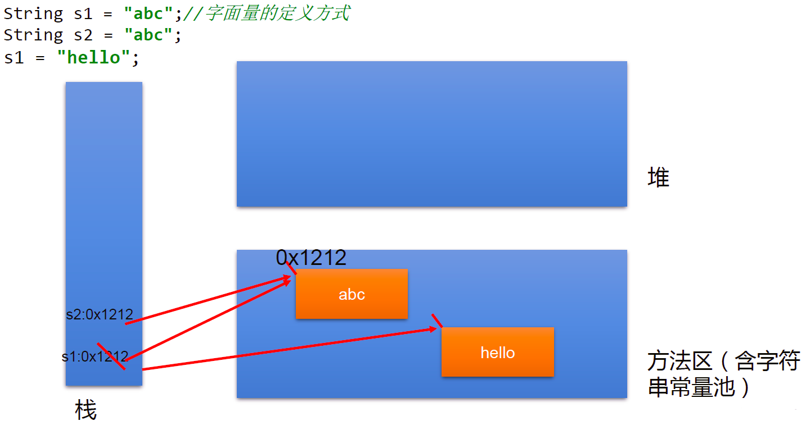


### 2. String 实例化方法

#### 2.1 实现方式说明：

- 方式一：通过字面量定义的方式
- 方式二：通过 new + 构造器的方式

**面试题：**

String s = new String("abc"); 方式创建对象，在内存中创建了几个对象？

两个: 一个是堆空间中 new 结构，另一个是 char[] 对应的常量池中的数据："abc"

#### 2.2 代码实例：

```java
//通过字面量定义的方式：此时的s1和s2的数据javaEE声明在方法区中的字符串常量池中。
String s1 = "javaEE";
String s2 = "javaEE";
//通过new + 构造器的方式:此时的s3和s4保存的地址值，是数据在堆空间中开辟空间以后对应的地址值。
String s3 = new String("javaEE");
String s4 = new String("javaEE");

System.out.println(s1 == s2);//true
System.out.println(s1 == s3);//false
System.out.println(s1 == s4);//false
System.out.println(s3 == s4);//false
```

String str1=“abc”; 与 String str2= new String(“abc”); 的区别?


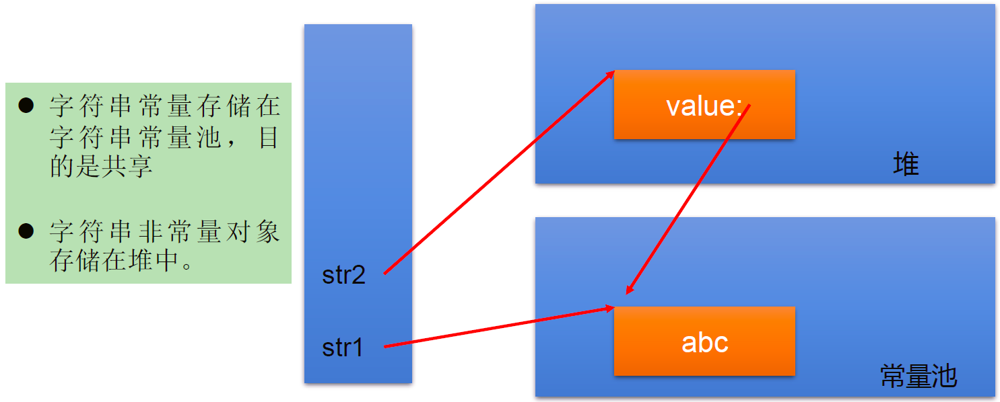


新建 String 对象的内存解析


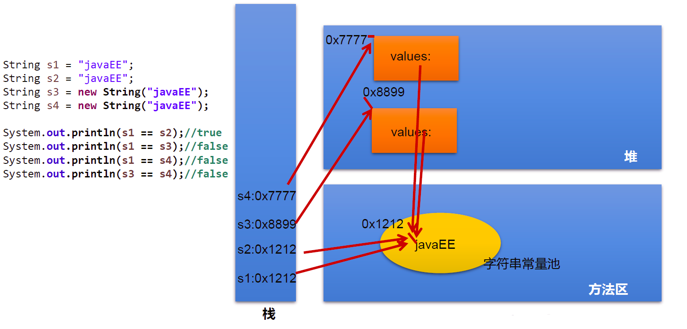


### 3. 字符串拼接方式赋值对比

#### 3.1 说明：

1. 常量与常量的拼接结果在常量池。且常量池中不会存在相同内容的常量。
2. 只要其中一个是变量，结果就在堆中。
3. 如果拼接的结果调用 intern() 方法，返回值就在常量池中

#### 3.2 代码示例

```java
String s1 = "javaEE";
String s2 = "hadoop";

String s3 = "javaEEhadoop";
String s4 = "javaEE" + "hadoop";
String s5 = s1 + "hadoop";
String s6 = "javaEE" + s2;
String s7 = s1 + s2;

System.out.println(s3 == s4);//true
System.out.println(s3 == s5);//false
System.out.println(s3 == s6);//false
System.out.println(s3 == s7);//false
System.out.println(s5 == s6);//false
System.out.println(s5 == s7);//false
System.out.println(s6 == s7);//false

String s8 = s6.intern();//返回值得到的s8使用的常量值中已经存在的“javaEEhadoop”
System.out.println(s3 == s8);//true
****************************
String s1 = "javaEEhadoop";
String s2 = "javaEE";
String s3 = s2 + "hadoop";
System.out.println(s1 == s3);//false

final String s4 = "javaEE";//s4:常量
String s5 = s4 + "hadoop";
System.out.println(s1 == s5);//true
```

内存解析


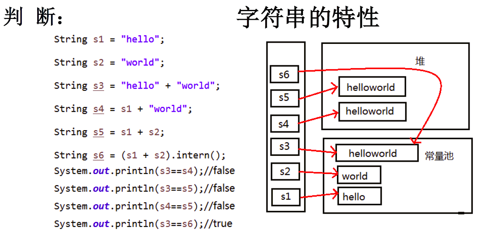


### 4. String 使用陷阱

- String s1="a"；

  说明：在字符串常量池中创建了一个字面量为 "a" 的字符串。

- s1=s1+"b"

  说明：实际上原来的 “a” 字符串对象已经丢弃了，现在在堆空间中产生了一个字符串 s1+"b"（也就是 "ab"）。如果多次执行这些改变串内容的操作，会导致大量副本字符串对象存留在内存中，降低效率。如果这样的操作放到循环中，会极大影响程序的性能。

- String s2="ab"； 说明：直接在字符串常量池中创建一个字面量为 "ab" 的字符串。

- String s3="a"+"b"； 说明：s3 指向字符串常量池中已经创建的 "ab" 的字符串。

- String s4=s1.intern()； 说明：堆空间的 S1 对象在调用 intern() 之后，会将常量池中已经存在的 "ab" 字符串赋值给 s4。

### 5. String 类常用方法

#### 5.1 字符串操作

**操作字符：**

1. int length()：返回字符串的长度： return value.length
2. char charAt(int index)： 返回某索引处的字符 return value[index]
3. boolean isEmpty()：判断是否是空字符串：return value.length == 0
4. String toLowerCase()：使用默认语言环境，将 String 中的所字符转换为小写
5. String toUpperCase()：使用默认语言环境，将 String 中的所字符转换为大写
6. String trim()：返回字符串的副本，忽略前导空白和尾部空白
7. boolean equals(Object obj)：比较字符串的内容是否相同
8. boolean equalsIgnoreCase(String anotherString)：与 equals 方法类似，忽略大小写
9. String concat(String str)：将指定字符串连接到此字符串的结尾。 等价于用 “+”
10. int compareTo(String anotherString)：比较两个字符串的大小
11. String substring(int beginIndex)：返回一个新的字符串，它是此字符串的从 beginIndex 开始截取到最后的一个子字符串。
12. String substring(int beginIndex, int endIndex) ：返回一个新字符串，它是此字符串从 beginIndex 开始截取到 endIndex(不包含) 的一个子字符串。

**代码示例：**

```java
@Test
public void test2() {
    String s1 = "helloword";
    System.out.println(s1.length());//9
    System.out.println(s1.charAt(4));//o
    System.out.println(s1.isEmpty());//false

    String s2 = "HELLOword";
    System.out.println(s2.toLowerCase());//hellowod
    System.out.println(s2.toUpperCase());//HELLOWORD

    String s3 = " hello word ";
    System.out.println(s3.trim());//hello word
    String s4 = "helloword";
    System.out.println(s4.equals(s1));//true
    System.out.println(s4.equalsIgnoreCase(s2));//true
    String s5 = "hello";
    System.out.println(s5.compareTo(s4));//-4 相等时返回0，小的时候返回负数
    System.out.println(s4.compareTo(s1));//0

    System.out.println(s4.substring(5));//word
    System.out.println(s4.substring(5, 9));//word,取值范围左开右闭

}
```

**判断字符：**

1. boolean endsWith(String suffix)：测试此字符串是否以指定的后缀结束
2. boolean startsWith(String prefix)：测试此字符串是否以指定的前缀开始
3. boolean startsWith(String prefix, int toffset)：测试此字符串从指定索引开始的子字符串是否以指定前缀开始

```java
@Test
public void test3() {
    String s1 = "javaEE";
    System.out.println(s1.endsWith("EE"));//true
    System.out.println(s1.startsWith("a"));//false
    System.out.println(s1.startsWith("EE", 4));//true

}
```

#### 5.2 查找字符串中的字符

1. boolean contains(CharSequence s)：当且仅当此字符串包含指定的 char 值序列时，返回 true
2. int indexOf(String str)：返回指定子字符串在此字符串中第一次出现处的索引
3. int indexOf(String str, int fromIndex)：返回指定子字符串在此字符串中第一次出现处的索引，从指定的索引开始
4. int lastIndexOf(String str)：返回指定子字符串在此字符串中最右边出现处的索引
5. int lastIndexOf(String str, int fromIndex)：返回指定子字符串在此字符串中最后一次出现处的索引，从指定的索引开始反向搜索

注：indexOf 和 lastIndexOf 方法如果未找到都是返回 - 1

**代码示例：**

```java
@Test
public void test3() {
    String s2="hello word";
    System.out.println(s2.contains("o"));//true
    System.out.println(s2.indexOf("h"));//0
    System.out.println(s2.indexOf("o", 5));//7
    System.out.println(s2.lastIndexOf("o"));//7
    System.out.println(s2.lastIndexOf("l", 2));//2
}
```

#### 5.3 字符串操作方法

1. 替换：
   - String replace(char oldChar, char newChar)：返回一个新的字符串，它是通过用 newChar 替换此字符串中出现的所 oldChar 得到的。
   - String replace(CharSequence target, CharSequence replacement)：使用指定的字面值替换序列替换此字符串所匹配字面值目标序列的子字符串。
   - String replaceAll(String regex, String replacement)：使用给定的 replacement 替换此字符串所匹配给定的正则表达式的子字符串。
   - String replaceFirst(String regex, String replacement)：使用给定的 replacement 替换此字符串匹配给定的正则表达式的第一个子字符串。
2. 匹配:
   - boolean matches(String regex)：告知此字符串是否匹配给定的正则表达式。
3. 切片：
   - String[] split(String regex)：根据给定正则表达式的匹配拆分此字符串。
   - String[] split(String regex, int limit)：根据匹配给定的正则表达式来拆分此字符串，最多不超过 limit 个，如果超过了，剩下的全部都放到最后一个元素中。

**代码示例:**

```java
@Test
public void test4() {
    String str1 = "北京你好，你好北京";
    String str2 = str1.replace('北', '南');

    System.out.println(str1);//北京你好，你好北京
    System.out.println(str2);//南京你好，你好南京

    String str3 = str1.replace("北京", "上海");
    System.out.println(str3);//上海你好，你好上海

    System.out.println("*************************");
    String str = "12hello34world5java7891mysql456";
    //把字符串中的数字替换成,，如果结果中开头和结尾有，的话去掉
    String string = str.replaceAll("\\d+", ",").replaceAll("^,|,$", "");
    System.out.println(string);//hello,world,java,mysql

    System.out.println("*************************");
    str = "12345";
    //判断str字符串中是否全部有数字组成，即有1-n个数字组成
    boolean matches = str.matches("\\d+");
    System.out.println(matches);//true
    String tel = "0571-4534289";
    //判断这是否是一个杭州的固定电话
    boolean result = tel.matches("0571-\\d{7,8}");
    System.out.println(result);//true


    System.out.println("*************************");
    str = "hello|world|java";
    String[] strs = str.split("\\|");
    for (int i = 0; i < strs.length; i++) {
        System.out.println(strs[i]);//依次输出hello word java
    }
    System.out.println();
    str2 = "hello.world.java";
    String[] strs2 = str2.split("\\.");
    for (int i = 0; i < strs2.length; i++) {
        System.out.println(strs2[i]);//依次输出hello word java
    }
}
```

### 6. String 与其他结构的转换

#### 6.1 String 与基本数据类型、包装类之间的转换

String --> 基本数据类型、包装类：调用包装类的静态方法：parseXxx(str)

基本数据类型、包装类 --> String: 调用 String 重载的 valueOf(xxx)

**代码示例：**

```java
@Test
public void StringToBasic() {
    String str1 = "123";
    int i = Integer.parseInt(str1);
    System.out.println(i);
    System.out.println(i == 123);//true

    int j = 456;
    String s = String.valueOf(j);
    System.out.println(s);
    System.out.println(s.equals("456"));//true
}
```

#### 6.2 与字符数组之间的转换

String --> char[]: 调用 String 的 toCharArray() char[] --> String: 调用 String 的构造器

**代码示例：**

```java
@Test
public void BasicToString() {
    String s1 = "helloword";
    char[] chars = s1.toCharArray();
    for (int i = 0; i < chars.length; i++) {
        System.out.println(chars[i]);
    }

    char[] charArray = new char[]{'h', 'e', 'l', 'l', 'o'};
    String s2 = new String(charArray);
    System.out.println(s2);

}
```

#### 6.3 与字节数组之间的转换

编码：String --> byte[]: 调用 String 的 getBytes()

解码：byte[] --> String: 调用 String 的构造器

编码：字符串 --> 字节 (看得懂 ---> 看不懂的二进制数据)

解码：编码的逆过程，字节 --> 字符串 （看不懂的二进制数据 ---> 看得懂

说明：解码时，要求解码使用的字符集必须与编码时使用的字符集一致，否则会出现乱码。

```java
@Test
public void StringToByteTest() throws UnsupportedEncodingException {
    String s1 ="你好java世界";
    byte[] bytesArray = s1.getBytes();//使用默认字符集编码
    System.out.println(Arrays.toString(bytesArray));//[-28, -67, -96, -27, -91, -67, 106, 97, 118, 97, -28, -72, -106, -25, -107, -116]

    byte[] gbks = s1.getBytes("gbk");//使用gbk编码集合
    System.out.println(Arrays.toString(gbks));//[-60, -29, -70, -61, 106, 97, 118, 97, -54, -64, -67, -25]

    System.out.println("--------------------------------");

    String str1=new String(bytesArray);//使用默认字符进行解码
    System.out.println(str1);//你好java世界

    String str2 = new String(gbks);//使用默认字符对gbk编码进行解码
    System.out.println(str2);//���java����解码错误，出现中文乱码,原因：编码和解码不一致

    String str3 = new String(gbks,"gbk");//使用gbk格式进行解码
    System.out.println(str3);//你好java世界，解码正确，原因：编码和解码一致
}
```

#### 6.4 与 StringBuffer、StringBuilder 之间的转换

1.String -->StringBuffer、StringBuilder: 调用 StringBuffer、StringBuilder 构造器

```java
@Test
public void StringToStringBufferTest(){
    String str1 ="helloword";

    StringBuffer stringBuffer = new StringBuffer(str1);
    System.out.println(stringBuffer);//helloword

    StringBuilder stringBuilder = new StringBuilder(str1);
    System.out.println(stringBuilder);//helloword

    stringBuffer.append("isStringBuffer");
    System.out.println(stringBuffer);//hellowordandgood

    stringBuilder.append("isStringBuider");
    System.out.println(stringBuilder);
}
```

2.StringBuffer、StringBuilder -->String:

①调用 String 构造器； ②StringBuffer、StringBuilder 的 toString()

```java
@Test
public void StringBuiderOrStringBufferToStringTest() {
    StringBuffer sb1 = new StringBuffer("hello StringBuffer");
    System.out.println(sb1);

    StringBuilder sb2 = new StringBuilder("hello StringBuider");
    System.out.println(sb2);

    System.out.println("----------------------");

    String str1 = new String(sb1);
    System.out.println(str1);

    String str2 = new String(sb2);
    System.out.println(str2);

    System.out.println("----------------------");
    System.out.println(sb1.toString());
    System.out.println(sb2.toString());
}
```

### 7. JVM 中字符串常量池存放位置说明：

jdk 1.6 (jdk 6.0 ,java 6.0): 字符串常量池存储在方法区（永久区）

jdk 1.7: 字符串常量池存储在堆空间

jdk 1.8: 字符串常量池存储在方法区（元空间）

### 8. 常见算法题目的考查：

1）模拟一个 trim 方法，去除字符串两端的空格。

```java
public String myTrim(String str) {
    if (str != null) {
        int start = 0;//记录从前往后首次索引位置不是空格的位置索引
        int end = str.length() - 1;//记录从后往前首次索引位置不是空格的位置索引
        while (start < end && str.charAt(start) == ' ') {
            start++;
        }
        while (start < end && str.charAt(end) == ' ') {
            end--;
        }
        if (str.charAt(start) == ' ') {
            return "";
        }
        return str.substring(start, end + 1);
    }

    return null;
}
```

2）将一个字符串进行反转。将字符串中指定部分进行反转。比如 “abcdefg” 反转为”abfedcg”

```java
//方式一
public String reverse1(String str, int start, int end) {
    if (str != null) {
        //1.转换成char型数组
        char[] charArray = str.toCharArray();
        //2.进行反转操作
        for (int i = start, j = end; i < j; i++, j--) {
            char temp = charArray[i];
            charArray[i] = charArray[j];
            charArray[j] = temp;
        }
        //3.返回值
        return new String(charArray);
    }
    return null;
}

//方式二
//分析：整个字符串分为三部分不反转的、反转的、不反转的
//先将前面不反转的部分取出来，将反转的部分取出后进行拼接
public String reverse2(String string, int start, int end) {
    if(string != null){
        //第一部分
    String newStr = string.substring(0, start);
    //第二部分
    for (int i = end; i >= start; i--) {
        newStr += string.charAt(i);
    }
    //第三部分
    newStr += string.substring(end + 1);
	//拼接操作
    return newStr;
    }
    return null;
}

//方式三,使用StringBuffer或StringBuilder替换String优化
public String reverse3(String str, int start, int end) {
    if(str != null){
      //1.新建StringBuffer
    StringBuffer stringBuffer = new StringBuffer(str.length());
    //2.第一部分
    stringBuffer.append(str.substring(0, start));
    //3.第二部分
    for (int i = end; i >= start; i--) {
        stringBuffer.append(str.charAt(i));
    }
    //4.第三部分
    stringBuffer.append(str.substring(end + 1));
    //5.拼接操作
    return stringBuffer.toString();  
    }
    return null;
}
```

3）获取一个字符串在另一个字符串中出现的次数。 比如：获取 “ab” 在 “abkkcadkabkebfkabkskab” 中出现的次数

```java
public int count(String mainStr, String subStr) {
    //1.判断主串和部分串的大小
    if (mainStr.length() >= subStr.length()) {
        int index = 0;
        int count = 0;
        //2.在主串中取出子串下标，并将新的下标赋值给主串，统计量加1
        //            while ((index = mainStr.indexOf(subStr) )!= -1){
        //                count++;
        //				//从已经找到的子串的下一个开始
        //                mainStr = mainStr.substring(index + subStr.length());
        //            }
        //改进，不再新建字符串，只做位置比对
        while ((index = mainStr.indexOf(subStr, index)) != -1) {
            index += subStr.length();
            count++;
        }
        return count;
    } else {
        return 0;
    }
}
```

4）获取两个字符串中最大相同子串。比如： str1 = "abcwerthelloyuiodef“;str2 ="cvhellobnm" 提示：将短的那个串进行长度依次递减的子串与较长的串比较。

```java
//只存在一个子串的情况
public String getMaxSameSubString(String str1, String str2) {
    //1.判断两个字串的大小
    if (str1 != null && str2 != null) {
        String maxStr = (str1.length() >= str2.length()) ? str1 : str2;
        String minStr = (str1.length() < str2.length()) ? str1 : str2;

        int len = minStr.length();
        //2.用小的依次去比对大的子串
        for (int i = 0; i < len; i++) {//这层for循环用来确定需要比对的字符次数
            for (int x = 0, y = len - i; y <= len; x++, y++) {
                if (maxStr.contains(minStr.substring(x, y))) {
                    return minStr.substring(x, y);
                }
            }

        }
    }
    return null;
}

//存在多个相同子串的情况
// 此时先返回String[]，后面可以用集合中的ArrayList替换，较方便
public String [] getMaxSameSubStrings(String str1, String str2) {
    //1.先比较出两个子串的大小
    if (str1 != null && str2 != null) {
        StringBuffer stringBuffer = new StringBuffer();
        String maxStr = (str1.length() > str2.length()) ? str1 : str2;
        String minStr = (str1.length() > str2.length()) ? str2 : str1;
        //2.用小的去依次匹配大的
        int len = minStr.length();
        for (int i = 0; i < len; i++) {
            for (int x = 0, y = len - i; y <= len; x++,y++ ){
                String subString = minStr.substring(x,y);
                //3.取出匹配到的子串
                if (maxStr.contains(subString)){
                    stringBuffer.append(subString+",");
                }
            }
            //System.out.println(stringBuffer);
            if (stringBuffer.length() != 0){
                break;
            }
        }

        String [] split = stringBuffer.toString().replaceAll(",$","").split("\\,");
        return split;
    }
    return null;
}
```

5）对字符串中字符进行自然顺序排序。 提示：

1. 字符串变成字符数组。
2. 对数组排序，择，冒泡，Arrays.sort();
3. 将排序后的数组变成字符串。

```java
@Test
public void charTest() {
    String str1 = "hello java";
    char[] charArray = str1.toCharArray();

    Arrays.sort(charArray);

    String str2 = new String(charArray);
    System.out.println(str2);
}
```

## 二、StringBuffer 和 StringBuilder

### （一）StringBuffer 类

#### 1. 概述：

java.lang.String.Buffer 代表可变的字符序列，JDK1.0 中声明，可以对字符串内容进行增删，此时不会产生新的对象。 很多方法与 String 相同 作为参数传递时，方法内部可以改变值。

```java
abstract class AbstractStringBuilder implements Appendable, CharSequence {
    /**
     * The value is used for character storage.
     */
    char[] value;//value没有final声明，value可以不断扩容

    /**
     * The count is the number of characters used.
     */
    int count;//count记录有效字符个数
```

- StringBuffer 类不同于 String，其对象必须使用构造器生成。
- 有三个构造器 StringBuffer()：初始容量为 16 的字符串缓冲区
- StringBuffer(int size)：构造指定容量的字符串缓冲区
- StringBuffer(String str)：将内容初始化为指定字符串内容

```java
String s= new String("我喜欢学习")；
StringBuffer buffer= new StringBuffer("我喜欢学习")；
buffer. append("数学");
```


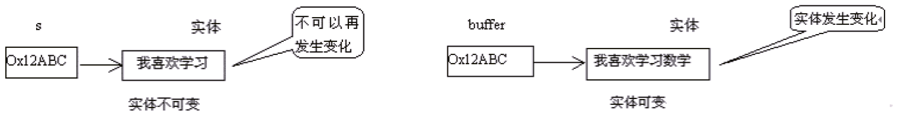


#### 2. 常用方法：

1. StringBuffer append(xxx)：提供了很多的 append() 方法，用于进行字符串拼接
2. StringBuffer delete(int start,int end)：删除指定位置的内容
3. StringBuffer replace(int start, int end, String str)：把 [start,end) 位置替换为 str
4. StringBuffer insert(int offset, xxx)：在指定位置插入 xxx
5. StringBuffer reverse() ：把当前字符序列逆转

当 append 和 insert 时，如果原来 vaue 数组长度不够，可扩容。 如上这些方法支持方法链操作。 方法链的原理：

```java
@Override
public StringBuilder append(String str) {
    super.append(str);
    return this;
}
```

- public int indexOf(String str)：返回子串的下标
- public String substring(int start,int end): 返回一个从 start 开始到 end 索引结束的左闭右开区间的子字符串
- public int length()：获取字符串的长度
- public char charAt(int n)：返回指定位置的字符
- public void setCharAt(int n ,char ch)：设置指定位置的字符

**总结：**

增：append(xxx) ；

删：delete(int start,int end) ；

改：setCharAt(int n ,char ch) / replace(int start, int end, String str) ；

查：charAt(int n) ；

插：insert(int offset, xxx) ；

长度：length();

遍历：for() + charAt() / toString()；

**代码示例：**

```java
@Test
public void stringBufferMethodTest(){
    StringBuffer s1 = new StringBuffer("abc");
    System.out.println(s1);

    System.out.println(s1.append("1"));//abc1
    System.out.println(s1.delete(0, 1));//bc1
    System.out.println(s1.replace(0, 1, "hello"));//helloc1
    System.out.println(s1.insert(3, "v"));//helvloc1
    System.out.println(s1.reverse());//1colvleh
}
```

### （二）StringBuilder 类

StringBuilder 和 StringBuffer 非常类似，均代表可变的字符序列，而且提供相关功能的方法也一样，只是 StringBuilder 类没有加线程锁，执行效率更高。

#### 1. String、StringBuffer、StringBuilder 三者的对比

- String: 不可变的字符序列；底层使用 char[] 存储；占用内存（会不断的创建和回收对象）
- StringBuffer: 可变的字符序列；线程安全的，效率低；线程安全；底层使用 char[] 存储；
- StringBuilder: 可变的字符序列；jdk5.0 新增的，线程不安全的，效率高；线程不安全；底层使用 char[] 存储

注意：作为参数传递的话，方法内部 Stng 不会改变其值， StringBuffer 和 StringBuilder 会改变其值。

#### 2. StringBuffer 与 StringBuilder 的内存解析

**以 StringBuffer 为例：**

```java
String str = new String();//char[] value = new char[0];
String str1 = new String("abc");//char[] value = new char[]{'a','b','c'};

StringBuffer sb1 = new StringBuffer();//char[] value = new char[16];底层创建了一个长度是16的数组。
System.out.println(sb1.length());//
sb1.append('a');//value[0] = 'a';
sb1.append('b');//value[1] = 'b';

StringBuffer sb2 = new StringBuffer("abc");//char[] value = new char["abc".length() + 16];
```

**StringBuffer 构造器源码：**

```java
public StringBuffer(String str) {
    super(str.length() + 16);
    append(str);
}
```

问题 1. System.out.println(sb2.length());//3

问题 2. 扩容问题: 如果要添加的数据底层数组盛不下了，那就需要扩容底层的数组。 默认情况下，扩容为原来容量的 2 倍 + 2，同时将原有数组中的元素复制到新的数组中。

指导意义：开发中建议大家使用：StringBuffer(int capacity) 或 StringBuilder(int capacity)


#### 3. 对比 String、StringBuffer、StringBuilder 三者的执行效率

从高到低排列：StringBuilder > StringBuffer > String

```java
@Test
public void test3(){
    //初始设置
    long startTime = 0L;
    long endTime = 0L;
    String text = "";
    StringBuffer buffer = new StringBuffer("");
    StringBuilder builder = new StringBuilder("");
    //开始对比
    startTime = System.currentTimeMillis();
    for (int i = 0; i < 20000; i++) {
        buffer.append(String.valueOf(i));
    }
    endTime = System.currentTimeMillis();
    System.out.println("StringBuffer的执行时间：" + (endTime - startTime));

    startTime = System.currentTimeMillis();
    for (int i = 0; i < 20000; i++) {
        builder.append(String.valueOf(i));
    }
    endTime = System.currentTimeMillis();
    System.out.println("StringBuilder的执行时间：" + (endTime - startTime));

    startTime = System.currentTimeMillis();
    for (int i = 0; i < 20000; i++) {
        text = text + i;
    }
    endTime = System.currentTimeMillis();
    System.out.println("String的执行时间：" + (endTime - startTime));

}
```

## 三、JDK 8.0 以前的日期时间 API

### 1. java.lang.System 类

System 类提供的 public static long currentTimeMillis() 用来返回当前时间与 1970 年 1 月 1 日 0 时 0 分 0 秒之间以毫秒为单位的时间差。(时间戳) 此方法适于计算时间差。

计算世界时间的主要标准有：

UTC（Coordinated Universal Time） GMT（Greenwich Mean Time） CST（Central Standard Time）

**代码示例：**

```java
//获取系统当前时间：System类中的currentTimeMillis()
long time = System.currentTimeMillis();
//返回当前时间与1970年1月1日0时0分0秒之间以毫秒为单位的时间差。
//称为时间戳
System.out.println(time);
```

### 2. java.util.Date 类

表示特定的瞬间，精确到毫秒

#### 2.1 构造器

Date(): 使用无参的构造器创建对象可以获取本地当前时间

Date(long date)

#### 2.2 常用方法

getTime()：返回自 1970 年 1 月 1 日 00：00：00GMT 以来此 Date 对象表示的毫秒数

tostring()：把此 Date 对象转换为以下形式的 String：

- dow mon dd
- hh: mm:ss zzz yyyy

其中：doW 是一周中的某一天（Sun，Mon，Tue，Wed，Thu，Fri，Sat），zzz 是时间标准。 其它很多方法都过时了

#### 2.3java.util.Date 类与 java.sql.Date 类

|---java.util.Date 类

|---java.sql.Date 类

\1. 两个构造器的使用

- 构造器一：Date()：创建一个对应当前时间的 Date 对象
- 构造器二：创建指定毫秒数的 Date 对象

\2. 两个方法的使用

- toString(): 显示当前的年、月、日、时、分、秒
- getTime(): 获取当前 Date 对象对应的毫秒数。（时间戳）

3.java.sql.Date 对应着数据库中的日期类型的变量

如何将 java.util.Date 对象转换为 java.sql.Date 对象

```java
@Test
public void dateTest(){
    //构造器一：Date()：创建一个对应当前时间的Date对象
    Date date1 = new Date();
    System.out.println(date1.toString());//Sun Apr 19 13:35:12 CST 2020
    System.out.println(date1.getTime());//1587274512876

    //构造器二：创建指定毫秒数的Date对象
    Date date2 = new Date(15872745176L);
    System.out.println(date2.toString());
    System.out.println("-----------------------");

    //创建java.sql.Date对象
    java.sql.Date date3 = new java.sql.Date(1587274512876L);
    System.out.println(date3.toString());

    //如何将java.util.Date对象转换为java.sql.Date对象
    Date date4 = new Date();
    //第一种方式，存在问题：java.util.Date cannot be cast to java.sql.Date
    //        java.sql.Date date6 = (java.sql.Date) date4;
    //        System.out.println(date6);
    //第二种方式
    java.sql.Date date5 = new java.sql.Date(date4.getTime());
    System.out.println(date5);
}
```

### 3. java.text.SimpleDateFormat 类

Date 类的 AP 不易于国际化，大部分被废弃了， java.text.SimpleDateFormat 类是一个不与语言环境有关的方式来格式化和解析日期的具体类。

它允许进行格式化：日期→文本、解析：文本→日期

**格式化：**

SimpleDateFormat()：默认的模式和语言环境创建对象

public SimpleDateFormat(String pattern)：该构造方法可以用参数 pattern 指定的格式创建一个对象，该对象调用：

public String format(Datedate)：方法格式化时间对象 date

**解析**： public Date parse(String source)：从给定字符串的开始解析文本，以生成个日期

#### 1. SimpleDateFormat 对日期 Date 类的格式化和解析

两个操作：

1.1 格式化：日期 ---> 字符串

1.2 解析：格式化的逆过程，字符串 ---> 日期

#### 2. SimpleDateFormat 的实例化: new + 构造器

照指定的方式格式化和解析：调用带参的构造器

```java
SimpleDateFormat sdf1 = new SimpleDateFormat("yyyyy.MMMMM.dd GGG hh:mm aaa");
```

**代码示例：**

```java
@Test
public void test2() throws ParseException {
    //实例化Date对象
    Date date1 = new Date();
    //实例化SimpleDateFormate对象，并设置显示格式
    SimpleDateFormat simpleDateFormat = new SimpleDateFormat("yyyy-MM-dd hh:mm:aaa");
    //格式化date对象
    String format = simpleDateFormat.format(date1);
    System.out.println(format.toString());//2020-09-19 02:09:下午
    //解析:要求字符串必须是符合SimpleDateFormat识别的格式(通过构造器参数体现),
    //否则，抛异常
    Date date2 = simpleDateFormat.parse("2020-04-20 14:20:下午");
    System.out.println(date2.toString());//Tue Jan 21 02:20:00 CST 2020
}
```


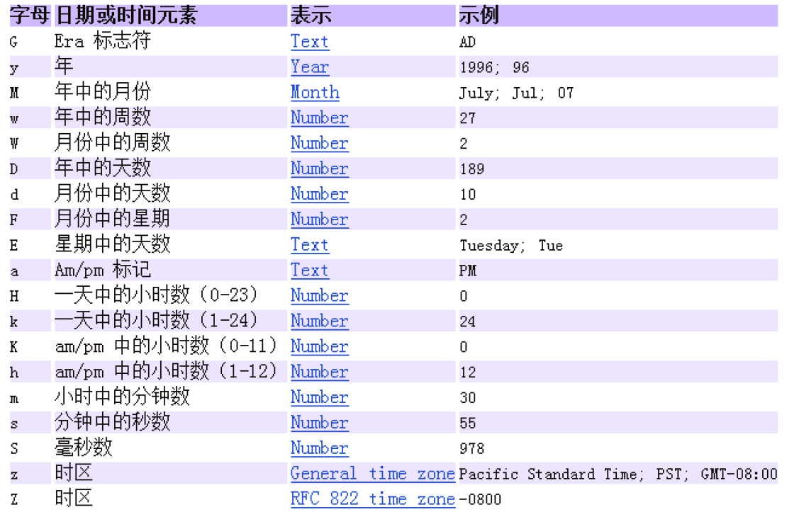


**小练习：**

将字符串 "2020-09-08" 转换为 java.sql.Date 格式的时间

```java
@Test
public void test3() throws ParseException {
    String brith = "1997-10-15";
    //新建SimpleDateFormat对象并设置时间格式
    SimpleDateFormat simpBrith = new SimpleDateFormat("yyyy-mm-dd");
    //将字符串格式的时间格式化为Date类
    Date brithday = simpBrith.parse(brith);
    //通过Date的getTime方法将Date对象转化为时间戳放到java.sql.date类的构造方法中
    java.sql.Date brithDate = new java.sql.Date(brithday.getTime());
    System.out.println(brithDate);
}
```

### 4. Calendar 类：日历类、抽象类

Calendar 是一个抽象基类，主用用于完成日期字段之间相互操作的功能。

- 获取 Calenda 实例的方法 使用 Calendar.getInstance() 方法 调用它的子类 GregorianCalendarl 的构造器。
- 一个 Calendar 的实例是系统时间的抽象表示，通过 get(int field) 方法来取得想要的时间信息。 比如 YEAR、MONTH、DAY_OF_WEEK、HOUR_OF_DAY、MINUTE、SECOND public void set(int field,int value) public void add(int field,int amount) public final Date get Time() public final void set Time(Date date)
- 注意 获取月份时：一月是 0，二月是 1，以此类推，12 月是 11 获取星期时：周日是 1，周二是 2，。。。周六是 7

#### 4.1 实例化

方式一：创建其子类 (GregorianCalendar) 的对象

方式二：调用其静态方法 getInstance()

```java
Calendar calendar = Calendar.getInstance();
```

#### 4.2 常用方法

get(): 获取日期

set(): 设置日期

add(): 添加、修改日期

getTime: 日历类 -->Date

setTime:Date--> 日历类

**代码示例：**

```java
Calendar calendar = Calendar.getInstance();
//        System.out.println(calendar.getClass());

//2.常用方法
//get()
int days = calendar.get(Calendar.DAY_OF_MONTH);//获取本月第几天
System.out.println(days);
System.out.println(calendar.get(Calendar.DAY_OF_YEAR));//获取本年第几天

//set()
//calendar可变性
calendar.set(Calendar.DAY_OF_MONTH,22);//设置本月第几天
days = calendar.get(Calendar.DAY_OF_MONTH);
System.out.println(days);

//add()
calendar.add(Calendar.DAY_OF_MONTH,-3);
days = calendar.get(Calendar.DAY_OF_MONTH);
System.out.println(days);

//getTime():日历类---> Date
Date date = calendar.getTime();
System.out.println(date);

//setTime():Date ---> 日历类
Date date1 = new Date();
calendar.setTime(date1);
days = calendar.get(Calendar.DAY_OF_MONTH);
System.out.println(days);
```

## 四、JDK 8.0 中新的日期时间类

### 1. 日期时间 API 的迭代：

第一代：jdk 1.0 Date 类

第二代：jdk 1.1 Calendar 类，一定程度上替换 Date 类

第三代：jdk 1.8 提出了新的一套 API

### 2. 前两代的问题：

可变性：像日期和时间这样的类应该是不可变的。

偏移性：Date 中的年份是从 1900 开始的，而月份都从 0 开始。

格式化：格式化只对 Date 用，Calendar 则不行。 此外，它们也不是线程安全的；不能处理闰秒等。

Java 8.0 中新引入的 java.time API:

Java 8.0 吸收了 Joda-Time 的精华，以一个新的开始为 Java 创建优秀的 APl。新的 java.time 中包含了所有关于本地日期 (LocalDate)、本地时间(Localtime)、本地日期时间(LocalDate time)、时区(ZonedDate time) 和持续时间 (Duration) 的类。历史悠久的 Date 类新增了 tolnstant()方法用于把 Date 转换成新的表示形式。这些新增的本地化时间日期 API 大大简化了日期时间和本地化的管理。

### 3. Java 8.0 中新的日期时间 API 涉及的包:


### 4. 本地日期、本地时间、本地日期时间的使用：

LocalDate / LocalTime / LocalDateTime

#### 4.1 说明：

① 分别表示使用 ISO-8601 日历系统的日期、时间、日期和时间。它们提供了简单的本地日期或时间，并不包含当前的时间信息，也不包含与时区相关的信息。

② LocalDateTime 相较于 LocalDate、LocalTime，使用频率要高

③ 类似于 Calendar

#### 4.2 常用方法：


**代码示例：**

```java
@Test
public void test1(){
    //now():获取当前的日期、时间、日期时间
    LocalDate localDate = LocalDate.now();
    LocalTime localTime = LocalTime.now();
    LocalDateTime localDateTime = LocalDateTime.now();

    System.out.println(localDate);//2020-04-21
    System.out.println(localTime);//18:52:54.929
    System.out.println(localDateTime);//2020-04-21T18:52:54.929

    //of():设置指定的年、月、日、时、分、秒。没有偏移量
    LocalDateTime localDateTime1 = LocalDateTime.of(2020,10,6,12,13,12);
    System.out.println(localDateTime1);//2020-10-06T12:13:12

    //getXxx()：获取相关的属性
    System.out.println(localDateTime.getDayOfMonth());//21
    System.out.println(localDateTime.getDayOfWeek());//TUESDAY
    System.out.println(localDateTime.getMonth());//APRIL
    System.out.println(localDateTime.getMonthValue());//4
    System.out.println(localDateTime.getMinute());//52

    //体现不可变性
    //withXxx():设置相关的属性
    LocalDate localDate1 = localDate.withDayOfMonth(22);
    System.out.println(localDate);//2020-04-21
    System.out.println(localDate1);//2020-04-22

    LocalDateTime localDateTime2 = localDateTime.withHour(4);
    System.out.println(localDateTime);//2020-04-21T18:59:17.484
    System.out.println(localDateTime2);//2020-04-21T04:59:17.484

    //不可变性
    LocalDateTime localDateTime3 = localDateTime.plusMonths(3);
    System.out.println(localDateTime);//2020-04-21T18:59:17.484
    System.out.println(localDateTime3);//2020-07-21T18:59:17.484

    LocalDateTime localDateTime4 = localDateTime.minusDays(6);
    System.out.println(localDateTime);//2020-04-21T18:59:17.484
    System.out.println(localDateTime4);//2020-04-15T18:59:17.484
}
```

### 5. 时间点：Instant

#### 5.1 说明：

① 时间线上的一个瞬时点。 概念上讲，它只是简单的表示自 1970 年 1 月 1 日 0 时 0 分 0 秒（UTC 开始的秒数。）

② 类似于 java.util.Date 类

#### 5.2 常用方法：


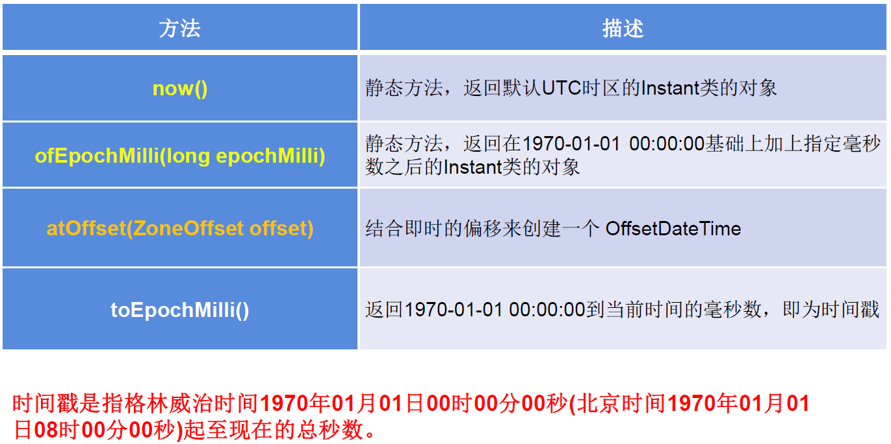


**代码示例：**

```java
@Test
public void test2(){
    //now():获取本初子午线对应的标准时间
    Instant instant = Instant.now();
    System.out.println(instant);//2020-04-21T11:03:21.469Z

    //添加时间的偏移量
    OffsetDateTime offsetDateTime = instant.atOffset(ZoneOffset.ofHours(8));
    System.out.println(offsetDateTime);//2020-04-21T19:03:21.469+08:00

    //toEpochMilli():获取自1970年1月1日0时0分0秒（UTC）开始的毫秒数  ---> Date类的getTime()
    long milli = instant.toEpochMilli();
    System.out.println(milli);//1587467105795

    //ofEpochMilli():通过给定的毫秒数，获取Instant实例  -->Date(long millis)
    Instant instant1 = Instant.ofEpochMilli(1587467105795L);
    System.out.println(instant1);//2020-04-21T11:05:05.795Z
}
```

### 6. 日期时间格式化类：DateTimeFormatter

#### 6.1 说明：

① 格式化或解析日期、时间

② 类似于 SimpleDateFormat

#### 6.2 常用方法：

1. 实例化方式： 预定义的标准格式。如：ISO_LOCAL_DATE_TIME;ISO_LOCAL_DATE;ISO_LOCAL_TIME 本地化相关的格式。如：ofLocalizedDateTime(FormatStyle.LONG) 自定义的格式。如：ofPattern(“yyyy-MM-dd hh:mm:ss”)

2. 常用方法：

   

   

   

   特别的：自定义的格式。如：ofPattern(“yyyy-MM-dd hh:mm:ss”)

   **代码示例：**

   ```java
   @Test
   public void test3(){
       //        方式一：预定义的标准格式。
       //        如：ISO_LOCAL_DATE_TIME;ISO_LOCAL_DATE;ISO_LOCAL_TIME
       DateTimeFormatter formatter = DateTimeFormatter.ISO_LOCAL_DATE_TIME;
       //格式化:日期-->字符串
       LocalDateTime localDateTime = LocalDateTime.now();
       String str1 = formatter.format(localDateTime);
       System.out.println(localDateTime);//2020-04-21T19:13:13.530
       System.out.println(str1);//2020-04-21T19:13:13.53
   
       //解析：字符串 -->日期
       TemporalAccessor parse = formatter.parse("2000-04-21T19:13:13.53");
       System.out.println(parse);//{},ISO resolved to 2000-04-21T19:13:13.530
       //        方式二：
       //        本地化相关的格式。如：ofLocalizedDateTime()
       //        FormatStyle.LONG / FormatStyle.MEDIUM / FormatStyle.SHORT :适用于LocalDateTime
       DateTimeFormatter formatter1 = DateTimeFormatter.ofLocalizedDateTime(FormatStyle.LONG);
       //格式化
       String str2 = formatter1.format(localDateTime);
       System.out.println(str2);//2020年4月21日 下午07时16分57秒
   
       //      本地化相关的格式。如：ofLocalizedDate()
       //      FormatStyle.FULL / FormatStyle.LONG / FormatStyle.MEDIUM / FormatStyle.SHORT : 适用于LocalDate
       DateTimeFormatter formatter2 = DateTimeFormatter.ofLocalizedDate(FormatStyle.MEDIUM);
       //格式化
       String str3 = formatter2.format(LocalDate.now());
       System.out.println(str3);//2020-4-21
   
       //       重点： 方式三：自定义的格式。如：ofPattern(“yyyy-MM-dd hh:mm:ss”)
       DateTimeFormatter formatter3 = DateTimeFormatter.ofPattern("yyyy-MM-dd hh:mm:ss");
       String Str4 = formatter3.format(LocalDateTime.now());
       System.out.println(Str4);//2020-04-21 07:24:04
   
       TemporalAccessor accessor = formatter3.parse("2020-02-03 05:23:06");
       System.out.println(accessor);//{SecondOfMinute=6, HourOfAmPm=5, NanoOfSecond=0, MicroOfSecond=0, MinuteOfHour=23, MilliOfSecond=0},ISO resolved to 2020-02-03
   }
   ```

### 7. 其它 API 的使用：


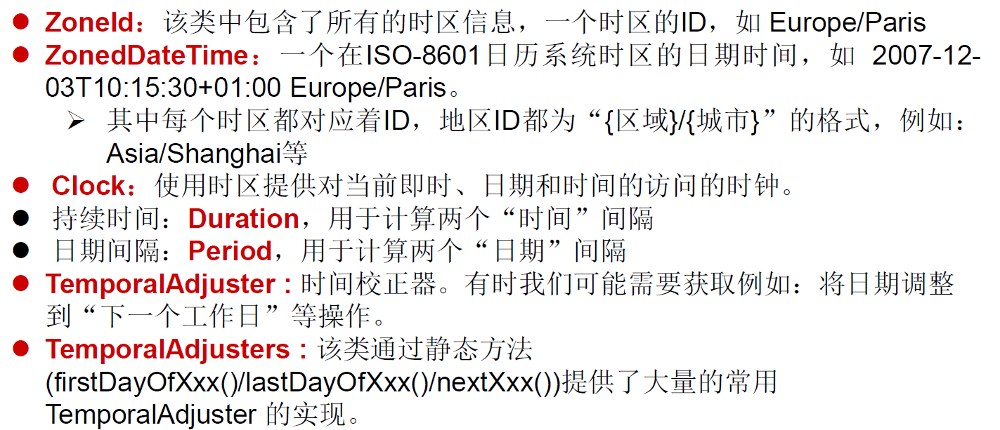


#### 7.1 带时区的日期时间：

ZonedDateTime / ZoneId

**代码示例：**

```java
// ZoneId:类中包含了所的时区信息
@Test
public void test1(){
    //getAvailableZoneIds():获取所的ZoneId
    Set<String> zoneIds = ZoneId.getAvailableZoneIds();
    for(String s : zoneIds){
        System.out.println(s);
    }
    System.out.println();

    //获取“Asia/Tokyo”时区对应的时间
    LocalDateTime localDateTime = LocalDateTime.now(ZoneId.of("Asia/Tokyo"));
    System.out.println(localDateTime);


}
//ZonedDateTime:带时区的日期时间
@Test
public void test2(){
    //now():获取本时区的ZonedDateTime对象
    ZonedDateTime zonedDateTime = ZonedDateTime.now();
    System.out.println(zonedDateTime);
    //now(ZoneId id):获取指定时区的ZonedDateTime对象
    ZonedDateTime zonedDateTime1 = ZonedDateTime.now(ZoneId.of("Asia/Tokyo"));
    System.out.println(zonedDateTime1);
}
```

#### 7.2 时间间隔：

Duration-- 用于计算两个 “时间” 间隔，以秒和纳秒为基准


**代码示例：**

```java
@Test
public void test3(){
    LocalTime localTime = LocalTime.now();
    LocalTime localTime1 = LocalTime.of(15, 23, 32);
    //between():静态方法，返回Duration对象，表示两个时间的间隔
    Duration duration = Duration.between(localTime1, localTime);
    System.out.println(duration);

    System.out.println(duration.getSeconds());
    System.out.println(duration.getNano());

    LocalDateTime localDateTime = LocalDateTime.of(2016, 6, 12, 15, 23, 32);
    LocalDateTime localDateTime1 = LocalDateTime.of(2017, 6, 12, 15, 23, 32);

    Duration duration1 = Duration.between(localDateTime1, localDateTime);
    System.out.println(duration1.toDays());

}
```

#### 7.3 日期间隔：

Period -- 用于计算两个 “日期” 间隔，以年、月、日衡量


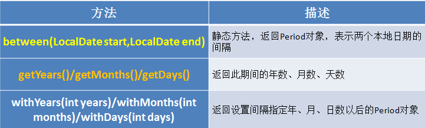


**代码示例：**

```java
@Test
public void test4(){
    LocalDate localDate = LocalDate.now();
    LocalDate localDate1 = LocalDate.of(2028, 3, 18);

    Period period = Period.between(localDate, localDate1);
    System.out.println(period);

    System.out.println(period.getYears());
    System.out.println(period.getMonths());
    System.out.println(period.getDays());

    Period period1 = period.withYears(2);
    System.out.println(period1);

}
```

#### 7.4 日期时间校正器：TemporalAdjuster

**代码示例：**

```java
@Test
public void test5(){
    //获取当前日期的下一个周日是哪天？
    TemporalAdjuster temporalAdjuster = TemporalAdjusters.next(DayOfWeek.SUNDAY);

    LocalDateTime localDateTime = LocalDateTime.now().with(temporalAdjuster);
    System.out.println(localDateTime);

    //获取下一个工作日是哪天？
    LocalDate localDate = LocalDate.now().with(new TemporalAdjuster(){

        @Override
        public Temporal adjustInto(Temporal temporal) {
            LocalDate date = (LocalDate)temporal;
            if(date.getDayOfWeek().equals(DayOfWeek.FRIDAY)){
                return date.plusDays(3);
            }else if(date.getDayOfWeek().equals(DayOfWeek.SATURDAY)){
                return date.plusDays(2);
            }else{
                return date.plusDays(1);
            }

        }

    });

    System.out.println("下一个工作日是：" + localDate);
}
```

#### 7.5 新的日期 API 与原来 API 的转化问题：


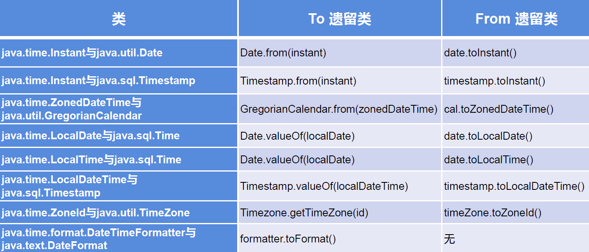


## 五、Java 比较器

### 1. Java 比较器的使用背景：

- Java 中的对象，正常情况下，只能进行比较：== 或 != 。不能使用 > 或 < 的
- 但是在开发场景中，我们需要对多个对象进行排序，言外之意，就需要比较对象的大小。
- 如何实现？使用两个接口中的任何一个：Comparable（自然排序） 或 Comparator（定制排序）

### 2. 自然排序：使用 Comparable 接口

#### 2.1 说明

1. 像 String、包装类等实现了 Comparable 接口，重写了 compareTo(obj) 方法，给出了比较两个对象大小的方式。
2. 像 String、包装类重写 compareTo() 方法以后，进行了从小到大的排列
3. 重写 compareTo(obj) 的规则： 如果当前对象 this 大于形参对象 obj，则返回正整数， 如果当前对象 this 小于形参对象 obj，则返回负整数， 如果当前对象 this 等于形参对象 obj，则返回零。
4. 对于自定义类来说，如果需要排序，我们可以让自定义类实现 Comparable 接口，重写 compareTo(obj) 方法。在 compareTo(obj) 方法中指明如何排序
5. Comparable 的典型实现：(默认都是从小到大排列的) String：按照字符串中字符的 Uincode 值进行比较 Character：按照字符的 Unicode 值来进行比较 数值类型对应的包装类以及 BigInteger、BigDecimal：按照它们对应的数值大小进行比较 Boolean：true 对应的包装类实例大于 false 对应的包装类实例 Date、Time 等：后面的日期时间比前面的日期时间大

#### 2.2 自定义类代码举例：

```java
public class Goods implements  Comparable{

    private String name;
    private double price;

    //指明商品比较大小的方式:照价格从低到高排序,再照产品名称从高到低排序
    @Override
    public int compareTo(Object o) {
        //        System.out.println("**************");
        if(o instanceof Goods){
            Goods goods = (Goods)o;
            //方式一：
            if(this.price > goods.price){
                return 1;
            }else if(this.price < goods.price){
                return -1;
            }else{
                //                return 0;
                return -this.name.compareTo(goods.name);
            }
            //方式二：
            //           return Double.compare(this.price,goods.price);
        }
        //        return 0;
        throw new RuntimeException("传入的数据类型不一致！");
    }
    // getter、setter、toString()、构造器：省略
}
```

### 3. 定制排序：使用 Comparator 接口

#### 3.1 说明:

1. 背景：

当元素的类型没实现 java.lang.Comparable 接口而又不方便修改代码，或者实现了 java.lang.Comparable 接口的排序规则不适合当前的操作，那么可以考虑使用 Comparator 的对象来排序

 \2. 重写 compare(Object o1,Object o2) 方法，比较 o1 和 o2 的大小：

- 如果方法返回正整数，则表示 o1 大于 o2；
- 如果返回 0，表示相等；
- 返回负整数，表示 o1 小于 o2。

#### 3.2 代码举例：

```java
Comparator com = new Comparator() {
    //指明商品比较大小的方式:照产品名称从低到高排序,再照价格从高到低排序
    @Override
    public int compare(Object o1, Object o2) {
        if(o1 instanceof Goods && o2 instanceof Goods){
            Goods g1 = (Goods)o1;
            Goods g2 = (Goods)o2;
            if(g1.getName().equals(g2.getName())){
                return -Double.compare(g1.getPrice(),g2.getPrice());
            }else{
                return g1.getName().compareTo(g2.getName());
            }
        }
        throw new RuntimeException("输入的数据类型不一致");
    }
}
```

### 4. 两种排序方式对比

- Comparable 接口的方式是一定的，保证 Comparable 接口实现类的对象在任何位置都可以比较大小。
- Comparator 接口属于临时性的比较。

## 六、其他常用类

### 1.System 类

- System 类代表系统，系统级的很多属性和控制方法都放置在该类的内部。该类位于 java.lang 包。
- 由于该类的构造器是 private 的，所以无法创建该类的对象，也就是无法实例化该类。其内部的成员变量和成员方法都是 static 的，所以也可以很方便的进行调用。

**成员方法：**

- native long currentTimeMillis()：

  该方法的作用是返回当前的计算机时间，时间的表达格式为当前计算机时间和 GMT 时间（格林威治时间）1970 年 1 月 1 号 0 时 0 分 0 秒所差的毫秒数。

- void exit(int status)

  该方法的作用是退出程序。其中 status 的值为 0 代表正常退出，非零代表异常退出。使用该方法可以在图形界面编程中实现程序的退出功能等

- void gc()

  该方法的作用是请求系统进行垃圾回收。至于系统是否立刻回收，则取决于系统中垃圾回收算法的实现以及系统执行时的情况。

- String getProperty(String key)

  该方法的作用是获得系统中属性名为 key 的属性对应的值。系统中常见的属性名以及属性的作用如下表所示：

  

  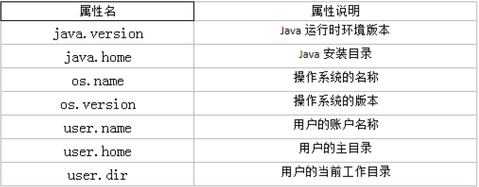

  

**代码示例：**

```java
@Test
public void test1() {
    String javaVersion = System.getProperty("java.version");
    System.out.println("java的version:" + javaVersion);

    String javaHome = System.getProperty("java.home");
    System.out.println("java的home:" + javaHome);

    String osName = System.getProperty("os.name");
    System.out.println("os的name:" + osName);

    String osVersion = System.getProperty("os.version");
    System.out.println("os的version:" + osVersion);

    String userName = System.getProperty("user.name");
    System.out.println("user的name:" + userName);

    String userHome = System.getProperty("user.home");
    System.out.println("user的home:" + userHome);

    String userDir = System.getProperty("user.dir");
    System.out.println("user的dir:" + userDir);

}
```

### 2.Math 类

java.lang.Math 提供了一系列静态方法用于科学计算。其方法的参数和返回值类型一般为 double 型。


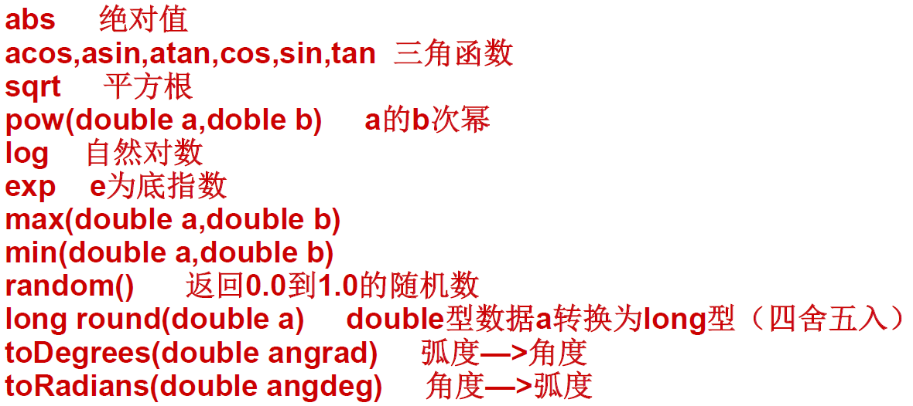


### 3.BigInteger 类、BigDecimal 类

#### 3.1BigInteger

java.math 包的 BigInteger 可以表示不可变的任意精度的整数。

BigInteger 提供所有 Java 的基本整数操作符的对应物，并提供 java.lang.Math 的所有相关方法。另外，BigInteger 还提供以下运算：模算术、GCD 计算、质数测试、素数生成、位操作以及一些其他操作。

构造器： BigInteger(String val)：根据字符串构建 BigInteger 对象


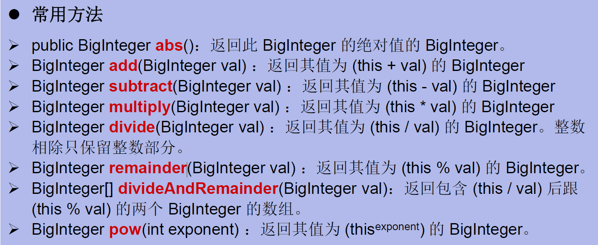


**代码举例：**

```java
@Test
public void test2() {
    BigInteger bi = new BigInteger("1243324112234324324325235245346567657653");
    BigDecimal bd = new BigDecimal("12435.351");
    BigDecimal bd2 = new BigDecimal("11");
    System.out.println(bi);
    //         System.out.println(bd.divide(bd2));
    System.out.println(bd.divide(bd2, BigDecimal.ROUND_HALF_UP));
    System.out.println(bd.divide(bd2, 25, BigDecimal.ROUND_HALF_UP));

}
```

#### 3.2 BigDecimal

要求数字精度比较高，用到 java.math.BigDecimal 类

BigDecimal 类支持不可变的、任意精度的有符号十进制定点数。

**构造器：**

public BigDecimal(double val)

public BigDecimal(String val)

**常用方法：**

public BigDecimal add(BigDecimal augend)

public BigDecimal subtract(BigDecimal subtrahend)

public BigDecimal multiply(BigDecimal multiplicand)

public BigDecimal divide(BigDecimal divisor， int scale， int rounding Mode)

**代码举例：**

```java
@Test
public void test2() {
    BigInteger bi = new BigInteger("1243324112234324324325235245346567657653");
    BigDecimal bd = new BigDecimal("12435.351");
    BigDecimal bd2 = new BigDecimal("11");
    System.out.println(bi);
    //         System.out.println(bd.divide(bd2));
    System.out.println(bd.divide(bd2, BigDecimal.ROUND_HALF_UP));
    System.out.println(bd.divide(bd2, 25, BigDecimal.ROUND_HALF_UP));

}
```


全文完