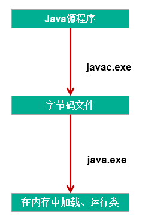

# Java 之异常处理 


## 异常的定义

异常：在 Java 语言中，将程序执行中发生的不正常情况称为 “异常”。 （开发过程中的语法错误和逻辑错误不是异常）

### 1. 异常的体系结构

Java 程序在执行过程中所发生的异常事件可分为两类：

1. Error： Java 虚拟机无法解决的严重问题。如：JVM 系统内部错误、资源耗尽等严重情况。比如： StackOverflowError 和 OOM。一般不编写针对性的代码进行处理。
2. Exception：其它因编程错误或偶然的外在因素导致的一般性问题，可以使用针对性的代码进行处理。例如：
   - 空指针访问
   - 试图读取不存在的文件
   - 网络连接中断
   - 数组角标越界

```java
异常的体系结构
 * java.lang.Throwable
 * 		|-----java.lang.Error:一般不编写针对性的代码进行处理。
 * 		|-----java.lang.Exception:可以进行异常的处理
 * 			|------编译时异常(checked)不会生成字节码文件
 * 					|-----IOException
 * 						|-----FileNotFoundException
 * 					|-----ClassNotFoundException
 * 			|------运行时异常(unchecked,RuntimeException)
 * 					|-----NullPointerException//空指针异常
 * 					|-----ArrayIndexOutOfBoundsException//数组角标越界
 * 					|-----ClassCastException//类型转化异常
 * 					|-----NumberFormatException//编码格式异常
 * 					|-----InputMismatchException//输入不匹配
 * 					|-----ArithmeticException//算术异常
```

java 中异常类的继承关系


### 2. 按照异常发生的时间可以分为两类

1. 编译时异常：执行 javac.exe 命名时，可能出现的异常 是指编译器不要求强制处置的异常。一般是指编程时的逻辑错误，是程序员应该积极避免其出现的异常。 java. lang. Runtime Exception 类及它的子类都是运行时异常。 对于这类异常，可以不作处理，因为这类异常很普遍，若全处理可能会对程序的可读性和运行效率产生影响
2. 运行时异常：执行 java.exe 命名时，出现的异常 是指编译器要求必须处置的异常。即程序在运行时由于外界因素造成的一般性异常。编译器要求 Java 程序必须捕获或声明所有编译时异常对于这类异常，如果程序不处理，可能会带来意想不到的结果。





### 3. 常见的异常类型

```java
//******************以下是运行时异常***************************
	//ArithmeticException
	@Test
	public void test6(){
		int a = 10;
		int b = 0;
		System.out.println(a / b);
	}
	
	//InputMismatchException
	@Test
	public void test5(){
		Scanner scanner = new Scanner(System.in);
		int score = scanner.nextInt();
		System.out.println(score);
		
		scanner.close();
	}
	
	//NumberFormatException
	@Test
	public void test4(){
		
		String str = "123";
		str = "abc";
		int num = Integer.parseInt(str);	
	}
	
	//ClassCastException
	@Test
	public void test3(){
		Object obj = new Date();
		String str = (String)obj;
	}
	
	//IndexOutOfBoundsException
	@Test
	public void test2(){
		//ArrayIndexOutOfBoundsException
//		int[] arr = new int[10];
//		System.out.println(arr[10]);
		//StringIndexOutOfBoundsException
		String str = "abc";
		System.out.println(str.charAt(3));
	}
	
	//NullPointerException
	@Test
	public void test1(){		
//		int[] arr = null;
//		System.out.println(arr[3]);
		
		String str = "abc";
		str = null;
		System.out.println(str.charAt(0));
		
	}

	//******************以下是编译时异常***************************
	@Test
	public void test7(){
//		File file = new File("hello.txt");
//		FileInputStream fis = new FileInputStream(file);
//		
//		int data = fis.read();
//		while(data != -1){
//			System.out.print((char)data);
//			data = fis.read();
//		}
//		
//		fis.close();
		
	}
```

## 异常的处理

### 1. java 异常处理的抓抛模型

过程一："抛"：程序在正常执行的过程中，一旦出现异常，就会在异常代码处生成一个对应异常类的对象。并将此对象抛出。一旦抛出对象以后，其后的代码就不再执行。

关于异常对象的产生：

① 系统自动生成的异常对象

② 手动的生成一个异常对象，并抛出（throw）

过程二："抓"：可以理解为异常的处理方式：① try-catch-finally ② throws

### 2. 异常处理方式一：try-catch-finally

#### 2.1 使用说明：

```java
try{
		//可能出现异常的代码
    
}catch(异常类型1 变量名1){
  		//处理异常的方式1
}catch(异常类型2 变量名2){
 		//处理异常的方式2
}catch(异常类型3 变量名3){
  		//处理异常的方式3
}
 ....
finally{
  		//一定会执行的代码
}
```

说明：

1. finally 是可选的。

2. 使用 try 将可能出现异常代码包装起来，在执行过程中，一旦出现异常，就会生成一个对应异常类的对象，根据此对象的类型，去 catch 中进行匹配

3. 一旦 try 中的异常对象匹配到某一个 catch 时，就进入 catch 中进行异常的处理。一旦处理完成，就跳出当前的 try-catch 结构（在没写 finally 的情况。继续执行其后的代码）

4. catch 中的异常类型如果没子父类关系，则谁声明在上，谁声明在下无所谓。

   catch 中的异常类型如果满足子父类关系，则要求子类一定声明在父类的上面。否则，报错

5. 常用的异常对象处理的方式： ① String getMessage() ② printStackTrace()

6. 在 try 结构中声明的变量，再出了 try 结构以后，就不能再被调用

7. try-catch-finally 结构可以嵌套

如何看待代码中的编译时异常和运行时异常？

1. 使用 try-catch-finally 处理编译时异常，是得程序在编译时就不再报错，但是运行时仍可能报错。相当于我们使用 try-catch-finally 将一个编译时可能出现的异常，延迟到运行时出现。
2. 开发中，由于运行时异常比较常见，所以我们通常就不针对运行时异常编写 try-catch-finally 了。== 针对于编译时异常，我们说一定要考虑异常的处理 ==。

#### 2.2. finally 的再说明：

1. finally 是可选的
2. finally 中声明的是一定会被执行的代码。即使 catch 中又出现异常了，try 中 return 语句，catch 中 return 语句等情况。
3. 像数据库连接、输入输出流、网络编程 Socket 等资源，JVM 是不能自动的回收的，我们需要自己手动的进行资源的释放。此时的资源释放，就需要声明在 finally 中。

### 3. 异常处理方式二：

"throws + 异常类型"== 写在方法的声明处 ==。指明此方法执行时，可能会抛出的异常类型。 一旦当方法体执行时，出现异常，仍会在异常代码处生成一个异常类的对象，此对象满足 throws 后异常类型时，就会被抛出。异常代码后续的代码，就不再执行！

### 4. 对比两种处理方式

try-catch-finally: 真正的将异常给处理掉了。 throws 的方式只是将异常抛给了方法的调用者。== 并没真正将异常处理掉 ==。

### 5. 开发中应该如何选择两种处理方式？

- 如果父类中被重写的方法没 throws 方式处理异常，则子类重写的方法也不能使用 throws，意味着如果子类重写的方法中异常，必须使用 try-catch-finally 方式处理。
- 执行的方法 a 中，先后又调用了另外的几个方法，这几个方法是递进关系执行的。我们建议这几个方法使用 throws 的方式进行处理。而执行的方法 a 可以考虑使用 try-catch-finally 方式进行处理。

补充： 方法重写的规则之一： 子类重写的方法抛出的异常类型不大于父类被重写的方法抛出的异常类型

## 手动抛出异常对象

### 1. 使用说明

在程序执行中，除了自动抛出异常对象的情况之外，我们还可以手动的 throw 一个异常类的对象。

### 2. 经典面试题

throw 和 throws 区别： throw 表示抛出一个异常类的对象，生成异常对象的过程。声明在方法体内。 throws 属于异常处理的一种方式，声明在方法的声明处。

### 3. 代码示例

```java
class Student{
	
	private int id;
	
	public void regist(int id) throws Exception {
		if(id > 0){
			this.id = id;
		}else{
			//手动抛出异常对象
//			throw new RuntimeException("您输入的数据非法！");
//			throw new Exception("您输入的数据非法！");
			throw new MyException("不能输入负数");

		}		
	}

	@Override
	public String toString() {
		return "Student [id=" + id + "]";
	}
		
}
```

## 自定义异常类

### 1. 如何自定义异常类

1. 继承于现的异常结构：RuntimeException 、Exception
2. 提供全局常量：serialVersionUID（对类的唯一标识）
3. 提供重载的构造器

### 2. 代码示例

```java
public class MyException extends Exception{
	
	static final long serialVersionUID = -7034897193246939L;
	
	public MyException(){
		
	}
	
	public MyException(String msg){
		super(msg);
	}
}
```


全文完