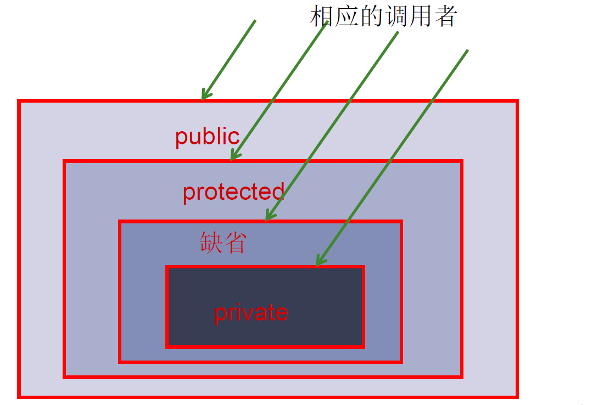
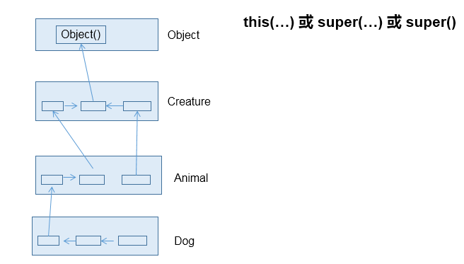
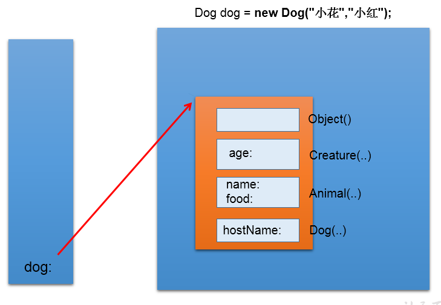

[TOC]


# 细说面向对象三大特征 


## 一、面向对象特征之封装性

### 1. 为什么要引入封装性？

我们程序设计追求 “高内聚，低耦合”

- 高内聚：类的内部数据操作细节自己完成，不允许外部干涉
- 低耦合：仅对外暴露少量的方法用于使用。

隐藏对象内部的复杂性，只对外公开简单的接口。便于外界调用，从而提高系统的可扩展性、可维护性。通俗的说，把该隐藏的隐藏起来，该暴露的暴露岀来。这就是封装性的设计思想。

### 2. 问题引入：

当我们创建一个类的对象以后，我们可以通过 "对象. 属性" 的方式，对对象的属性进行赋值。这里，赋值操作要受到属性的数据类型和存储范围的制约。除此之外，没其他制约条件。但是，在实际问题中，我们往往需要给属性赋值加入额外的限制条件。这个条件就不能在属性声明时体现，我们只能通过方法进行限制条件的添加。（比如：setName() 同时，我们需要避免用户再使用 "对象. 属性" 的方式对属性进行赋值。则需要将属性声明为私有的 (private)。此时，针对于属性就体现了封装性。

### 3. 封装性思想具体的代码体现：

体现一：

将类的属性 xxx 私化 (private), 同时，提供公共的(public) 方法来获取 (getXxx) 和设置 (setXxx) 此属性的值

```java
private double radius;
public void setRadius(double radius){
	this.radius = radius;
}
public double getRadius(){
	return radius;
}
```

体现二：不对外暴露的私有的方法

体现三：单例模式（将构造器私有化）

体现四：如果不希望类在包外被调用，可以将类设置为缺省的。

### 4. Java 规定的四种权限修饰符

通过对不同的方法属性设置不同的权限修饰符来达到对类进行封装的目的。

- 权限从小到大顺序为：private < 缺省 < protected < public
- 具体的修饰范围：

| 修饰符    | 类内部 | 同一个包 | 不同包的子类 | 同一个工程 |
| --------- | ------ | -------- | ------------ | ---------- |
| private   | Yes    |          |              |            |
| （缺省）  | Yes    | Yes      |              |            |
| protected | Yes    | Yes      | Yes          |            |
| public    | Yes    | Yes      | Yes          | Yes        |





**权限修饰符可用来修饰的结构说明**：

- 4 种权限都可以用来修饰**类的内部结构**：属性、方法、构造器、内部类
- **修饰类**，只能使用：缺省、public

## 二、面向对象特征之继承性

### 1. 引入继承性的好处

- 减少了代码的冗余，提高了代码的复用性
- 便于功能的扩展
- 为之后多态性的使用，提供了前提


### 2. 继承性的格式：

```java
class A extends B{}
 *    A:子类、派生类、subclass
 *    B:父类、超类、基类、superclass
```

判断是否要进行继承：A is a B, 若成立，则 B 继承 A

### 3. 子类继承父类以后有哪些不同？

- 子类 A 继承父类 B 以后，子类 A 中就获取了父类 B 中声明的所有的属性和方法。特别的，父类中声明为 private 的属性或方法，子类继承父类以后，仍然认为获取了父类中私的结构。只因为封装性的影响，使得子类不能直接调用父类的结构而已。
- 子类继承父类以后，还可以声明自己特有的属性或方法：实现功能的拓展。子类和父类的关系，不同于子集和集合的关系。

### 4. Java 中继承性的说明

1. 一个类可以被多个子类继承。
2. Java 中类的单继承性：一个类只能有一个父类
3. 子父类是相对的概念。
4. 子类直接继承的父类，称为：直接父类。间接继承的父类称为：间接父类
5. 子类继承父类以后，就获取了直接父类以及所间接父类中声明的属性和方法


### 5. Object 类

#### 5.1 java.lang.Object 类的理解

是 Java 中所有类的父类，类似于二叉树中的根节点，定义了一些通用的方法。

1. 如果我们没显式的声明一个类的父类的话，则此类继承于 java.lang.Object 类
2. 所的 java 类（除 java.lang.Object 类之外都直接或间接的继承于 java.lang.Object 类
3. 意味着，所的 java 类具有 java.lang.Object 类声明的功能。
4. java.lang.Object 类中定义的一些方法

| 方法名                            | 类型     | 描述           |
| --------------------------------- | -------- | -------------- |
| public Object()                   | 构造方法 | 构造器         |
| public boolean equals(Object obj) | 普通方法 | 对象比较       |
| public int hashCode()             | 普通方法 | 获取 Hash 码   |
| public String toString()          | 普通方法 | 对象打印时调用 |

#### 5.2. java.lang.Object 类的说明：

1. Object 类是所 Java 类的根父类
2. 如果在类的声明中未使用 extends 关键字指明其父类，则默认父类为 java.lang.Object 类
3. Object 类中的功能 (属性、方法) 就具通用性。

- 属性：无

- 方法：equals() / toString() / getClass() /hashCode() / clone() / finalize()

  wait() 、 notify()、notifyAll()

1. Object 类只声明了一个空参的构造器
2. 数组也作为 Object 类的子类出现，可以调用 Object 类中声明的方法

#### 5.3. equals() 方法

- 是一个方法，而非运算符
- 只能适用于引用数据类型

```java
public boolean equals(Object obj) {
	        return (this == obj);
	  }
```

**使用说明**：

- Object 类中定义的 equals() 和 == 的作用是相同的：比较两个对象的地址值是否相同. 即两个引用是否指向同一个对象实体
- 像 ==String、Date、File、包装类 == 等都重写了 Object 类中的 equals() 方法。== 重写 == 以后，比较的不是两个引用的地址是否相同，而是 == 比较两个对象的 "实体内容" 是否相同 ==。
- 通常情况下，我们自定义的类如果使用 equals() 的话，也通常是比较两个对象的 "实体内容" 是否相同。那么，我们就需要对 Object 类中的 equals() 进行重写.
- 重写的原则：比较两个对象的实体内容是否相同.

**手动重写举例：**

```java
class User{
	String name;
	int age;
	//重写其equals()方法
	public boolean equals(Object obj){
		if(obj == this){//判断形参和比较对象的引用地址是否相同，相同直接返回true
			return true;
		}
		if(obj instanceof User){
			User u = (User)obj;
			return this.age == u.age && this.name.equals(u.name);
		}
		return false;
	}
}
```

**自动生成的**，自动生成快捷键 ctrl+alt+S, 选择自动生成 hashCode 和 equals 方法


**自动生成的代码：**

```java
@Override
	public boolean equals(Object obj) {
		if (this == obj)
			return true;
		if (obj == null)
			return false;
		if (getClass() != obj.getClass())
			return false;
		Person other = (Person) obj;
		if (age != other.age)
			return false;
		if (name == null) {
			if (other.name != null)
				return false;
		} else if (!name.equals(other.name))
			return false;
		return true;
```

**回顾 == 运算符的使用：**

== ：运算符

1. 可以使用在基本数据类型变量和引用数据类型变量中

2. 如果比较的是基本数据类型变量：

   比较两个变量保存的数据是否相等。（不一定类型要相同）

3. 如果比较的是引用数据类型变量：

   比较两个对象的地址值是否相同, 即两个引用是否指向同一个对象实体

**使用说明**

- == 符号使用时，必须保证符号左右两边的变量类型一致。
- 基本数据类型用 ==，引用数据类型用 equals

#### 5.4. toString() 方法

**toString() 的使用:**

1. 当我们输出一个对象的引用时，实际上就是调用当前对象的 toString() 方法

2. Object 类中 toString() 的定义：

   ```java
   public String toString() {
           return getClass().getName() + "@" + Integer.toHexString(hashCode());
   }
   ```

3. 像 String、Date、File、包装类等都重写了 Object 类中的 toString() 方法。使得在调用对象的 toString() 时，返回 "实体内容" 信息。

4. 自定义类也可以重写 toString() 方法，当调用此方法时，返回对象的 "实体内容"

**重写 toString()**

```java
//自动实现
	@Override
	public String toString() {
		return "Customer [name=" + name + ", age=" + age + "]";
	}
```

### 6. 子类对象实例化全过程

#### 1. 从结果上看：继承性

子类继承父类以后，就获取了父类中声明的属性或方法。 创建子类的对象，在堆空间中，就会加载所父类中声明的属性。

#### 2. 从过程上看：

当我们通过子类的构造器创建子类对象时，我们一定会直接或间接的调用其父类的构造器，进而调用父类的父类的构造器，... 直到调用了 java.lang.Object 类中空参的构造器为止。正因为加载过所的父类的结构，所以才可以看到内存中父类中的结构，子类对象才可以考虑进行调用。





#### 3. 强调说明：

虽然创建子类对象时，调用了父类的构造器，但是自始至终就创建过一个对象，即为 new 的子类对象。





## 三、面向对象的特征之多态性

### 1. 多态性的理解：

可以理解为一个事物的多种形态。比如数据库的连接方式，我们定义好了数据库的连接，也规定了连接时的步骤，但是我们并不知道用户会采用什么数据库，在没有多态以前我们只能针对不同的数据库写不同的连接方法，而有了多态以后我们只需要定义好数据库的类并书写好连接方法，让所有的数据库继承数据库类并重写数据库连接方法。

这样我们在调用的时候只需要通过声明数据库类并指向数据库的子类的方式，**（即数据库类的引用指向继承了数据库类的具体实现类的对象）**就可以进行数据库连接。而不是需要针对不同的数据库书写不同的连接方式。

### 2. 何为多态性：

对象的多态性：父类的引用指向子类的对象（或子类的对象赋给父类的引用）

编译时和运行时类型不一致，产生了多态

**代码举例：**

```java
Person p = new Man();
Object obj = new Date();
```

### 3. 多态性的使用：虚拟方法调用

- 有了对象的多态性以后，我们在编译期，只能调用父类中声明的方法，但在运行期，我们实际执行的是子类重写父类的方法。
- 总结：编译，看左边；运行，看右边。
- 对象的多态：在 Java 中，子类的对象可以替代父类的对象使用
  - 一个变量只能有一种确定的数据类型
  - 一个引用类型变量可能指向（引用）多种不同类型的对象

#### 3.1 多态性的使用前提：

① 类的继承关系 ② 方法的重写

#### 3.2 多态性的应用举例：

```java
举例一：
	public void func(Animal animal){//Animal animal = new Dog();
		animal.eat();
		animal.shout();
	}
举例二：
public void method(Object obj){
		
	}
举例三：
class Driver{
	
	public void doData(Connection conn){//conn = new MySQlConnection(); / conn = new OracleConnection();
		//规范的步骤去操作数据
//		conn.method1();
//		conn.method2();
//		conn.method3();
		
	}
	
}
```

#### 3.3 多态性使用的注意点：

- 对象的多态性，只适用于方法，不适用于属性（编译和运行都看左边）
- 个引用类型变量如果声明为父类的类型，但实际引用的是子类对象，那么该变量就 == 不能 == 再访问子类中添加的属性和方法

#### 3.4 多态使用总结

- 多态的作用：提高了代码的通用性，常称作接口重用
- 使用前提：①需要存在继承或者实现关系 ②有方法的重写
- 成员方法：
  - 编译时：要查看引用变量所声明的类中是否有所调用的方法
  - 运行时：调用实际 new 的对象所属的类中的重写方法
- 成员变量：不具备多态性，只看引用变量所声明的类

### 4. 关于向上转型与向下转型：

向上转型：多态

#### 4.1 为什么使用向下转型：

有了对象的多态性以后，内存中实际上是加载了子类特有的属性和方法的，但是由于变量声明为父类类型，导致编译时，只能调用父类中声明的属性和方法。子类特有的属性和方法不能调用。如何才能调用子类特的属性和方法？使用向下转型。

#### 4.2 如何实现向下转型：

使用强制类型转换符：()

```java
Person p = new Man();

Man m1=（Man）p2；//向下转型
```

#### 4.3 使用时的注意点：

① 使用强转时，可能出现 ClassCastException 的异常。

② 为了避免在向下转型时出现 ClassCastException 的异常，我们在向下转型之前，先进行 instanceof 的判断，一旦返回 true，就进行向下转型。如果返回 false，不进行向下转型。

③ 只有对象 A 是 B 的子类实例化对象或者在下层的子类，才能向下转型

#### 4.4 instanceof 的使用：

① a instanceof A:== 判断对象 a== 是否是 == 类 A 的实例 ==。如果是，返回 true；如果不是，返回 false。

② 如果 a instanceof A 返回 true, 则 a instanceof B 也返回 true. 其中，类 B 是类 A 的父类。

③ 要求 a 所属的类与类 A 必须是子类和父类的关系，否则编译错误。

```java
p instanceif Man//左边是变量名，右边是类的类型
```


### 5. 面试题：

**1. 谈谈你对多态性的理解？**

1. 实现代码的通用性。
2. 举例：
   - Object 类中定义的 public boolean equals(Object obj){ }
   - JDBC: 使用 java 程序操作 (获取数据库连接、CRUD) 数据库(MySQL、Oracle、DB2、SQL Server）
   - 抽象类、接口的使用肯定体现了多态性。（抽象类、接口不能实例化）

**2. 多态是编译时行为还是运行时行为？**运行时行为

```java
class Base {
	int count = 10;

	public void display() {
		System.out.println(this.count);
	}
}

class Sub extends Base {
	int count = 20;

	public void display() {
		System.out.println(this.count);
	}
}

public class FieldMethodTest {
	public static void main(String[] args) {
		Sub s = new Sub();
		System.out.println(s.count);//20
		s.display();//20
		
		Base b = s;//多态性
		//==：对于引用数据类型来讲，比较的是两个引用数据类型变量的地址值是否相同
		System.out.println(b == s);//true
		System.out.println(b.count);//10
		b.display();//20
	}
}
```

1. 若子类重写了父类方法，就意味着子类里面定义的方法彻底覆盖了父类里的同名方法，系统将不可能把父类里的方法转移到子类中：编译看左边，运行看右边
2. 对于实例变量则不存在这样的现象，即使子类里定义了与父类完全相同的实例变量，这个实例变量依然不可能覆盖父类中定义的实例变量：编译运行都看左边


全文完