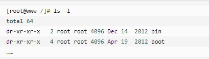
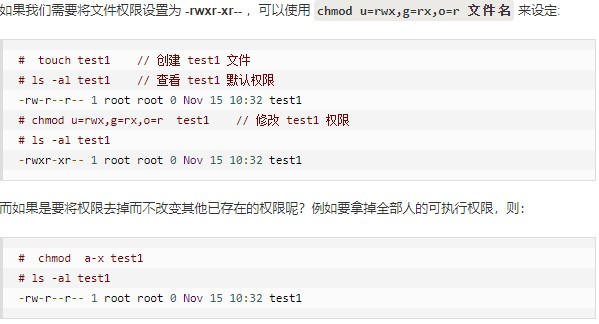

[TOC]


# 组管理和权限管理

## 1. Linux组基本介绍

* Linux中每个用户属于一个组，不能独立于组以外。所以在Linux中每个文件存在组的概念：
    1. 所有者
    2. 所在组
    3. 其他组
    4. 改变用户所在组

## 2. 文件/目录所有者

> 一般为文件的创建者，谁创建了该文件，就自然的称为该文件的所有者。

* 查看文件所有者：ls -ahl
* 修改文件所有者：chown (用户名) (文件名)

## 3. 文件/目录所在组

> 当某个用户创建了一个文件之后，默认之歌文件所在组就是该用户所在的组

* 查看文件所有者：ls -ahl
* 修改文件所在组：chgrp (组名) (文件名)

## 4. 其他组

> 除文件的所有者和所在组的用户外，系统的其他用户都是文件的其他组

## 5. 文件属性

* ls -l中显示的内容如图所示


1. 在Linux中第一个字符代表这个文件是目录、文件或链接文件等等。
    * 当为[ d ]则是目录
    * 当为[ - ]则是文件；
    * 若是[ l ]则表示为链接文档(link file)；
    * 若是[ b ]则表示为装置文件里面的可供储存的接口设备(可随机存取装置)；
    * 若是[ c ]则表示为装置文件里面的串行端口设备，例如键盘、鼠标(一次性读取装置)。
2. 接下来的字符中，以三个为一组，且均为『rwx』 的三个参数的组合。[ r ]代表可读(read)、[ w ]代表可写(write)、[ x ]代表可执行(execute)。 要注意的是，这三个权限的位置不会改变，如果没有权限，就会出现减号[ - ]而已。
每个文件的属性由左边第一部分的10个字符来确定（如下图）。
    

### 5.1 rwx权限详解

* rwx作用到文件：
  * r：read，可读。读取查看。
  * w：write，可以修改。但不代表可以删除该文件。删除一个文件的前提条件是对该文件所在的目录有写权限，才能删除该文件。
  * x：execute，可执行。可以被执行。
* rwx作用到目录：
  * r：可以读取，ls查看目录内容。
  * w：可以修改，目录内创建+删除+重命名目录。
  * x：可执行，可以进入该目录。

### 5.2 修改权限

#### 5.2.1 chgrp：更改文件属组

* chgrp [-R] 属组名 文件名
  * -R：递归更改文件属组，就是在更改某个目录文件的属组时，如果加上-R的参数，那么该目录下的所有文件的属组都会更改。
  
#### 5.2.2 chown：更改文件属主，也可以同时更改文件属组

> 语法:
>
>* chown [–R] 属主名 文件名
>* chown [-R] 属主名：属组名 文件名

#### 5.2.3 chmod：更改文件9个属性

* Linux文件属性有两种设置方法，一种是数字，一种是符号。
* Linux文件的基本权限就有九个，分别是owner/group/others三种身份各有自己的read/write/execute权限。
* 我们可以使用数字来代表各个权限，各权限的分数对照表如下：
  * r:4
  * w:2
  * x:1
* 每种身份(owner/group/others)各自的三个权限(r/w/x)分数是需要累加的，例如当权限为： [-rwxrwx---] 分数则是：
  * owner = rwx = 4+2+1 = 7
  * group = rwx = 4+2+1 = 7
  * others= --- = 0+0+0 = 0

##### 5.2.3.1 使用数字修改权限

* **chmod [-R] xyz 文件或目录**
  * xyz : 就是刚刚提到的数字类型的权限属性，为 rwx 属性数值的相加。
  * -R : 进行递归(recursive)的持续变更，亦即连同次目录下的所有文件都会变更
  * 举例来说，如果要将.bashrc这个文件所有的权限都设定启用，那么命令如下：
  

##### 5.2.3.1 使用符号修改权限

* 我们就可以使用 u(user), g(group), o(others) 来代表三种身份的权限！
* 此外， a 则代表 all，即全部的身份。读写的权限可以写成 r, w, x，也就是可以使用下表的方式来看

* 举例说明


### 5.3 ACL权限设置（setfacl和getfacl）

#### 5.3.1 setfacl的用途

setfacl命令可以用来细分linux下的文件权限。
chmod命令可以把文件权限分为u,g,o三个组，而setfacl可以对每一个文件或目录设置更精确的文件权限。
换句话说，setfacl可以更精确的控制权限的分配。
比如：让某一个用户对某一个文件具有某种权限。

这种独立于传统的u,g,o的rwx权限之外的具体权限设置叫ACL（Access Control List）
ACL可以针对单一用户、单一文件或目录来进行r,w,x的权限控制，对于需要特殊权限的使用状况有一定帮助。
如，某一个文件，不让单一的某个用户访问。

> 用法:
>
> setfacl [-bkndRLP] { -m|-M|-x|-X ... } file ...
>
> **-m：设定ACL权限**
>
> - 针对用户：使用格式“u:用户名:权限”，例如 setfacl -m u:st:rx /project 表示设定 st 用户对 project 目录具有 rx 权限；
> - 针对群组：使用格式“g:组名:权限”，例如 setfacl -m g:tgroup:rx /project 表示设定群组 tgroup 对 project 目录具有 rx 权限。
>
> **-x：删除指定用户和群组的ACL权限**
>
> - 针对用户：使用格式“u:用户名”，例如 setfacl -x u:st /project 表示删除用户st对project目录的ACL权限；
> - 针对群组：使用格式“g:群组名”，例如 setfacl -x g:tgroup /project 表示删除群组tgrope对目录project的ACL权限。
>
> **-b：删除所有的ACL权限**
>
> - 例如 setfacl -b /project 表示删除有关 project 目录的所有 ACL 权限。
>
> **-d ：设定默认 ACL 权限**
>
> - 命令格式为 “setfacl -m d:u:用户名:权限 文件名”（如果是群组，则使用 d:g:群组名:权限），该选项只对目录生效，指目录中新建立的文件拥有此默认权限，例如 setfacl -m d:u:st:rx /project 表示 st 用户对 project 目录中新建立的文件拥有 rx 权限。
>
> **-R：递归设定ACL权限**
>
> - 指设定的 ACL 权限会对目录下的所有子文件生效，命令格式为 “setfacl -m u:用户名:权限 -R 文件名”（群组使用 g:群组名:权限），例如 setfacl -m u:st:rx -R /project 表示 st 用户对已存在于 project 目录中的子文件和子目录拥有 rx 权限。
>
> **-k：删除默认 ACL 权限**


#### 5.3.2 getfacl

**getfacl -- 获取目录或文件访问控制列表**

> **使用方法: getfacl [-aceEsRLPtpndvh] 文件 **
> -a,  *--access           仅显示文件访问控制列表* 
> -d, *--default           仅显示默认的访问控制列表* 
> -c, *--omit-header       不显示注释表头*  
> -e, *--all-effective     显示所有的有效权限* 
> -E, *--no-effective      显示无效权限* 
> -s, *--skip-base         跳过只有基条目(base entries)的文件*  
> -R, *--recursive         递归显示子目录* 
> -L, *--logical           逻辑遍历(跟随符号链接)*  
> -P, *--physical          物理遍历(不跟随符号链接)*  
> -t, *--tabular           使用制表符分隔的输出格式*  
> -n, *--numeric           显示数字的用户/组标识*  
> -p, *--absolute-names    不去除路径前的 '/' 符号*  
> -v, *--version           显示版本并退出*  
> -h, *--help              显示本帮助信息*

### 5.4 特殊权限

#### 5.4.1 setuid和setgid

##### 5.4.1.1 setuid简介

1. set_uid 只能作用于二进制可执行文件的s权限，忽略脚本类可执行文件的s权限。脚本类包括shell、python等等。防止安全隐患。
2. 普通用户执行拥有该权限的二进制文件时，可以使普通用户临时拥有root权限（例如：更改密码的命令 /usr/bin/passwd 对除 root 以外的用户不可读、不可写和不可执行，但是普通用户同样可以使用该命令更改自己的密码）
3. 子进程不继承s权限，脚本类文件s权限不受认可，那么可不可以先用C写个程序赋予s权限，然后在C里通过system()等函数调用脚本，从而通过“传递”实现脚本s权限呢。答案是不行的。不仅system()调用脚本不行，system( )调用二进制可执行文件也不具有s权限。本质原因是，system()是通过fork()建立子进程，fork()建立子进程时把子进程归属uid而归属euid。

##### 5.4.1.2 setgid简介

setgid的意思和setuid是一样的，即让执行文件的用户以该文件所属组的权限去执行。

#### 5.4.2 stick bit（粘滞位）

看一下系统中用到它的地方，以/tmp为例：

```csharp
[root@Salve1 /]# ll -d /tmp 
drwxrwxrwt 13 root root 4096 Apr 23 02:06 /tmp 
[root@Salve1 /]# 
```

我们知道/tmp是系统的临时文件目录，所有的用户在该目录下拥有所有的权限，

也就是说在该目录下可以任意创建、修改、删除文件，那如果用户A在该目录下创建了一个文件，

用户B将该文件删除了，这种情况我们是不能允许的。为了达到该目的，就出现了stick bit（粘滞位）的概念。

它是针对目录来说的，如果该目录设置了stick bit（粘滞位），

则该目录下的文件除了该文件的创建者和root用户可以删除和修改/tmp目录下的stuff，

别的用户均不能动别人的，这就是粘滞位的作用。

#### 5.4.3 setuid  setgid  stick bit用法示范

```bash
chmod u+s xxx # 设置setuid权限 
chmod g+s xxx # 设置setgid权限 
chmod o+t xxx # 设置stick bit权限，针对目录 
chmod 4775 xxx # 设置setuid权限 
chmod 2775 xxx # 设置setgid权限 
chmod 1775 xxx # 设置stick bit权限，针对目录 
```

##### 5.4.3.2 注意事项

有时你设置了s或t 权限，你会发现它变成了S或T，

这是因为在那个位置上你没有给它x（可执行）的权限，这样的话这样的设置是不会有效的，

你可以先给它赋上x的权限，然后再给s或t 的权限。