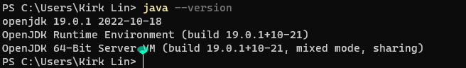
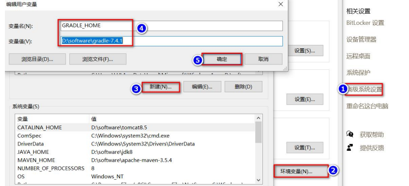
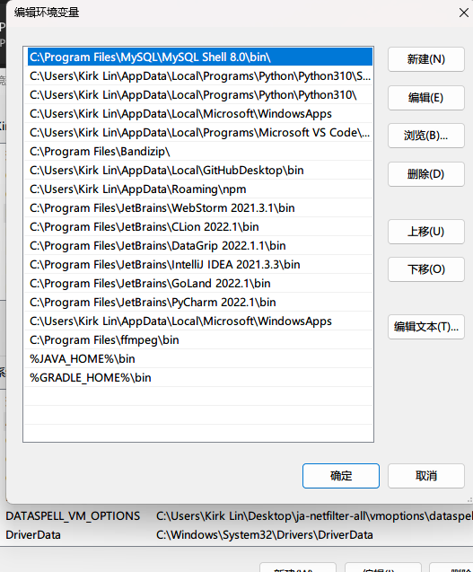
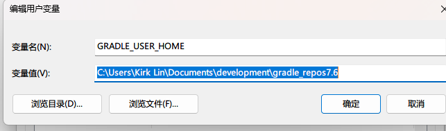
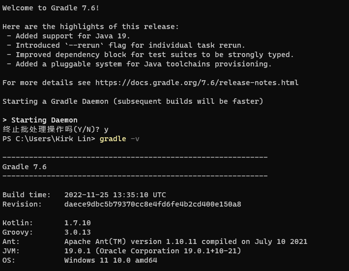

# 第02章_Gradle环境搭建.md

## 先决条件

已安装 JDK/JRE（版本 8 或以上），这里是 Win11 系统 + JDK19

在命令行输入：java --version 可查询当前电脑已安装的版本



Gradle 附带了自己的 Groovy 库，因此不需要安装 Groovy。任何现有的Groovy安装都会被Gradle忽略。

Gradle将使用环境变量中找到的JDK。`JAVA_HOME` `%JAVA_HOME%/bin`

## 使用包管理器安装

[SDKMAN](http://sdkman.io/)是一个工具，用于在大多数类Unix系统（macOS，Linux，Cygwin，Solaris和FreeBSD）上管理多个软件开发工具包的并行版本。

```bash
❯ sdk install gradle
```

[Homebrew](http://brew.sh/)是“macOS 的包管理器”。

```bash
❯ brew install gradle
```

[MacPorts](https://www.macports.org/)是macOS的另一个软件包管理器。

```bash
❯ sudo port install gradle
```

##  手动安装

###  [下载](https://gradle.org/releases)最新的 Gradle 发行版

### 解压

Gradle 发行包是一个 ZIP 文件。完整的发行包包括以下内容(官方发行包有 full 完整版，也有不带源码和文档的版本，可根据需求下载):

- Gradle 可执行文件
- 用户手册 (有 PDF 和 HTML 两种版本)
- DSL 参考指南
- API 手册(Javadoc 和 Groovydoc)
- 样例，包括用户手册中的例子，一些完整的构建样例和更加复杂的构建脚本
- 源代码。仅供参考使用,如果你想要自己来编译 Gradle 你需要从源代码仓库中检出发行版本源码，具体请查看 Gradle 官方主页。

### 配置系统环境

要运行 Gradle，从 Gradle 网站下载后解压缩文件的路径需要位于系统的环境变量中。执行此操作的步骤因操作系统而异。

#### Linux 和 MacOS 用户

配置您的环境变量以包含解压缩发行版的目录，例如：`PATH``bin`

```
❯ export PATH=$PATH:/opt/gradle/gradle-7.6/bin
```

或者，您也可以添加环境变量GRADLE_HOME，而不是特定版本的 Gradle 。升级到不同版本的 Gradle 时，只需更改环境变量即可。`GRADLE_HOME``PATH``$GRADLE_HOME/bin``PATH``GRADLE_HOME`

#### Windows

GRADLE_HOME



环境变量Path



**特别注意**：这里我们接着再配置一个 GRADLE_USER_HOME 环境变量



GRADLE_USER_HOME 相当于配置 Gradle 本地仓库位置和 Gradle Wrapper

## 测试安装

运行如下命令来检查是否安装成功.该命令会显示当前的 JVM 版本和 Gradle 版本。

```bash
❯ gradle -v 
```



## JVM 参数配置

Gradle 运行时的 JVM 参数可以通过 `GRADLE_OPTS` 或 `JAVA_OPTS `来设置.这些参数将会同时生效。 `JAVA_OPTS` 设置的参数将会同其它 JAVA 应用共享，一个典型的例子是可以在` JAVA_OPTS` 中设置代理和 `GRADLE_OPTS` 设置内存参数。同时这些参数也可以在 gradle 或者 gradlew 脚本文件的开头进行设置。