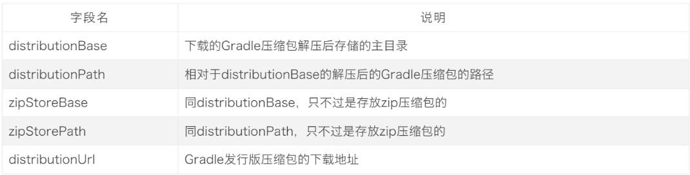

# 第03章_Gradle快速入门.md

## Gradle 中的常用指令

| 常用Gradle指令           | 作用            |
|----------------------|:--------------|
| gradle clean         | 清楚build目录     |
| gradle classes       | 编译业务代码和配置文件   |
| gradle test          | 编译测试代码，生成测试报告 |
| gradle build         | 构建项目          |
| gradle build -x test | 跳过测试，构建       |

## Gradle 项目目录结构

Gradle 项目默认目录结构和 Maven 项目的目录结构一致,都是基于约定大于配置【Convention Over Configuration】。 其完整项目目录结构如下所示


1. 只有war工程才有webapp目录，对于普通的jar工程并没有webapp目录

2. gradlew与gradlew.bat执行的是指定gradle wrapper版本中的gradle指令,不是本地安装的gradle指令。

### Spring Initializr

借助于  Spring Initializr 创建 gradle 第一个项目： [Spring Initializr](https://start.spring.io/)


## 修改maven 下载源

Gradle 自带的Maven 源地址是国外的，该Maven源在国内的访问速度是很慢的，除非使用了特别的手段。一般情况下，我们建议使用国内的第三方开放的Maven 源或企业内部自建Maven 源。

**认识init.d 文件夹**

我们可以在gradle 的init.d 目录下创建以.gradle 结尾的文件，.gradle 文件可以实现在build 开始之前执行，所以你可以在

这个文件配置一些你想预先加载的操作。

**在init.d 文件夹创建init.gradle 文件**

``` Groovy
allprojects {
    repositories {
        maven {
            url 'https://maven.aliyun.com/repository/public/'
        }
        maven {
            url 'https://maven.aliyun.com/repository/spring/'
        }
        mavenLocal()
        mavenCentral()
    }

    buildscript {
        repositories {
            maven {
                url 'https://maven.aliyun.com/repository/public/'
            }
            maven {
                url 'https://maven.aliyun.com/repository/spring/'
            }
            maven { 
                url 'https://plugins.gradle.org/m2/'
            }
        }
    }
}
```

**拓展 1**：启用init.gradle 文件的方法有：

1. 在命令行指定文件,例如：gradle --init-script yourdir/init.gradle -q taskName。你可以多次输入此命令来指定多个init文件
2. 把init.gradle文件放到 USER_HOME/.gradle/ 目录下
3. 把以.gradle结尾的文件放到 USER_HOME/.gradle/init.d/ 目录下
4. 把以.gradle结尾的文件放到 GRADLE_HOME/init.d/ 目录下

如果存在上面的4种方式的2种以上，gradle会按上面的1-4序号依次执行这些文件，如果给定目录下存在多个init脚本，会按拼音a-z顺序执行这些脚本，每个init脚本都存在一个对应的gradle实例,你在这个文件中调用的所有方法和属性，都会委托给这个gradle实例，每个init脚本都实现了Script接口。

**拓展** 2：仓库地址说明

mavenLocal(): 指定使用maven本地仓库，而本地仓库在配置maven时settings文件指定的仓库位置。如E:/repository，gradle 查找jar包顺序如下：USER_HOME/.m2/settings.xml >> M2_HOME/conf/settings.xml >> USER_HOME/.m2/repository

maven { url 地址}，指定maven仓库，一般用私有仓库地址或其它的第三方库【比如阿里镜像仓库地址】。

mavenCentral()：这是Maven的中央仓库，无需配置，直接声明就可以使用。

jcenter(): JCenter中央仓库，实际也是是用的maven搭建的，但相比Maven仓库更友好，通过CDN分发，并且支持https访问,**在新版本中已经废弃了，替换为了mavenCentral()。**

总之, gradle可以通过指定仓库地址为本地maven仓库地址和远程仓库地址相结合的方式，避免每次都会去远程仓库下载依赖库。这种方式也有一定的问题，如果本地maven仓库有这个依赖，就会从直接加载本地依赖，如果本地仓库没有该依赖，那么还是会从远程下载。但是下载的jar不是存储在本地maven仓库中，而是放在自己的缓存目录中，默认在USER_HOME/.gradle/caches目录,当然如果我们配置过GRADLE_USER_HOME环境变量，则会放在GRADLE_USER_HOME/caches目录,那么可不可以将gradle caches指向maven repository。我们说这是不行的，caches下载文件不是按照maven仓库中存放的方式。

**拓展** 3：阿里云仓库地址请参考：https://developer.aliyun.com/mvn/guide

### Wrapper 包装器

Gradle Wrapper 实际上就是对 Gradle 的一层包装，用于解决实际开发中可能会遇到的不同的项目需要不同版本的 Gradle

问题。例如：把自己的代码共享给其他人使用，可能出现如下情况:

1. 对方电脑没有安装 gradle
2. 对方电脑安装过 gradle，但是版本太旧了

这时候，我们就可以考虑使用 Gradle Wrapper 了。这也是官方建议使用 Gradle Wrapper 的原因。实际上有了 Gradle Wrapper 之后，我们本地是可以不配置 Gradle 的,下载Gradle 项目后，使用 gradle 项目自带的wrapper 操作也是可以的。

那如何使用Gradle Wrapper 呢？

项目中的gradlew、gradlew.cmd脚本用的就是wrapper中规定的gradle版本。参见源码

而我们上面提到的gradle指令用的是本地gradle,所以gradle指令和gradlew指令所使用的gradle版本**有可能是不一样的**。

gradlew、gradlew.cmd的使用方式与gradle使用方式完全一致，只不过把gradle指令换成了gradlew指令。

当然,我们也可在终端执行 gradlew 指令时，指定指定一些参数,来控制 Wrapper 的生成，比如依赖的版本等，如下：

| 参数名                       | 说明                    |
|:--------------------------|:----------------------|
| --gradle-version          | 用于指定使用的Gradle版本       |
| --gradle-distribution-url | 用于指定下载Gradle发行版的Url地址 |

例如：

`gradle wrapper --gradle-version=7.6`：升级wrapper版本号,只是修改gradle.properties中wrapper版本，未实际下载
`gradle wrapper --gradle-version 7.6 --distribution-type all` :关联源码用

#### GradleWrapper 的执行流程：

1. 当我们第一次执行 ./gradlew build 命令的时候，gradlew 会读取 gradle-wrapper.properties 文件的配置信息
2. 准确的将指定版本的 gradle 下载并解压到指定的位置(GRADLE_USER_HOME目录下的wrapper/dists目录中)
3. 并构建本地缓存(GRADLE_USER_HOME目录下的caches目录中),下载再使用相同版本的gradle就不用下载了
4. 之后执行的 ./gradlew 所有命令都是使用指定的 gradle 版本。**如下图所示**：


gradle-wrapper.properties 文件解读:



注意：前面提到的 **GRADLE_USER_HOME 环境变量**用于这里的Gradle Wrapper 下载的特定版本的gradle 存储目录。如果我们**没有配置过GRALE_USER_HOME 环境变量,默认在当前用户家目录下的.gradle 文件夹中。**

**那什么时候选择使用 gradle wrapper、什么时候选择使用本地gradle?**

下载别人的项目或者使用操作以前自己写的不同版本的gradle项目时：用Gradle wrapper,也即:gradlew

什么时候使用本地gradle?新建一个项目时: 使用gradle指令即可。