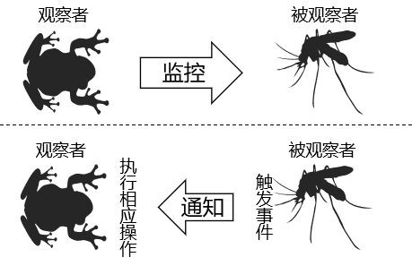

# 监听器笔记

## 1、观察者模式

- 观察者监控被观察者的行为
- 被观察者做出相应的动作会触发事件
- 当观察者发现被观察者触发事件，就会调用事先准备好的方法

## 2、监听器分类

- 监听域对象本身
  - ServletContext
  - HttpSession
  - HttpServletRequest
- 监听域对象的属性域
  - 应用域
  - 会话域
  - 请求域
- 监听存入Session域的对象本身
  - 对象是否存入会话域
  - 对象是否和Session一起被钝化到了硬盘上

## 3、后续用到的监听器

名称：ServletContextListener

方法：

| 方法名                                      | 作用                     |
| ------------------------------------------- | ------------------------ |
| contextInitialized(ServletContextEvent sce) | ServletContext创建时调用 |
| contextDestroyed(ServletContextEvent sce)   | ServletContext销毁时调用 |

> 将来在SpringMVC中会用到：ContextLoaderListener，这个监听器就是实现了ServletContextListener接口。
