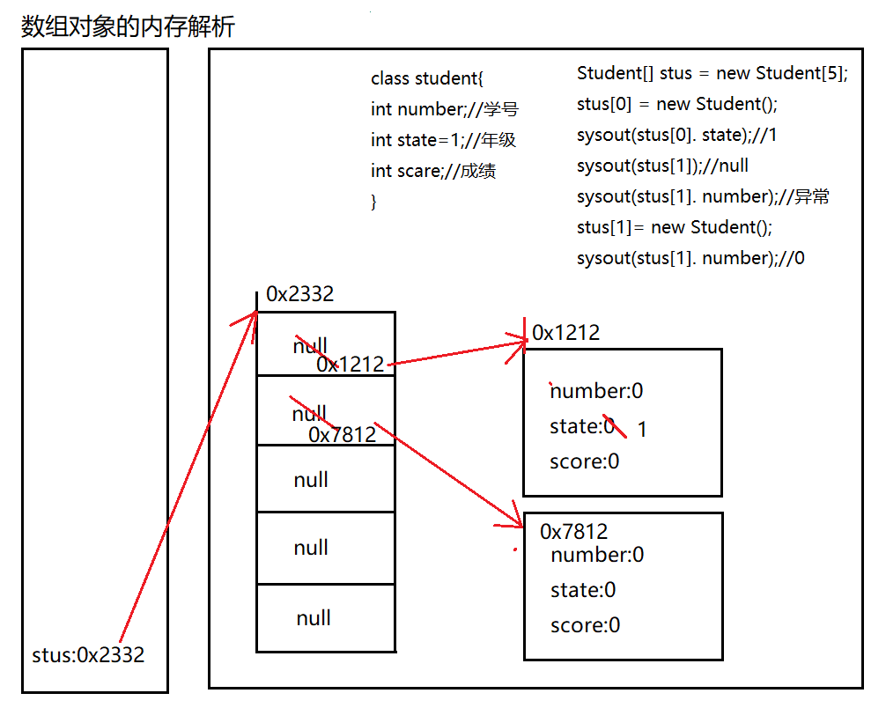

[TOC]


# Java 中类的那些事 


## 类与对象

类中主要包括五种结构，下面进行对这五种结构进行详细的介绍。

### 1. 面向对象与面向过程

- 面向过程：强调的是功能行为，以函数为最小单位，考虑怎么做。
- 面向对象：强调具备了功能的对象，以类 / 对象为最小单位，考虑谁来做。-- 唯物主义（物质决定意识）

### 2. 类与对象的关系

类：对一类事物的描述，是抽象的、概念上的定义

对象：是实际存在的该类事物的每个个体，因而也称为实例 (instance)

面向对象程序设计的重点是类的设计，设计类就是设计类的成员。

二者的关系：对象，是由类 new 出来的，派生出来的。

### 3. 面向对象思想实现的规则

1. 创建类，设计类的成员
2. 创建类的对象
3. 通过`对象.属性` 或 `对象.方法`调用对象的结构

补充：几个概念的使用说明

- 属性 = 成员变量 = field = 域、字段
- 方法 = 成员方法 = 函数 = method
- 创建类的对象 = 类的实例化 = 实例化类

### 4. 对象的创建与对象的内存解析

**典型代码：**

```java
Person p1 = new Person();
Person p2 = new Person();
Person p3 = p1;//没有新创建一个对象，共用一个堆空间中的对象实体。
/*说明：
*如果创建了一个类的多个对象，则每个对象都独立的拥有一套类的属性。（非static的）
*意味着：如果我们修改一个对象的属性a，则不影响另外一个对象属性a的值。
*/
```

**内存解析：**





### 5. JVM 内存结构

编译完源程序以后，生成一个或多个字节码文件。我们使用 JVM 中的类的加载器和解释器对生成的字节码文件进行解释运行。意味着，需要将字节码文件对应的类加载到内存中，涉及到内存解析。


虚拟机栈：即为平时提到的栈结构。***我们将局部变量存储在栈结构中***

虚拟机堆：我们将 new 出来的结构（比如：数组、对象）加载在对空间中。

补充：对象的属性（非 static 的）加载在堆空间中。

方法区：类的加载信息、常量池、静态域

### 6. 匿名对象:

我们创建的对象，没显式的赋给一个变量名。即为匿名对象

特点：匿名对象只能调用一次。

```java
new Phone().sendEmail();
new Phone().playGame();
        
new Phone().price = 1999;
new Phone().showPrice();//0.0
```

**应用场景：**

```java
PhoneMall mall = new PhoneMall();

//匿名对象的使用
mall.show(new Phone());
其中，
class PhoneMall{
    public void show(Phone phone){
        phone.sendEmail();
        phone.playGame();
    }
    
}
```

### 7. "万事万物皆对象"

在 Java 语言范畴中，我们都将功能、结构等封装到类中，通过类的实例化，来调用具体的功能结构

- Scanner,String 等
- 文件：File
- 网络资源：URL

涉及到 Java 语言与前端 HTML、后端的数据库交互时，前后端的结构在 Java 层面交互时，都体现为类、对象。

## 类的结构之一：属性

### 1. 属性 vs 局部变量

#### 1.1 相同点：

- 定义变量的格式：数据类型 变量名 = 变量值
- 先声明，后使用
- 变量都其对应的作用域

#### 1.2 不同点：

1.2.1 在类中声明的位置的不同

- 属性：直接定义在类的一对 {} 内
- 局部变量：声明在方法内、方法形参、代码块内、构造器形参、构造器内部的变量。

1.2.2 关于权限修饰符的不同

- 属性：可以在声明属性时，指明其权限，使用权限修饰符。
- 常用的权限修饰符：private、public、缺省、protected ---> 封装性
- 目前，声明属性时，使用缺省就可以。
- 局部变量：不可以使用权限修饰符。

1.2.3 默认初始化值的情况：

- 属性：类的属性，根据其类型，都默认初始化值。
- 整型（byte、short、int、long：0）
- 浮点型（float、double：0.0）
- 字符型（char：0 （或'\u0000'））
- 布尔型（boolean：false）
- 引用数据类型（类、数组、接口：null）
- 局部变量：没默认初始化值。
  - 意味着，我们在调用局部变量之前，一定要显式赋值。
  - 特别地：形参在调用时，我们赋值即可。

1.2.4 在内存中加载的位置：

- 属性：加载到堆空间中 （非 static）
- 局部变量：加载到栈空间

### 2. 变量的分类：

- 方式一：按照数据类型：


- 方式二：按照在类中声明的位置：


## 类的结构之二：方法

定义：描述类应该具的功能。

### 1. 方法举例：

**1.1 JDK 中的方法：**

- Math 类：`sqrt()` `random()` ...

- ```java
  Scanner类：`nextXxx()` ...
  ```

- ```java
  Arrays类：`sort()`    `binarySearch()`    `toString()`     `equals()`   ...
  ```

**1.2 自定义的方法：**

```java
public void eat(){
     System.out.printly("我要吃饭！！！");
 }

 public String getNation(String nation){
     System.out.printly("当前地点为" + nation);
 }
```

**1.3 方法的声明：**

```java
权限修饰符 返回值类型  方法名(形参列表){

方法体

}
```

注意：static、final、abstract 来修饰的方法，后面再聊。

### 2. 方法的说明：

#### 2.1 关于权限修饰符：

Java 规定的 4 种权限修饰符：private、public、缺省、protected

详细内容请查看文章《细说面向对象三大特征》

#### 2.2 返回值类型：

**2.2.1 返回值 vs 没返回值**

- **如果方法有返回值**，则必须在方法声明时，指定返回值的类型。同时，方法中，需要使用 return 关键字来返回指定类型的变量或常量：`return 数据`。
- **如果方法没返回值**，则方法声明时，使用 void 来表示。通常，没返回值的方法中，就不需要使用 return。如果使用的话，只能使用 `return;` 表示结束此方法的意思。

**2.2.2 方法该不该定义返回值？**

① 题目要求

② 具体问题具体分析

#### 2.3 方法命名规范

- 属于标识符，遵循标识符的规则和规范，“见名知意”
- 方法名应遵循小驼峰命名 `aaaBbbCcc`
- 方法名最好使用英文单词，不要使用拼音或者缩写
- 更多规范要求请参考《Java 开发手册》

#### 2.4 关于形参列表

方法可以声明 0 个，1 个，或多个形参。

也可以使用可变形参，但可变形参必须放到最后，详细说明请查看本章第五部分。

格式：`数据类型1 形参1` `数据类型2 形参2` .....

**定义方法时，该不该定义形参？**

① 题目要求

② 具体问题具体分析

#### 2.5 方法体

是方法中功能的体现，通过循环分支、条件判断等语句完成复杂的逻辑关系。

方法中可以调用其他方法，同类中可以直接调用，不同类中通过类的实例化对象调用。

注意：方法中不可以定义新的方法

### 3. 方法的使用

- 同类中的方法可以直接调用当前类的属性或方法，不同类中通过类的实例化对象调用。
- 特殊的：方法 A 中又调用了自身 --- 递归方法。（自身调用）

关于递归方法的使用请查看本章第七部分。

### 4. 方法的重载

#### 4.1 重载的概念

在同一个类中，允许存在一个以上的同名方法，只要它们的参数个数或者参数类型不同即可。

**"两同一不同":**

- 相同：同一个类、相同方法名
- 参数列表不同：参数个数不同，参数类型不同

#### 4.2 构成重载的实例：

```java
// 举例一：Arrays类中重载的sort() / binarySearch()；PrintStream中的println()
// 举例二：
// 如下的4个方法构成了重载
public void getSum(int i,int j){
    System.out.println("1");
}

public void getSum(double d1,double d2){
    System.out.println("2");
}

public void getSum(String s ,int i){
    System.out.println("3");
}

public void getSum(int i,String s){
    System.out.println("4");
}
```

**不构成重载的实例：**

```java
// 如下的3个方法不能与上述4个方法构成重载
public int getSum(int i,int j){
    return 0;
}
    
public void getSum(int m,int n){
        
}
    
private void getSum(int i,int j){
    
}
```

#### 4.3 重载方法判断

**如何判断是否构成方法重载？**

严格按照定义判断：两同一不同。跟方法的权限修饰符、返回值类型、形参变量名、方法体都没关系！

**如何确定类中某一个方法的调用：**

①方法名 ---> ②参数列表

### 5. 可变个数形参方法

#### 5.1 使用说明

- JDK 5.0 新增的内容

- JDK 5.0 以前：采用数组形参来定义方法，传入多个同一类型变量

  `public static void test(int a， String[] books);`

- JDK 5.0 以后：采用可变个数形参来定义方法，传入多个同一类型变量

  `public static void test(int a， String ... books);`

**具体使用：**

- 可变个数形参的格式：`数据类型 ... 变量名`
- 当调用可变个数形参的方法时，传入的参数个数可以是：0 个，1 个, 2 个，.....
- 可变个数形参的方法与本类中方法名相同，形参不同的方法之间构成重载
- 可变个数形参的方法与本类中方法名相同，形参类型也相同的数组之间不构成重载。换句话说，二者不能共存。
- 可变个数形参在方法的形参中，***必须声明在末尾。***
- 可变个数形参在方法的形参中 ***, 最多只能声明一个可变形参 ***。

#### 5.2 举例说明

```java
public void show(int i){

}

public void show(String s){
    System.out.println("show(String)");
}

public void show(String ... strs){
    System.out.println("show(String ... strs)");

    for(int i = 0;i < strs.length;i++){
        System.out.println(strs[i]);
    }
}
// 不能与上一个方法同时存在
//  public void show(String[] strs){
//      
//  }
// 调用时：可变形参与数组类似
test.show("hello");
test.show("hello","world");
test.show();

test.show(new String[]{"AA","BB","CC"});
```

### 6. Java 的值传递机制

#### 6.1 针对方法内变量的赋值举例：

```java
System.out.println("***********基本数据类型：****************");
int m = 10;
int n = m;

System.out.println("m = " + m + ", n = " + n);

n = 20;

System.out.println("m = " + m + ", n = " + n);

System.out.println("***********引用数据类型：****************");

Order o1 = new Order();
o1.orderId = 1001;

Order o2 = o1;//赋值以后，o1和o2的地址值相同，都指向了堆空间中同一个对象实体。

System.out.println("o1.orderId = " + o1.orderId + ",o2.orderId = " +o2.orderId);

o2.orderId = 1002;

System.out.println("o1.orderId = " + o1.orderId + ",o2.orderId = " +o2.orderId);
```

规则： 如果变量是基本数据类型，此时赋值的是变量所保存的数据值。 如果变量是引用数据类型，此时赋值的是变量所保存的数据的地址值。

#### 6.2 针对于方法的参数概念

形参：***方法定义时***，声明的小括号内的参数 实参：***方法调用时***，实际传递给形参的数据

#### 6.3 Java 中参数传递机制：值传递机制

**规则：**

- 如果参数是 *** 基本数据类型 ***，此时实参赋给形参的是实参真实存储的数据值。
- 如果参数是 *** 引用数据类型 ***，此时实参赋给形参的是实参存储数据的地址值。

**推广：**

- 如果变量是基本数据类型，此时赋值的是变量所保存的数据值。
- 如果变量是引用数据类型，此时赋值的是变量所保存的数据的地址值。

#### 6.4 内存解析：

内存解析画法要点：

\1. 内存结构：栈（局部变量）、堆（new 出来的结构：对象（非 static 成员变量）、数组 2. 变量：成员变量 vs 局部变量（方法内、方法形参、构造器内、构造器形参、代码块内）

**举例一**


**举例二**


### 7. 递归方法

递归方法：一个方法体内调用它自身。

方法递归包含了一种隐式的循环，它会重复执行某段代码，但这种重复执行无须循环控制。 递归一定要向已知方向递归，否则这种递归就变成了无穷递归，类似于死循环。

**递归方法举例：**

```java
// 例1：计算1-n之间所自然数的和
public int getSum(int n) {// 3

    if (n == 1) {
        return 1;
    } else {
        return n + getSum(n - 1);
    }

}

// 例2：计算1-n之间所自然数的乘积:n!
public int getSum1(int n) {

    if (n == 1) {
        return 1;
    } else {
        return n * getSum1(n - 1);
    }

}

//例3：已知一个数列：f(0) = 1,f(1) = 4,f(n+2)=2*f(n+1) + f(n),
//其中n是大于0的整数，求f(10)的值。
public int f(int n){
    if(n == 0){
        return 1;
    }else if(n == 1){
        return 4;
    }else{
        //          return f(n + 2) - 2 * f(n + 1);
        return 2*f(n - 1) + f(n - 2);
    }
}

//例4：斐波那契数列

//例5：汉诺塔问题

//例6：快排
```

### 8. 方法的重写

#### 8.1 什么是方法的重写 (override 或 overwrite)？

子类继承父类以后，可以对父类中同名同参数的方法，进行覆盖操作.

#### 8.2 重写的应用：

重写以后，当创建子类对象以后，通过子类对象调用子父类中的同名同参数的方法时，实际执行的是子类重写父类的方法。

#### 8.3 重写举例：

```java
// 父类
class Circle{
public double findArea(){}//求面积
}
// 子类
class Cylinder extends Circle{
public double findArea(){}//求表面积
}
**********************************************
// 父类
class Account{
public boolean withdraw(double amt){}
}
// 子类
class CheckAccount extends Account{
public boolean withdraw(double amt){}
}
```

#### 8.4 重写的规则：

**方法的声明：**

```java
权限修饰符  返回值类型  方法名(形参列表) throws 异常的类型{
    //方法体
}
```

约定俗称：子类中的叫重写的方法，父类中的叫被重写的方法

1. 子类重写的方法的方法名和形参列表与父类被重写的方法的方法名和形参列表相同
2. 子类重写的方法的权限修饰符不小于父类被重写的方法的权限修饰符

特殊情况：子类不能重写父类中声明为 private 权限的方法

1. 返回值类型：

- 父类被重写的方法的返回值类型是 void，则子类重写的方法的返回值类型只能是 void
- 父类被重写的方法的返回值类型是 A 类型，则子类重写的方法的返回值类型可以是 A 类或 A 类的子类
- 父类被重写的方法的返回值类型是基本数据类型 (比如：double)，则子类重写的方法的返回值类型必须是相同的基本数据类型 (必须也是 double)

1. 子类重写的方法抛出的异常类型不大于父类被重写的方法抛出的异常类型（具体放到异常处理时候讲）

子类和父类中的同名同参数的方法要么都声明为非 static 的（考虑重写，要么都声明为 static 的（不是重写)。

开发中一般保持子父类一致

#### 8.5 面试题：

**区分方法的重写和重载？**

1. 二者的概念：

- 方法的重写：子类继承父类以后，可以对父类中同名同参数的方法，进行覆盖操作.
- 方法的重载：在同一个类中，允许存在一个以上的同名方法，只要它们的参数个数或者参数类型不同即可。

1. 重载和重写的具体规则：重载：两同一不同，重写
2. 重载：不表现为多态性。 重写：表现为多态性。
3. 从编译和运行的角度看：

- 重载，是指允许存在多个同名方法，而这些方法的参数不同。编译器根据方法不同的参数表，对同名方法的名称做修饰。对于编译器而言，这些同名方法就成了不同的方法。它们的调用地址在编译期就绑定了。Java 的重载是可以包括父类和子类的，即子类可以重载父类的同名不同参数的方法。
- 所以对于重载而言，在方法调用之前，编译器就已经确定了所要调用的方法，这称为 “早绑定” 或“静态绑定”；
- 而对于多态，只等到方法调用的那一刻，解释运行器才会确定所要调用的具体方法，这称为 “晚绑定” 或“动态绑定”。

引用一句 Bruce Eckel 的话：“不要犯傻，如果它不是晚绑定，它就不是多态。”

## 类的结构之三：构造器

### 1. 构造器（或构造方法）：Constructor

构造器的作用：（只要造对象就得用构造器）

1. 创建对象
2. 初始化对象的信息

### 2. 使用说明：

- 如果没显式的定义类的构造器的话，则系统默认提供一个空参的构造器
- 定义构造器的格式：`权限修饰符 类名(形参列表){ }`
- 一个类中定义的 *** 多个构造器 ***，彼此构成重载
- 一旦我们显式的定义了类的构造器之后，系统就不再提供默认的空参构造器
- 一个类中，***至少会有一个构造器***。

### 3. 构造器举例：

```java
//构造器不等于方法
public Person(){
    System.out.println("Person().....");
}

public Person(String n){
    name = n;

}

public Person(String n,int a){
    name = n;
    age = a;
}
```

构造器默认权限和类的权限一致

### 4. 属性赋值顺序

总结：属性赋值的先后顺序

① 默认初始化

② 显式初始化

③ 构造器中初始化

④ 通过 "对象. 方法" 或 "对象. 属性" 的方式，赋值

以上操作的先后顺序：① - ② - ③ - ④

### 5. JavaBean 的概念

所谓 JavaBean，是指符合如下标准的 Java 类：

- 类是公共的
- 一个 *** 无参 *** 的公共的构造器
- 属性，且对应的 get、set 方法

## 类的结构之四：代码块

代码块 (初始化块)（重要性较属性、方法、构造器差一些）

### 1. 代码块的作用：

用来初始化类、对象的信息

### 2. 分类：

代码块要是使用修饰符，只能使用 static 分类：静态代码块 vs 非静态代码块

### 3. 静态代码块 vs 非静态代码块区别

**静态代码块：**

- 内部可以输出语句
- 随着类的加载而执行, 而且只执行一次
- 作用：初始化类的信息
- 如果一个类中定义了多个静态代码块，则按照声明的先后顺序执行
- 静态代码块的执行要优先于非静态代码块的执行
- 静态代码块内只能调用静态的属性、静态的方法，不能调用非静态的结构

**非静态代码块：**

- 内部可以输出语句
- 随着对象的创建而执行
- 每创建一个对象，就执行一次非静态代码块
- 作用：可以在创建对象时，对对象的属性等进行初始化
- 如果一个类中定义了多个非静态代码块，则按照声明的先后顺序执行
- 非静态代码块内可以调用静态的属性、静态的方法，或非静态的属性、非静态的方法

注意：实例化子类对象时，涉及到父类、子类中静态代码块、非静态代码块、构造器的加载顺序：由父及子，静态先行。

**举例一**

```java
class Root{
    static{
        System.out.println("Root的静态初始化块");
    }
    {
        System.out.println("Root的普通初始化块");
    }
    public Root(){
        System.out.println("Root的无参数的构造器");
    }
}
class Mid extends Root{
    static{
        System.out.println("Mid的静态初始化块");
    }
    {
        System.out.println("Mid的普通初始化块");
    }
    public Mid(){
        System.out.println("Mid的无参数的构造器");
    }
    public Mid(String msg){
        //通过this调用同一类中重载的构造器
        this();
        System.out.println("Mid的带参数构造器，其参数值："
                           + msg);
    }
}
class Leaf extends Mid{
    static{
        System.out.println("Leaf的静态初始化块");
    }
    {
        System.out.println("Leaf的普通初始化块");
    }   
    public Leaf(){
        //通过super调用父类中有一个字符串参数的构造器
        super("调用父类构造器");
        System.out.println("Leaf的构造器");
    }
}
public class LeafTest{
    public static void main(String[] args){
        new Leaf(); 
        //new Leaf();
    }
}
```

**举例二**

```java
class Father {
    static {
        System.out.println("11111111111");
    }
    {
        System.out.println("22222222222");
    }

    public Father() {
        System.out.println("33333333333");
    }
}

public class Son extends Father {
    static {
        System.out.println("44444444444");
    }
    {
        System.out.println("55555555555");
    }
    public Son() {
        System.out.println("66666666666");
    }

    public static void main(String[] args) { // 由父及子 静态先行
        System.out.println("77777777777");
        System.out.println("************************");
        new Son();
        System.out.println("************************");

        new Son();
        System.out.println("************************");
        new Father();
    }
}
```

### 4. 属性的赋值顺序

① 默认初始化

② 显式初始化 /⑤在代码块中赋值

③ 构造器中初始化

④ 有了对象以后，可以通过 "对象. 属性" 或 "对象. 方法" 的方式，进行赋值

执行的先后顺序：① - ② / ⑤ - ③ - ④

## 类的结构之五：内部类

内部类：类的第五个成员

### 1. 内部类的定义：

Java 中允许将一个类 A 声明在另一个类 B 中，则类 A 就是内部类，类 B 称为外部类。

### 2. 内部类的分类：

成员内部类（静态、非静态 ） 局部内部类 (方法内、代码块内、构造器内)

### 3. 成员内部类的理解：

一方面，作为外部类的成员：

- 调用外部类的结构
- 可以被 static 修饰
- 可以被 4 种不同的权限修饰

另一方面，作为一个类：

- 类内可以定义属性、方法、构造器等
- 可以被 final 修饰，表示此类不能被继承。言外之意，不使用 final，就可以被继承
- 可以被 abstract 修饰

### 4. 成员内部类：

**4.1 如何创建成员内部类的对象？(静态的，非静态的)**

```java
// 创建静态的Dog内部类的实例(静态的成员内部类):
Person.Dog dog = new Person.Dog();

// 创建非静态的Bird内部类的实例(非静态的成员内部类):
// Person.Bird bird = new Person.Bird();//错误的
Person p = new Person();
Person.Bird bird = p.new Bird();
```

**4.2 如何在成员内部类中调用外部类的结构？**

```java
class Person{
    String name = "小明";
    public void eat(){
    }
    //非静态成员内部类
    class Bird{
        String name = "杜鹃";
        public void display(String name){
            System.out.println(name);//方法的形参
            System.out.println(this.name);//内部类的属性
            System.out.println(Person.this.name);//外部类的属性
            //Person.this.eat();
        }
    }
}
```

### 5. 局部内部类的使用：

```java
//返回一个实现了Comparable接口的类的对象
public Comparable getComparable(){

    //创建一个实现了Comparable接口的类:局部内部类
    //方式一：
    //      class MyComparable implements Comparable{
    //
    //          @Override
    //          public int compareTo(Object o) {
    //              return 0;
    //          }
    //          
    //      }
    //      
    //      return new MyComparable();

    //方式二：
    return new Comparable(){

        @Override
        public int compareTo(Object o) {
            return 0;
        }
    };
}
```

**注意点：**

在局部内部类的方法中（比如：show 如果**调用局部内部类所声明的方法** (比如：method) 中的**局部变量** (比如：num) 的话, 要求此局部变量声明为 final 的。

原因：局部内部类也会生成字节码文件，在调用所属类的局部变量时，因为是两个类，所以不能修改所属类的属性，因此所属类将属性设置为 final 的为内部类调用提供一个副本，而内部类不能进行修改。

- jdk 7 及之前版本：要求此局部变量显式的声明为 final 的
- jdk 8 及之后的版本：可以省略 final 的声明

总结：成员内部类和局部内部类，在编译以后，都会生成字节码文件。 格式：成员内部类：`外部类$内部类名.class` 局部内部类：`外部类$数字 内部类名.class`


全文完