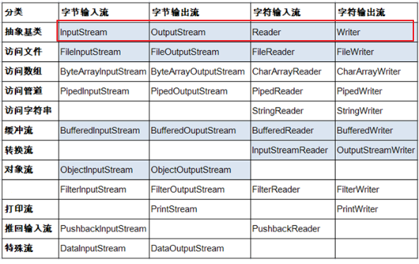
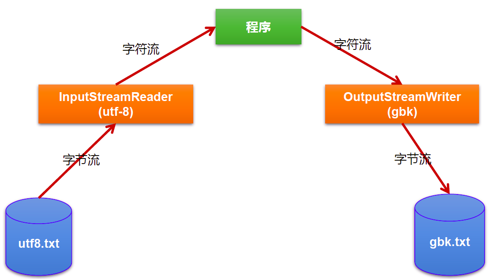
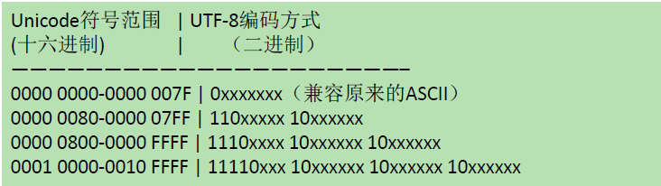

[TOC]


# Java 之 IO 流 


## 一、File 类的使用

### 1. File 类的理解

- File 类的一个对象，代表一个文件或一个文件目录 (俗称：文件夹)。
- File 类声明在 java.io 包下：文件和文件路径的抽象表示形式，与平台无关。
- File 类中涉及到关于文件或文件目录的创建、删除、重命名、修改时间、文件大小等方法，并未涉及到写入或读取文件内容的操作。如果需要读取或写入文件内容，必须使用 IO 流来完成。
- 想要在 Java 程序中表示一个真实存在的文件或目录，那么必须有一个 File 对象，但是 Java 程序中的一个 File 对象，可能没有一个真实存在的文件或目录。
- 后续 File 类的对象常会作为参数传递到流的构造器中，指明读取或写入的 "终点"。

### 2. File 的实例化

#### 2.1 常用构造器

- File(String filePath)
- File(String parentPath,String childPath)
- File(File parentFile,String childPath)

**代码示例**：

```java
@Test
public void test1() {
    //构造器1
    File file1 = new File("hello.txt");
    File file2 = new File("E:\\workspace_idea\\JavaSenic\\IO\\hello.txt");
    System.out.println(file1);
    System.out.println(file2);

    //构造器2
    File file3 = new File("E:\\workspace_idea\\JavaSenior", "hello.txt");
    System.out.println(file3);

    //构造器3
    File file4 = new File(file3, "hi.txt");
    System.out.println(file4);
}
```

#### 2.2 路径分类

- 相对路径：相较于某个路径下，指明的路径。
- 绝对路径：包含盘符在内的文件或文件目录的路径。

**说明**：

- IDEA 中：
  - 如果使用 JUnit 中的单元测试方法测试，相对路径即为当前 Module 下。
  - 如果使用 main() 测试，相对路径即为当前的 Project 下。
- Eclipse 中：
  - 不管使用单元测试方法还是使用 main() 测试，相对路径都是当前的 Project 下。

#### 2.3 路径分隔符

- windows 和 DOS 系统默认使用 “\” 来表示

- UNIX 和 URL 使用 “/” 来表示

- Java 程序支持跨平台运行，因此路径分隔符要慎用。

- 为了解决这个隐患，File 类提供了一个常量： public static final String separator。根据操作系统，动态的提供分隔符。

  举例：

  ```java
  //windows和DOS系统
  File file1 = new File("E:\\io\\test.txt");
  //UNIX和URL
  File file = new File("E:/io/test.txt");
  //java提供的常量
  File file = new File("E:"+File.separator+"io"+File.separator+"test.txt");
  ```

### 3. File 类的常用方法

#### 3.1 File 类的获取功能

- public String getAbsolutePath()：获取绝对路径
- public String getPath() ：获取路径
- public String getName() ：获取名称
- public String getParent()：获取上层文件目录路径。若无，返回 null
- public long length() ：获取文件长度（即：字节数）。不能获取目录的长度。
- public long lastModified() ：获取最后一次的修改时间，毫秒值
- 如下的两个方法适用于文件目录：
- public String[] list() ：获取指定目录下的所有文件或者文件目录的名称数组
- public File[] listFiles() ：获取指定目录下的所有文件或者文件目录的 File 数组

**代码示例：**

```java
@Test
public void test2(){
    File file1 = new File("hello.txt");
    File file2 = new File("d:\\io\\hi.txt");

    System.out.println(file1.getAbsolutePath());
    System.out.println(file1.getPath());
    System.out.println(file1.getName());
    System.out.println(file1.getParent());
    System.out.println(file1.length());
    System.out.println(new Date(file1.lastModified()));

    System.out.println();

    System.out.println(file2.getAbsolutePath());
    System.out.println(file2.getPath());
    System.out.println(file2.getName());
    System.out.println(file2.getParent());
    System.out.println(file2.length());
    System.out.println(file2.lastModified());
}
@Test
public void test3(){
    File file = new File("D:\\workspace_idea1\\JavaSenior");

    String[] list = file.list();
    for(String s : list){
        System.out.println(s);
    }

    System.out.println();

    File[] files = file.listFiles();
    for(File f : files){
        System.out.println(f);
    }

}
```

#### 3.2 File 类的重命名功能

- public boolean renameTo(File dest): 把文件重命名为指定的文件路径
- 注意：file1.renameTo(file2) 为例：要想保证返回 true, 需要 file1 在硬盘中是存在的，java且 file2 不能在硬盘中存在。

**代码示例：**

```java
@Test
public void test4(){
    File file1 = new File("hello.txt");
    File file2 = new File("D:\\io\\hi.txt");

    boolean renameTo = file2.renameTo(file1);
    System.out.println(renameTo);

}
```

#### 3.3 File 类的判断功能

- public boolean isDirectory()：判断是否是文件目录
- public boolean isFile() ：判断是否是文件
- public boolean exists() ：判断是否存在
- public boolean canRead() ：判断是否可读
- public boolean canWrite() ：判断是否可写
- public boolean isHidden() ：判断是否隐藏

**代码示例：**

```java
@Test
public void test5(){
    File file1 = new File("hello.txt");
    file1 = new File("hello1.txt");

    System.out.println(file1.isDirectory());
    System.out.println(file1.isFile());
    System.out.println(file1.exists());
    System.out.println(file1.canRead());
    System.out.println(file1.canWrite());
    System.out.println(file1.isHidden());

    System.out.println();

    File file2 = new File("d:\\io");
    file2 = new File("d:\\io1");
    System.out.println(file2.isDirectory());
    System.out.println(file2.isFile());
    System.out.println(file2.exists());
    System.out.println(file2.canRead());
    System.out.println(file2.canWrite());
    System.out.println(file2.isHidden());

}
```

#### 3.4 Flie 类的创建功能

- 创建硬盘中对应的文件或文件目录
- public boolean createNewFile() ：创建文件。若文件存在，则不创建，返回 false
- public boolean mkdir() ：创建文件目录。如果此文件目录存在，就不创建了。如果此文件目录的上层目录不存在，也不创建。
- public boolean mkdirs() ：创建文件目录。如果此文件目录存在，就不创建了。如果上层文件目录不存在，一并创建

**代码示例：**

```java
@Test
public void test6() throws IOException {
    File file1 = new File("hi.txt");
    if(!file1.exists()){
        //文件的创建
        file1.createNewFile();
        System.out.println("创建成功");
    }else{//文件存在
        file1.delete();
        System.out.println("删除成功");
    }


}
@Test
public void test7(){
    //文件目录的创建
    File file1 = new File("d:\\io\\io1\\io3");

    boolean mkdir = file1.mkdir();
    if(mkdir){
        System.out.println("创建成功1");
    }

    File file2 = new File("d:\\io\\io1\\io4");

    boolean mkdir1 = file2.mkdirs();
    if(mkdir1){
        System.out.println("创建成功2");
    }
    //要想删除成功，io4文件目录下不能有子目录或文件
    File file3 = new File("D:\\io\\io1\\io4");
    file3 = new File("D:\\io\\io1");
    System.out.println(file3.delete());
}
```

#### 3.5 File 类的删除功能

- 删除磁盘中的文件或文件目录
- public boolean delete()：删除文件或者文件夹
- 删除注意事项：Java 中的删除不走回收站。

### 4. 内存解析


### 5. 小练习

利用 Fie 构造器，new 一个文件目录 file 1）在其中创建多个文件和目录 2）编写方法，实现删除 fle 中指定文件的操作

```java
@Test
public void test1() throws IOException {
    File file = new File("E:\\io\\io1\\hello.txt");
    //创建一个与file同目录下的另外一个文件，文件名为：haha.txt
    File destFile = new File(file.getParent(),"haha.txt");
    boolean newFile = destFile.createNewFile();
    if(newFile){
        System.out.println("创建成功！");
    }
}
```

判断指定目录下是否有后缀名为 jpg 的文件，如果有，就输出该文件名称

```java
public class FindJPGFileTest {

    @Test
    public void test1(){
        File srcFile = new File("d:\\code");

        String[] fileNames = srcFile.list();
        for(String fileName : fileNames){
            if(fileName.endsWith(".jpg")){
                System.out.println(fileName);
            }
        }
    }
    @Test
    public void test2(){
        File srcFile = new File("d:\\code");

        File[] listFiles = srcFile.listFiles();
        for(File file : listFiles){
            if(file.getName().endsWith(".jpg")){
                System.out.println(file.getAbsolutePath());
            }
        }
    }
    /*
	 * File类提供了两个文件过滤器方法
	 * public String[] list(FilenameFilter filter)
	 * public File[] listFiles(FileFilter filter)

	 */
    @Test
    public void test3(){
        File srcFile = new File("d:\\code");

        File[] subFiles = srcFile.listFiles(new FilenameFilter() {

            @Override
            public boolean accept(File dir, String name) {
                return name.endsWith(".jpg");
            }
        });

        for(File file : subFiles){
            System.out.println(file.getAbsolutePath());
        }
    }

}
```

遍历指定目录所有文件名称，包括子文件目录中的文件。 拓展 1：并计算指定目录占用空间的大小 拓展 2：删除指定文件目录及其下的所有文件

```java
public class ListFileTest {

    public static void main(String[] args) {
        // 递归:文件目录
        /** 打印出指定目录所有文件名称，包括子文件目录中的文件 */

        //1.创建目录对象
        File file = new File("E:\\test");

        //2.打印子目录
        printSubFile(file);

    }

    /**
     * 递归方法遍历所有目录下的文件
     *
     * @param dir
     */
    public static void printSubFile(File dir) {
        //打印子目录
        File[] files = dir.listFiles();
        for (File f : files) {
            if (f.isDirectory()) {//如果为文件目录，则递归调用自身
                printSubFile(f);
            } else {
                System.out.println(f.getAbsolutePath());//输出绝对路径
            }
        }
    }

    // 拓展1：求指定目录所在空间的大小
    // 求任意一个目录的总大小
    public long getDirectorySize(File file) {
        // file是文件，那么直接返回file.length()
        // file是目录，把它的下一级的所有大小加起来就是它的总大小
        long size = 0;
        if (file.isFile()) {
            size += file.length();
        } else {
            File[] allFiles = file.listFiles();// 获取file的下一级
            // 累加all[i]的大小
            for (File f : allFiles) {
                size += getDirectorySize(f);//f的大小
            }
        }
        return size;
    }

    /**
     * 拓展2：删除指定的目录
     */
    public void deleteDirectory(File file) {
        // 如果file是文件，直接delete
        // 如果file是目录，先把它的下一级干掉，然后删除自己
        if (file.isDirectory()) {
            File[] allFiles = file.listFiles();
            //递归调用删除file下一级
            for (File f : allFiles) {
                deleteDirectory(f);
            }
        } else {
            //删除文件
            file.delete();
        }
    }
}
```

## 二、IO 流概述

### 1. 简述

- IO 是 Input/Output 的缩写，I/O 技术是非常实用的技术，用于处理设备之间的数据传输。如读 / 写文件，网络通讯等。
- Java 程序中，对于数据的输入输出操作以 “流(stream)” 的方式进行。
- Java.IO 包下提供了各种 “流” 类和接口，用以获取不同种类的数据，并通过标准的方法输入或输出数据。

### 2. 流的分类

**操作数据单位：字节流、字符流**

- 对于文本文件 (.txt,.java,.c,.cpp)，使用字符流处理
- 对于非文本文件 (.jpg,.mp3,.mp4,.avi,.doc,.ppt,...)，使用字节流处理

**数据的流向：输入流、输出流**

- 输入 input: 读取外部数据（磁盘、光盘等存储设备的数据）到程序（内存）中。
- 输出 output: 将程序（内存）数据输出到磁盘、光盘等存储设备中。

**流的角色：节点流、处理流**

节点流：直接从数据源或目的地读写数据。


处理流：不直接连接到数据源或目的地，而是 “连接” 在已存在的流（节点流或处理流）之上，通过对数据的处理为程序提供更为强大的读写功能。


**图示：**


### 3. IO 流的体系分类

#### 3.1 总体分类





红框为抽象基类，蓝框为常用 IO 流

#### 3.2 常用的几个 IO 流结构

| 抽象基类    | 节点流（或文件流）                           | 缓冲流（处理流的一种）                                     |
| ----------- | -------------------------------------------- | ---------------------------------------------------------- |
| InputStream | FileInputStream (read(byte[] buffer))        | BufferedInputStream (read(byte[] buffer))                  |
| OutputSteam | FileOutputStream (write(byte[] buffer,0,len) | BufferedOutputStream (write(byte[] buffer,0,len) / flush() |
| Reader      | FileReader (read(char[] cbuf))               | BufferedReader (read(char[] cbuf) / readLine())            |
| Writer      | FileWriter (write(char[] cbuf,0,len)         | BufferedWriter (write(char[] cbuf,0,len) / flush()         |

#### 3.3 对抽象基类的说明：

| 抽象基类 | 字节流      | 字符流 |
| -------- | ----------- | ------ |
| 输入流   | InputSteam  | Reader |
| 输出流   | OutputSteam | Writer |

- 说明：Java 的 lO 流共涉及 40 多个类，实际上非常规则，都是从如下 4 个抽象基类派生的。
- 由这四个类派生出来的子类名称都是以其父类名作为子类名后缀。

3.3.1InputSteam & Reader

- InputStream 和 Reader 是所有输入流的基类。
- InputStream（典型实现：FileInputStream）
  - int read()
  - int read(byte[] b)
  - int read(byte[] b,int off,int len)
- Reader（典型实现：FileReader）
  - int read()
  - int read(char[] c）
  - int read(char[] c,int off,int len）
- 程序中打开的文件 IO 资源不属于内存里的资源，垃圾回收机制无法回收该资源，所以应该显式关闭文件 IO 资源。
- FileInputStream 从文件系统中的某个文件中获得输入字节。FileInputStream 用于读取非文本数据之类的原始字节流。要读取字符流，需要使用 FileReader。

**InputSteam：**

- int read()

  从输入流中读取数据的下一个字节。返回 0 到 255 范围内的 int 字节值。如果因为已经到达流末尾而没有可用的字节，则返回值 - 1。

- int read(byte[] b)

  从此输入流中将最多 b.length 个字节的数据读入一个 byte 数组中。如果因为已经到达流末尾而没有可用的字节，则返回值 - 1. 否则以整数形式返回实际读取的字节数。

- int read(byte[] b,int off,int len)

  将输入流中最多 len 个数据字节读入 byte 数组。尝试读取 len 个字节，但读取的字节也可能小于该值。以整数形式返回实际读取的字节数。如果因为流位于文件末尾而没有可用的字节，则返回值 - 1。

- public void close throws IOException

  关闭此输入流并释放与该流关联的所有系统资源。

**Reader：**

- int read()

  读取单个字符。作为整数读取的字符，范围在 0 到 65535 之间（0x00-0xffff）(2 个字节的 Unicode 码)，如果已到达流的末尾，则返回 - 1。

- int read（char[] cbuf）

  将字符读入数组。如果已到达流的末尾，则返回 - 1。否则返回本次读取的字符数。

- int read（char[] cbuf,int off,int len）

  将字符读入数组的某一部分。存到数组 cbuf 中，从 off 处开始存储，最多读 len 个字符。如果已到达流的末尾，则返回 - 1。否则返回本次读取的字符数。

- public void close throws IOException

  关闭此输入流并释放与该流关联的所有系统资源

3.3.2 OutputSteam & Writer

- OutputStream 和 Writer 也非常相似：
  - void write(int b/int c);
  - void write(byte[] b/char[] cbuf);
  - void write(byte[] b/char[] buff,int off,int len);
  - void flush();
  - void close(); 需要先刷新，再关闭此流
- 因为字符流直接以字符作为操作单位，所以 Writer 可以用字符串来替换字符数组，即以 String 对象作为参数
  - void write(String str);
  - void write(String str,int off,int len);
- FileOutputStream 从文件系统中的某个文件中获得输出字节。FileOutputstream 用于写出非文本数据之类的原始字节流。要写出字符流，需要使用 FileWriter

**OutputStream:**

- void write(int b)

  将指定的字节写入此输出流。 write 的常规协定是：向输出流写入一个字节。要写入的字节是参数 b 的八个低位。b 的 24 个高位将被忽略。即写入 0~255 范围的

- void write（byte[] b）

  将 b.length 个字节从指定的 byte 数组写入此输出流。write（b）的常规协定是：应该与调用 wite（b,0,b.length）的效果完全相同。

- void write（byte[] b,int off,int len）

  将指定 byte 数组中从偏移量 off 开始的 len 个字节写入此输出流。

- public void flush()throws IOException

  刷新此输出流并强制写出所有缓冲的输出字节，调用此方法指示应将这些字节立即写入它们预期的目标。

- public void close throws IOException

  关闭此输岀流并释放与该流关联的所有系统资源。

**Writer:**

- void write(int c)

  写入单个字符。要写入的字符包含在给定整数值的 16 个低位中，16 高位被忽略。即写入 0 到 65535 之间的 Unicode 码。

- void write(char[] cbuf)

  写入字符数组

- void write(char[] cbuf,int off,int len)

  写入字符数组的某一部分。从 off 开始，写入 len 个字符

- void write(String str)

  写入字符串。

- void write(String str,int off,int len)

  写入字符串的某一部分。

- void flush()

  刷新该流的缓冲，则立即将它们写入预期目标。

- public void close throws IOException

  关闭此输出流并释放与该流关联的所有系统资源

### 4. 输入、输出标准化过程

#### 4.1 输入过程：

① 创建 File 类的对象，指明读取的数据的来源。（要求此文件一定要存在）

② 创建相应的输入流，将 File 类的对象作为参数，传入流的构造器中

③ 具体的读入过程：创建相应的 byte[] 或 char[]。

④ 关闭流资源

说明：程序中出现的异常需要使用 try-catch-finally 处理。

#### 4.2 输出过程：

① 创建 File 类的对象，指明写出的数据的位置。（不要求此文件一定要存在）

② 创建相应的输出流，将 File 类的对象作为参数，传入流的构造器中

③ 具体的写出过程：write(char[]/byte[] buffer,0,len)

④ 关闭流资源

说明：程序中出现的异常需要使用 try-catch-finally 处理。

## 三、节点流（文件流）

### 1. 文件字符流 FileReader 和 FileWriter 的使用

#### 1.1 文件的输入

从文件中读取到内存（程序）中

**步骤：**

1. 建立一个流对象，将已存在的一个文件加载进流 FileReader fr = new FileReader(new File("Test. txt"));
2. 创建一个临时存放数据的数组 char[] ch = new char[1024];
3. 调用流对象的读取方法将流中的数据读入到数组中。 fr.read(ch);
4. 关闭资源。 fr.close();

**代码示例：**

```Java
@Test
public void testFileReader1()  {
    FileReader fr = null;
    try {
        //1.File类的实例化
        File file = new File("hello.txt");

        //2.FileReader流的实例化
        fr = new FileReader(file);

        //3.读入的操作
        //read(char[] cbuf):返回每次读入cbuf数组中的字符的个数。如果达到文件末尾，返回-1
        char[] cbuf = new char[5];
        int len;
        while((len = fr.read(cbuf)) != -1){
            String str = new String(cbuf,0,len);
            System.out.print(str);
        }
    } catch (IOException e) {
        e.printStackTrace();
    } finally {
        if(fr != null){
            //4.资源的关闭
            try {
                fr.close();
            } catch (IOException e) {
                e.printStackTrace();
            }

        }
    }

}
```

**注意点：**

1. read() 的理解：返回读入的一个字符。如果达到文件末尾，返回 - 1
2. 异常的处理：为了保证流资源一定可以执行关闭操作。需要使用 try-catch-finally 处理
3. 读入的文件一定要存在，否则就会报 FileNotFoundException。

#### 1.2 文件的输出

从内存（程序）到硬盘文件中

**步骤：**

1. 创建流对象，建立数据存放文件 File Writer fw = new File Writer(new File("Test.txt"))
2. 调用流对象的写入方法，将数据写入流 fw.write("HelloWord")
3. 关闭流资源，并将流中的数据清空到文件中。 fw.close();

**代码示例：**

```Java
@Test
public void testFileWriter() {
    FileWriter fw = null;
    try {
        //1.提供File类的对象，指明写出到的文件
        File file = new File("hello1.txt");

        //2.提供FileWriter的对象，用于数据的写出
        fw = new FileWriter(file,false);

        //3.写出的操作
        fw.write("I have a dream!\n");
        fw.write("you need to have a dream!");
    } catch (IOException e) {
        e.printStackTrace();
    } finally {
        //4.流资源的关闭
        if(fw != null){

            try {
                fw.close();
            } catch (IOException e) {
                e.printStackTrace();
            }
        }
    }
}
```

#### 1.3 小练习

实现文本文件的复制操作

```Java
@Test
public void testFileReaderFileWriter() {
    FileReader fr = null;
    FileWriter fw = null;
    try {
        //1.创建File类的对象，指明读入和写出的文件
        File srcFile = new File("hello.txt");
        File destFile = new File("hello2.txt");

        //不能使用字符流来处理图片等字节数据
        //            File srcFile = new File("test.jpg");
        //            File destFile = new File("test1.jpg");

        //2.创建输入流和输出流的对象
        fr = new FileReader(srcFile);
        fw = new FileWriter(destFile);

        //3.数据的读入和写出操作
        char[] cbuf = new char[5];
        int len;//记录每次读入到cbuf数组中的字符的个数
        while((len = fr.read(cbuf)) != -1){
            //每次写出len个字符
            fw.write(cbuf,0,len);

        }
    } catch (IOException e) {
        e.printStackTrace();
    } finally {
        //4.关闭流资源
        try {
            if(fw != null)
                fw.close();
        } catch (IOException e) {
            e.printStackTrace();
        }

        try {
            if(fr != null)
                fr.close();
        } catch (IOException e) {
            e.printStackTrace();
        }

    }

}
```

### 2. 文件字节流 FileInputSteam 和 FileOutputSteam 的使用

文件字节流操作与字符流操作类似，只是实例化对象操作和数据类型不同。

**代码示例：**

```Java
//使用字节流FileInputStream处理文本文件，可能出现乱码。
@Test
public void testFileInputStream() {
    FileInputStream fis = null;
    try {
        //1. 造文件
        File file = new File("hello.txt");

        //2.造流
        fis = new FileInputStream(file);

        //3.读数据
        byte[] buffer = new byte[5];
        int len;//记录每次读取的字节的个数
        while((len = fis.read(buffer)) != -1){

            String str = new String(buffer,0,len);
            System.out.print(str);

        }
    } catch (IOException e) {
        e.printStackTrace();
    } finally {
        if(fis != null){
            //4.关闭资源
            try {
                fis.close();
            } catch (IOException e) {
                e.printStackTrace();
            }

        }
    }

}
```

**小练习**

实现图片文件复制操作

```Java
@Test
public void testFileInputOutputStream()  {
    FileInputStream fis = null;
    FileOutputStream fos = null;
    try {
        //1.创建File对象
        File srcFile = new File("test.jpg");
        File destFile = new File("test2.jpg");

        //2.创建操流
        fis = new FileInputStream(srcFile);
        fos = new FileOutputStream(destFile);

        //3.复制的过程
        byte[] buffer = new byte[5];
        int len;
        while((len = fis.read(buffer)) != -1){
            fos.write(buffer,0,len);
        }

    } catch (IOException e) {
        e.printStackTrace();
    } finally {
        //4.关闭流
        if(fos != null){
            //
            try {
                fos.close();
            } catch (IOException e) {
                e.printStackTrace();
            }
        }
        if(fis != null){
            try {
                fis.close();
            } catch (IOException e) {
                e.printStackTrace();
            }

        }
    }

}
```

### 3. 注意点

- 定义路径时，可以用 “/” 或“\\”。
- 输出操作，对应的 File 可以不存在的。并不会报异常。
- File 对应的硬盘中的文件如果不存在，在输出的过程中，会自动创建此文件。
- File 对应的硬盘中的文件如果存在：
  - 如果流使用的构造器是：FileWriter(file,false) / FileWriter(file): 对原有文件的覆盖。
  - 如果流使用的构造器是：FileWriter(file,true): 不会对原有文件覆盖，而是在原有文件基础上追加内容。
- 读取文件时，必须保证文件存在，否则会报异常。
- 对于文本文件 (.txt,.java,.c,.cpp)，使用字符流处理
- 对于非文本文件 (.jpg,.mp3,.mp4,.avi,.doc,.ppt,...)，使用字节流处理

## 四、缓冲流

### 1. 缓冲流涉及到的类：

- BufferedInputStream
- BufferedOutputStream
- BufferedReader
- BufferedWriter

### 2. 引入目的：

- 作用：提供流的读取、写入的速度

- 提高读写速度的原因：内部提供了一个缓冲区。默认情况下是 8kb

  

  

  

**处理流与节点流的对比图示**


### 3. 使用说明

- 当读取数据时，数据按块读入缓冲区，其后的读操作则直接访问缓冲区。
- 当使用 BufferedInputStream 读取字节文件时，BufferedInputStream 会一次性从文件中读取 8192 个 (8Kb)，存在缓冲区中，直到缓冲区装满了，才重新从文件中读取下一个 8192 个字节数组。
- 向流中写入字节时，不会直接写到文件，先写到缓冲区中直到缓冲区写满，BufferedOutputStream 才会把缓冲区中的数据一次性写到文件里。使用方法 flush() 可以强制将缓冲区的内容全部写入输出流。
- 关闭流的顺序和打开流的顺序相反。只要关闭最外层流即可，关闭最外层流也会相应关闭内层节点流。
- flush() 方法的使用：手动将 buffer 中内容写入文件。
- 如果是带缓冲区的流对象的 close() 方法，不但会关闭流，还会在关闭流之前刷新缓冲区，关闭后不能再写出。

**代码示例：**

#### 3.1 使用 BufferInputStream 和 BufferOutputStream 实现非文本文件的复制

```Java
@Test
public void testBufferedStream(){
    BufferedInputStream bis = null;
    BufferedOutputStream bos = null;
    try {
        //1.造文件
        File srcFile = new File("test.jpg");
        File destFile = new File("test4.jpg");
        //2.造流
        //2.1造节点流
        FileInputStream fis = new FileInputStream(srcFile);
        FileOutputStream fos = new FileOutputStream(destFile);
        //2.2造缓冲流，可以合并书写
        bis = new BufferedInputStream(fis);
        bos = new BufferedOutputStream(fos);

        //3.文件读取、写出操作
        byte[] buffer = new byte[1024];
        int len;
        while ((len = bis.read(buffer)) != -1){
            bos.write(buffer,0,len);
        }
    } catch (IOException e) {
        e.printStackTrace();
    } finally {
        //4.关闭流
        if (bos != null){
            try {
                bos.close();
            } catch (IOException e) {
                e.printStackTrace();
            }
        }
        if (bis != null){

            try {
                bis.close();
            } catch (IOException e) {
                e.printStackTrace();
            }
        }
    }
}
```

#### 3.2 使用 BufferedReader 和 BufferedWriter 实现文本文件的复制

```Java
@Test
public void testBufferedReaderBufferedWriter(){
    BufferedReader br = null;
    BufferedWriter bw = null;
    try {
        //创建文件和相应的流
        br = new BufferedReader(new FileReader(new File("dbcp.txt")));
        bw = new BufferedWriter(new FileWriter(new File("dbcp1.txt")));

        //读写操作
        //方式一：使用char[]数组
        //            char[] cbuf = new char[1024];
        //            int len;
        //            while((len = br.read(cbuf)) != -1){
        //                bw.write(cbuf,0,len);
        //    //            bw.flush();
        //            }

        //方式二：使用String
        String data;
        while((data = br.readLine()) != null){
            //方法一：
            //                bw.write(data + "\n");//data中不包含换行符
            //方法二：
            bw.write(data);//data中不包含换行符
            bw.newLine();//提供换行的操作

        }


    } catch (IOException e) {
        e.printStackTrace();
    } finally {
        //关闭资源
        if(bw != null){

            try {
                bw.close();
            } catch (IOException e) {
                e.printStackTrace();
            }
        }
        if(br != null){
            try {
                br.close();
            } catch (IOException e) {
                e.printStackTrace();
            }

        }
    }

}
```

### 4. 小练习

#### 4.1 测试缓冲流和节点流文件复制速度

节点流实现复制方法

```Java
//指定路径下文件的复制
public void copyFile(String srcPath,String destPath){
    FileInputStream fis = null;
    FileOutputStream fos = null;
    try {
        //1.造文件
        File srcFile = new File(srcPath);
        File destFile = new File(destPath);

        //2.造流
        fis = new FileInputStream(srcFile);
        fos = new FileOutputStream(destFile);

        //3.复制的过程
        byte[] buffer = new byte[1024];
        int len;
        while((len = fis.read(buffer)) != -1){
            fos.write(buffer,0,len);
        }

    } catch (IOException e) {
        e.printStackTrace();
    } finally {
        if(fos != null){
            //4.关闭流
            try {
                fos.close();
            } catch (IOException e) {
                e.printStackTrace();
            }
        }
        if(fis != null){
            try {
                fis.close();
            } catch (IOException e) {
                e.printStackTrace();
            }

        }
    }
}
```

缓冲流实现复制操作

```Java
//实现文件复制的方法
public void copyFileWithBuffered(String srcPath,String destPath){
    BufferedInputStream bis = null;
    BufferedOutputStream bos = null;

    try {
        //1.造文件
        File srcFile = new File(srcPath);
        File destFile = new File(destPath);
        //2.造流
        //2.1 造节点流
        FileInputStream fis = new FileInputStream((srcFile));
        FileOutputStream fos = new FileOutputStream(destFile);
        //2.2 造缓冲流
        bis = new BufferedInputStream(fis);
        bos = new BufferedOutputStream(fos);

        //3.复制的细节：读取、写入
        byte[] buffer = new byte[1024];
        int len;
        while((len = bis.read(buffer)) != -1){
            bos.write(buffer,0,len);
        }
    } catch (IOException e) {
        e.printStackTrace();
    } finally {
        //4.资源关闭
        //要求：先关闭外层的流，再关闭内层的流
        if(bos != null){
            try {
                bos.close();
            } catch (IOException e) {
                e.printStackTrace();
            }

        }
        if(bis != null){
            try {
                bis.close();
            } catch (IOException e) {
                e.printStackTrace();
            }

        }
    }
}
```

测试二者速度

```Java
@Test
public void testCopyFileWithBuffered(){
    long start = System.currentTimeMillis();

    String srcPath = "C:\\Users\\Administrator\\Desktop\\01-视频.avi";
    String destPath = "C:\\Users\\Administrator\\Desktop\\03-视频.avi";

    copyFileWithBuffered(srcPath,destPath);

    long end = System.currentTimeMillis();

    System.out.println("复制操作花费的时间为：" + (end - start));//618 - 176
}
```

#### 4.2 实现图片加密操作

加密操作

- 将图片文件通过字节流读取到程序中
- 将图片的字节流逐一进行 ^ 操作
- 将处理后的图片字节流输出

```Java
//图片的加密
@Test
public void test1() {

    FileInputStream fis = null;
    FileOutputStream fos = null;
    try {
        fis = new FileInputStream("test.jpg");
        fos = new FileOutputStream("testSecret.jpg");

        byte[] buffer = new byte[20];
        int len;
        while ((len = fis.read(buffer)) != -1) {

            for (int i = 0; i < len; i++) {
                buffer[i] = (byte) (buffer[i] ^ 5);
            }

            fos.write(buffer, 0, len);
        }
    } catch (IOException e) {
        e.printStackTrace();
    } finally {
        if (fos != null) {
            try {
                fos.close();
            } catch (IOException e) {
                e.printStackTrace();
            }

        }
        if (fis != null) {
            try {
                fis.close();
            } catch (IOException e) {
                e.printStackTrace();
            }

        }
    }
}
```

解密操作

- 将加密后图片文件通过字节流读取到程序中
- 将图片的字节流逐一进行 ^ 操作（原理：A^B^B = A）
- 将处理后的图片字节流输出

```Java
//图片的解密
@Test
public void test2() {

    FileInputStream fis = null;
    FileOutputStream fos = null;
    try {
        fis = new FileInputStream("testSecret.jpg");
        fos = new FileOutputStream("test4.jpg");

        byte[] buffer = new byte[20];
        int len;
        while ((len = fis.read(buffer)) != -1) {
          
            for (int i = 0; i < len; i++) {
                buffer[i] = (byte) (buffer[i] ^ 5);
            }

            fos.write(buffer, 0, len);
        }
    } catch (IOException e) {
        e.printStackTrace();
    } finally {
        if (fos != null) {
            try {
                fos.close();
            } catch (IOException e) {
                e.printStackTrace();
            }

        }
        if (fis != null) {
            try {
                fis.close();
            } catch (IOException e) {
                e.printStackTrace();
            }

        }
    }
}
```

#### 4.3 统计文本字符出现次数

实现思路：

1. 遍历文本每一个字符
2. 字符出现的次数存在 Map 中
3. 把 map 中的数据写入文件

```Java
@Test
public void testWordCount() {
    FileReader fr = null;
    BufferedWriter bw = null;
    try {
        //1.创建Map集合
        Map<Character, Integer> map = new HashMap<Character, Integer>();

        //2.遍历每一个字符,每一个字符出现的次数放到map中
        fr = new FileReader("dbcp.txt");
        int c = 0;
        while ((c = fr.read()) != -1) {
            //int 还原 char
            char ch = (char) c;
            // 判断char是否在map中第一次出现
            if (map.get(ch) == null) {
                map.put(ch, 1);
            } else {
                map.put(ch, map.get(ch) + 1);
            }
        }

        //3.把map中数据存在文件count.txt
        //3.1 创建Writer
        bw = new BufferedWriter(new FileWriter("wordcount.txt"));

        //3.2 遍历map,再写入数据
        Set<Map.Entry<Character, Integer>> entrySet = map.entrySet();
        for (Map.Entry<Character, Integer> entry : entrySet) {
            switch (entry.getKey()) {
                case ' ':
                    bw.write("空格=" + entry.getValue());
                    break;
                case '\t'://\t表示tab 键字符
                    bw.write("tab键=" + entry.getValue());
                    break;
                case '\r'://
                    bw.write("回车=" + entry.getValue());
                    break;
                case '\n'://
                    bw.write("换行=" + entry.getValue());
                    break;
                default:
                    bw.write(entry.getKey() + "=" + entry.getValue());
                    break;
            }
            bw.newLine();
        }
    } catch (IOException e) {
        e.printStackTrace();
    } finally {
        //4.关流
        if (fr != null) {
            try {
                fr.close();
            } catch (IOException e) {
                e.printStackTrace();
            }

        }
        if (bw != null) {
            try {
                bw.close();
            } catch (IOException e) {
                e.printStackTrace();
            }

        }
    }
}
```

## 五、转换流

### 1. 简介

- 转换流提供了在字节流和字符流之间的转换
- Java API 提供了两个转换流：
  - InputstreamReader：将 Inputstream 转换为 Reader
  - OutputStreamWriter：将 Writer 转换为 OutputStream
- 字节流中的数据都是字符时，转成字符流操作更高效。
- 很多时候我们使用转换流来处理文件乱码问题。实现编码和解码的功能。

#### 1.1 InputStreamReader

InputStreamReader 将一个字节的输入流转换为字符的输入流 解码：字节、字节数组 ---> 字符数组、字符串

构造器：

- public InputStreamReader(InputStream in)
- public InputStreamReader(Inputstream in,String charsetName)// 可以指定编码集

#### 1.2 OutputStreamWriter

OutputStreamWriter 将一个字符的输出流转换为字节的输出流 编码：字符数组、字符串 ---> 字节、字节数组

构造器：

- public OutputStreamWriter(OutputStream out)
- public OutputStreamWriter(Outputstream out,String charsetName)// 可以指定编码集

**图示：**





### 2. 代码示例：

```Java
/**
综合使用InputStreamReader和OutputStreamWriter
     */
@Test
public void test1() {
    InputStreamReader isr = null;
    OutputStreamWriter osw = null;
    try {
        //1.造文件、造流
        File file1 = new File("dbcp.txt");
        File file2 = new File("dbcp_gbk.txt");

        FileInputStream fis = new FileInputStream(file1);
        FileOutputStream fos = new FileOutputStream(file2);

        isr = new InputStreamReader(fis, "utf-8");
        osw = new OutputStreamWriter(fos, "gbk");

        //2.读写过程
        char[] cbuf = new char[20];
        int len;
        while ((len = isr.read(cbuf)) != -1){
            osw.write(cbuf,0,len);
        }
    } catch (IOException e) {
        e.printStackTrace();
    } finally {
        //3.关流
        if (isr != null){

            try {
                isr.close();
            } catch (IOException e) {
                e.printStackTrace();
            }
        }
        if (osw != null){
            try {
                osw.close();
            } catch (IOException e) {
                e.printStackTrace();
            }

        }
    }
}
```

说明：文件编码的方式（比如：GBK），决定了解析时使用的字符集（也只能是 GBK）。

### 3. 编码集

#### 3.1 常见的编码表

- ASCII：美国标准信息交换码。用一个字节的 7 位可以表示。
- ISO8859-1：拉丁码表。欧洲码表用一个字节的 8 位表示。
- GB2312：中国的中文编码表。最多两个字节编码所有字符
- GBK：中国的中文编码表升级，融合了更多的中文文字符号。最多两个字节编码
- Unicode：国际标准码，融合了目前人类使用的所字符。为每个字符分配唯一的字符码。所有的文字都用两个字节来表示。
- UTF-8：变长的编码方式，可用 1-4 个字节来表示一个字符。


**说明：**

- 面向传输的众多 UTF(UCS Transfer Format) 标准出现了，顾名思义，UTF-8 就是每次 8 个位传输数据，而 UTF-16 就是每次 16 个位。这是为传输而设计的编码，并使编码无国界，这样就可以显示全世界上所有文化的字符了。
- Unicode 只是定义了一个庞大的、全球通用的字符集，并为每个字符规定了唯确定的编号，具体存储成什么样的字节流，取决于字符编码方案。推荐的 Unicode 编码是 UTF-8 和 UTF-16。

**UTF-8 变长编码表示**





#### 3.2 编码应用

- 编码：字符串 --> 字节数组
- 解码：字节数组 --> 字符串
- 转换流的编码应用
  - 可以将字符按指定编码格式存储
  - 可以对文本数据按指定编码格式来解读
  - 指定编码表的动作由构造器完成

**使用要求：**

客户端 / 浏览器端 <----> 后台 (java,GO,Python,Node.js,php) <----> 数据库

要求前前后后使用的字符集都要统一：UTF-8.

## 六、标准输入、输出流

### 1. 简介

[System.in](http://system.in/): 标准的输入流，默认从键盘输入

System.out: 标准的输出流，默认从控制台输出

### 2. 主要方法

System 类的 setIn(InputStream is) 方式重新指定输入的流

System 类的 setOut(PrintStream ps) 方式重新指定输出的流。

### 3. 使用示例

从键盘输入字符串，要求将读取到的整行字符串转成大写输出。然后继续进行输入操作，

直至当输入 “e” 或者 “exit” 时，退出程序。

**设计思路**

方法一：使用 Scanner 实现，调用 next() 返回一个字符串

方法二：使用 System.in 实现。[System.in](http://system.in/) ---> 转换流 ---> BufferedReader 的 readLine()

```Java
public static void main(String[] args) {
    BufferedReader br = null;
    try {
        InputStreamReader isr = new InputStreamReader(System.in);
        br = new BufferedReader(isr);

        while (true) {
            System.out.println("请输入字符串：");
            String data = br.readLine();
            if ("e".equalsIgnoreCase(data) || "exit".equalsIgnoreCase(data)) {
                System.out.println("程序结束");
                break;
            }

            String upperCase = data.toUpperCase();
            System.out.println(upperCase);

        }
    } catch (IOException e) {
        e.printStackTrace();
    } finally {
        if (br != null) {
            try {
                br.close();
            } catch (IOException e) {
                e.printStackTrace();
            }

        }
    }
}
```

### 4. 小练习

设计实现 Scanner 类

```Java
public class MyInput {
    // Read a string from the keyboard
    public static String readString() {
        BufferedReader br = new BufferedReader(new InputStreamReader(System.in));

        // Declare and initialize the string
        String string = "";

        // Get the string from the keyboard
        try {
            string = br.readLine();

        } catch (IOException ex) {
            System.out.println(ex);
        }

        // Return the string obtained from the keyboard
        return string;
    }

    // Read an int value from the keyboard
    public static int readInt() {
        return Integer.parseInt(readString());
    }

    // Read a double value from the keyboard
    public static double readDouble() {
        return Double.parseDouble(readString());
    }

    // Read a byte value from the keyboard
    public static double readByte() {
        return Byte.parseByte(readString());
    }

    // Read a short value from the keyboard
    public static double readShort() {
        return Short.parseShort(readString());
    }

    // Read a long value from the keyboard
    public static double readLong() {
        return Long.parseLong(readString());
    }

    // Read a float value from the keyboard
    public static double readFloat() {
        return Float.parseFloat(readString());
    }
}
```

## 七、打印流Java

PrintStream 和 PrintWriter **说明：**

- 提供了一系列重载的 print() 和 println() 方法，用于多种数据类型的输出
- System.out 返回的是 PrintStream 的实例

```Java
@Test
public void test2() {
    PrintStream ps = null;
    try {
        FileOutputStream fos = new FileOutputStream(new File("D:\\IO\\text.txt"));
        // 创建打印输出流,设置为自动刷新模式(写入换行符或字节 '\n' 时都会刷新输出缓冲区)
        ps = new PrintStream(fos, true);
        if (ps != null) {// 把标准输出流(控制台输出)改成文件
            System.setOut(ps);
        }


        for (int i = 0; i <= 255; i++) { // 输出ASCII字符
            System.out.print((char) i);
            if (i % 50 == 0) { // 每50个数据一行
                System.out.println(); // 换行
            }
        }


    } catch (FileNotFoundException e) {
        e.printStackTrace();
    } finally {
        if (ps != null) {
            ps.close();
        }
    }

}
```

## 八、数据流

DataInputStream 和 DataOutputStream **作用：** 用于读取或写出基本数据类型的变量或字符串

**示例代码：**

将内存中的字符串、基本数据类型的变量写出到文件中。

```Java
@Test
public void test3(){
    //1.造对象、造流
    DataOutputStream dos = null;
    try {
        dos = new DataOutputStream(new FileOutputStream("data.txt"));
        //数据输出
        dos.writeUTF("Bruce");
        dos.flush();//刷新操作，将内存的数据写入到文件
        dos.writeInt(23);
        dos.flush();
        dos.writeBoolean(true);
        dos.flush();
    } catch (IOException e) {
        e.printStackTrace();
    } finally {
        //3.关闭流
        if (dos != null){
            try {
                dos.close();
            } catch (IOException e) {
                e.printStackTrace();
            }
        }
    }
}
```

将文件中存储的基本数据类型变量和字符串读取到内存中，保存在变量中。

```Java
/*
注意点：读取不同类型的数据的顺序要与当初写入文件时，保存的数据的顺序一致！
 */
@Test
public void test4(){
    DataInputStream dis = null;
    try {
        //1.造对象、造流
        dis = new DataInputStream(new FileInputStream("data.txt"));
        //2.从文件读入数据
        String name = dis.readUTF();
        int age = dis.readInt();
        boolean isMale = dis.readBoolean();

        System.out.println("name:"+name);
        System.out.println("age:"+age);
        System.out.println("isMale:"+isMale);
    } catch (IOException e) {
        e.printStackTrace();
    } finally {
        //3.关闭流
        if (dis != null){

            try {
                dis.close();
            } catch (IOException e) {
                e.printStackTrace();
            }
        }
    }
}
```

## 九、对象流

### 1. 对象流：

ObjectInputStream 和 ObjectOutputStream

### 2. 作用：

- ObjectOutputStream: 内存中的对象 ---> 存储中的文件、通过网络传输出去：序列化过程
- ObjectInputStream: 存储中的文件、通过网络接收过来 ---> 内存中的对象：反序列化过程

### 3. 对象的序列化

- 对象序列化机制允许把内存中的 Java 对象转换成平台无关的二进制流，从而允许把这种二进制流持久地保存在磁盘上，或通过网络将这种二进制流传输到另一个网络节点。// 当其它程序获取了这种二进制流，就可以恢复成原来的 Java 对象。
- 序列化的好处在于可将任何实现了 Serializable 接口的对象转化为字节数据，使其在保存和传输时可被还原。
- 序列化是 RMI(Remote Method Invoke - 远程方法调用) 过程的参数和返回值都必须实现的机制，RMI 是 JavaEE 的基础。因此序列化机制是 JavaEE 平台的基础。
- 如果需要让某个对象支持序列化机制，则必须让对象所属的类及其属性是可序列化的，为了让某个类是可序列化的，该类必须实现如下两个接口之一。否则，会抛出 NotserializableEXception 异常
  - Serializable
  - Externalizable
- 凡是实现 Serializable 接口的类都有一个表示序列化版本标识符的静态变量：
  - private static final long serialVersionUID;
  - serialVersionUID 用来表明类的不同版本间的兼容性。简言之，其目的是以序列化对象进行版本控制，有关各版本反序列化时是否兼容
  - 如果类没有显示定义这个静态常量，它的值是 Java 运行时环境根据类的内部细节自动生成的。若类的实例变量做了修改，serialVersionUID 可能发生变化。故建议显式声明。
- 简单来说，Java 的序列化机制是通过在运行时判断类的 serialversionUID 来验证版本一致性的。在进行反序列化时，JVM 会把传来的字节流中的 serialversionUID 与本地相应实体类的 serialversionUID 进行比较，如果相同就认为是一致的，可以进行反序列化，否则就会出现序列化版本不一致的异常。(InvalidCastException)

### 4. 实现序列化的对象所属的类需要满足：

1. 需要实现接口：Serializable（标识接口）
2. 当前类提供一个全局常量：serialVersionUID（序列版本号）
3. 除了当前 Person 类需要实现 Serializable 接口之外，还必须保证其内部所属性也必须是可序列化的。（默认情况下，基本数据类型可序列化）

补充：ObjectOutputStream 和 ObjectInputStream 不能序列化 static 和 transient 修饰的成员变量

### 5. 对象流的使用

#### 5.1 序列化代码实现

序列化：将对象写入磁盘或进行网络传输

要求被序列化对象必须实现序列化

```Java
@Test
public void testObjectOutputStream(){
    ObjectOutputStream oos = null;

    try {
        //1.创建对象，创建流
        oos = new ObjectOutputStream(new FileOutputStream("object.dat"));
        //2.操作流
        oos.writeObject(new String("我爱北京天安门"));
        oos.flush();//刷新操作

        oos.writeObject(new Person("王铭",23));
        oos.flush();

        oos.writeObject(new Person("张学良",23,1001,new Account(5000)));
        oos.flush();

    } catch (IOException e) {
        e.printStackTrace();
    } finally {
        if(oos != null){
            //3.关闭流
            try {
                oos.close();
            } catch (IOException e) {
                e.printStackTrace();
            }

        }
    }

}
```

#### 5.2 反序列化代码实现

反序列化：将磁盘的对象数据源读出

```Java
@Test
public void testObjectInputStream(){
    ObjectInputStream ois = null;
    try {
        ois = new ObjectInputStream(new FileInputStream("object.dat"));

        Object obj = ois.readObject();
        String str = (String) obj;

        Person p = (Person) ois.readObject();
        Person p1 = (Person) ois.readObject();

        System.out.println(str);
        System.out.println(p);
        System.out.println(p1);

    } catch (IOException e) {
        e.printStackTrace();
    } catch (ClassNotFoundException e) {
        e.printStackTrace();
    } finally {
        if(ois != null){
            try {
                ois.close();
            } catch (IOException e) {
                e.printStackTrace();
            }

        }
    }
}
```

## 十、任意存取文件流

RandomAccessFile 的使用

### 1. 简介

- RandomAccessFile 直接继承于 java.lang.Object 类，实现了 DataInput 和 DataOutput 接口
- RandomAccessFile 既可以作为一个输入流，又可以作为一个输出流
- RandomAccessFile 类支持 “随机访问” 的方式，程序可以直接跳到文件的任意地方来读、写文件
  - 支持只访问文件的部分内容
  - 可以向已存在的文件后追加内容
- RandomAccessFile 对象包含一个记录指针，用以标示当前读写处的位置
- RandomaccessFile 类对象可以自由移动记录指针：
  - long getFilePointer()：获取文件记录指针的当前位置
  - void seek(long pos)：将文件记录指针定位到 pos 位置

**构造器**

public RandomAccessFile(File file,String mode)

public RandomAccessFile(String name,String mode)

### 2. 使用说明：

1. 如果 RandomAccessFile 作为输出流时，写出到的文件如果不存在，则在执行过程中自动创建。
2. 如果写出到的文件存在，则会对原文件内容进行覆盖。（默认情况下，从头覆盖）
3. 可以通过相关的操作，实现 RandomAccessFile“插入” 数据的效果。借助 seek(int pos) 方法
4. 创建 RandomAccessFile 类实例需要指定一个 mode 参数，该参数指定 RandomAccessFile 的访问模式:
   - r：以只读方式打开
   - rw：打开以便读取和写入
   - rwd：打开以便读取和写入；同步文件内容的更新
   - rws：打开以便读取和写入；同步文件内容和元数据的更新
5. 如果模式为只读 r, 则不会创建文件，而是会去读取一个已经存在的文件, 读取的文件不存在则会出现异常。如果模式为 rw 读写, 文件不存在则会去创建文件，存在则不会创建。

### 3. 使用示例

文件的读取和写出操作

```Java
@Test
public void test1() {

    RandomAccessFile raf1 = null;
    RandomAccessFile raf2 = null;
    try {
        //1.创建对象，创建流
        raf1 = new RandomAccessFile(new File("test.jpg"),"r");
        raf2 = new RandomAccessFile(new File("test1.jpg"),"rw");
        //2.操作流
        byte[] buffer = new byte[1024];
        int len;Java
        while((len = raf1.read(buffer)) != -1){
            raf2.write(buffer,0,len);
        }
    } catch (IOException e) {
        e.printStackTrace();
    } finally {
        //3.关闭流
        if(raf1 != null){
            try {
                raf1.close();
            } catch (IOException e) {
                e.printStackTrace();
            }

        }
        if(raf2 != null){
            try {
                raf2.close();
            } catch (IOException e) {
                e.printStackTrace();
            }

        }
    }
}
```

使用 RandomAccessFile 实现数据的插入效果

```Java
@Test
public void test2(){
    RandomAccessFile raf1 = null;
    try {
        raf1 = new RandomAccessFile(new File("hello.txt"), "rw");

        raf1.seek(3);//将指针调到角标为3的位置
        //            //方式一
        //            //保存指针3后面的所有数据到StringBuilder中
        //            StringBuilder builder = new StringBuilder((int) new File("hello.txt").length());
        //            byte[] buffer = new byte[20];
        //            int len;
        //            while ((len = raf1.read(buffer)) != -1){
        //                builder.append(new String(buffer,0,len));
        //            }

        //方式二
        ByteArrayOutputStream baos = new ByteArrayOutputStream();
        byte[] buffer = new byte[20];
        int len;
        while ((len = raf1.read(buffer)) != -1){
            baos.write(buffer);
        }
        //调回指针，写入“xyz”
        raf1.seek(3);
        raf1.write("xyz".getBytes());
        //将StringBuilder中的数据写入到文件中
        raf1.write(baos.toString().getBytes());
    } catch (IOException e) {
        e.printStackTrace();
    } finally {
        if (raf1 != null){
            try {
                raf1.close();
            } catch (IOException e) {
                e.printStackTrace();
            }
        }
    }


}
```

## 十一、流的基本应用总结

- 流是用来处理数据的。

- 处理数据时，一定要先明确数据源，与数据目的地数据源可以是文件，可以是键盘数据目的地可以是文件、显示器或者其他设备

- 而流只是在帮助数据进行传输，并对传输的数据进行处理，比如过滤处理、转换处理等

- 除去 RandomAccessFile 类外所有的流都继承于四个基本数据流抽象类 InputSteam、OutputSteam、Reader、Writer

- 不同的操作流对应的后缀均为四个抽象基类中的某一个

  

  

  

- 不同处理流的使用方式都是标准操作：

  - 创建文件对象，创建相应的流
  - 处理流数据
  - 关闭流
  - 用 try-catch-finally 处理异常

## 十二、NIO

Path、Paths、Files 的使用，介绍比较简单，后期会再抽时间详细写有关 NIO 的博客。

### 1.NIO 的使用说明：

- Java NIO (New IO，Non-Blocking IO) 是从 Java 1.4 版本开始引入的一套新的 IO API，可以替代标准的 Java IO AP。
- NIO 与原来的 IO 同样的作用和目的，但是使用的方式完全不同，NIO 支持面向缓冲区的 (IO 是面向流的)、基于通道的 IO 操作。
- NIO 将以更加高效的方式进行文件的读写操作。
- JDK 7.0 对 NIO 进行了极大的扩展，增强了对文件处理和文件系统特性的支持，称他为 NIO.2。

```
Java API中提供了两套NIO，一套是针对标准输入输出NIO，另一套就是网络编程NIO
|-----java.nio.channels.Channel
      |---- FileChannel：处理本地文件
      |---- SocketChannel：TCP网络编程的客户端的Channel
      |---- ServerSocketChannel：TCP网络编程的服务器端的Channel
      |---- DatagramChannel：UDP网络编程中发送端和接收端的Channel
```

### 2.Path 接口 ---JDK 7.0 提供

- 早期的 Java 只提供了一个 File 类来访问文件系统，但 File 类的功能比较有限，所提供的方法性能也不高。而且，大多数方法在出错时仅返回失败，并不会提供异常信息。
- NIO.2 为了弥补这种不足，引入了 Path 接口，代表一个平台无关的平台路径，描述了目录结构中文件的位置。Path 可以看成是 File 类的升级版本，实际引用的资源也可以不存在。

#### 2.1Path 的说明：

Path 替换原有的 File 类。

- 在以前 IO 操作都是这样写的：
  - import java.io.File
  - File file = new File("index.html");
- 但在 Java7 中，我们可以这样写：
  - import java.nio.file.Path;
  - import java.nio.file.Paths;
  - Path path = Paths.get("index. html");

#### 2.2 Paths 的使用

- Paths 类提供的静态 get() 方法用来获取 Path 对象：
- static Path get(String first， String….more)：用于将多个字符串串连成路径
- static Path get(URI uri)：返回指定 uri 对应的 Path 路径

**代码示例**

```Java
@Test
public void test1(){
    Path path1 = Paths.get("hello.txt");//new File(String filepath)

    Path path2 = Paths.get("E:\\", "test\\test1\\haha.txt");//new File(String parent,String filename);

    Path path3 = Paths.get("E:\\", "test");

    System.out.println(path1);
    System.out.println(path2);
    System.out.println(path3);

}
```

#### 2.3 常用方法

- String toString() ： 返回调用 Path 对象的字符串表示形式
- boolean startsWith(String path) : 判断是否以 path 路径开始
- boolean endsWith(String path) : 判断是否以 path 路径结束
- boolean isAbsolute() : 判断是否是绝对路径
- Path getParent() ：返回 Path 对象包含整个路径，不包含 Path 对象指定的文件路径
- Path getRoot() ：返回调用 Path 对象的根路径
- Path getFileName() : 返回与调用 Path 对象关联的文件名
- int getNameCount() : 返回 Path 根目录后面元素的数量
- Path getName(int idx) : 返回指定索引位置 idx 的路径名称
- Path toAbsolutePath() : 作为绝对路径返回调用 Path 对象
- Path resolve(Path p) : 合并两个路径，返回合并后的路径对应的 Path 对象
- File toFile(): 将 Path 转化为 File 类的对象

**代码示例**

```Java
@Test
public void test2() {
    Path path1 = Paths.get("d:\\", "nio\\nio1\\nio2\\hello.txt");
    Path path2 = Paths.get("hello.txt");

    //		String toString() ： 返回调用 Path 对象的字符串表示形式
    System.out.println(path1);

    //		boolean startsWith(String path) : 判断是否以 path 路径开始
    System.out.println(path1.startsWith("d:\\nio"));
    //		boolean endsWith(String path) : 判断是否以 path 路径结束
    System.out.println(path1.endsWith("hello.txt"));
    //		boolean isAbsolute() : 判断是否是绝对路径
    System.out.println(path1.isAbsolute() + "~");
    System.out.println(path2.isAbsolute() + "~");
    //		Path getParent() ：返回Path对象包含整个路径，不包含 Path 对象指定的文件路径
    System.out.println(path1.getParent());
    System.out.println(path2.getParent());
    //		Path getRoot() ：返回调用 Path 对象的根路径
    System.out.println(path1.getRoot());
    System.out.println(path2.getRoot());
    //		Path getFileName() : 返回与调用 Path 对象关联的文件名
    System.out.println(path1.getFileName() + "~");
    System.out.println(path2.getFileName() + "~");
    //		int getNameCount() : 返回Path 根目录后面元素的数量
    //		Path getName(int idx) : 返回指定索引位置 idx 的路径名称
    for (int i = 0; i < path1.getNameCount(); i++) {
        System.out.println(path1.getName(i) + "*****");
    }

    //		Path toAbsolutePath() : 作为绝对路径返回调用 Path 对象
    System.out.println(path1.toAbsolutePath());
    System.out.println(path2.toAbsolutePath());
    //		Path resolve(Path p) :合并两个路径，返回合并后的路径对应的Path对象
    Path path3 = Paths.get("d:\\", "nio");
    Path path4 = Paths.get("nioo\\hi.txt");
    path3 = path3.resolve(path4);
    System.out.println(path3);

    //		File toFile(): 将Path转化为File类的对象
    File file = path1.toFile();//Path--->File的转换

    Path newPath = file.toPath();//File--->Path的转换

}
```

### 3.Files 类

java.nio.file.Files 用于操作文件或目录的工具类

#### 3.1 Files 类常用方法

- Path copy(Path src, Path dest, CopyOption … how) : 文件的复制

  要想复制成功，要求 path1 对应的物理上的文件存在。path1 对应的文件没有要求。

- Files.copy(path1, path2, StandardCopyOption.REPLACE_EXISTING);

- Path createDirectory(Path path, FileAttribute<?> … attr) : 创建一个目录

  要想执行成功，要求 path 对应的物理上的文件目录不存在。一旦存在，抛出异常。

- Path createFile(Path path, FileAttribute<?> … arr) : 创建一个文件

- 要想执行成功，要求 path 对应的物理上的文件不存在。一旦存在，抛出异常。

- void delete(Path path) : 删除一个文件 / 目录，如果不存在，执行报错

- void deleteIfExists(Path path) : Path 对应的文件 / 目录如果存在，执行删除. 如果不存在，正常执行结束

- Path move(Path src, Path dest, CopyOption…how) : 将 src 移动到 dest 位置

  要想执行成功，src 对应的物理上的文件需要存在，dest 对应的文件没有要求。

- long size(Path path) : 返回 path 指定文件的大小

**代码示例**

```java
@Test
public void test1() throws IOException{
    Path path1 = Paths.get("d:\\nio", "hello.txt");
    Path path2 = Paths.get("atguigu.txt");

    //		Path copy(Path src, Path dest, CopyOption … how) : 文件的复制
    //要想复制成功，要求path1对应的物理上的文件存在。path1对应的文件没有要求。
    //		Files.copy(path1, path2, StandardCopyOption.REPLACE_EXISTING);

    //		Path createDirectory(Path path, FileAttribute<?> … attr) : 创建一个目录
    //要想执行成功，要求path对应的物理上的文件目录不存在。一旦存在，抛出异常。
    Path path3 = Paths.get("d:\\nio\\nio1");
    //		Files.createDirectory(path3);

    //		Path createFile(Path path, FileAttribute<?> … arr) : 创建一个文件
    //要想执行成功，要求path对应的物理上的文件不存在。一旦存在，抛出异常。
    Path path4 = Paths.get("d:\\nio\\hi.txt");
    //		Files.createFile(path4);

    //		void delete(Path path) : 删除一个文件/目录，如果不存在，执行报错
    //		Files.delete(path4);

    //		void deleteIfExists(Path path) : Path对应的文件/目录如果存在，执行删除.如果不存在，正常执行结束
    Files.deleteIfExists(path3);

    //		Path move(Path src, Path dest, CopyOption…how) : 将 src 移动到 dest 位置
    //要想执行成功，src对应的物理上的文件需要存在，dest对应的文件没有要求。
    //		Files.move(path1, path2, StandardCopyOption.ATOMIC_MOVE);

    //		long size(Path path) : 返回 path 指定文件的大小
    long size = Files.size(path2);
    System.out.println(size);

}
```


#### 3.2 Files 类常用方法：用于判断

- boolean exists(Path path, LinkOption … opts) : 判断文件是否存在

- boolean isDirectory(Path path, LinkOption … opts) : 判断是否是目录

  不要求此 path 对应的物理文件存在。

- boolean isRegularFile(Path path, LinkOption … opts) : 判断是否是文件

- boolean isHidden(Path path) : 判断是否是隐藏文件

  要求此 path 对应的物理上的文件需要存在。才可判断是否隐藏。否则，抛异常。

- boolean isReadable(Path path) : 判断文件是否可读

- boolean isWritable(Path path) : 判断文件是否可写

- boolean notExists(Path path, LinkOption … opts) : 判断文件是否不存在

**代码示例**

```Java
@Test
public void test2() throws IOException{
    Path path1 = Paths.get("d:\\nio", "hello.txt");
    Path path2 = Paths.get("atguigu.txt");
    //		boolean exists(Path path, LinkOption … opts) : 判断文件是否存在
    System.out.println(Files.exists(path2, LinkOption.NOFOLLOW_LINKS));

    //		boolean isDirectory(Path path, LinkOption … opts) : 判断是否是目录
    //不要求此path对应的物理文件存在。
    System.out.println(Files.isDirectory(path1, LinkOption.NOFOLLOW_LINKS));

    //		boolean isRegularFile(Path path, LinkOption … opts) : 判断是否是文件

    //		boolean isHidden(Path path) : 判断是否是隐藏文件
    //要求此path对应的物理上的文件需要存在。才可判断是否隐藏。否则，抛异常。
    //		System.out.println(Files.isHidden(path1));

    //		boolean isReadable(Path path) : 判断文件是否可读
    System.out.println(Files.isReadable(path1));
    //		boolean isWritable(Path path) : 判断文件是否可写
    System.out.println(Files.isWritable(path1));
    //		boolean notExists(Path path, LinkOption … opts) : 判断文件是否不存在
    System.out.println(Files.notExists(path1, LinkOption.NOFOLLOW_LINKS));
}
```

**补充：**

- StandardOpenOption.READ: 表示对应的 Channel 是可读的。
- StandardOpenOption.WRITE：表示对应的 Channel 是可写的。
- StandardOpenOption.CREATE：如果要写出的文件不存在，则创建。如果存在，忽略
- StandardOpenOption.CREATE_NEW：如果要写出的文件不存在，则创建。如果存在，抛异常

#### 3.3 Files 类常用方法：用于操作内容

- InputStream newInputStream(Path path, OpenOption…how): 获取 InputStream 对象
- OutputStream newOutputStream(Path path, OpenOption…how) : 获取 OutputStream 对象
- SeekableByteChannel newByteChannel(Path path, OpenOption…how) : 获取与指定文件的连接，how 指定打开方式。
- DirectoryStream<Path> newDirectoryStream(Path path) : 打开 path 指定的目录

**代码示例**

```Java
@Test
public void test3() throws IOException{
    Path path1 = Paths.get("d:\\nio", "hello.txt");

    //		InputStream newInputStream(Path path, OpenOption…how):获取 InputStream 对象
    InputStream inputStream = Files.newInputStream(path1, StandardOpenOption.READ);

    //		OutputStream newOutputStream(Path path, OpenOption…how) : 获取 OutputStream 对象
    OutputStream outputStream = Files.newOutputStream(path1, StandardOpenOption.WRITE,StandardOpenOption.CREATE);


    //		SeekableByteChannel newByteChannel(Path path, OpenOption…how) : 获取与指定文件的连接，how 指定打开方式。
    SeekableByteChannel channel = Files.newByteChannel(path1, StandardOpenOption.READ,StandardOpenOption.WRITE,StandardOpenOption.CREATE);

    //		DirectoryStream<Path>  newDirectoryStream(Path path) : 打开 path 指定的目录
    Path path2 = Paths.get("e:\\teach");
    DirectoryStream<Path> directoryStream = Files.newDirectoryStream(path2);
    Iterator<Path> iterator = directoryStream.iterator();
    while(iterator.hasNext()){
        System.out.println(iterator.next());
    }
}
```


全文完

