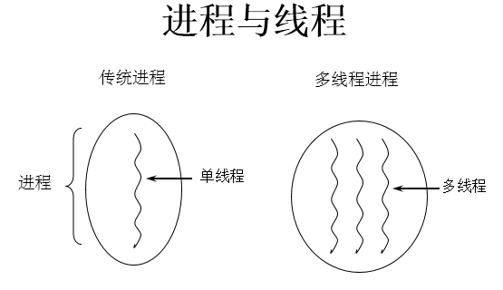
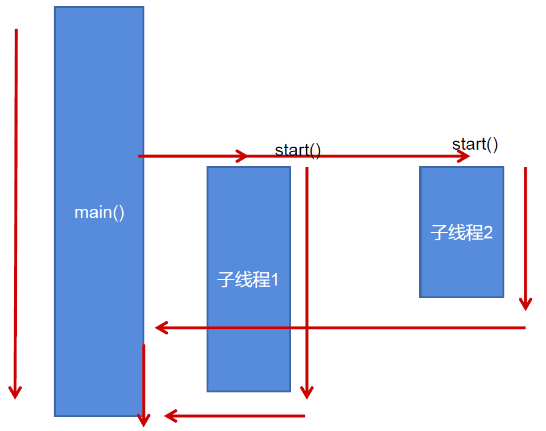
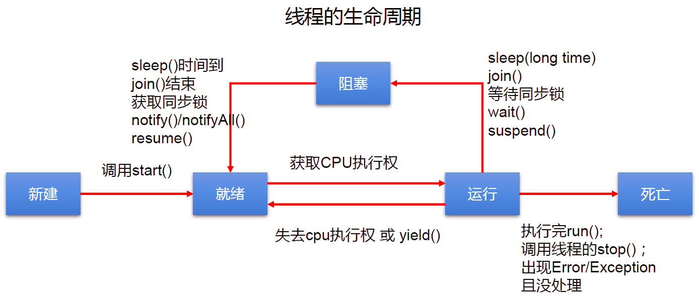

[TOC]


# Java 之多线程 


在进行多线程的内容之前我们需要首先了解涉及操作系统的几个知识点。

## 一、程序、进程、线程

### 1. 程序 (program)

概念：是为完成特定任务、用某种语言编写的一组指令的集合。即指一段静态的代码。

### 2. 进程 (process)

概念：程序的一次执行过程，或是正在运行的一个程序。 说明：进程作为资源分配的单位，系统在运行时会为每个进程分配不同的内存区域

### 3. 线程 (thread)

概念：进程可进一步细化为线程，是一个程序内部的一条执行路径。 说明：线程作为调度和执行的单位，每个线程拥独立的运行栈和程序计数器 (pc)，线程切换的开销小。





**内存结构：**


进程可以细化为多个线程。 每个线程，拥有自己独立的：栈、程序计数器 多个线程，共享同一个进程中的结构：方法区、堆。

## 二、并行与并发

### 1. 单核 CPU 与多核 CPU

- 单核 CPU，其实是一种假的多线程，因为在一个时间单元内，也只能执行一个线程的任务。涉及到 CPU 处理线程的方式，CPU 在单位时间（也就是说一个时间片内）内只能处理一个线程，于是就将其他的线程设置为阻塞状态，加入到阻塞队列中，等到处理完成当前线程后从就绪队列中取出新的线程进行处理，由于切换和处理时间很快用户感知不到于是用户便认为 CPU 在同一时间内处理多个线程。
- 多核 CPU，才能更好的发挥多线程的效率。（现在的服务器都是多核的）
- 一个 Java 应用程序 java.exe，其实至少三个线程：main() 主线程，gc() 垃圾回收线程，异常处理线程。当然如果发生异常，会影响主线程。

### 2. 并行与并发的理解

并行：多个 CPU 同时执行多个任务。比如：多个人同时做不同的事。

并发：一个 CPU(采用时间片) 同时执行多个任务。比如：秒杀、多个人做同一件事

## 为什么要使用多线程？

当我们在进行商品抢购的时候，在支付按钮上总是有个计时器在进行倒计时，但是我们此时仍然可以进行商品信息的查看，这个计时器和我们浏览商品信息的线程是同时进行的，这样也就实现了抢购场景，增加了用户的体验。

### 多线程程序的优点：

1. 提高应用程序的响应。对图形化界面更有意义，可增强用户体验。
2. 提高计算机系统 CPU 的利用率。
3. 改善程序结构。将既长又复杂的进程分为多个线程，独立运行，利于理解和修改。

### 应用的场景

1. 程序需要同时执行两个或多个任务。
2. 程序需要实现一些需要等待的任务时，如用户输入、文件读写操作、网络操作、搜索等
3. 需要一些后台运行的程序时

## 三、Thread 类

Java 语言的 JVM 允许程序运行多个线程，它通过 java. lang.Thread 类来体现

#### 1. Thread 类的特性

每个线程都是通过某个特定 Thread 对象的 run（方法来完成操作的，经常把 run() 方法的主体称为线程体 通过该 Thread 对象的 start（方法来启动这个线程，而非直接调用 run

#### 2. 构造器：

- Thread()：创建新的 Thread 对象
- Thread（String threadName）：创建线程并指定线程实例名
- Thread（Runnable target）：指定创建线程的目标对象，它实现了 Runnable 接口中的 run 方法
- Thread（Runnable target， String name）：创建新的 Thread 对象

#### 3. 创建多线程的两种方式

3.1. 方式一继承 Thread 类的方式：

1. 创建一个继承于 Thread 类的子类
2. 重写 Thread 类的 run() --> 将此线程执行的操作声明在 run() 中
3. 创建 Thread 类的子类的对象
4. 通过此对象调用 start()：①启动当前线程 ② 调用当前线程的 run()

**注意点：**

1. 我们启动一个线程，必须调用 start()，不能调用 run() 的方式启动线程。 如果再启动一个线程，必须重新创建一个 Thread 子类的对象，调用此对象的 start().（注意后面的点）
2. 如果自己手动调用 run() 方法，那么就只是普通方法，没有启动多线程模式
3. run（方法由 JVM 调用，什么时候调用，执行的过程控制都有操作系统的 CPU 调度决定。
4. 想要启动多线程，必须调用 start 方法。
5. 一个线程对象只能调用一次 start() 方法启动，如果重复调用了，则将抛出异常 “lllegalThreadStateException”.

**代码示例**

```java
//1.继承Thread类
class MyThread extends Thread {
    public MyThread() {
    }

    //2.重run方法
    @Override
    public void run() {
        for (int i = 0; i < 100; i++) {
            if (i % 2 == 0) {
                System.out.println(i);
            }
        }
    }
}

public class ThreadTest {
    public static void main(String[] args) {
//3.新建Thread对象
        MyThread myThread = new MyThread();
        //4.调用start方法
        myThread.start();
    }
}
```





3.2. 方式二实现 Runnable 接口的方式：

1. 创建一个实现了 Runnable 接口的类
2. 实现类去实现 Runnable 中的抽象方法：run()
3. 创建实现类的对象
4. 将此对象作为参数传递到 Thread 类的构造器中，创建 Thread 类的对象
5. 通过 Thread 类的对象调用 start()

**代码示例：**

```java
//1. 创建一个实现了Runnable接口的类
public class RunnableTest implements Runnable {
    // 2. 实现类去实现Runnable中的抽象方法：run()
    @Override
    public void run() {
        for (int i = 0; i < 100; i++) {
            System.out.println(i);
        }
    }
}

class test {
    public static void main(String[] args) {
        //3. 创建实现类的对象
        RunnableTest runnableTest = new RunnableTest();
        //4. 将此对象作为参数传递到Thread类的构造器中，创建Thread类的对象
        Thread thread = new Thread(runnableTest);
        //5. 通过Thread类的对象调用start()
        thread.start();

    }
}
```

**两种方式的对比：**

开发中优先选择：实现 Runnable 接口的方式

**原因：**

\1. 实现的方式没类的单继承性的局限性

 2. 实现的方式更适合来处理多个线程共享数据的情况。

**联系：**public class Thread implements Runnable

**相同点：**两种方式都需要重写 run(), 将线程要执行的逻辑声明在 run() 中。 目前两种方式，要想启动线程，都是调用的 Thread 类中的 start()。

**也可以采用创建匿名类的方式**

```java
public class ThreadDemo {
    public static void main(String[] args) {

        //创建Thread类的匿名子类的方式
        new Thread() {
            @Override
            public void run() {
                for (int i = 0; i < 100; i++) {
                    if (i % 2 == 0) {
                        System.out.println(Thread.currentThread().getName() + ":" + i);
                    }
                }
            }
        }.start();

        new Thread() {
            @Override
            public void run() {
                for (int i = 0; i < 100; i++) {
                    if (i % 2 != 0) {
                        System.out.println(Thread.currentThread().getName() + ":" + i);
                    }
                }
            }
        }.start();


    }
}
```

#### 4. Thread 类的常用方法

4.1 常用方法：

1. start(): 启动当前线程；调用当前线程的 run()，只有 Thread 类和他的子类才能调用 start() 方法
2. run(): 通常需要重写 Thread 类中的此方法，将创建的线程要执行的操作声明在此方法中
3. currentThread(): 静态方法，返回执行当前代码的线程
4. getName(): 获取当前线程的名字
5. setName(): 设置当前线程的名字
6. yield(): 释放当前 cpu 的执行权
7. join(): 在线程 a 中调用线程 b 的 join(), 此时线程 a 就进入阻塞状态，直到线程 b 完全执行完以后，线程 a 才结束阻塞状态。
8. stop(): 已过时。当执行此方法时，强制结束当前线程。
9. sleep(long millitime): 让当前线程 “睡眠” 指定的 millitime 毫秒。在指定的 millitime 毫秒时间内，当前线程是阻塞状态。
10. isAlive(): 判断当前线程是否存活

4.2 线程的优先级：

- MAX_PRIORITY：10
- MIN _PRIORITY：1
- NORM_PRIORITY：5 --> 默认优先级

获取和设置当前线程的优先级：

- getPriority(): 获取线程的优先级
- setPriority(int p): 设置线程的优先级

说明：高优先级的线程要抢占低优先级线程 CPU 的执行权。但是只是从概率上讲，高优先级的线程高概率的情况下被执行。并不意味着只当高优先级的线程执行完以后，低优先级的线程才执行。

线程通信：wait() / notify() / notifyAll() : 此三个方法定义在 Object 类中的。

**线程的分类**

- 守护线程，如：垃圾回收线程，依赖于主线程而存在
- 用户线程，如：main 方法的线程

### 5. Thread 的生命周期

**线程的五种状态：**

- 新建：当一个 Thread 类或其子类的对象被声明并创建时，新生的线程对象处于新建状态
- 就绪：处于新建状态的线程被 star() 后，将进入线程队列等待 CPU 时间片，此时它已具备了运行的条件，只是没分配到 CPU 资源
- 运行：当就绪的线程被调度并获得 CPU 资源时，便进入运行状态，run() 方法定义了线程的操作和功能
- 阻塞：在某种特殊情况下，被人为挂起或执行输入输出操作时，让出 CP∪并临时中止自己的执行，进入阻塞状态
- 死亡：线程完成了它的全部工作或线程被提前强制性地中止或出现异常导致结束





**说明：**

1. 生命周期关注两个概念：状态、相应的方法
2. 关注：状态 a--> 状态 b: 哪些方法执行了（回调方法） 某个方法主动调用：状态 a--> 状态 b
3. 阻塞：临时状态，不可以作为最终状态
4. 死亡：最终状态。

## 四、线程的同步机制

### 1. 背景

例子：创建个窗口卖票，总票数为 100 张. 使用实现 Runnable 接口的方式

- 问题：卖票过程中，出现了重票、错票 --> 出现了线程的安全问题
- 问题出现的原因：当某个线程操作车票的过程中，尚未操作完成时，其他线程参与进来，也操作车票。
- 如何解决：当一个线程 a 在操作 ticket 的时候，其他线程不能参与进来。直到线程 a 操作完 ticket 时，其他线程才可以开始操作 ticket。这种情况即使线程 a 出现了阻塞，也不能被改变。

### 2. Java 解决方案：同步机制

在 Java 中，我们通过同步机制，来解决线程的安全问题。

#### 2.1 方式一：同步代码块

```java
synchronized(同步监视器){//同步监视器就是需要同步线程的公共对象
   //需要被同步的代码
    
}
```

**说明：**

1. 操作共享数据的代码，即为需要被同步的代码。 --> 不能包含代码多了，也不能包含代码少了。
2. 共享数据：多个线程共同操作的变量。比如：ticket 就是共享数据。
3. 同步监视器，俗称：锁。任何一个类的对象，都可以充当锁。
4. 要求多个线程必须要共用同一把锁。

- 在实现 Runnable 接口创建多线程的方式中，我们可以考虑使用 this 充当同步监视器。
- 在继承 Thread 类创建多线程的方式中，慎用 this 充当同步监视器，考虑使用当前类充当同步监视器。

**代码示例：**

**继承 Runnable 接口形式同步代码块**

```java
public class Ticket implements Runnable {
    private int tick = 100;

    @Override
    public void run() {

        while (true) {
            synchronized (this) {
                if (tick > 0) {
                    System.out.println(Thread.currentThread().getName() + "号窗口买票，票号为：" + tick--);
                } else {
                    break;
                }
            }
        }
    }
}

class TicketTest {
    public static void main(String[] args) {
        Ticket ticket = new Ticket();

        Thread thread1 = new Thread(ticket);
        Thread thread2 = new Thread(ticket);
        Thread thread3 = new Thread(ticket);

        thread1.setName("窗口1");
        thread2.setName("窗口2");
        thread3.setName("窗口3");

        thread1.start();
        thread2.start();
        thread3.start();

    }
}
```

**继承 Thread 类形式同步代码块**

```java
public class Ticket2 extends Thread {
    private static int tick = 100;
    private static Object object = new Object();

    public Ticket2() {
    }

    @Override
    public void run() {

        while (true) {
            synchronized (object) {
            //synchronized (Ticket2.class) {//通过反射调用当前类
                if (tick > 0) {
                    System.out.println(Thread.currentThread().getName() + "号窗口买票，票号为" + tick--);
                } else {
                    break;
                }
            }

        }
    }
}

class TicketTest2 {
    public static void main(String[] args) {
        Ticket2 ticket1 = new Ticket2();
        Ticket2 ticket2 = new Ticket2();
        Ticket2 ticket3 = new Ticket2();

        ticket1.setName("窗口1");
        ticket2.setName("窗口2");
        ticket3.setName("窗口3");

        ticket1.start();
        ticket2.start();
        ticket3.start();


    }
}
```

#### 2.2 方式二：同步方法

如果操作共享数据的代码完整的声明在一个方法中，我们不妨将此方法声明同步的。

```java
public synchronized void show(String namer){
....
}
```

**代码示例：**

```java
public class Ticket3 implements Runnable {
    private int tick = 100;
    private boolean isFlag = true;

    @Override
    public void run() {
        while (isFlag) {
            show();

        }
    }

    public synchronized void show() {//同步show方法，继承Thread类方法一样，只需同步方法即可，同时需要给方法加static关键字，确保不会创建多个对象
        if (tick > 0) {
            try {
                Thread.sleep(100);
            } catch (InterruptedException e) {
                e.printStackTrace();
            }
            System.out.println(Thread.currentThread().getName() + "号窗口买票，票号为：" + tick--);
        } else {
            isFlag = false;
        }
    }
}

class TicketTest3 {
    public static void main(String[] args) {
        Ticket3 ticket = new Ticket3();

        Thread thread1 = new Thread(ticket);
        Thread thread2 = new Thread(ticket);
        Thread thread3 = new Thread(ticket);

        thread1.setName("窗口1");
        thread2.setName("窗口2");
        thread3.setName("窗口3");

        thread1.start();
        thread2.start();
        thread3.start();

    }
}
```

#### 2.3 方式三：Lock 锁 --- JDK 5.0 新增

- 从 JDK 5.0 开始，Java 提供了更强大的线程同步机制 -- 通过显式定义同步锁对象来实现同步。同步锁使用 Lock 对象充当。
- java.util.concurrent.locks.Lock 接口是控制多个线程对共享资源进行访问的工具。锁提供了对共享资源的独占访问，每次只能有一个线程对 Lock 对象加锁，线程开始访问共享资源之前应先获得 Lock 对象。
- ReentrantLock 类实现了 Lock，它拥有与 synchronized 相同的并发性和内存语义，在实现线程安全的控制中，比较常用的是 Reentrantlock，可以显式加锁、释放锁。

```java
class A {
    //1.实例化ReentrantLock对象
    private final ReenTrantLock lock = new ReenTrantLook();
    public void m (){
        lock.lock//2.先加锁
        try{
            //保证线程同步的代码
        }finally{
            lock.unlock();//3.后解锁
        }
    }
}

//注意：如果同步代码块有异常，要将unlock()写入finally语句块中
```

**代码示例：**

```java
class Window implements Runnable{

    private int ticket = 100;
    //1.实例化ReentrantLock
    private ReentrantLock lock = new ReentrantLock();

    @Override
    public void run() {
        while(true){
            try{

                //2.调用锁定方法lock()
                lock.lock();

                if(ticket > 0){

                    try {
                        Thread.sleep(100);
                    } catch (InterruptedException e) {
                        e.printStackTrace();
                    }

                    System.out.println(Thread.currentThread().getName() + "：售票，票号为：" + ticket);
                    ticket--;
                }else{
                    break;
                }
            }finally {
                //3.调用解锁方法：unlock()
                lock.unlock();
            }

        }
    }
}

public class LockTest {
    public static void main(String[] args) {
        Window w = new Window();

        Thread t1 = new Thread(w);
        Thread t2 = new Thread(w);
        Thread t3 = new Thread(w);

        t1.setName("窗口1");
        t2.setName("窗口2");
        t3.setName("窗口3");

        t1.start();
        t2.start();
        t3.start();
    }
}
```

### 3. 同步方法的总结：

在《 Thinking in Java》中，是这么说的：对于并发工作，你需要某种方式来防止两个任务访问相同的资源（其实就是共享资源竞争）。防止这种冲突的方法就是当资源被一个任务使用时，在其上加锁。第一个访问某项资源的任务必须锁定这项资源，使其他仼务在其被解锁之前，就无法访问它了，而在其被解锁之时，另一个任务就可以锁定并使用它了。

**synchronized 的锁是什么**：

1. 任意对象都可以作为同步锁。所有对象都自动含有单一的锁（监视器）
2. 同步方法的锁：静态方法（类名. class）、非静态方法（this）
3. 同步代码块：自己指定，很多时候也是指定为 this 或类名. class

**注意点：**

1. 必须确保使用同一个资源的多个线程共用一把锁，这个非常重要，否则就无法保证共享资源的安全
2. 一个线程类中的所有静态方法共用同一把锁（类名. class），所有非静态方法共用同一把锁（this），同步代码块（指定需谨慎）
3. 同步方法仍然涉及到同步监视器，只是不需要我们显式的声明。
4. 非静态的同步方法，同步监视器是：this
5. 静态的同步方法，同步监视器是：当前类本身

### 4. 同步的范围：

**如何找问题，即代码是否存在线程安全？（非常重要**）

（1）明确哪些代码是多线程运行的代码

（2）明确多个线程是否有共享数据

（3）明确多线程运行代码中是否有多条语句操作共享数据

**如何解决呢？（非常重要）**

对多条操作共享数据的语句，只能让一个线程都执行完，在执行过程中，其他线程不可以参与执行。 即所有操作共享数据的这些语句都要放在同步范围中

**注意点：**

范围太小：没锁住所有有安全问题的代码 范围太大：没发挥多线程的功能。

### 5. 面试题：

**1. synchronized 与 Lock 的异同？**

1. 相同：二者都可以解决线程安全问题

2. 不同：synchronized 机制在执行完相应的同步代码以后，自动的释放同步监视器

3. Lock 需要手动的启动同步（lock()，同时结束同步也需要手动的实现（unlock()）

4. 使用的优先顺序：

   Lock---> 同步代码块（已经进入了方法体，分配了相应资源 ) ---> 同步方法（在方法体之外)

5. 利弊： 同步的方式，解决了线程的安全问题。--- 好处 操作同步代码时，只能一个线程参与，其他线程等待。相当于是一个单线程的过程，效率低。

**2. Java 是如何解决线程安全问题的，有几种方式？并对比几种方式的不同**

利用同步锁的方式，有三种方式同步代码块、同步方法和用 lock 方法

**3. synchronized 和 Lock 方式解决线程安全问题的对比**

1. 相同：二者都可以解决线程安全问题
2. 不同：synchronized 机制在执行完相应的同步代码以后，自动的释放同步监视器
3. Lock 需要手动的启动同步（lock()，同时结束同步也需要手动的实现（unlock()）

### 6. 线程安全的单例模式

```java
使用同步机制将单例模式中的懒汉式改写为线程安全的。


class Bank{

    private Bank(){}

    private static Bank instance = null;

    public static Bank getInstance(){
        //方式一：效率稍差
//        synchronized (Bank.class) {
//            if(instance == null){
//
//                instance = new Bank();
//            }
//            return instance;
//        }
        //方式二：效率更高
        if(instance == null){

            synchronized (Bank.class) {
                if(instance == null){

                    instance = new Bank();
                }

            }
        }
        return instance;
    }

}
```

### 6. 死锁问题

1. 死锁的理解： 不同的线程分别占用对方需要的同步资源不放弃，都在等待对方放弃自己需要的同步资源，就形成了线程的死锁
2. 说明：

- 出现死锁后，不会出现异常，不会出现提示，只是所的线程都处于阻塞状态，无法继续

- 我们使用同步时，要避免出现死锁。

  **死锁举例：**

  ```java
  public static void main(String[] args) {
  
      StringBuffer s1 = new StringBuffer();
      StringBuffer s2 = new StringBuffer();
  
  
      new Thread(){
          @Override
          public void run() {
  
              synchronized (s1){
  
                  s1.append("a");
                  s2.append("1");
  
                  try {
                      Thread.sleep(100);
                  } catch (InterruptedException e) {
                      e.printStackTrace();
                  }
  
  
                  synchronized (s2){
                      s1.append("b");
                      s2.append("2");
  
                      System.out.println(s1);
                      System.out.println(s2);
                  }
  
  
              }
  
          }
      }.start();
  
  
      new Thread(new Runnable() {
          @Override
          public void run() {
              synchronized (s2){
  
                  s1.append("c");
                  s2.append("3");
  
                  try {
                      Thread.sleep(100);
                  } catch (InterruptedException e) {
                      e.printStackTrace();
                  }
  
                  synchronized (s1){
                      s1.append("d");
                      s2.append("4");
  
                      System.out.println(s1);
                      System.out.println(s2);
                  }
              }
          }
      }).start();
  
  
  }
  ```

## 五、线程通讯

为了解决线程的死锁问题，引入线程通讯

### 1. 线程通信涉及到的三个方法：

- wait(): 一旦执行此方法，当前线程就进入阻塞状态，并释放同步监视器。
- notify(): 一旦执行此方法，就会唤醒被 wait 的一个线程。如果有多个线程被 wait，就唤醒优先级高的那个。
- notifyAll(): 一旦执行此方法，就会唤醒所有被 wait 的线程。

### 2. 说明：

- wait()，notify()，notifyAll() 三个方法必须使用在同步代码块或同步方法中。

- wait()，notify()，notifyAll() 三个方法的调用者必须是同步代码块或同步方法中的同步监视器。

  否则，会出现 IllegalMonitorStateException 异常

- wait()，notify()，notifyAll() 三个方法是定义在 java.lang.Object 类中。

**代码示例：**

使用两个线程打印 1-100，线程 1, 线程 2 交替打印。

```java
class MyThread implements Runnable {
    private int number = 1;
    private Object object = new Object();

    @Override
    public void run() {
        while (true) {

            synchronized (object) {
                object.notify();//调用notify()方法唤醒线程
                if (number <= 100) {
                    //线程休眠
                    try {
                        Thread.sleep(10);
                    } catch (InterruptedException e) {
                        e.printStackTrace();
                    }

                    System.out.println(Thread.currentThread().getName() + number);
                    number++;

                    try {
                        object.wait();//打印输出一次后调用wait()方法将线程阻塞
                    } catch (InterruptedException e) {
                        e.printStackTrace();
                    }
                } else {
                    break;
                }
            }
        }
    }
}

public class CommunicationTest {
    public static void main(String[] args) {
        MyThread myThread = new MyThread();

        Thread thread1 = new Thread(myThread);
        Thread thread2 = new Thread(myThread);

        thread1.setName("线程1:");
        thread2.setName("线程2:");

        thread1.start();
        thread2.start();
    }
}
```

### 3. 面试题：

sleep() 和 wait() 的异同？

相同点：一旦执行方法，都可以使得当前的线程进入阻塞状态。

不同点：

1）两个方法声明的位置不同：Thread 类中声明 sleep() , Object 类中声明 wait()

2）调用的要求不同：sleep() 可以在任何需要的场景下调用。 wait() 必须使用在同步代码块或同步方法中

3）关于是否释放同步监视器：如果两个方法都使用在同步代码块或同步方法中，sleep() 不会释放锁，wait() 会释放锁。

### 4. 释放锁的操作：

- 当前线程的同步方法、同步代码块执行结束
- 当前线程在同步代码块、同步方法中遇到 break、 return 终止了该代码块该方法的继续执行。
- 当前线程在同步代码块、同步方法中出现了未处理的 Error 或 Exception，导致异常结束。
- 当前线程在同步代码块、同步方法中执行了线程对象的 wait() 方法，当前线程暂停，并释放锁

### 5. 不会释放锁的操作：

- 线程执行同步代码块或同步方法时，程序调用 Thread. sleep()、Thread yield() 方法暂停当前线程的执行
- 线程执行同步代码块时，其他线程调用了该线程的 suspend() 方法将该线程挂起，该线程不会释放锁（同步监视器）
- 应尽量避免使用 suspend() 和 resume() 来控制线程

## 六、JDK 5.0 新增线程创建方式

### 1. 新增方式一：实现 Callable 接口。

**实现方法：**

1. 创建一个实现 Callable 的实现类
2. 实现 call 方法，将此线程需要执行的操作声明在 call() 中
3. 创建 Callable 接口实现类的对象
4. 将此 Callable 接口实现类的对象作为传递到 FutureTask 构造器中，创建 FutureTask 的对象
5. 将 FutureTask 的对象作为参数传递到 Thread 类的构造器中，创建 Thread 对象，并调用 start()
6. 获取 Callable 中 call 方法的返回值

**代码示例：**

```java
//1.创建一个实现Callable的实现类
class NumThread implements Callable{
    //2.实现call方法，将此线程需要执行的操作声明在call()中
    @Override
    public Object call() throws Exception {
        int sum = 0;
        for (int i = 1; i <= 100; i++) {
            if(i % 2 == 0){
                System.out.println(i);
                sum += i;
            }
        }
        return sum;
    }
}


public class ThreadNew {
    public static void main(String[] args) {
        //3.创建Callable接口实现类的对象
        NumThread numThread = new NumThread();
        //4.将此Callable接口实现类的对象作为传递到FutureTask构造器中，创建FutureTask的对象
        FutureTask futureTask = new FutureTask(numThread);
        //5.将FutureTask的对象作为参数传递到Thread类的构造器中，创建Thread对象，并调用start()
        new Thread(futureTask).start();

        try {
            //6.获取Callable中call方法的返回值
            //get()返回值即为FutureTask构造器参数Callable实现类重写的call()的返回值。
            Object sum = futureTask.get();
            System.out.println("总和为：" + sum);
        } catch (InterruptedException e) {
            e.printStackTrace();
        } catch (ExecutionException e) {
            e.printStackTrace();
        }
    }

}
```

**如何理解实现 Callable 接口的方式创建多线程比实现 Runnable 接口创建多线程方式强大？**

1. call() 可以返回值的。
2. call() 可以抛出异常，被外面的操作捕获，获取异常的信息
3. Callable 是支持泛型的

### 2. 新增方式二：使用线程池

背景：经常创建和销毁、使用量特别大的资源，比如并发情况下的线程对性能影响很大。

**解决方案：**

提前创建好多个线程，放入线程池中，使用时直接获取，使用完放回池中。可以避免频繁创建销毁、实现重复利用。类似生活中的公共交通工具。

**实现方法：**

1. 提供指定线程数量的线程池
2. 执行指定的线程的操作。需要提供实现 Runnable 接口或 Callable 接口实现类的对象
3. 关闭连接池

**相关 API：**

```java
JDK 5.0起提供了线程池相关AP|： Executor Service和 Executors

Executor Service：真正的线程池接口。常见子类 Thread Poolexecutor
void execute(Runnable command）：执行任务/命令，没有返回值，一般用来执行Runnable
<T> Future<T> submit（Callable<T>task）：执行任务，有返回值，一般又来执行Callable
void shutdown()：关闭连接池

Executors：工具类、线程池的工厂类，用于创建并返回不同类型的线程池
Executors. newCachedThreadPool()：创建一个可根据需要创建新线程的线程池
Executors.newFⅸedthreadPool(n)；创建一个可重用固定线程数的线程池
EXecutors. newSingleThreadEXecutor()：创建一个只有一个线程的线程池
Executors. new thread Poo(n)：创建一个线程池，它可安排在给定延迟后运行命令或者定期地执行。
```

**代码示例：**

```java
class NumberThread implements Runnable{

    @Override
    public void run() {
        for(int i = 0;i <= 100;i++){
            if(i % 2 == 0){
                System.out.println(Thread.currentThread().getName() + ": " + i);
            }
        }
    }
}

class NumberThread1 implements Runnable{

    @Override
    public void run() {
        for(int i = 0;i <= 100;i++){
            if(i % 2 != 0){
                System.out.println(Thread.currentThread().getName() + ": " + i);
            }
        }
    }
}

public class ThreadPool {

    public static void main(String[] args) {
        //1. 提供指定线程数量的线程池
        ExecutorService service = Executors.newFixedThreadPool(10);
        ThreadPoolExecutor service1 = (ThreadPoolExecutor) service;
        //设置线程池的属性
//        System.out.println(service.getClass());
//        service1.setCorePoolSize(15);
//        service1.setKeepAliveTime();


        //2.执行指定的线程的操作。需要提供实现Runnable接口或Callable接口实现类的对象
        service.execute(new NumberThread());//适合适用于Runnable
        service.execute(new NumberThread1());//适合适用于Runnable

//        service.submit(Callable callable);//适合使用于Callable
        //3.关闭连接池
        service.shutdown();
    }

}
```

**应用线程池的好处：**

1. 提高响应速度（减少了创建新线程的时间）

2. 降低资源消耗（重复利用线程池中线程，不需要每次都创建）

3. 便于线程管理

   corePoolSize：核心池的大小

   maximumPoolSize：最大线程数

   keepAliveTime：线程没任务时最多保持多长时间后会终止

**面试题：Java 中多线程的创建有几种方式？四种。**

JDK 5.0 以前：

- 即继承 Thread 类重 run 方法
- 实现 Runnable 接口实现 run 方法

JDK 5.0 以后：

- 实现 callable 接口，实现 call 方法
- 利用线程池


全文完