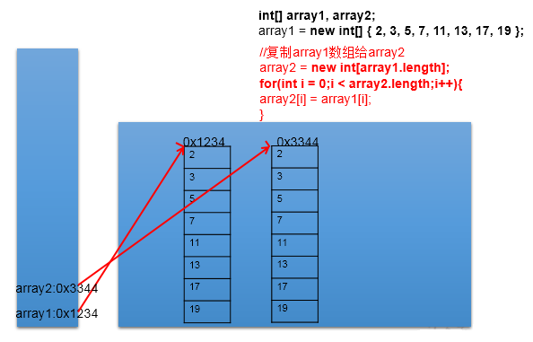

[TOC]


# Java 之数组 


## 一、数组的概述

### 1. 数组的理解：

数组 (Array)，是多个相同类型数据一定顺序排列的集合，并使用一个名字命名，并通过编号的 方式对这些数据进行统一管理。

### 2. 数组相关的概念：

数组名 元素 角标、下标、索引 数组的长度：元素的个数

### 3. 数组的特点：

1. 数组是序排列的
2. 数组属于引用数据类型的变量。数组的元素，既可以是基本数据类型，也可以是引用数据类型
3. 创建数组对象会在内存中开辟一整块连续的空间
4. 数组的长度一旦确定，就不能修改。

### 4. 数组的分类：

① 按照维数：一维数组、二维数组、。。。

② 按照数组元素的类型：基本数据类型元素的数组、引用数据类型元素的数组

### 5. 数据结构：

1. 数据与数据之间的逻辑关系：集合（关系很弱）、一对一（数组里面的元素）、一对多（二叉树）、多对多（社交网络）
2. 数据的存储结构： 线性表：顺序表（比如：数组）、链表、栈、队列 树形结构：二叉树 图形结构：

## 二、一维数组

### 1. 一维数组的声明与初始化

正确的方式：

```java
int num;//声明
num = 10;//初始化
int id = 1001;//声明 + 初始化		
int[] ids;//声明
//1.1 静态初始化:数组的初始化和数组元素的赋值操作同时进行
ids = new int[]{1001,1002,1003,1004};
//1.2动态初始化:数组的初始化和数组元素的赋值操作分开进行
String[] names = new String[5];
int[] arr4 = {1,2,3,4,5};//类型推断
```

错误的方式：

```java
//int[] arr1 = new int[];
//int[5] arr2 = new int[5];
//int[] arr3 = new int[3]{1,2,3};
```

### 2. 一维数组元素的引用：

通过角标的方式调用。

```java
//数组的角标（或索引从0开始的，到数组的长度-1结束。
names[0] = "王铭";
names[1] = "王赫";
names[2] = "张学良";
names[3] = "孙居龙";
names[4] = "王宏志";//charAt(0)
```

### 3. 数组的属性：

数组的属性：length

```java
System.out.println(names.length);//5
System.out.println(ids.length);
```

说明： 数组一旦初始化，其长度就是确定的。arr.length 数组长度一旦确定，就不可修改。

### 4. 一维数组的遍历

```java
for(int i = 0;i < names.length;i++){
	System.out.println(names[i]);
}
```

### 5. 一维数组元素的默认初始化值

- 数组元素是整型：0
- 数组元素是浮点型：0.0
- 数组元素是 char 型：0 或'\u0000'，而非'0'
- 数组元素是 boolean 型：false
- 数组元素是引用数据类型：null

### 6. 一维数组的内存结构


## 三、二维数组

### 1. 如何理解二维数组？

数组属于引用数据类型 数组的元素也可以是引用数据类型 一个一维数组 A 的元素如果还是一个一维数组类型的，则，此数组 A 称为二维数组。

### 2. 二维数组的声明与初始化

正确的方式：

```java
int[] arr = new int[]{1,2,3};//一维数组
//静态初始化
int[][] arr1 = new int[][]{{1,2,3},{4,5},{6,7,8}};
//动态初始化1
String[][] arr2 = new String[3][2];
//动态初始化2
String[][] arr3 = new String[3][];
//也是正确的写法：
int[] arr4[] = new int[][]{{1,2,3},{4,5,9,10},{6,7,8}};
int[] arr5[] = {{1,2,3},{4,5},{6,7,8}};//类型推断
```

错误的方式：

```java
//String[][] arr4 = new String[][4];
//String[4][3] arr5 = new String[][];
//int[][] arr6 = new int[4][3]{{1,2,3},{4,5},{6,7,8}};
```

### 3. 如何调用二维数组元素:

```java
System.out.println(arr1[0][1]);//2
System.out.println(arr2[1][1]);//null
		
arr3[1] = new String[4];
System.out.println(arr3[1][0]);
System.out.println(arr3[0]);//
```

### 4. 二维数组的属性：

```java
System.out.println(arr4.length);//3
System.out.println(arr4[0].length);//3
System.out.println(arr4[1].length);//4
```

### 5. 遍历二维数组元素

```java
for(int i = 0;i < arr4.length;i++){
			
	for(int j = 0;j < arr4[i].length;j++){
		System.out.print(arr4[i][j] + "  ");
	}
	System.out.println();
}
```


### 6. 二维数组元素的默认初始化值

```java
* 	规定：二维数组分为外层数组的元素，内层数组的元素
 * 		int[][] arr = new int[4][3];
 * 		外层元素：arr[0],arr[1]等
 * 		内层元素：arr[0][0],arr[1][2]等
 * 
 *   ⑤ 数组元素的默认初始化值 
 *   针对于初始化方式一：比如：int[][] arr = new int[4][3];
 *      外层元素的初始化值为：地址值
 *      内层元素的初始化值为：与一维数组初始化情况相同
 *      
 *   针对于初始化方式二：比如：int[][] arr = new int[4][];
 *   	外层元素的初始化值为：null
 *      内层元素的初始化值为：不能调用，否则报错。
```

### 7. 二维数组的内存结构


## 四、数组的常见算法

### 1. 数组的创建与元素赋值：

杨辉三角（二维数组）、回形数（二维数组）、6 个数，1-30 之间随机生成且不重复。

**杨辉三角**

```java
// 1.新建二位数组，动态初始化
int[][] yangHui = new int[10][];
// 2.为二维数组赋值
for (int i = 0; i < yangHui.length; i++) {
    yangHui[i] = new int[i + 1];
    // 2.1为首末元素赋值
    yangHui[i][0] = yangHui[i][i] = 1;
    // 2.2为其余元素赋值
    for (int j = 1; j < yangHui[i].length - 1; j++) {//
        yangHui[i][j] = yangHui[i - 1][j - 1] + yangHui[i - 1][j];
    }

}
// 3.打印输出二维数组
for (int i = 0; i < yangHui.length; i++) {
    for (int j = 1; j < yangHui[i].length; j++) {// 第0个位置没有元素
        System.out.print(yangHui[i][j] + " ");
    }
    System.out.println();
}
```

### 2. 针对于数值型的数组：

最大值、最小值、总和、平均数等

```java
// 1.找到数组中的最大值
int maxArr = arr[0];
for (int i = 0; i < arr.length; i++) {
    if (maxArr < arr[i]) {
        maxArr = arr[i];
    }
}
System.out.println("数组中的最大值为：" + maxArr);

// 2.找到数组中的最小值

int minArr = arr[0];
for (int i = 0; i < arr.length; i++) {
    if (minArr > arr[i]) {
        minArr = arr[i];
    }
}
System.out.println("数组中的最小值为：" + minArr);

// 3.找到数组中的平均数
int num = 0;
for (int i = 0; i < arr.length; i++) {
    num += arr[i];
}
System.out.println("数组的平均数为：" + (num / arr.length));

// 4.求总和
int num1 = 0;
for (int i = 0; i < arr.length; i++) {
    num1 += arr[i];
}
System.out.println("数组的总和为：" + num1);
```

### 3. 数组的赋值与复制

```java
// 1.数组的赋值
String[] str1 = new String[5];
str1 = str;
str1[2] = "AA";
for (int i = 0; i < str1.length; i++) {
    System.out.print(str[i] + " ");
}
System.out.println();
```

#### 3.1 赋值

如何理解：如何理解：将 array1 保存的数组的地址值赋给了 array2，使得 array1 和 array2 共同指向堆空间中的同一个数组实体。


#### 3.2 复制：

```java
// 1.1数组的复制
for (int i = 0; i < str1.length; i++) {
    str1[i] = str[i];
    System.out.print(str1[i] + " ");
}
```

如何理解：我们通过 new 的方式，给 array2 在堆空间中新开辟了数组的空间。将 array1 数组中的元素值一个一个的赋值到 array2 数组中。





### 4. 数组元素的反转:

```java
//方法一：
for(int i = 0;i < arr.length / 2;i++){
    String temp = arr[i];
    arr[i] = arr[arr.length - i -1];
    arr[arr.length - i -1] = temp;
}

//方法二：
for(int i = 0,j = arr.length - 1;i < j;i++,j--){
    String temp = arr[i];
    arr[i] = arr[j];
    arr[j] = temp;
}
```

### 5. 数组中指定元素的查找：搜索，检索

#### 5.1 线性查找：

实现思路：通过遍历的方式，一个一个的数据进行比较、查找。 适用性：具有普遍适应性

#### 5.2 二分法查找：

实现思路：每次比较中间值，折半的方式检索。 适用性：（前提：数组必须有序）

### 6 . 数组的排序算法

**十大排序算法**

- 选择排序：
  - 直接选择排序、堆排序
- 交换排序：
  - 冒泡排序、快速排序
- 插入排序：
  - 直接插入排序、折半插入排序、希尔排序
- 归并排序
- 桶排序
- 基数排序

理解： 1）衡量排序算法的优劣：

 时间复杂度、空间复杂度、稳定性

2）排序的分类：内部排序 与 外部排序（需要借助磁盘）

3）不同排序算法的时间复杂度


冒泡排序的实现：

```java
int[] arr = new int[] { 21, 43, 64, 76, 878, 432, 21 };
        for (int i = 0; i < arr.length - 1; i++) {
            for (int j = 0; j < arr.length - i - 1; j++) {
                if (arr[j] > arr[j + 1]) {
                    int temp = arr[j];
                    arr[j] = arr[j + 1];
                    arr[j + 1] = temp;
                }
            }
        }

        for (int i = 0; i < arr.length; i++) {
            System.out.print(arr[i] + " ");
        }
```

## 五、Arrays 工具类的使用

### 1. 理解：

① 定义在 java.util 包下。 ② Arrays: 提供了很多操作数组的方法。

### 2. 使用：

```java
int arr1[] = new int[] { 21, 43, 542, 432, 4, 2, 5, 1 };
int arr2[] = new int[] { 32, 43, 4, 1, 4, 76, 54, 68, 4 };

// 1.Arrays.equals(arr1, arr2):判断数组是否相等
System.out.println(Arrays.equals(arr1, arr2));
// 2.Arrays.toString(arr1):输出数组信息
System.out.println(Arrays.toString(arr1));

// 3.Arrays.fill(arr1, 2):将指定值填充到数组中
Arrays.fill(arr1, 2);
System.out.println(Arrays.toString(arr1));
// 4.Arrays.sort(arr2):对数组进行排序
Arrays.sort(arr2);
System.out.println(Arrays.toString(arr2));
// 5.Arrays.binarySearch(arr2, 1):堆排序好的数组用二分法检索指定值
int index = Arrays.binarySearch(arr2, 1);
System.out.println(index);
```

## 六、数组的常见异常

### 1. 数组角标越界异常：

ArrayIndexOutOfBoundsException

```java
int[] arr = new int[]{1,2,3,4,5};

for(int i = 0;i <= arr.length;i++){
    System.out.println(arr[i]);
}

System.out.println(arr[-2]);

System.out.println("hello");
```

### 2. 空指针异常：

NullPointerException

```java
//情况一：
int[] arr1 = new int[]{1,2,3};
arr1 = null;
System.out.println(arr1[0]);

//情况二：
int[][] arr2 = new int[4][];
System.out.println(arr2[0][0]);

//情况：
String[] arr3 = new String[]{"AA","BB","CC"};
arr3[0] = null;
System.out.println(arr3[0].toString());
```

提示：一旦程序出现异常，未处理时，就终止执行。


全文完

