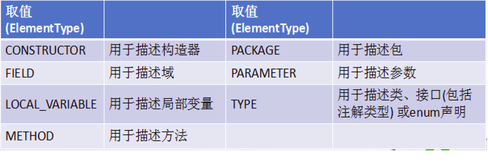

[TOC]


# Java 之枚举类和注解 


## 一、枚举类的使用

### 1. 枚举类的说明：

1. 枚举类的理解：类的对象只有有限个，确定的。我们称此类为枚举类

2. 当需要定义一组常量时，强烈建议使用枚举类

3. 枚举类的实现：

   JDK 5.0 以前需要自定义

   JDK 5.0 后新增 enum 关键字用于定义枚举类

4. 如果枚举类中只一个对象，则可以作为单例模式的实现方式。

5. 枚举类的属性：

   枚举类对象的属性不应允许被改动，所以应该使用 private final 修饰 枚举类的使用 private final 修饰的属性应该在构造器中为其赋值 若枚举类显式的定义了带参数的构造器，则在列出枚举值时也必须对应的传入参数

### 2. 如何自定义枚举类？

步骤:

1. 私有化构造器，保证不能在类的外部创建其对象；
2. 在类的内部创建枚举类的示例。声明为：public static final；
3. 对象如果有实例变量，应该声明为 private final，并在构造器中初始化；

代码示例：

```java
//自定义枚举类
class Season{
    //1.声明Season对象的属性:private final修饰
    private final String seasonName;
    private final String seasonDesc;

    //2.私化类的构造器,并给对象属性赋值
    private Season(String seasonName,String seasonDesc){
        this.seasonName = seasonName;
        this.seasonDesc = seasonDesc;
    }

    //3.提供当前枚举类的多个对象：public static final的
    public static final Season SPRING = new Season("春天","春暖花开");
    public static final Season SUMMER = new Season("夏天","夏日炎炎");
    public static final Season AUTUMN = new Season("秋天","秋高气爽");
    public static final Season WINTER = new Season("冬天","冰天雪地");

    //4.其他诉求1：获取枚举类对象的属性
    public String getSeasonName() {
        return seasonName;
    }

    public String getSeasonDesc() {
        return seasonDesc;
    }
    //4.其他诉求1：提供toString()
    @Override
    public String toString() {
        return "Season{" +
            "seasonName='" + seasonName + '\'' +
            ", seasonDesc='" + seasonDesc + '\'' +
            '}';
    }
}
```

### 3. JDK 5.0 新增使用 enum 定义枚举类。

#### 使用说明：

- 使用 enum 定义的枚举类默认继承了 java.lang.Enum 类，因此不能再继承其他类
- 枚举类的构造器只能使用 private 权限修饰符
- 枚举类的所有实例必须在枚举类中显式列出 (“,” 分隔 “;” 结尾)。列出的实例系统会自动添加 public static final 修饰
- 必须在枚举类的第一行声明枚举类对象

#### 代码示例：

```java
//使用enum关键字枚举类
enum Season1 {
    //1.提供当前枚举类的对象，多个对象之间用","隔开，末尾对象";"结束
    SPRING("春天","春暖花开"),
    SUMMER("夏天","夏日炎炎"),
    AUTUMN("秋天","秋高气爽"),
    WINTER("冬天","冰天雪地");

    //2.声明Season对象的属性:private final修饰
    private final String seasonName;
    private final String seasonDesc;

    //2.私化类的构造器,并给对象属性赋值

    private Season1(String seasonName,String seasonDesc){
        this.seasonName = seasonName;
        this.seasonDesc = seasonDesc;
    }

    //4.其他诉求1：获取枚举类对象的属性
    public String getSeasonName() {
        return seasonName;
    }

    public String getSeasonDesc() {
        return seasonDesc;
    }

}
```

#### Enum 类的常用方法：

1. values() 方法：返回枚举类型的对象数组。该方法可以很方便地遍历所有的枚举值。
2. valueOf(String str)：可以把一个字符串转为对应的枚举类对象。要求字符串必须是枚举类对象的 “名字”. 如不是，会有运行时异常 IllegalArgumentException
3. toString()：返回当前枚举类对象常量的名称

代码示例：

```java
Season1 summer = Season1.SUMMER;
//toString():返回枚举类对象的名称
System.out.println(summer.toString());

//        System.out.println(Season1.class.getSuperclass());
System.out.println("****************");
//values():返回所的枚举类对象构成的数组
Season1[] values = Season1.values();
for(int i = 0;i < values.length;i++){
    System.out.println(values[i]);
}
System.out.println("****************");
Thread.State[] values1 = Thread.State.values();
for (int i = 0; i < values1.length; i++) {
    System.out.println(values1[i]);
}

//valueOf(String objName):返回枚举类中对象名是objName的对象。
Season1 winter = Season1.valueOf("WINTER");
//如果没objName的枚举类对象，则抛异常：IllegalArgumentException
//        Season1 winter = Season1.valueOf("WINTER1");
System.out.println(winter);
```

#### 用 Enum 类定义的枚举类对象分别实现接口：

使用说明：

1. 和普通 Java 类一样，枚举类可以实现一个或多个接口
2. 若每个枚举值在调用实现的接口方法呈现相同的行为方式，则只要统一实现该方法即可。
3. 若需要每个枚举值在调用实现的接口方法呈现出不同的行为方式，则可以让每个枚举值分别来实现该方法

代码示例：

```java
interface Info{
    void show();
}

//使用enum关键字枚举类
enum Season1 implements Info{
    //1.提供当前枚举类的对象，多个对象之间用","隔开，末尾对象";"结束
    SPRING("春天","春暖花开"){
        @Override
        public void show() {
            System.out.println("春天在哪里？");
        }
    },
    SUMMER("夏天","夏日炎炎"){
        @Override
        public void show() {
            System.out.println("宁夏");
        }
    },
    AUTUMN("秋天","秋高气爽"){
        @Override
        public void show() {
            System.out.println("秋天不回来");
        }
    },
    WINTER("冬天","冰天雪地"){
        @Override
        public void show() {
            System.out.println("大约在冬季");
        }
    };
}
```

## 二、注解的使用

### 1. 注解的理解

① jdk 5.0 新增的功能

② Annotation 其实就是代码里的特殊标记, 这些标记可以在编译, 类加载, 运行时被读取, 并执行相应的处理。通过使用 Annotation, 程序员可以在不改变原逻辑的情况下, 在源文件中嵌入一些补充信息。

③ Annotation 可以像修饰符一样使用，可以用来修饰包、类、构造器、方法、成员变量、参数、局部变量的声明，这些信息被保存在 Annotation 的 “name = value” 对中。

④ 在 JavaSE 中，注解的使用目的比较简单，例如标记过时的功能，忽略警告等。在 JavaEE/Android 中注解占据了更重要的角色，例如用来配置应用程序的任何切面，代替 JavaEE 旧版中所遗留的繁冗 代码和 XML 配置等。

⑤ 框架 = 注解 + 反射机制 + 设计模式

### 2. 注解的使用示例

使用 Annotation 时要在其前面增加 [@符号](https://my.oschina.net/uancn)，并把该 Annotation 当成个修饰符使用。用于修饰它支持的程序元素

#### 示例一：生成文档相关的注解

@author 标明开发该类模块的作者，多个作者之间使用，分割 @version 标明该类模块的版本 @see 参考转向，也就是相关主题 @since 从哪个版本开始增加的 @param 对方法中某参数的说明，如果没有参数就不能写 @return 对方法返回值的说明，如果方法的返回值类型是 void 就不能写 @exception 对方法可能抛出的异常进行说明，如果方法没有用 throws 显式抛出的异常就不能写 其中 [@param](https://my.oschina.net/u/2303379) @return 和 @exception 这三个标记都是只用于方法的。 @param 的格式要求：@param 形参名形参类型形参说明 @return 的格式要求：@return 返回值类型返回值说明 @exception 的格式要求：@exception 异常类型异常说明 @param 和 @ exception 可以并列多个

代码示例：

```java
/**
 * @author bruce
 * @project_name JavaSenior
 * @package_name com.bruce.java
 * @create 2020-04-26 10:58
 */
public class AnnotationTest {
    /**
     *程序的主方法
     * @param args 传入命令行参数
     */
    public static void main(String[] args) {

    }

    /**
     * 求圆形面积
     * @param radius 所求面积的半径
     * @return 面积值
     */
    public static double getArea(double radius){
        return Math.PI * radius * radius;
    }
}
```

#### 示例二：在编译时进行格式检查 (JDK 内置的个基本注解)

[@Override](https://my.oschina.net/u/1162528): 限定重写父类方法, 该注解只能用于方法 [@Deprecated](https://my.oschina.net/jianhuaw): 用于表示所修饰的元素 (类, 方法等) 已过时。通常是因为所修饰的结构危险或存在更好的择 @SuppressWarnings: 抑制编译器警告

代码示例：

```java
public class AnnotationTest{
    public static void mian (String [] args){
        @SuppressWarning("unused")
        int a = 0;
    }
    @Deprecated
    public void print(){
        System.out.print("过时的方法");
    }
    @Override
    public String toString(){
        return "重写的toString方法";
    }
}
```

#### 示例三：跟踪代码依赖性，实现替代配置文件功能

在使用 Spring 框架时会大量用到注解驱动开发。

### 3. 如何自定义注解

参照 @SuppressWarnings 定义

1. 注解声明为：[@interface](https://my.oschina.net/u/996807)
2. 内部定义成员，通常使用 value 表示
3. 可以指定成员的默认值，使用 default 定义
4. 如果自定义注解没成员，表明是一个标识作用。

#### 说明：

- 如果注解有成员，在使用注解时，需要指明成员的值。
- 自定义注解必须配上注解的信息处理流程 (使用反射) 才意义。
- 自定义注解通过都会指明两个元注解：Retention、Target

#### 代码举例：

```java
@Inherited
@Repeatable(MyAnnotations.class)
@Retention(RetentionPolicy.RUNTIME)
@Target({TYPE, FIELD, METHOD, PARAMETER, CONSTRUCTOR, LOCAL_VARIABLE,TYPE_PARAMETER,TYPE_USE})
public @interface MyAnnotation {

    String value() default "hello";
}
```

### 4. 元注解 ：

对现有的注解进行解释说明的注解。

JDK 5.0 提供的 4 种元注解：

1. Retention：指定所修饰的 Annotation 的生命周期：SOURCE\CLASS（默认行为）\RUNTIME 只有声明为 RUNTIME 生命周期的注解，才能通过反射获取。

2. Target: 用于指定被修饰的 Annotation 能用于修饰哪些程序元素

   

3. Documented: 表示所修饰的注解在被 javadoc 解析时，保留下来。

4. Inherited: 被它修饰的 Annotation 将具继承性。

类比：元数据的概念：String name = "Tom"; 对现有数据的修饰

### 5. 如何获取注解信息:

通过发射来进行获取、调用。

前提：要求此注解的元注解 Retention 中声明的生命周期状态为：RUNTIME.

### 6. JDK 8.0 中注解的新特性：

可重复注解、类型注解

#### 6.1 可重复注解：

① 在 MyAnnotation 上声明 @Repeatable，成员值为 MyAnnotations.class

② MyAnnotation 的 Target 和 Retention 等元注解与 MyAnnotations 相同。

#### 6.2 类型注解：

ElementType.TYPE_PARAMETER 表示该注解能写在类型变量的声明语句中（如：泛型声明。）

ElementType.TYPE_USE 表示该注解能写在使用类型的任何语句中。


全文完

