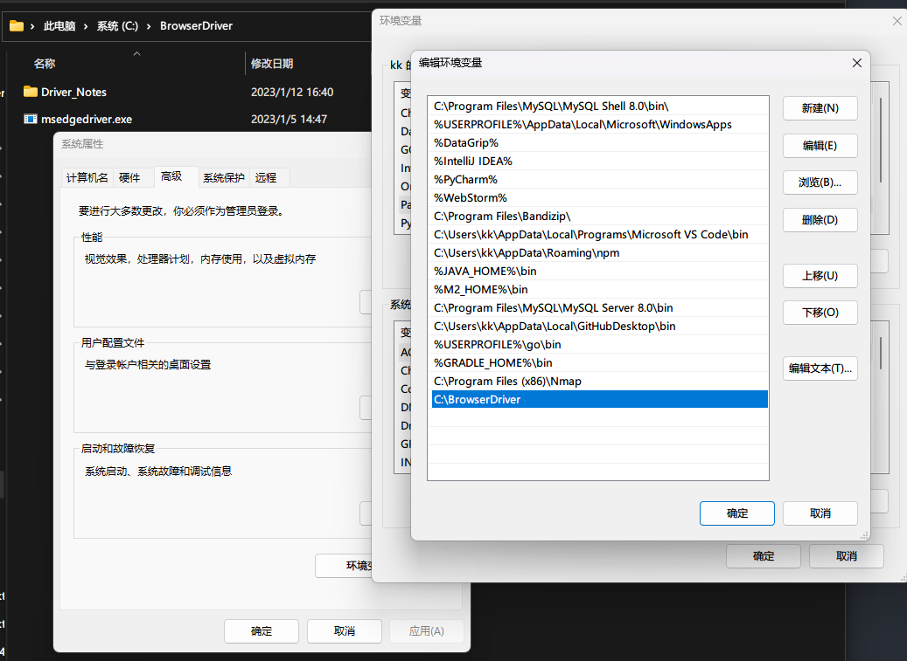

# 详解介绍Selenium常用API的使用Python语言

## （一）安装selenium

### 安装python

------

打开 [Python官网](https://www.python.org/)，找到“Download”, 在其下拉菜单中选择自己的平台（Windows/Mac）,一般的Linux平台已经自带的Python，所以不需要安装，通过打开“终端” ，输入“python”命令来验证。

注意：在安装的过程中需要勾选：“Add Python 3.x to PATH” , 如果没有勾选，需要在安装完成之后，将Python的安装目录（如：C:\Python310）添加到环境变量PATH下面。

打开Windows命令提示符（cmd）/ Linux终端输入：

```
PS C:\Users\kk> python
Python 3.10.5 (tags/v3.10.5:f377153, Jun  6 2022, 16:14:13) [MSC v.1929 64 bit (AMD64)] on win32
Type "help", "copyright", "credits" or "license" for more information.
>>>
```


### 安装selenium

------

首先，在Windows命令提示符（cmd）/ Linux终端输入：`pip`

```
PS C:\Users\kk> pip

Usage:
  pip <command> [options]

Commands:
  install                     Install packages.
  download                    Download packages.
  uninstall                   Uninstall packages.
  freeze                      Output installed packages in requirements format.
  inspect                     Inspect the python environment.
  list                        List installed packages.
  show                        Show information about installed packages.
……
```

确保pip命令可用，如果提示“pip不是内部或外部命令”，需要将pip的安装目录（如：C:\Python310\Scripts）添加到环境变量PATH下面。

接下来通过pip命令安装Selenium: pip install selenium

```
PS C:\Users\kk> pip install selenium
Collecting selenium
  Downloading selenium-4.7.2-py3-none-any.whl (6.3 MB)
     ━━━━━━━━━━━━━━━━━━━━━━━━━━━━━━━━━━━━━━━━ 6.3/6.3 MB 8.1 MB/s eta 0:00:00
Requirement already satisfied: certifi>=2021.10.8 in c:\python310\lib\site-packages (from selenium) (2022.9.24)
Collecting trio-websocket~=0.9
  Downloading trio_websocket-0.9.2-py3-none-any.whl (16 kB)
……
```


### 测试

打开一款Python编辑器，默认Python自带的IDLE也行。创建 baidu.py文件，输入以下内容：

```
from selenium import webdriver


def hello_selenium(url):
    driver = webdriver.Chrome()
    driver.get(url)

    print(driver.title)

    driver.quit()


if __name__ == '__main__':
    # 打开百度
    hello_selenium('https://www.baidu.com')

```

第一次运行这段代码**报错很正常**，因为我们还没有安装浏览器驱动，请看下一节安装浏览器驱动


## （二）安装浏览器驱动

### 下载浏览器驱动

如果想使用selenium驱动不同的浏览器，必须单独下载并设置不同的浏览器驱动。

部分浏览器下载地址：

Firefox浏览器驱动：[geckodriver](https://github.com/mozilla/geckodriver/releases)

Chrome浏览器驱动：[chromedriver](https://sites.google.com/a/chromium.org/chromedriver/home) , [taobao备用地址](https://registry.npmmirror.com/binary.html?path=chromedriver/)

Edge浏览器驱动：[MicrosoftWebDriver](https://developer.microsoft.com/en-us/microsoft-edge/tools/webdriver)

注：部分浏览器驱动地址需要科学上网。**下载驱动的时候,驱动版本必须和浏览器版本保持一致!!!!!!**


### 设置浏览器驱动

设置浏览器的地址非常简单。 我们可以手动创建一个存放浏览器驱动的目录，如： C:\BrowserDriver , 将下载的浏览器驱动文件（例如：chromedriver、MicrosoftWebDriver）丢到该目录下。

我的电脑-->属性-->系统设置-->高级-->环境变量-->系统变量-->Path，将“C:\BrowserDriver ”目录添加到Path的值中。

- Path
- C:\BrowserDriver 



### 设置浏览器驱动

验证不同的浏览器驱动是否正常使用。

```python
from selenium import webdriver


driver = webdriver.Firefox()   # Firefox浏览器

driver = webdriver.Chrome()    # Chrome浏览器

driver = webdriver.Edge()      # Edge浏览器

……
```
