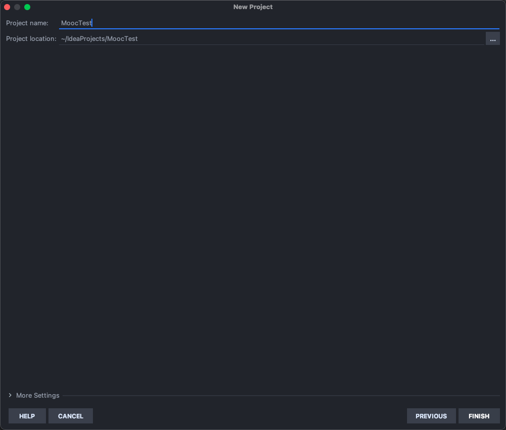
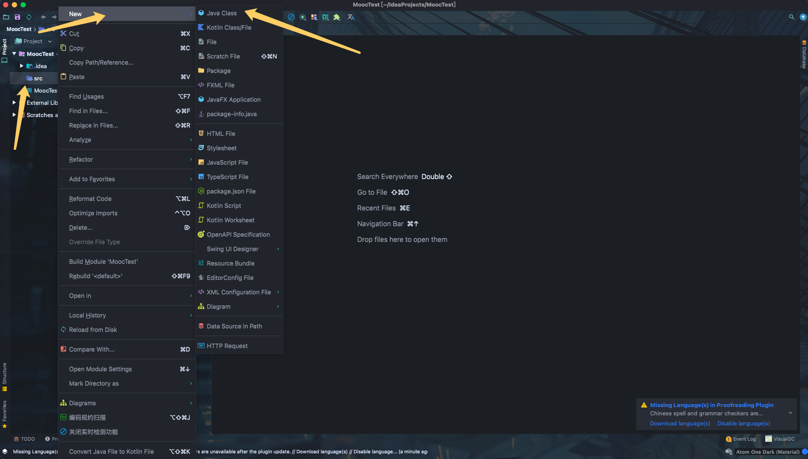
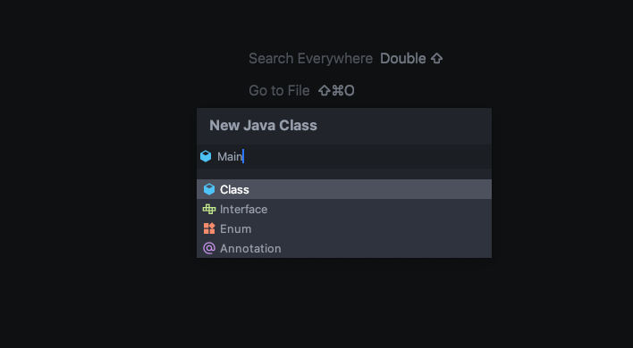

[TOC]

# 详解介绍Selenium常用API的使用--Java语言

## （一）环境安装之Java

### 安装java


点击 [JDK8下载](https://www.oracle.com/java/technologies/downloads/#java8)，根据自己的平台，选择相应的版本进行下载。

```
小知识：
Java环境分JDK和JRE ，JDK就是Java Development Kit。简单的说JDK是面向开发人员使用的SDK，它提供了Java的开发
环境和运行环境。JRE是Java Runtime Enviroment是指Java的运行环境，是面向 Java 程序的使用者。
```

我们以 Windows安装JDK为例，双击下载的JDK，设置安装路径。这里我选择默认安装在 **"C:\Program Files\Java\jdk1.8.0_101"** 目录下。

下面设置环境变量：

“我的电脑” 右键菜单--->属性--->高级--->环境变量--->系统变量--->新建..

```
变量名： JAVA_HOME
变量值： C:\Program Files\Java\jdk1.8.0_101
变量名： CALSS_PATH
变量值： .;%JAVA_HOME%\lib\dt.jar;%JAVA_HOME%\lib\tools.jar;
```

找到 path 变量名—>“编辑” 添加：

```
变量名： PATH
变量值： %JAVA_HOME%\bin;%JAVA_HOME%\jre\bin;
```

在Windows命令提示符(cmd)下验证 Java 是否成功：

```
> java
用法: java [-options] class [args...]
           (执行类)
   或  java [-options] -jar jarfile [args...]
           (执行 jar 文件)
其中选项包括:
    -d32          使用 32 位数据模型 (如果可用)
    -d64          使用 64 位数据模型 (如果可用)
    -client       选择 "client" VM
    -server       选择 "server" VM
                  默认 VM 是 client.
......

> javac
用法: javac <options> <source files>
其中, 可能的选项包括:
  -g                         生成所有调试信息
  -g:none                    不生成任何调试信息
  -g:{lines,vars,source}     只生成某些调试信息
  -nowarn                    不生成任何警告
  -verbose                   输出有关编译器正在执行的操作的消息
  -deprecation               输出使用已过时的 API 的源位置
  -classpath <路径>            指定查找用户类文件和注释处理程序的位置
.......
```

- java 命令可以运行 class 文件字节码。
- javac 命令可以将 Java 源文件编译为 class 字节码文件。

可能读者当前下载的 Java 版本与本书不同， 但安装方法是一样的。

## （二）环境安装之IntelliJ IDEA


### 安装IntelliJ IDEA


你可能会问，为什么不用Eclipse呢？随着发展IntelliJ IDEA有超越Eclipse的势头，JetBrains公司的IDE基本上已经一统了各家主流编程语言的江湖。考虑到 Java IDE的流行趋势，本书中决定选用IntelliJ IDEA。

当然， 选择什么样的IDE充满着个人喜好。你依然可以参考其它资料安装Java IDE。这不会影响你阅读该系列文章。 点击 [IntelliJ IDEA下载](https://www.jetbrains.com/idea)，根据自己的平台，选择相应的版本进行下载。

IntelliJ IDEA安装过程省略...

如果第一次打开IntelliJ IDEA，会看到如下界面。 


点击"Create New Project"选项创建新的Java项目。选择项目类型为Java，然后，继续"Next"。 




- Project name: 项目名称。
- Project location: 项目在硬盘上的路径。

点击"Finish"结束项目创建完成。


### 编写Hello World！

首先，打开IntelliJ IDEA，点击左侧项目列表，在src下面创建**包**和**类文件**。


1)右键左侧项目列表 src--->New ---> Package 弹出窗口， 输入包的名：javaBase。

2)右键左侧创建的包名：java --->New ---> Java Class 弹出窗口， 输入类的名：Main。 





在 Main.java 文件中编写第一个 Java 程序。


```java
/**
 * @author: Kirk Lin
 * @date: 2021/10/6 12:24 下午
 * @description:
 */
public class Main {
    public static void main(String[] args) {
        System.out.println("Hello World");
    }
}

```

输入完成， 点击工具栏 Run 按钮(或在代码文件中右键选择"Run 'HelloWorld.main()'")运行， 将会在控制台看到“hello word” 的输出。

## （三）环境安装之Selenium


### 通过jar包安装

点击 [Selenium下载](http://docs.seleniumhq.org/download/) 链接 你会看到Selenium Standalone Server的介绍：

Below is where you can find the latest releases of all the Selenium components. You can also find a list of previous releases, source code, and additional information for Maven users.

点击版本号进行下载(Latest stable version)，下载完成将会得到一个 **selenium-server-standalone-3.4.0.jar** 文件。

或者通过 [淘宝镜像](https://npm.taobao.org/mirrors/selenium)。

打开IntelliJ IDEA，导入.jar包。

点击菜单栏 `File` --> `Project Structure`（快捷键Ctrl + Alt + Shift + s） ，点击 `Project Structure`界面左侧的`Modules` 。在`Dependencies` 标签界面下，点击右边绿色的“+” 号，选择第一个选项`JARs or directories...` ，选择相应的 jar 包，点`OK` ，jar包添加成功。


### 通过Maven安装

关于Maven安装又是另一个话题了。你可以参考其它资料学习在IntelliJ IDEA创建Maven项目。

[Maven官网](http://maven.apache.org/)

[idea & maven help](https://www.jetbrains.com/help/idea/maven.html)

[Maven仓库](https://mvnrepository.com/)

打开pom.xml 配置Selenium。

```xml
<?xml version="1.0" encoding="UTF-8"?>
<project xmlns="http://maven.apache.org/POM/4.0.0"
         xmlns:xsi="http://www.w3.org/2001/XMLSchema-instance"
         xsi:schemaLocation="http://maven.apache.org/POM/4.0.0 http://maven.apache.org/xsd/maven-4.0.0.xsd">
    <modelVersion>4.0.0</modelVersion>

    <groupId>com.mvn.demo</groupId>
    <artifactId>MyMvnPro</artifactId>
    <version>1.0-SNAPSHOT</version>
    <build>
        <plugins>
            <plugin>
                <groupId>org.apache.maven.plugins</groupId>
                <artifactId>maven-compiler-plugin</artifactId>
                <configuration>
                    <source>1.6</source>
                    <target>1.6</target>
                </configuration>
            </plugin>
        </plugins>
    </build>

    <dependencies>

        <!-- selenium-java -->
        <dependency>
            <groupId>org.seleniumhq.selenium</groupId>
            <artifactId>selenium-java</artifactId>
            <version>3.4.0</version>
        </dependency>

    </dependencies>

</project>
```

虽然，学习Maven需要增加你的学习成本，但如果你需要长期使用Java编程语言，或者想用Java来做更多事情的话，越早使用Maven越好！因为它会让的第三方包管理变得非常简单。


### Hello Selenium

最后，少不了要写一个简单的Selenium Sample来验证Selenium安装是否成功，打开IntelliJ IDEA 创建一个新类Itest.java

```java
package javaBase;

import org.openqa.selenium.WebDriver;
import org.openqa.selenium.chrome.ChromeDriver;

public class Itest {
    public static void main(String[] args) {

        WebDriver driver = new ChromeDriver();
        driver.get("http://www.lkk.name");

        String title = driver.getTitle();
        System.out.printf(title);

        driver.close();
    }
}
```

如果执行报错，请看下一节的浏览器驱动安装。

## （四）selenium3 浏览器驱动


### 下载浏览器驱动

当selenium升级到3.0之后，对不同的浏览器驱动进行了规范。如果想使用selenium驱动不同的浏览器，必须单独下载并设置不同的浏览器驱动。

各浏览器下载地址：

Firefox浏览器驱动：[geckodriver](https://github.com/mozilla/geckodriver/releases)

Chrome浏览器驱动：[chromedriver](https://sites.google.com/a/chromium.org/chromedriver/home) [taobao备用地址](https://npm.taobao.org/mirrors/chromedriver)

IE浏览器驱动：[IEDriverServer](http://selenium-release.storage.googleapis.com/index.html)

Edge浏览器驱动：[MicrosoftWebDriver](https://developer.microsoft.com/en-us/microsoft-edge/tools/webdriver)

Opera浏览器驱动：[operadriver](https://github.com/operasoftware/operachromiumdriver/releases)

PhantomJS浏览器驱动：[phantomjs](http://phantomjs.org/)

注：部分浏览器驱动地址需要科学上网。


### 设置浏览器驱动

设置浏览器的地址非常简单。 我们可以手动创建一个存放浏览器驱动的目录，如： C:\driver , 将下载的浏览器驱动文件（例如：chromedriver、geckodriver）丢到该目录下。

我的电脑-->属性-->系统设置-->高级-->环境变量-->系统变量-->Path，将“C:\driver”目录添加到Path的值中。

- Path
- ;C:\driver


### 设置浏览器驱动

验证不同的浏览器驱动是否正常使用。

```java
import org.openqa.selenium.chrome.ChromeDriver;
import org.openqa.selenium.firefox.FirefoxDriver;
import org.openqa.selenium.edge.EdgeDriver;
import org.openqa.selenium.ie.InternetExplorerDriver;
import org.openqa.selenium.opera.OperaDriver;
import org.openqa.selenium.phantomjs.PhantomJSDriver;

……

WebDriver driver = new ChromeDriver();    //Chrome浏览器

WebDriver driver = new FirefoxDriver();   //Firefox浏览器

WebDriver driver = new EdgeDriver();      //Edge浏览器

WebDriver driver = new InternetExplorerDriver();  // Internet Explorer浏览器

WebDriver driver = new OperaDriver();     //Opera浏览器

WebDriver driver = new PhantomJSDriver();   //PhantomJS

……
```


## （五）selenium元素定位


### selenium定位方法

Selenium提供了8种定位方式。

- id
- name
- class name
- tag name
- link text
- partial link text
- xpath
- css selector

这8种定位方式在Python selenium中所对应的方法为：

- findElement(By.id())
- findElement(By.name())
- findElement(By.className())
- findElement(By.tagName())
- findElement(By.linkText())
- findElement(By.partialLinkText())
- findElement(By.xpath())
- findElement(By.cssSelector())


### 定位方法的用法

假如我们有一个Web页面，通过开发者工具 （一般都是浏览器按F12）查看到一个元素的属性是这样的。

```html
<html>
  <head>
  <body link="#0000cc">
    <a id="result_logo" href="/" onmousedown="return c({'fm':'tab','tab':'logo'})">
    <form id="form" class="fm" name="f" action="/s">
      <span class="soutu-btn"></span>
        <input id="kw" class="s_ipt" name="wd" value="" maxlength="255" autocomplete="off">
```

我们的目的是要定位input标签的输入框。

- 通过id定位:

```java
driver.findElement(By.id("kw"))
```

- 通过name定位:

```java
driver.findElement(By.name("wd"))
```

- 通过class name定位:

```java
driver.findElement(By.className("s_ipt"))
```

- 通过tag name定位:

```java
driver.findElement(By.tagName("input"))
```

- 通过xpath定位，xpath定位有N种写法，这里列几个常用写法:

```java
driver.findElement(By.xpath("//*[@id='kw']"))
driver.findElement(By.xpath("//*[@name='wd']"))
driver.findElement(By.xpath("//input[@class='s_ipt']"))
driver.findElement(By.xpath("/html/body/form/span/input"))
driver.findElement(By.xpath("//span[@class='soutu-btn']/input"))
driver.findElement(By.xpath("//form[@id='form']/span/input"))
driver.findElement(By.xpath("//input[@id='kw' and @name='wd']"))
```

- 通过css定位，css定位有N种写法，这里列几个常用写法:

```java
driver.findElement(By.cssSelector("#kw")
driver.findElement(By.cssSelector("[name=wd]")
driver.findElement(By.cssSelector(".s_ipt")
driver.findElement(By.cssSelector("html > body > form > span > input")
driver.findElement(By.cssSelector("span.soutu-btn> input#kw")
driver.findElement(By.cssSelector("form#form > span > input")
```

接下来，我们的页面上有一组文本链接。

```html
<a class="mnav" href="http://news.baidu.com" name="tj_trnews">新闻</a>
<a class="mnav" href="http://www.hao123.com" name="tj_trhao123">hao123</a>
```

- 通过link text定位:

```java
driver.findElement(By.linkText("新闻")
driver.findElement(By.linkText("hao123")
```

- 通过link text定位:

```java
driver.findElement(By.partialLinkText("新")
driver.findElement(By.partialLinkText("hao")
driver.findElement(By.partialLinkText("123")
```


关于xpaht和css的定位比较复杂，请参考： [xpath语法](http://www.w3school.com.cn/xpath/xpath_syntax.asp)、 [css选择器](http://www.w3school.com.cn/cssref/css_selectors.asp)


## （六）控制浏览器操作


### 控制浏览器窗口大小

有时候我们希望能以某种浏览器尺寸找开，访问的页面在这种尺寸下运行。例如可以将浏览器设置成移动端大小(480* 800)，然后访问移动站点，对其样式进行评估；WebDriver 提供了 manage().window().setSize()方法来设置浏览器的大小。

- maximize() 设置浏览器最大化
- setSize() 设置浏览器宽高

```java
import org.openqa.selenium.Dimension;
import org.openqa.selenium.WebDriver;
import org.openqa.selenium.chrome.ChromeDriver;


public class Browser {
  public static void main(String[] args) throws InterruptedException {

    WebDriver driver= new ChromeDriver();
    driver.get("https://www.baidu.cn");

    driver.manage().window().maximize();
    Thread.sleep(2000);

    driver.get("https://m.baidu.cn");
    driver.manage().window().setSize(new Dimension(480, 800));
    Thread.sleep(2000);

    driver.quit();
  }
}
```

在 PC 端执行自动化测试脚本大多的情况下是希望浏览器在全屏幕模式下执行， 那么可以使用 maximize()方法使打开的浏览器全屏显示， 其用法与 setSize()相同， 但它不需要任何参数。


### 控制浏览器后退、前进

在使用浏览器浏览网页时，浏览器提供了后退和前进按钮，可以方便地在浏览过的网页之间切换，WebDriver也提供了对应的back()和forward()方法来模拟后退和前进按钮。下面通过例子来演示这两个方法的使用。

- back() 模拟浏览器后退按钮
- forward() 模拟浏览器前进按钮

```java
import org.openqa.selenium.WebDriver;
import org.openqa.selenium.chrome.ChromeDriver;
import org.openqa.selenium.By;


public class BrowserGo {

  public static void main(String[] args) throws InterruptedException {

    WebDriver driver = new ChromeDriver();

    //get 到百度首页
    driver.get("https://www.baidu.com/");
    System.out.printf("now accesss %s \n", driver.getCurrentUrl());
    Thread.sleep(2000);

    //点击“新闻” 链接
    driver.findElement(By.linkText("新闻")).click();
    System.out.printf("now accesss %s \n", driver.getCurrentUrl());
    Thread.sleep(2000);

    //执行浏览器后退
    driver.navigate().back();
    System.out.printf("back to %s \n", driver.getCurrentUrl());
    Thread.sleep(2000);

    //执行浏览器前面
    driver.navigate().forward();
    System.out.printf("forward to %s \n", driver.getCurrentUrl());
    Thread.sleep(2000);

    driver.quit();
  }
}
```

为了看清脚本的执行过程，下面每操作一步都通过printf()方法来打印当前的URL地址。


### 刷新页面

有时候需要手动刷新（F5） 页面。

- refresh() 刷新页面（F5）

```java
……
//刷新页面
driver.navigate().refresh();
……
```

## （七）WebDriver常用方法


前面我们已经学习了定位元素， 定位只是第一步， 定位之后需要对这个元素进行操作， 或单击（按钮） 或 输入（输入框） ， 下面就来认识这些最常用的方法。


### WebDriver 常用方法

下面先来认识 WebDriver 中最常用的几个方法：

- clear() 清除文本。
- sendKeys(*value) 模拟按键输入。
- click() 单击元素

```java
import org.openqa.selenium.By;
import org.openqa.selenium.WebDriver;
import org.openqa.selenium.WebElement;
import org.openqa.selenium.chrome.ChromeDriver;

public class BaiduDemo {

  public static void main(String[] args) {

    WebDriver driver = new ChromeDriver();
    driver.get("https://www.baidu.com/");

    WebElement search_text = driver.findElement(By.id("kw"));
    WebElement search_button = driver.findElement(By.id("su"));

    search_text.sendKeys("Java");
    search_text.clear();
    search_text.sendKeys("Selenium");
    search_button.click();

    driver.quit();
  }
}
```

clear()方法用于清除文本输入框中的内容。

sendKeys()方法模拟键盘向输入框里输入内容。 但是它的作用不仅于此， 我们还可以用它发送键盘按键， 甚至用它来指定上传的文件。

click()方法可以用来单击一个元素，前提是它是可以被单击的对象，它与 sendKeys()方法是Web页面操作中最常用到的两个方法。 其实click()方法不仅仅用于单击一个按钮，它还可以单击任何可以单击的文字/图片链接、复选框、单选框、下拉框等。


### 其它常用方法

- submit()

submit()方法用于提交表单。 例如，在搜索框输入关键字之后的“回车” 操作， 就可以通过 submit()方法模拟.

```java
……
WebElement search_text = driver.findElement(By.id("kw"));
search_text.sendKeys("Selenium");
search_text.submit();
……
```

- getSize() 返回元素的尺寸。
- getText() 获取元素的文本。
- getAttribute(name) 获得属性值。
- isDisplayed() 设置该元素是否用户可见。

```java
import org.openqa.selenium.By;
import org.openqa.selenium.WebDriver;
import org.openqa.selenium.WebElement;
import org.openqa.selenium.chrome.ChromeDriver;

public class BaiduDemo {

  public static void main(String[] args) {

    WebDriver driver = new ChromeDriver();
    driver.get("https://www.baidu.com/");

    //获得百度输入框的尺寸
    WebElement size = driver.findElement(By.id("kw"));
    System.out.println(size.getSize());

    //返回百度页面底部备案信息
    WebElement text = driver.findElement(By.id("cp"));
    System.out.println(text.getText());

    //返回元素的属性值， 可以是 id、 name、 type 或元素拥有的其它任意属性
    WebElement ty = driver.findElement(By.id("kw"));
    System.out.println(ty.getAttribute("type"));

    //返回元素的结果是否可见， 返回结果为 True 或 False
    WebElement display = driver.findElement(By.id("kw"));
    System.out.println(display.isDisplayed());

    driver.quit();
  }
}
```

打印结果：

```
(500, 22)
©2021 Baidu 使用百度前必读 意见反馈 京 ICP 证 030173 号 京公网安备 11000002000001 号
text
true
```


## （八）模拟鼠标操作


通过前面例子了解到，可以使用click()来模拟鼠标的单击操作，现在的Web产品中提供了更丰富的鼠标交互方式， 例如鼠标右击、双击、悬停、甚至是鼠标拖动等功能。在WebDriver中，将这些关于鼠标操作的方法封装在ActionChains类提供。

Actions 类提供了鼠标操作的常用方法：

- contextClick() 右击
- clickAndHold() 鼠标点击并控制
- doubleClick() 双击
- dragAndDrop() 拖动
- release() 释放鼠标
- perform() 执行所有Actions中存储的行为

百度首页设置悬停下拉菜单。

```java
import org.openqa.selenium.By;
import org.openqa.selenium.WebDriver;
import org.openqa.selenium.WebElement;
import org.openqa.selenium.chrome.ChromeDriver;
import org.openqa.selenium.interactions.Actions;

public class MouseDemo {

  public static void main(String[] args) {

    WebDriver driver = new ChromeDriver();
    driver.get("https://www.baidu.com/");

    WebElement search_setting = driver.findElement(By.linkText("设置"));
    Actions action = new Actions(driver);
    action.clickAndHold(search_setting).perform();

    driver.quit();
  }
}
```

- import org.openqa.selenium.interactions.Actions;

导入提供鼠标操作的 ActionChains 类

- Actions(driver) 调用Actions()类，将浏览器驱动driver作为参数传入。
- clickAndHold() 方法用于模拟鼠标悬停操作， 在调用时需要指定元素定位。
- perform() 执行所有ActionChains中存储的行为， 可以理解成是对整个操作的提交动作。


### 关于鼠标操作的其它方法

```java
import org.openqa.selenium.interactions.Actions;
……

Actions action = new Actions(driver);

// 鼠标右键点击指定的元素
action.contextClick(driver.findElement(By.id("element"))).perform();

// 鼠标右键双击指定的元素
action.doubleClick(driver.findElement(By.id("element"))).perform();

// 鼠标拖拽动作， 将 source 元素拖放到 target 元素的位置。
WebElement source = driver.findElement(By.name("element"));
WebElement target = driver.findElement(By.name("element"));
action.dragAndDrop(source,target).perform();

// 释放鼠标
action.release().perform();
```

## （九）模拟键盘操作


Keys()类提供了键盘上几乎所有按键的方法。 前面了解到， sendKeys()方法可以用来模拟键盘输入， 除此之外， 我们还可以用它来输入键盘上的按键， 甚至是组合键， 如 Ctrl+A、 Ctrl+C 等。

```java
import org.openqa.selenium.WebElement;
import org.openqa.selenium.WebDriver;
import org.openqa.selenium.chrome.ChromeDriver;
import org.openqa.selenium.By;
import org.openqa.selenium.Keys;

public class Keyboard {

  public static void main(String[] args)throws InterruptedException {

    WebDriver driver = new ChromeDriver();
    driver.get("https://www.baidu.com");

    WebElement input = driver.findElement(By.id("kw"));

    //输入框输入内容
    input.sendKeys("seleniumm");
    Thread.sleep(2000);

    //删除多输入的一个 m
    input.sendKeys(Keys.BACK_SPACE);
    Thread.sleep(2000);

    //输入空格键+“教程”
    input.sendKeys(Keys.SPACE);
    input.sendKeys("教程");
    Thread.sleep(2000);

    //ctrl+a 全选输入框内容
    input.sendKeys(Keys.CONTROL,"a");
    Thread.sleep(2000);

    //ctrl+x 剪切输入框内容
    input.sendKeys(Keys.CONTROL,"x");
    Thread.sleep(2000);

    //ctrl+v 粘贴内容到输入框
    input.sendKeys(Keys.CONTROL,"v");
    Thread.sleep(2000);

    //通过回车键盘来代替点击操作
    input.sendKeys(Keys.ENTER);
    Thread.sleep(2000);

    driver.quit();
  }
}
```

需要说明的是，上面的脚本没有什么实际意义，但向我们展示了模拟键盘各种按键与组合键的用法。

- import org.openqa.selenium.Keys;

在使用键盘按键方法前需要先导入 keys 类。


以下为常用的键盘操作：

sendKeys(Keys.BACK_SPACE) 回格键（BackSpace）

sendKeys(Keys.SPACE) 空格键(Space)

sendKeys(Keys.TAB) 制表键(Tab)

sendKeys(Keys.ESCAPE) 回退键（Esc）

sendKeys(Keys.ENTER) 回车键（Enter）

sendKeys(Keys.CONTROL,'a') 全选（Ctrl+A）

sendKeys(Keys.CONTROL,'c') 复制（Ctrl+C）

sendKeys(Keys.CONTROL,'x') 剪切（Ctrl+X）

sendKeys(Keys.CONTROL,'v') 粘贴（Ctrl+V）

sendKeys(Keys.F1) 键盘 F1

……

sendKeys(Keys.F12) 键盘 F12


## （十）获取断言信息


不管是在做功能测试还是自动化测试，最后一步需要拿实际结果与预期进行比较。这个比较的称之为断言。
我们通常可以通过获取 title 、URL 和 text 等信息进行断言。text 方法在前面已经讲过，它用于获取标签对之间的文本信息。


- getTitle()： 用于获得当前页面的 title。
- getCurrentUrl() ： 用户获得当前页面的 URL。
- getText() 获取页面文本信息。


下面同样以百度为例，介绍如何获取这些信息。


```java
import org.openqa.selenium.By;
import org.openqa.selenium.Keys;
import org.openqa.selenium.WebDriver;
import org.openqa.selenium.WebElement;
import org.openqa.selenium.chrome.ChromeDriver;
 
 
public class AssertDemo {
 
  public static void main(String[] args) throws InterruptedException {
 
      WebDriver driver = new ChromeDriver();
      driver.get("https://www.baidu.com");
 
      System.out.println("Search before================");
 
      //获取当前的 title 和 url
      System.out.printf("title of current page is %s\n", driver.getTitle());
      System.out.printf("url of current page is %s\n", driver.getCurrentUrl());
 
      //百度搜索
      WebElement search = driver.findElement(By.id("kw"));
      search.sendKeys("Selenium");
      search.sendKeys(Keys.ENTER);
      Thread.sleep(2000);
 
      System.out.println("Search after================");
 
      //获取当前的 title 和 url
      System.out.printf("title of current page is %s\n", driver.getTitle());
      System.out.printf("url of current page is %s\n", driver.getCurrentUrl());
 
      //获取第一条搜索结果的标题
      WebElement result = driver.findElement(By.xpath("//div[@id='content_left']/div/h3/a"));
      System.out.println(result.getText());
 
      driver.quit();
  }
}
```


打印结果：


```bash
Search before================
title of current page is 百度一下， 你就知道
url of current page is https://www.baidu.com/
 
Search after================
title of current page is Selenium_百度搜索
url of current page is
https://www.baidu.com/s?ie=utf-8&f=8&rsv_bp=0&rsv_idx=1&tn=baidu&wd=Selenium&rsv_pq=9be
4680700a485c1&rsv_t=e925U%2F%2B9SBTqmRI%2BuARg0%2BTCzrrZWn4jOBJkb1OS2vUjMrZsq5VblQ7toD8
&rqlang=cn&rsv_enter=1&rsv_sug3=8&rsv_sug2=0&inputT=155&rsv_sug4=155
Selenium - Web Browser Automation
```


## （十一）设置元素等待


WebDriver 提供了两种类型的等待：显式等待和隐式等待。


### 1. 显示等待


WebDriver 提供了显式等待方法，专门针对某个元素进行等待判断。


```java
import org.openqa.selenium.By;
import org.openqa.selenium.WebDriver;
import org.openqa.selenium.WebElement;
import org.openqa.selenium.chrome.ChromeDriver;
import org.openqa.selenium.support.ui.WebDriverWait;
import org.openqa.selenium.support.ui.ExpectedCondition;
 
 
public class TimeOut01 {
 
  public static void main(String[]args) throws InterruptedException {
 
    WebDriver driver = new ChromeDriver();
    driver.get("https://www.baidu.com");
 
    //显式等待， 针对某个元素等待
    WebDriverWait wait = new WebDriverWait(driver,10,1);
 
    wait.until(new ExpectedCondition<WebElement>(){
      @Override
      public WebElement apply(WebDriver text) {
            return text.findElement(By.id("kw"));
          }
    }).sendKeys("selenium");
 
    driver.findElement(By.id("su")).click();
    Thread.sleep(2000);
 
    driver.quit();
  }
}
```


WebDriverWait 类是由 WebDirver 提供的等待方法。在设置时间内，默认每隔一段时间检测一次当前页面元素是否存在，如果超过设置时间检测不到则抛出异常。具体格式如下：
WebDriverWait(driver, 10, 1)
driver： 浏览器驱动。 10： 最长超时时间， 默认以秒为单位。 1： 检测的的间隔（步长） 时间， 默认为 0.5s。


### 2. 隐式等待


WebDriver 提供了几种方法来等待元素。


- implicitlyWait。识别对象时的超时时间。过了这个时间如果对象还没找到的话就会抛出 NoSuchElement 异常。
- setScriptTimeout。异步脚本的超时时间。WebDriver 可以异步执行脚本，这个是设置异步执行脚本脚本返回结果的超时时间。
- pageLoadTimeout。页面加载时的超时时间。因为 WebDriver 会等页面加载完毕再进行后面的操作，所以如果页面超过设置时间依然没有加载完成，那么 WebDriver 就会抛出异常。


```java
import org.openqa.selenium.chrome.ChromeDriver;
import org.openqa.selenium.WebDriver;
import org.openqa.selenium.By;
import java.util.concurrent.TimeUnit;
 
public class TimeOut02 {
 
  public static void main(String[] args){
 
    WebDriver driver = new ChromeDriver();
 
    //页面加载超时时间设置为 5s
    driver.manage().timeouts().pageLoadTimeout(5, TimeUnit.SECONDS);
    driver.get("https://www.baidu.com/");
 
    //定位对象时给 10s 的时间, 如果 10s 内还定位不到则抛出异常
    driver.manage().timeouts().implicitlyWait(10, TimeUnit.SECONDS);
    driver.findElement(By.id("kw")).sendKeys("selenium");
 
    //异步脚本的超时时间设置成 3s
    driver.manage().timeouts().setScriptTimeout(3, TimeUnit.SECONDS);
 
    driver.quit();
  }
}
```


## （十二）定位一组元素


在第（五）节我们已经学习了 8 种定位方法， 那 8 种定位方法是针对单个元素定位的， WebDriver 还提供了另外 8 种用于定位一组元素的方法。


```java
import org.openqa.selenium.By;
......
findElements(By.id())
findElements(By.name())
findElements(By.className())
findElements(By.tagName())
findElements(By.linkText())
findElements(By.partialLinkText())
findElements(By.xpath())
findElements(By.cssSelector())
```


定位一组元素的方法与定位单个元素的方法类似，唯一的区别是在单词 findElement 后面多了一个 s 表示复数。


```java
import org.openqa.selenium.By;
import org.openqa.selenium.WebDriver;
import org.openqa.selenium.WebElement;
import org.openqa.selenium.chrome.ChromeDriver;
import java.util.List;
 
 
public class ElementsDemo {
 
  public static void main(String[] args) throws InterruptedException {
 
    WebDriver driver = new ChromeDriver();
    driver.get("https://www.baidu.com/");
 
    WebElement search_text = driver.findElement(By.id("kw"));
    search_text.sendKeys("selenium");
    search_text.submit();
    Thread.sleep(2000);
 
    //匹配第一页搜索结果的标题， 循环打印
    List<WebElement> search_result = driver.findElements(By.xpath("//div/div/h3"));
 
    //打印元素的个数
    System.out.println(search_result.size());
 
    // 循环打印搜索结果的标题
    for(WebElement result : search_result){
        System.out.println(result.getText());
    }
 
    System.out.println("-------我是分割线---------");
 
    //打印第n结果的标题
    WebElement text = search_result.get(search_result.size() - 10);
    System.out.println(text.getText());
 
    driver.quit();
  }
}
```


打印结果：


```bash
15
selenium java 教程-90 天从入门到高薪「学习必看」
python selenium 视频-90 天从入门到高薪「学习必看」
Selenium - Web Browser Automation
功能自动化测试工具——Selenium 篇
Selenium Documentation — Selenium Documentation
selenium + python 自动化测试环境搭建 - 虫师 - 博客园
selenium_百度翻译
Selenium_百度百科
怎样开始用 selenium 进行自动化测试(个人总结)_百度经验
Selenium 官网教程_selenium 自动化测试实践_Selenium_领测软件测试网
Selenium - 开源中国社区
selenium 是什么?_百度知道
selenium-0 基础入学， 先就业后付款!
selenium， 亚马逊官网， 正品低价， 货到付款!
selenium java 教程-90 天从入门到高薪「学习必看」
-------我是分割线---------
selenium + python 自动化测试环境搭建 - 虫师 - 博客园
```


## （十三）多表单切换


在 Web 应用中经常会遇到 frame/iframe 表单嵌套页面的应用， WebDriver 只能在一个页面上对元素识别与 定位， 对于 frame/iframe 表单内嵌页面上的元素无法直接定位。 这时就需要通过 switchTo().frame() 方法将当前定 位的主体切换为 frame/iframe 表单的内嵌页面中。


```html
<html>
  <body>
    ...
    <iframe id="x-URS-iframe" ...>
      <html>
         <body>
           ...
           <input name="email" >
```


126 邮箱登录框的结构大概是这样子的，想要操作登录框必须要先切换到 iframe 表单。


```java
import org.openqa.selenium.By;
import org.openqa.selenium.WebDriver;
import org.openqa.selenium.WebElement;
import org.openqa.selenium.chrome.ChromeDriver;
 
 
public class MailLogin {
 
  public static void main(String[] args){
 
    WebDriver driver = new ChromeDriver();
    driver.get("http://www.126.com");
 
    WebElement xf = driver.findElement(By.xpath("//*[@id='loginDiv']/iframe"));
    driver.switchTo().frame(xf);
    driver.findElement(By.name("email")).clear();
    driver.findElement(By.name("email")).sendKeys("username");
    driver.findElement(By.name("password")).clear();
    driver.findElement(By.name("password")).sendKeys("password");
    driver.findElement(By.id("dologin")).click();
    driver.switchTo().defaultContent();
    //……
  }
}
```


如果完成了在当前表单上的操作，则可以通过 switchTo().defaultContent() 方法跳出表单。


## （十四）多窗口切换


在页面操作过程中有时候点击某个链接会弹出新的窗口， 这时就需要主机切换到新打开的窗口上进行操作。WebDriver 提供了 switchTo().window() 方法可以实现在不同的窗口之间切换。
以百度首页和百度注册页为例，实现窗口切换的代码如下：

```java
import java.util.Set;
import org.openqa.selenium.By;
import org.openqa.selenium.WebDriver;
import org.openqa.selenium.chrome.ChromeDriver;
 
public class MoreWindows {
 
  public static void main(String[] arge) throws InterruptedException{
 
    WebDriver driver = new ChromeDriver();
    driver.get("https://www.baidu.com");
 
    //获得当前窗口句柄
    String search_handle = driver.getWindowHandle();
 
    //打开百度注册窗口
    driver.findElement(By.linkText("登录")).click();
    Thread.sleep(3000);
    driver.findElement(By.linkText("立即注册")).click();
 
    //获得所有窗口句柄
    Set<String> handles = driver.getWindowHandles();
 
    //判断是否为注册窗口， 并操作注册窗口上的元素
    for(String handle : handles){
      if (handle.equals(search_handle)==false){
        //切换到注册页面
        driver.switchTo().window(handle);
        System.out.println("now register window!");
        Thread.sleep(2000);
        driver.findElement(By.name("userName")).clear();
        driver.findElement(By.name("userName")).sendKeys("user name");
        driver.findElement(By.name("phone")).clear();
        driver.findElement(By.name("phone")).sendKeys("phone number");
        //......
        Thread.sleep(2000);
        //关闭当前窗口
        driver.close();
      }
    }
    Thread.sleep(2000);
 
    driver.quit();
  }
}
```


在本例中所涉及的新方法如下：


- getWindowHandle()： 获得当前窗口句柄。
- getWindowHandles()： 返回的所有窗口的句柄到当前会话。
- switchTo().window()： 用于切换到相应的窗口，与上一节的 switchTo().frame() 类似，前者用于不同窗口的切换， 后者用于不同表单之间的切换。


## （十五）下拉框选择


有时我们会碰到下拉框，WebDriver 提供了 Select 类来处理下接框。
如百度搜索设置的下拉框，搜索下拉框实现代码如下：

```html
<select id="nr" name="NR">
  <option value="10" selected>每页显示 10 条</option>
  <option value="20">每页显示 20 条</option>
  <option value="50">每页显示 50 条</option>
<select>
```


操作下接框代码如下：


```java
import org.openqa.selenium.By;
import org.openqa.selenium.WebDriver;
import org.openqa.selenium.WebElement;
import org.openqa.selenium.chrome.ChromeDriver;
import org.openqa.selenium.support.ui.Select;
 
 
public class SelectDemo {
 
  public static void main(String[] args) throws InterruptedException {
 
    WebDriver driver = new ChromeDriver();
    driver.get("https://www.baidu.com");
 
    driver.findElement(By.linkText("设置")).click();
    driver.findElement(By.linkText("搜索设置")).click();
    Thread.sleep(2000);
 
    //<select>标签的下拉框选择
    WebElement el = driver.findElement(By.xpath("//select"));
    Select sel = new Select(el);
    sel.selectByValue("20");
    Thread.sleep(2000);
 
    driver.quit();
  }
}
```


Select 类用于定位 select 标签。 selectByValue() 方法符用于选取 **<option>** 标签的 value 值。


## （十六）警告框处理


在 WebDriver 中处理 JavaScript 所生成的 alert、confirm 以及 prompt 十分简单，具体做法是使用 switch_to_alert() 方法定位到 alert/confirm/prompt，然后使用 text/accept/dismiss/sendKeys 等方法进行操作。


- getText()： 返回 alert/confirm/prompt 中的文字信息。
- accept()： 接受现有警告框。
- dismiss()： 解散现有警告框。
- sendKeys(keysToSend)： 发送文本至警告框。
- keysToSend： 将文本发送至警告框。


百度搜索设置弹出的窗口是不能通过前端工具对其进行定位的，这个时候就可以通过 switchTo().alert() 方法接受这个弹窗。


接受一个警告框的代码如下：


```java
import org.openqa.selenium.By;
import org.openqa.selenium.WebDriver;
import org.openqa.selenium.chrome.ChromeDriver;
 
 
public class AlertDemo {
 
  public static void main(String[] args) throws InterruptedException {
 
    WebDriver driver = new ChromeDriver();
    driver.get("https://www.baidu.com");
 
    driver.findElement(By.linkText("设置")).click();
    driver.findElement(By.linkText("搜索设置")).click();
    Thread.sleep(2000);
 
    //保存设置
    driver.findElement(By.className("prefpanelgo")).click();
 
    //接收弹窗
    driver.switchTo().alert().accept();
    Thread.sleep(2000);
 
    driver.quit();
  }
}
```


## （十七）文件上传


对于通过 input 标签实现的上传功能，可以将其看作是一个输入框，即通过 sendKeys() 指定本地文件路径的方式实现文件上传。
创建 upfile.html 文件，代码如下：


```java
<html>
<head>
<meta http-equiv="content-type" content="text/html;charset=utf-8" />
<title>upload_file</title>
<link href="http://cdn.bootcss.com/bootstrap/3.3.0/css/bootstrap.min.css" rel="stylesheet" />
</head>
<body>
  <div class="row-fluid">
	<div class="span6 well">
	<h3>upload_file</h3>
	  <input type="file" name="file" />
	</div>
  </div>
</body>
<script src="http://cdn.bootcss.com/bootstrap/3.3.0/css/bootstrap.min.js"></scrip>
</html>
```


通过浏览器打开 upfile.html 文件

接下来通过 sendKeys() 方法来实现文件上传。


```java
import java.io.File;
import org.openqa.selenium.By;
import org.openqa.selenium.WebDriver;
import org.openqa.selenium.chrome.ChromeDriver;
 
 
public class UpFileDemo {
 
  public static void main(String[] args) throws InterruptedException {
 
    WebDriver driver = new ChromeDriver();
    File file = new File("./HTMLFile/upfile.html");
    String filePath = file.getAbsolutePath();
    driver.get(filePath);
 
    //定位上传按钮， 添加本地文件
    driver.findElement(By.name("file")).sendKeys("D:\\upload_file.txt");
    Thread.sleep(5000);
 
    driver.quit();
  }
}
```


## （十八）浏览器 cookie 操作


有时候我们需要验证浏览器中 Cookie 是否正确， 因为基于真实 Cookie 的测试是无法通过白盒测试和集成测试进行的。WebDriver 提供了操作 Cookie 的相关方法可以读取、 添加和删除 Cookie 信息。
WebDriver 操作 Cookie 的方法：


- getCookies() 获得所有 cookie 信息。
- getCookieNamed(String name) 返回字典的 key 为 “name” 的 Cookie 信息。
- addCookie(cookie dict) 添加 Cookie。“cookie_dict” 指字典对象，必须有 name 和 value 值。
- deleteCookieNamed(String name) 删除 Cookie 信息。 “name” 是要删除的 cookie 的名称； “optionsString” 是该 Cookie 的选项，目前支持的选项包括 “路径” ， “域” 。
- deleteAllCookies() 删除所有 cookie 信息。


下面通过 geCookies() 来获取当前浏览器的 cookie 信息。


```java
import java.util.Set;
import org.openqa.selenium.chrome.ChromeDriver;
import org.openqa.selenium.WebDriver;
import org.openqa.selenium.Cookie;
 
 
public class CookieDemo {
 
  public static void main(String[] args){
 
    WebDriver driver = new ChromeDriver();
    driver.get("https://www.baidu.com");
 
    Cookie c1 = new Cookie("name", "key-aaaaaaa");
    Cookie c2 = new Cookie("value", "value-bbbbbb");
    driver.manage().addCookie(c1);
    driver.manage().addCookie(c2);
 
    //获得 cookie
    Set<Cookie> coo = driver.manage().getCookies();
    System.out.println(coo);
 
    //删除所有 cookie
    //driver.manage().deleteAllCookies();
 
    driver.quit();
  }
}
```


打印结果：


```
[BIDUPSID=82803D3E2DAD0F5342D22C8F96B9E088; expires=星期六, 24 二月 208512:40:10 CST; path=/; domain=.baidu.com, name=key-aaaaaaa; path=/;domain=www.baidu.com, PSTM=1486301167; expires=星期六, 24 二月 2085 12:40:10 CST;path=/; domain=.baidu.com,H_PS_PSSID=1437_21094_21943_22023; path=/;domain=.baidu.com, BD_UPN=12314753; expires=星期三, 15 二月 2017 09:26:04 CST;path=/; domain=www.baidu.com, value=value-bbbbbb; path=/;domain=www.baidu.com,BAIDUID=82803D3E2DAD0F5342D22C8F96B9E088:FG=1; expires=星期六, 24 二月 208512:40:10 CST; path=/; domain=.baidu.com, BD_HOME=0; path=/;domain=www.baidu.com, __bsi=16852840641557463410_00_0_I_R_1_0303_C02F_N_I_I_0;expires=星期日, 05 二月 2017 09:26:10 CST; path=/; domain=.www.baidu.com]
```


## （十九）调用 JavaScript 代码


虽然 WebDriver 提供了操作浏览器的前进和后退方法，但对于浏览器滚动条并没有提供相应的操作方法。在这种情况下，就可以借助 JavaScript 来控制浏览器的滚动条。WebDriver 提供了 executeScript() 方法来执行 JavaScript 代码。
用于调整浏览器滚动条位置的 JavaScript 代码如下：


```javascript
<!-- window.scrollTo(左边距,上边距); -->
window.scrollTo(0,450);
```


window.scrollTo() 方法用于设置浏览器窗口滚动条的水平和垂直位置。方法的第一个参数表示水平的左间距，第二个参数表示垂直的上边距。其代码如下：


```java
import org.openqa.selenium.By;
import org.openqa.selenium.WebDriver;
import org.openqa.selenium.Dimension;
import org.openqa.selenium.chrome.ChromeDriver;
import org.openqa.selenium.JavascriptExecutor;
 
 
public class JSDemo {
 
 
  public static void main(String[] args) throws InterruptedException{
 
 
    WebDriver driver = new ChromeDriver();
 
 
    //设置浏览器窗口大小
    driver.manage().window().setSize(new Dimension(700, 600));
    driver.get("https://www.baidu.com");
 
 
    //进行百度搜索
    driver.findElement(By.id("kw")).sendKeys("webdriver api");
    driver.findElement(By.id("su")).click();
    Thread.sleep(2000);
 
 
    //将页面滚动条拖到底部
    ((JavascriptExecutor)driver).executeScript("window.scrollTo(100,450);");
    Thread.sleep(3000);
 
 
    driver.quit();
  }
}
```


通过浏览器打开百度进行搜索，并且提前通过 window().setSize() 方法将浏览器窗口设置为固定宽高显示，目的是让窗口出现水平和垂直滚动条。然后通过 executeScript() 方法执行 JavaScripts 代码来移动滚动条的位置。

## （二十）获取窗口截图


自动化用例是由程序去执行，因此有时候打印的错误信息并不十分明确。如果在脚本执行出错的时候能对当前窗口截图保存，那么通过图片就可以非常直观地看出出错的原因。 WebDriver 提供了截图函数 getScreenshotAs() 来截取当前窗口。


```java
import java.io.File;
import java.io.IOException;
import org.apache.commons.io.FileUtils;
import org.openqa.selenium.OutputType;
import org.openqa.selenium.WebDriver;
import org.openqa.selenium.chrome.ChromeDriver;
import org.openqa.selenium.TakesScreenshot;
 
public class GetImg {
 
  public static void main(String[] arge){
 
    WebDriver driver = new ChromeDriver();
    driver.get("https://www.baidu.com");
 
    File srcFile = ((TakesScreenshot)driver).getScreenshotAs(OutputType.FILE);
    try {
      FileUtils.copyFile(srcFile,new File("d:\\screenshot.png"));
    } catch (IOException e) {
      e.printStackTrace();
    }
 
    driver.quit();
  }
}
```


脚本运行完成后打开 D 盘，就可以找到 screenshot.png 图片文件了。

