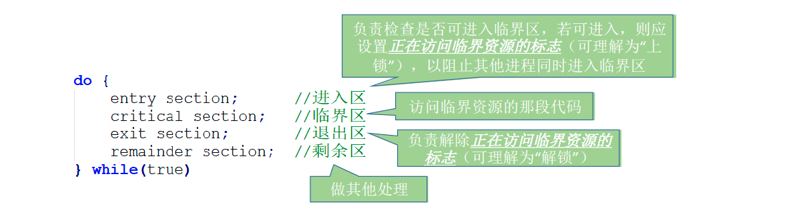
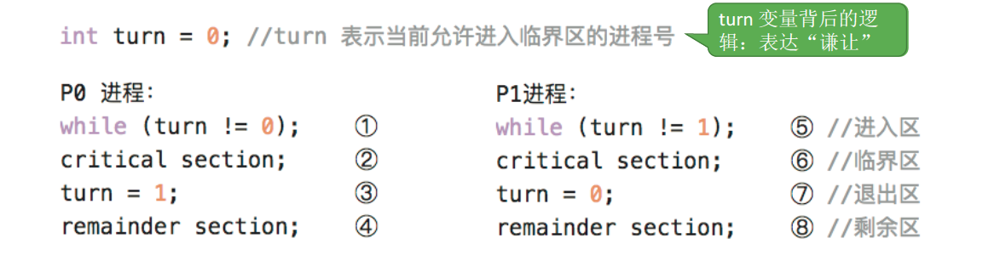
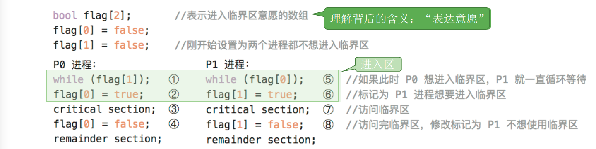
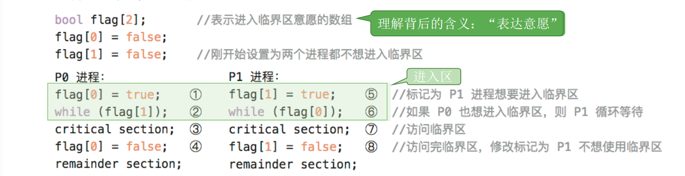
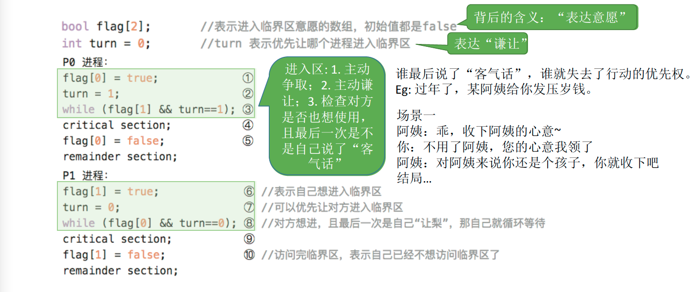
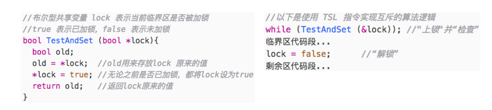
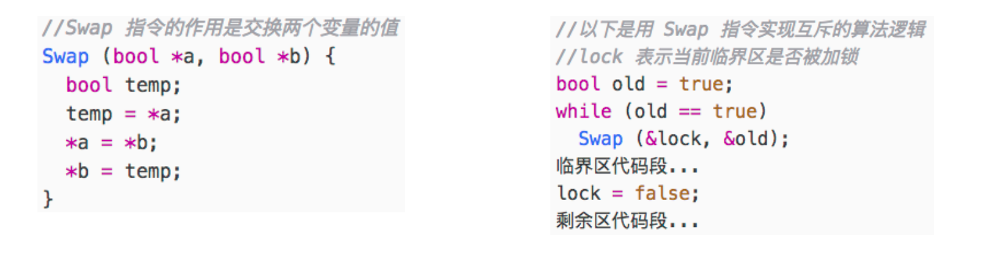

# 进程同步互斥

## 进程同步的概念

同步亦称直接制约关系，它是指为完成某种任务而建立的两个或多个进程，这些进程因为需要在某些位置上协调它们的工作次序而产生的制约关系。进程间的直接制约关系就是源于它们之间的相互合作。

## 进程互斥的概念

进程的“并发”需要“共享”的支持。各个并发执行的进程不可避免的需要共享一些系统资源（比如内存，又比如打印机、摄像头这样的I/O设备）

### 两种资源共享方式

### 互斥共享方式

系统中的某些资源，虽然可以提供给多个进程使用，但一个时间段内只允许一个进程访问该资源

### 同时共享方式

系统中的某些资源，允许一个时间段内由多个进程“同时”对它们进行访问

### 临界资源

我们把一个时间段内只允许一个进程使用的资源称为临界资源。许多物理设备（比如摄像头、打印机）都属于临界资源。此外还有许多变量、数据、内存缓冲区等都属于临界资源。对临界资源的访问，必须互斥地进行。互斥，亦称间接制约关系。进程互斥指当一个进程访问某临界资源时，另一个想要访问该临界资源的进程必须等待。当前访问临界资源的进程访问结束，释放该资源之后，另一个进程才能去访问临界资源。

### 临界资源的互斥访问

临界区是进程中访问临界资源的代码段。

进入区和退出区是负责实现互斥的代码段。

临界区也可称为“临界段”。

### 进程互斥原则

为了实现对临界资源的互斥访问，同时保证系统整体性能，需要遵循以下原则：

1. 空闲让进。临界区空闲时，可以允许一个请求进入临界区的进程立即进入临界区；

2. 忙则等待。当已有进程进入临界区时，其他试图进入临界区的进程必须等待；

3. 有限等待。对请求访问的进程，应保证能在有限时间内进入临界区（保证不会饥饿）；

4. 让权等待。当进程不能进入临界区时，应立即释放处理机，防止进程忙等待。

## 进程互斥的软件实现方法

### 单标志法

算法思想：两个进程在访问完临界区后会把使用临界区的权限转交给另一个进程。也就是说每个进程进入临界区的权限只能被另一个进程赋予。

turn 的初值为0，即刚开始只允许0号进程进入临界区。
若P1 先上处理机运行，则会一直卡在⑤。直到P1的时间片用完，发生调度，切换P0上处理机运行。
代码①不会卡住P0，P0可以正常访问临界区，在P0访问临界区期间即时切换回P1，P1依然会卡在⑤。
只有P0 在退出区将turn 改为1后，P1才能进入临界区。因此，该算法可以实现“**同一时刻最多只允许一个进程访问临界区**”

#### 存在的问题

只能按P0 -> P1 -> P0 -> P1 -> ……这样轮流访问。这种必须“轮流访问”带来的问题是，如果此时允许进入临界区的进程是P0，而P0 一直不访问临界区，那么虽然此时临界区空闲，但是并不允许P1访问。因此，单标志法存在的主要问题是：违背“**空闲让进**”原则。

### 双标志先检查

算法思想：设置一个布尔型数组flag[]，数组中各个元素用来标记各进程想进入临界区的意愿，比如:

“flag[0] = ture”意味着0 号进程P0 现在想要进入临界区。每个进程在进入临界区之前先检查当前有没有别的进程想进入临界区，如果没有，则把自身对应的标志flag[i] 设为true，之后开始访问临界区。

#### 存在的问题

若按照①⑤②⑥③⑦….的顺序执行，P0 和P1将会同时访问临界区。因此，双标志先检查法的主要问题是：违反“**忙则等待**”原则。原因在于，进入区的“检查”和“上锁” 两个处理不是一气呵成的。“检查”后，“上锁”前可能发生进程切换。

### 双标志后检查

算法思想：双标志先检查法的改版。前一个算法的问题是先“检查”后“上锁”，但是这两个操作又无法一气呵成，因此导致了两个进程同时进入临界区的问题。因此，人们又想到先“上锁”后“检查”的方法，来避免上述问题。

#### 存在的问题

若按照①⑤②⑥….的顺序执行，P0 和P1 将都无法进入临界区。因此，双标志后检查法虽然解决了“忙则等待”的问题，但是又违背了“**空闲让进**”和“**有限等待**”原则，会因各进程都长期无法访问临界资源而产生“饥饿”现象。两个进程都争着想进入临界区，但是谁也不让谁，最后谁都无法进入临界区。

### Peterson算法

算法思想：结合双标志法、单标志法的思想。如果双方都争着想进入临界区，那可以让进程尝试“孔融让梨”（谦让）。做一个有礼貌的进程。

#### 存在的问题

Peterson 算法用软件方法解决了进程互斥问题，遵循了空闲让进、忙则等待、有限等待三个原则，但是依然**未遵循让权等待的原则**。

Peterson 算法相较于之前三种软件解决方案来说，是最好的，但依然不够好。

## 进程互斥的硬件实现方法

### 中断屏蔽方法

利用“开/关中断指令”实现（与原语的实现思想相同，即在某进程开始访问临界区到结束访问为 止都不允许被中断，也就不能发生进程切换，因此也不可能发生两个同时访问临界区的情况）

#### 优点、缺点

优点：简单、高效 

缺点：不适用于多处理机；只适用于操作系统内核进程，不适用于用户进程（因为开/关中断指令 只能运行在内核态，这组指令如果能让用户随意使用会很危险）

### TestAndSet指令

简称 TS 指令，也有地方称为 TestAndSetLock 指令，或 TSL 指令TSL 指令是用硬件实现的，执行的过程不允许被中断，只能一气呵成。以下是用C语言描述的逻辑

若刚开始 lock 是 false，则 TSL 返回的 old 值为 false，while 循环条件不满足，直接跳过循环，进入 临界区。若刚开始 lock 是 true，则执行 TLS 后 old 返回的值为 true，while 循环条件满足，会一直循环，直到当前访问临界区的进程在退出区进行“解锁”。 相比软件实现方法，TSL 指令把“上锁”和“检查”操作用硬件的方式变成了一气呵成的原子操作。

#### 优点、缺点

优点：实现简单，无需像软件实现方法那样严格检查是否会有逻辑漏洞；适用于多处理机环境。

缺点：不满足“让权等待”原则，暂时无法进入临界区的进程会占用CPU并循环执行TSL指令，从而导致“忙等”。

### Swap指令

有的地方也叫 Exchange 指令，或简称 XCHG 指令。 Swap 指令是用硬件实现的，执行的过程不允许被中断，只能一气呵成。以下是用C语言描述的逻辑

逻辑上来看 Swap 和 TSL 并无太大区别，都是先记录下此时临界区是否已经被上锁（记录在 old 变 量上），再将上锁标记 lock 设置为 true，最后检查 old，如果 old 为 false 则说明之前没有别的进程 对临界区上锁，则可跳出循环，进入临界区。

#### 优点、缺点

优点：实现简单，无需像软件实现方法那样严格检查是否会有逻辑漏洞；适用于多处理机环境 。

缺点：不满足“让权等待”原则，暂时无法进入临界区的进程会占用CPU并循环执行TSL指令，从而导致“忙等”。

