# 物理内存管理：非连续内存分配

## 非连续分配的设计目标

### 连续内存分配的缺点

 - 分配给一个程序的物理内存必须是连续的

 - 内存分配的动态修改困难

 - **内存利用率较低**

 - 有外碎片/内碎片问题

### 非连续内存分配的优点

 - 提高内存利用效率和管理灵活性**

 - 分配给一个程序的物理内存是非连续的

 - 允许共享代码和数据(共享库等)

 - 支持动态加载和动态链接

### 非连续分配需要解决的问题

 - 如何实现虚拟地址和物理地址的转换

	> - 软件实现 （灵活，开销大）
	>
	> - 硬件实现 （够用，开销小）

### 非连续分配的硬件辅助机制

- 如何选择非连续分配中的内存分块大小

> - 段式存储管理 （segmentation）
>
> - 页式存储管理 （paging）

## 分段存储管理Segmentation：

### 分段目的：

**更细粒度和灵活的分离与共享**

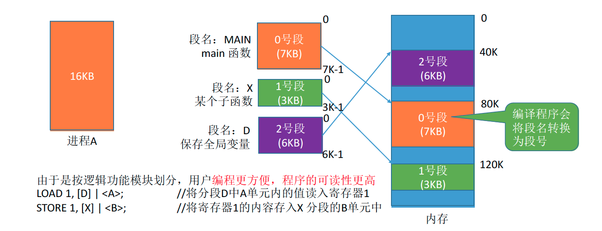

进程的地址空间：按照程序自身的逻辑关系划分为若干个段，每个段都有一个段名（在低级语言中，程序员使用段名来编程），每段从0开始编址

内存分配规则：以段为单位进行分配，每个段在内存中占据连续空间，但各段之间可以不相邻。

### 段访问机制

分段系统的逻辑地址结构由段号（段名）和段内地址（段内偏移量）所组成。

### 段访问的硬件实现

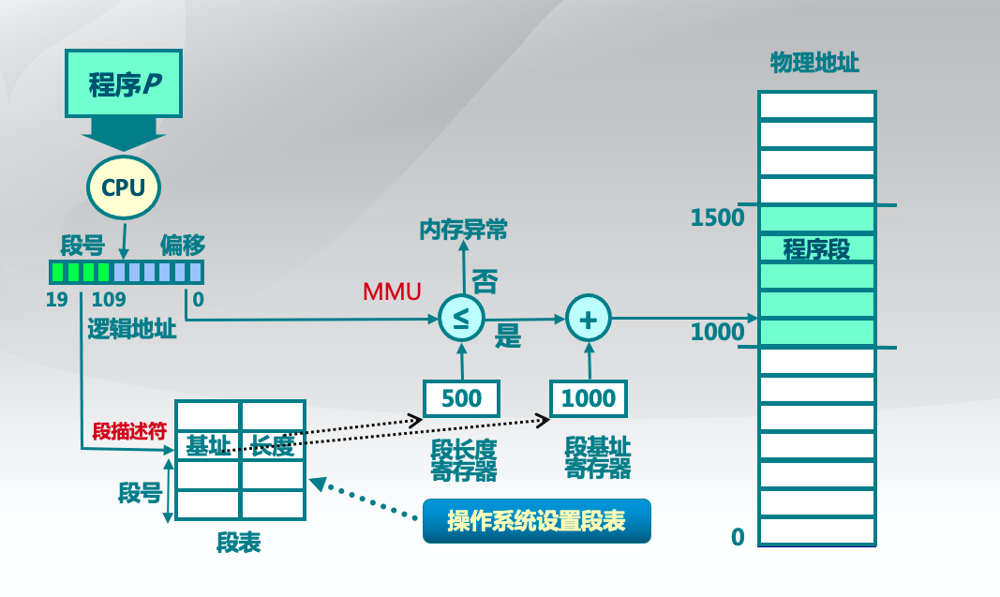

### 段表

程序分多个段，各段离散地装入内存，为了保证程序能正常运行，就必须能从物理内存中找到各个逻辑段的存放位置。为此，需为每个进程建立一张段映射表，简称“段表”。

- 每个段对应一个段表项，其中记录了该段在内存中的起始位置（又称“基址”）和段的长度。

-  各个段表项的长度是相同的。例如：某系统按字节寻址，采用分段存储管理，逻辑地址结构为（段号16位, 段内地址16位），因此用16位即可表示最大段长。物理内存大小为4GB（可用32位表示整个物理内存地址空间）。因此，可以让每个段表项占16+32 = 48位，即6B。由于段表项长度相同，因此**段号可以是隐含的，不占存储空间**。若段表存放的起始地址为M，则K号段对应的段表项存放的地址为M + K*6

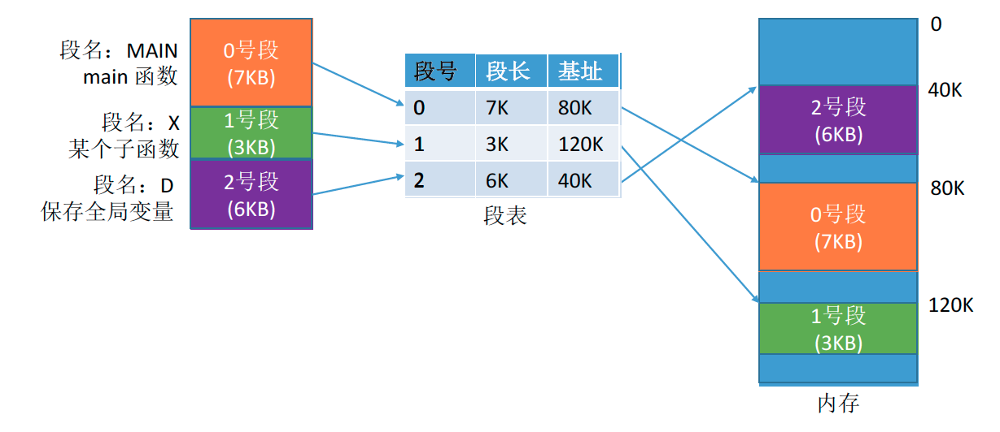

### 如何实现地址变换

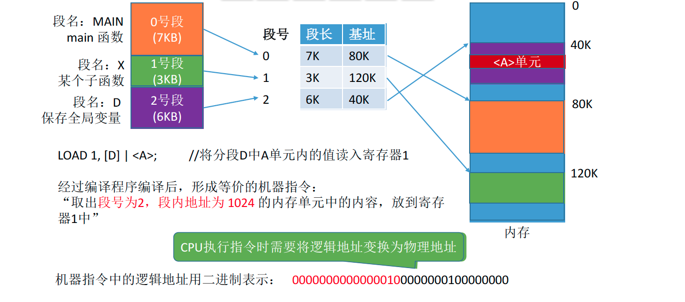

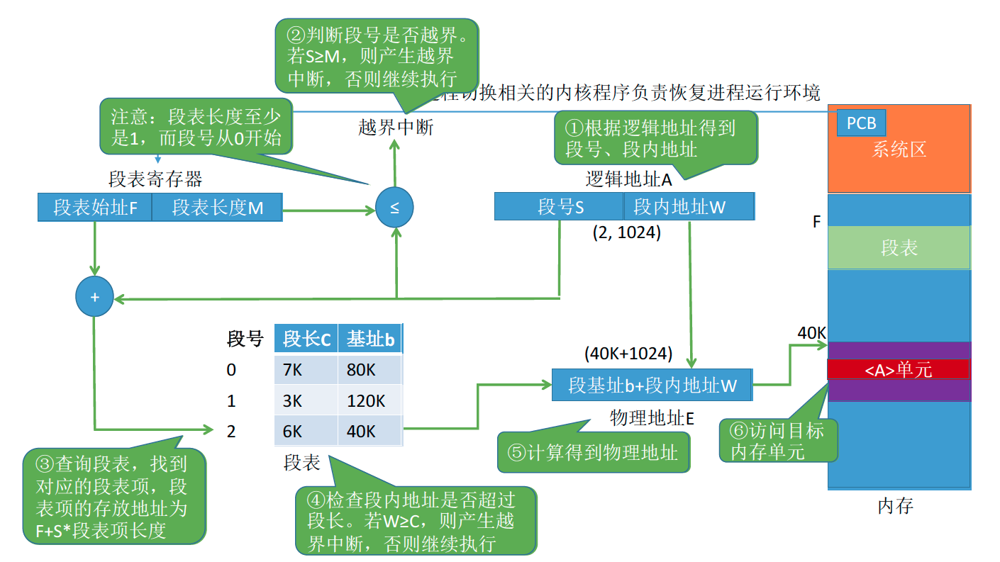

## 分页存储管理paging：

### **Page Frame** 

将内存空间分为一个个大小相等的分区（比如：每个分区4KB），每个分区就是一个“页框”（**Page Frame** 页框=页帧=内存块=物理块=物理页面）。每个页框有一个编号，即“页框号”（页框号=页帧号=内存块号=物理块号=物理页号），页框号从0开始。将进程的逻辑地址空间也分为与页框大小相等的一个个部分，每个部分称为一个“页”或“页面” 。每个页面也有一个编号，即“页号”，页号也是从0开始。

操作系统以页框为单位为各个进程分配内存空间。进程的每个页面分别放入一个页框中。也就是说，进程的页面与内存的页框有一一对应的关系。

各个页面不必连续存放，可以放到不相邻的各个页框中。（注：进程的最后一个页面可能没有一个页框那么大。也就是说，分页存储有可能产生内部碎片，因此页框不能太大，否则可能产生过大的内部碎片造成浪费）

> Tips：初学易混——页、页面vs 页框、页帧、物理页页号、页面号vs 页框号、页帧号、物理页号

### 页表

为了能知道进程的每个页面在内存中存放的位置，操作系统要为每个进程建立一张页表。

注：页表通常存在PCB（进程控制块）中

-  一个进程对应一张页表
-  进程的每个页面对应一个页表项
-  每个页表项由“页号”和“块号”组成
-  页表记录进程页面和实际存放的内存块之间的映射关系
-  每个页表项的长度是相同的

### 页号要占多少字节？

假设页表中的各页表项从内存地址为X 的地方开始连续存放…如何找到页号为i 的页表项？

i 号页表项的存放地址= X + 3*I

因此，页表中的页号可以是隐含的，即**页号不占用存储空间**（类比数组）

### 重点：每个页表项占多少字节？

## 地址转换

### 什么是“地址空间”

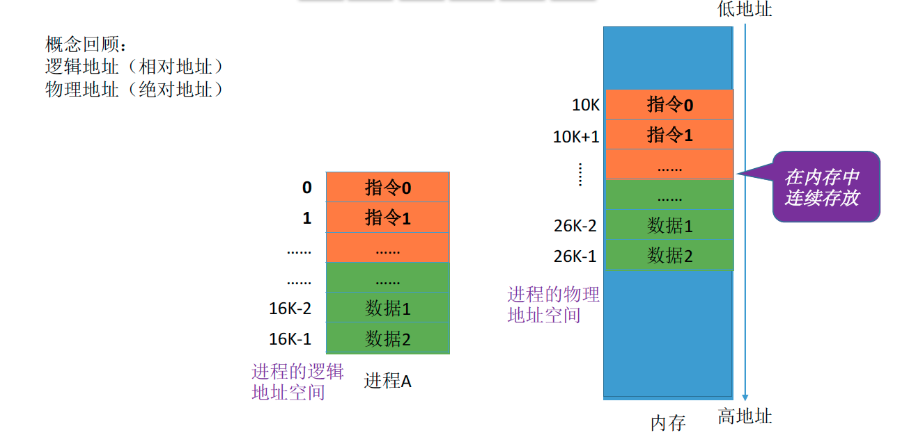

### 如何实现地址的转换？

#### 进程在内存中连续存放时，操作系统是如何实现逻辑地址到物理地址的转换的？

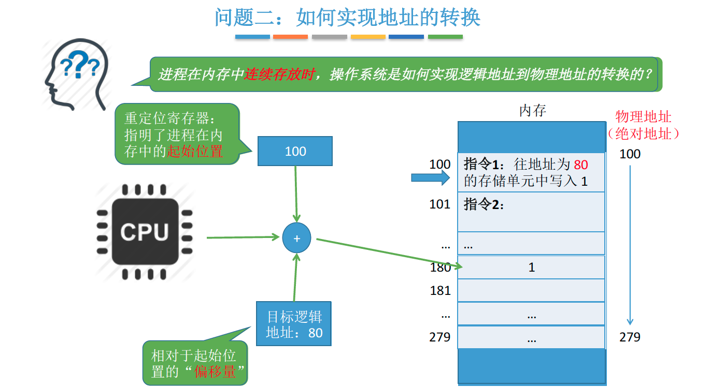

#### 将进程地址空间分页之后，操作系统该如何实现逻辑地址到物理地址的转换？

#### 如何确定一个逻辑地址对应的页号、页内偏移量？

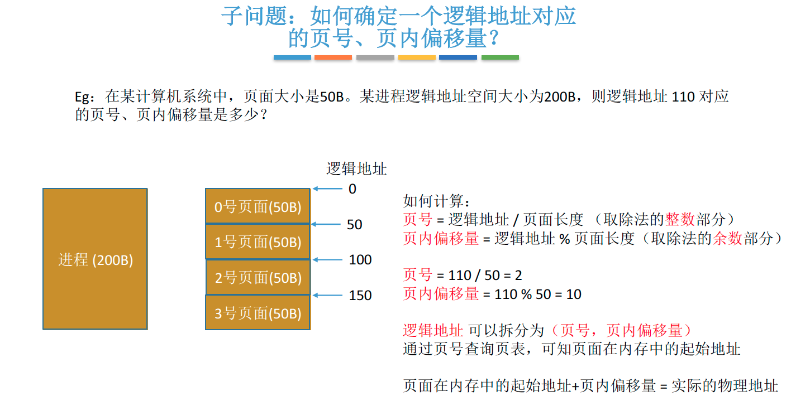

#### 如何确定一个逻辑地址对应的页号、页内偏移量？

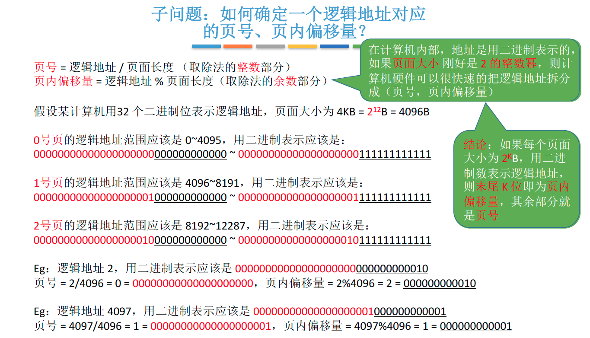

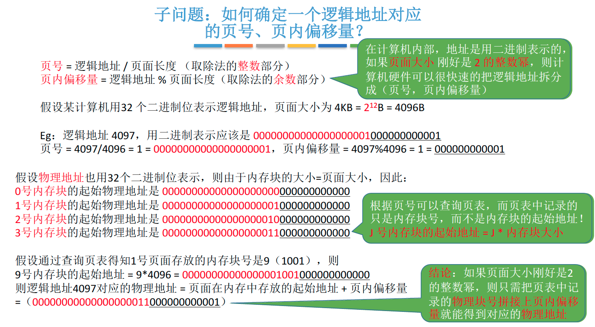

#### 为何页面大小要取2的整数幂？

在计算机内部，地址是用二进制表示的，如果页面大小刚好是2 的整数幂，则计算机硬件可以很快速的把逻辑地址拆分成（页号，页内偏移量）

##### 如何计算：

页号= 逻辑地址/ 页面长度（取除法的整数部分）

页内偏移量= 逻辑地址% 页面长度（取除法的余数部分）

##### 总结：页面大小刚好是2 的整数幂有什么好处？

- 逻辑地址的拆分更加迅速——如果每个页面大小为2KB，用二进制数表示逻辑地址，则末尾K 位即为页内偏移量，其余部分就是页号。因此，如果让每个页面的大小为2 的整数幂，计算机硬件就可以很方便地得出一个逻辑地址对应的页号和页内偏移量，而无需进行除法运算，从而提升了运行速度。

- 物理地址的计算更加迅速——根据逻辑地址得到页号，根据页号查询页表从而找到页面存放的内存块号，将二进制表示的内存块号和页内偏移量拼接起来，就可以得到最终的物理地址。

#### 逻辑地址结构

地址结构包含两个部分：前一部分为页号，后一部分为页内偏移量W。在上图所示的例子中，地址长度为32 位，其中0~11位为“页内偏移量”，或称“页内地址”；12~31 位为“页号”。

如果有K 位表示“页内偏移量”，则说明该系统中一个页面的大小是2K 个内存单元。

如果有M 位表示“页号”，则说明在该系统中，一个进程最多允许有2M 个页面。

**重点！！！：（页面大小 ↔ 页内偏移量位数 -> 逻辑地址结构）**

Tips：有些奇葩题目中页面大小有可能不是2的整数次幂，这种情况还是得用最原始的方法计算：

> 页号= 逻辑地址/ 页面长度（取除法的整数部分）
>
> 页内偏移量= 逻辑地址% 页面长度（取除法的余数部分）

## 基本地址变换机构

基本地址变换机构可以借助进程的页表将逻辑地址转换为物理地址。

通常会在系统中设置一个页表寄存器（PTR），存放页表在内存中的起始地址F 和页表长度M。

进程未执行时，页表的始址和页表长度放在进程控制块（PCB）中，当进程被调度时，操作系统内核会把它们放到页表寄存器中。

注意：页面大小是2的整数幂

设页面大小为L，逻辑地址A到物理地址E的变换过程如下：

1. 计算页号P 和页内偏移量W（ 如果用十进制数手算，则P=A/L，W=A%L；但是在计算机实际运行时，逻辑地址结构是固定不变的，因此计算机硬件可以更快地得到二进制表示的页号、页内偏移量）
2. 比较页号P 和页表长度M，若P≥M，则产生越界中断，否则继续执行。（注意：页号是从0开始的，而页表长度至少是1，因此P=M 时也会越界）
3. 页表中页号P对应的页表项地址= 页表起始地址F + 页号P * 页表项长度，取出该页表项内容b，即为内存块号。（注意区分页表项长度、页表长度、页面大小的区别。页表长度指的是这个页表中总共有几个页表项，即总共有几个页；页表项长度指的是每个页表项占多大的存储空间；页面大小指的是一个页面占多大的存储空间）
4. 计算E = b * L + W，用得到的物理地址E 去访存。（如果内存块号、页面偏移量是用二进制表示的，那么把二者拼接起来就是最终的物理地址了）

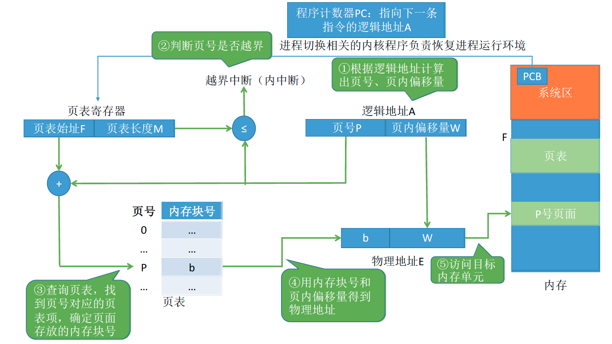

例：若页面大小L 为1K 字节，页号2对应的内存块号b = 8，将逻辑地址A=2500 转换为物理地址E。

等价描述：某系统按字节寻址，逻辑地址结构中，页内偏移量占10位（说明一个页面的大小为2的10次方 B = 1KB），页号2对应的内存块号b = 8，将逻辑地址A=2500 转换为物理地址E。

①计算页号、页内偏移量    页号P = A/L = 2500/1024 = 2； 页内偏移量W = A%L = 2500%1024 = 452

②根据题中条件可知，页号2没有越界，其存放的内存块号b = 8

③物理地址E = b * L + W = 8 * 1024 + 425 = 8644

在分页存储管理（页式管理）的系统中，只要确定了每个页面的大小，逻辑地址结构就确定了。因此，页式管理中地址是一维的。即，只要给出一个逻辑地址，系统就可以自动地算出页号、页内偏移量两个部分，并不需要显式地告诉系统这个逻辑地址中，页内偏移量占多少位。

### 对页表项大小的进一步探讨

每个页表项的长度是相同的，页号是“隐含”的

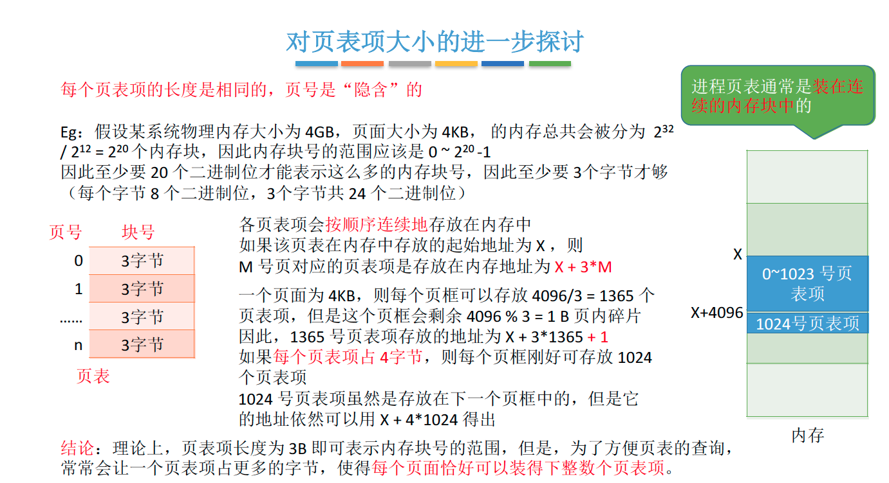

## 具有快表的地址变换机构

### 什么是快表（TLB）

快表，又称联想寄存器（TLB， translation lookaside buffer ），是一种访问速度比内存快很多的高速缓存（TLB不是内存！），用来存放最近访问的页表项的副本，可以加速地址变换的速度。与此对应，内存中的页表常称为慢表。

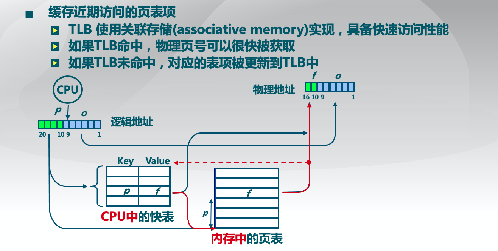

### 引入快表后，地址的变换过程

1.  CPU给出逻辑地址，由某个硬件算得页号、页内偏移量，将页号与快表中的所有页号进行比较。
2.  如果找到匹配的页号，说明要访问的页表项在快表中有副本，则直接从中取出该页对应的内存块号，再将内存块号与页内偏移量拼接形成物理地址，最后，访问该物理地址对应的内存单元。因此，若快表命中，则访问某个逻辑地址**仅需一次访存**即可。
3. 如果没有找到匹配的页号，则需要访问内存中的页表，找到对应页表项，得到页面存放的内存块号，再将内存块号与页内偏移量拼接形成物理地址，最后，访问该物理地址对应的内存单元。因此，若快表未命中，则访问某个逻辑地址需要两次访存（注意：在找到页表项后，应同时将其存入快表，以便后面可能的再次访问。但若快表已满，则必须按照一定的算法对旧的页表项进行替换）由于查询快表的速度比查询页表的速度快很多，因此只要快表命中，就可以节省很多时间。因为局部性原理，一般来说快表的命中率可以达到90% 以上。

例：某系统使用基本分页存储管理，并采用了具有快表的地址变换机构。访问一次快表耗时1us，访问一次内存耗时100us。若快表的命中率为90%，那么访问一个逻辑地址的平均耗时是多少？
          (1+100) * 0.9 + (1+100+100) * 0.1 = 111 us
    有的系统**支持快表和慢表同时查找**，如果是这样，平均耗时应该是(1+100) * 0.9 + (100+100) * 0.1 =110.9 us
    若未采用快表机制，则访问一个逻辑地址需要100+100 = 200us

显然，**引入快表机制后，访问一个逻辑地址的速度快多了**。

### 局部性原理

#### 时间局部性：

如果执行了程序中的某条指令，那么不久后这条指令很有可能再次执行；如果某个数据被访问过，不久之后该数据很可能再次被访问。（因为程序中存在大量的循环）

#### 空间局部性：

一旦程序访问了某个存储单元，在不久之后，其附近的存储单元也很有可能被访问。（因为很多数据在内存中都是连续存放的）

> 在基本地址变换机构中，每次要访问一个逻辑地址，都需要查询内存中的页表。由于局部性原理，可能连续很多次查到的都是同一个页表项

## 多级页表

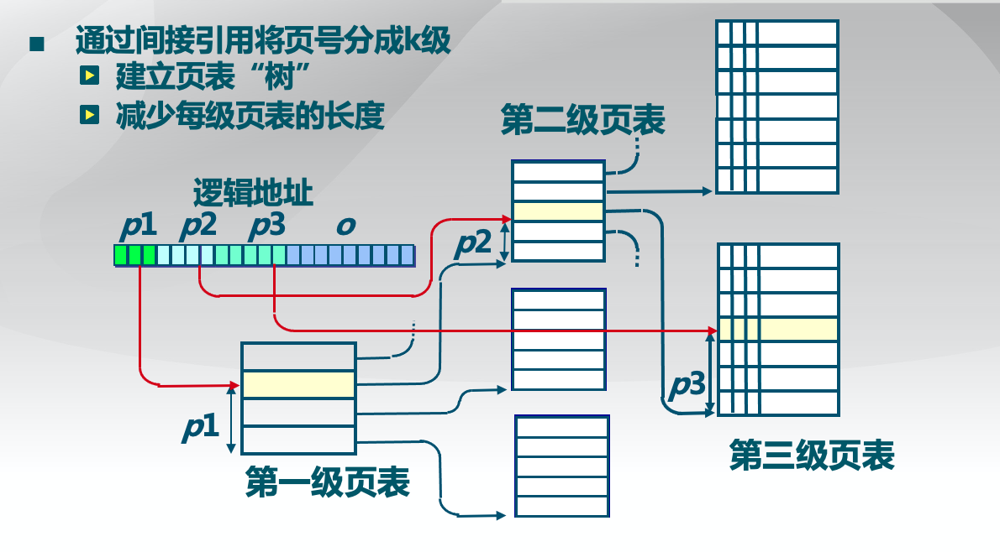

### 如何解决单级页表的问题

#### 问题一：页表必须连续存放，因此当页表很大时，需要占用很多个连续的页框。

- 把页表再分页并离散存储，然后再建立一张页表记录页表各个部分的存放位置，称为页目录表，或称外层页表，或称顶层页表
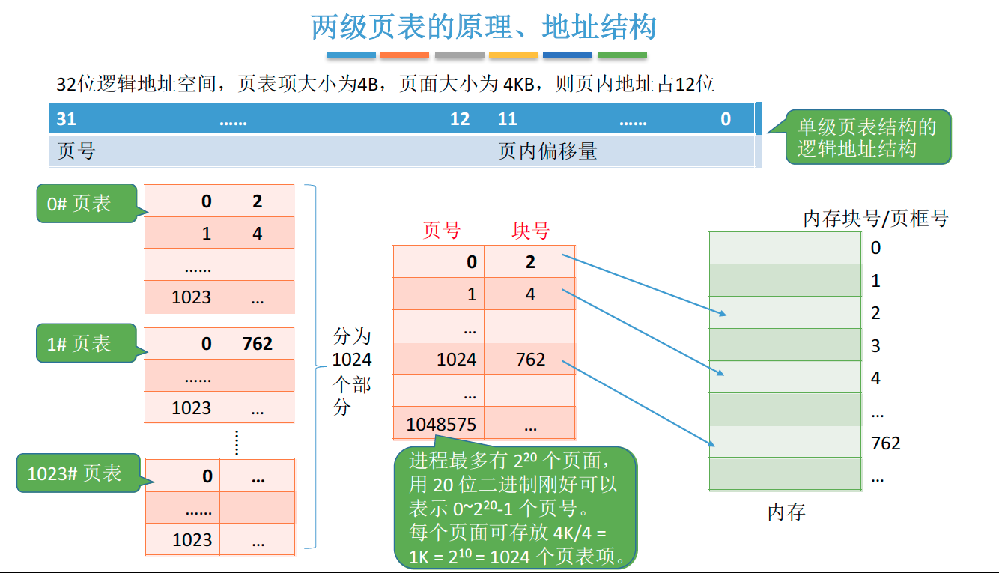
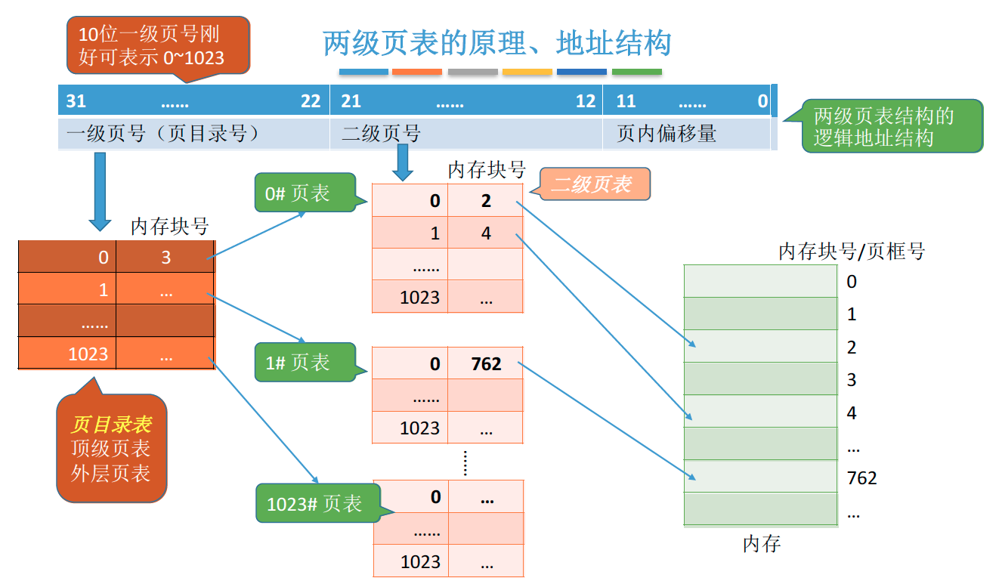
#####  如何实现地址变换
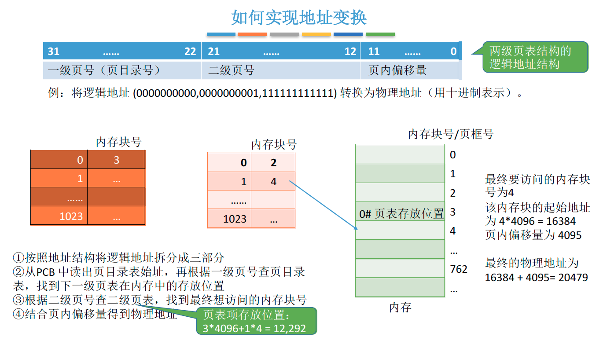

#### 问题二：根据局部性原理可知，很多时候，进程在一段时间内只需要访问某几个页面就可以正常运行了。没有必要让整个页表都常驻内存。
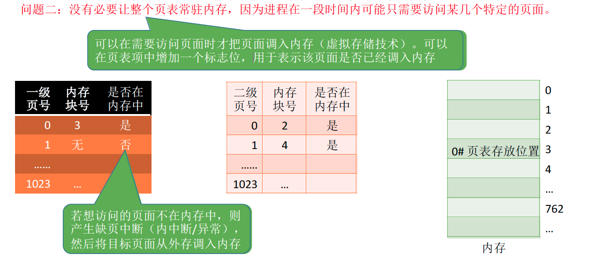

### 需要注意的几个细节

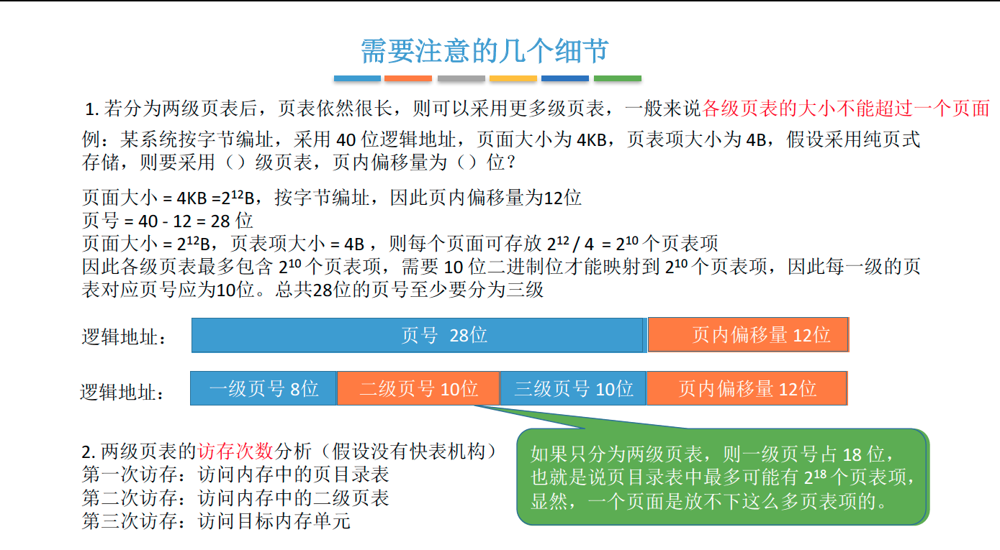

### 反置页表

基于Hash映射值查找对应页表项中的帧号

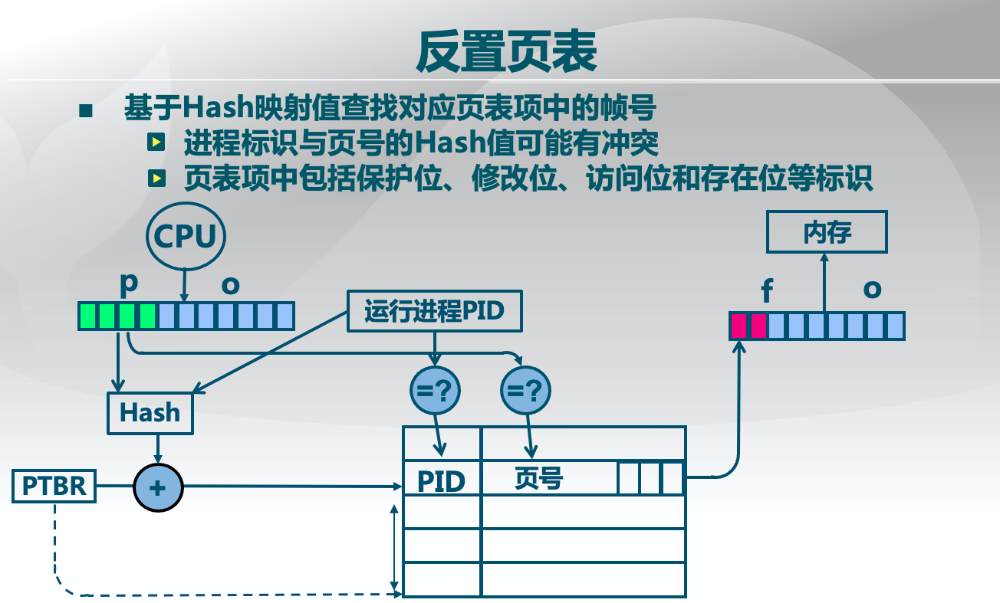

#### 反置页表的Hash冲突

## 分段、分页管理的对比

页是信息的物理单位。分页的主要目的是为了实现离散分配，提高内存利用率。分页仅仅是系统管理上的需要，完全是系统行为，**对用户是不可见**的。

段是信息的逻辑单位。分页的主要目的是更好地满足用户需求。一个段通常包含着一组属于一个逻辑模块的信息。分段对用户是可见的，用户编程时需要显式地给出段名。

页的大小固定且由系统决定。段的长度却不固定，决定于用户编写的程序。

分页的用户进程地址空间是一维的，程序员只需给出一个记忆符即可表示一个地址。

分段的用户进程地址空间是二维的，程序员在标识一个地址时，既要给出段名，也要给出段内地址。

分段比分页更容易实现信息的共享和保护。不能被修改的代码称为纯代码或可重入代码（不属于临界资源），这样的代码是可以共享的。可修改的代码是不能共享的

访问一个逻辑地址需要几次访存？

分页（单级页表）：第一次访存——查内存中的页表，第二次访存——访问目标内存单元。总共两次访存

分段：第一次访存——查内存中的段表，第二次访存——访问目标内存单元。总共两次访存与分页系统类似，分段系统中也可以引入快表机构，将近期访问过的段表项放到快表中，这样可以少一次访问，加快地址变换速度。

## 段页式存储管理方式

### 分页、分段的优缺点分析

|          | 优点                                                     | 缺点                                                         |
| -------- | -------------------------------------------------------- | ------------------------------------------------------------ |
| 分页管理 | 内存空间利用率高，不会产生外部碎片，只会有少量的页内碎片 | 不方便按照逻辑模块实现信息的共享和保护                       |
| 分段管理 | 很方便按照逻辑模块实现信息的共享和保护                   | 如果段长过大，为其分配很大的连续空间会很不方便。另外，段式管理会产生外部碎片（分段管理中产生的外部碎片也可以用“紧凑”来解决，只是需要付出较大的时间代价） |

### 分段+分页=段页式管理

将进程按逻辑模块分段，再将各段分页（如每个页面4KB）再将内存空间分为大小相同的内存块/页框/页帧/物理块进程前将各页面分别装入各内存块中

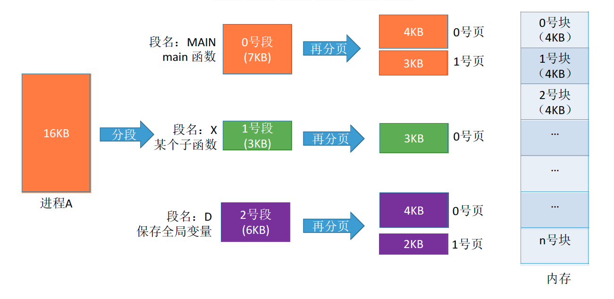

### 段页式管理的逻辑地址结构

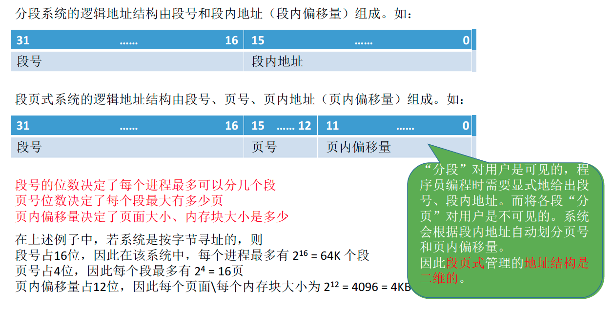
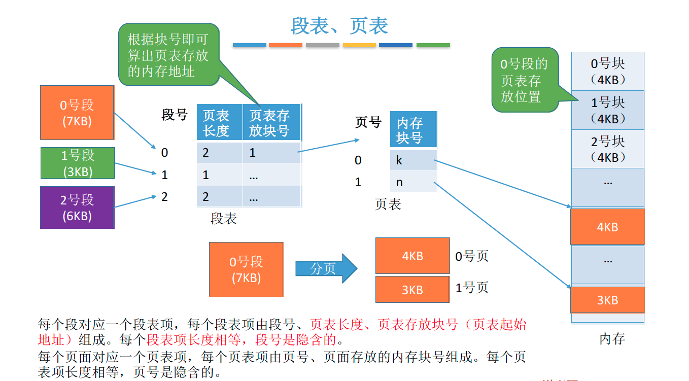
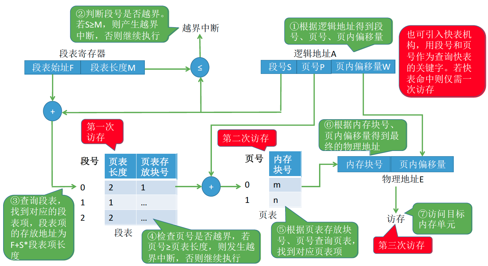