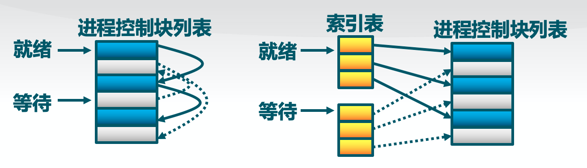
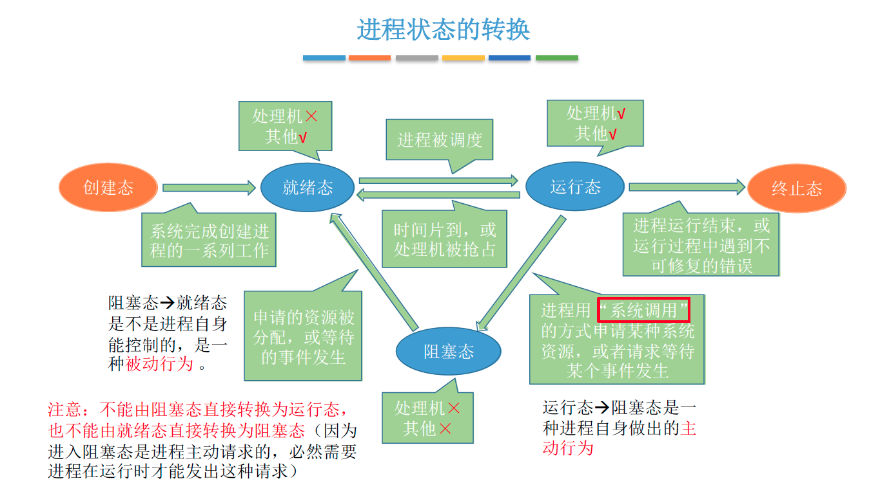
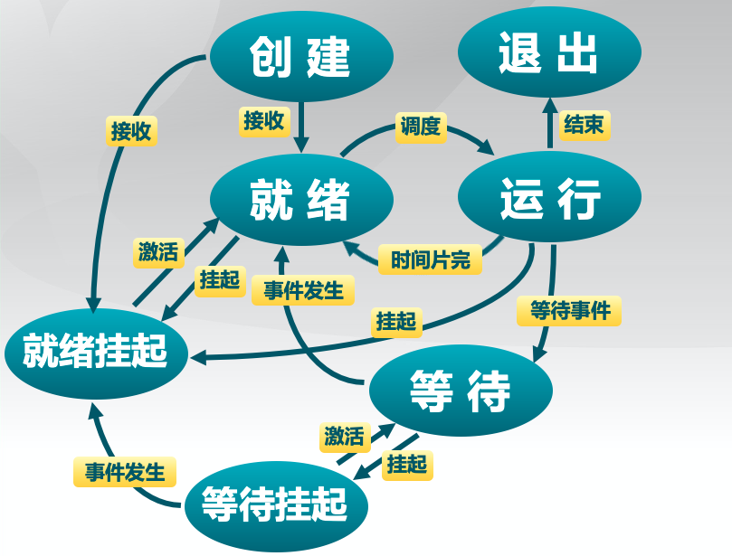

# 进程和线程

## 进程的定义

进程是指一个具有一定独立功能的程序在一个数据集合上的一次动态执行过程。同一个程序多次执行会对应多个进程。

## 进程的组成

进程包含了正在运行的一个程序的**所有状态信息**

- 代码
- 数据
- 状态寄存器
  - CPU状态CR0、指令指针IP
- 通用寄存器
  - AX、BX、CX。。。
- 进程占用系统资源
  - 打开文件、已分配内存。。。

这些信息都被保存在一个数据结构PCB （Process Control Block）中，即进程控制块

操作系统需要对各个并发运行的进程进行管理，但凡管理时所需要的信息，都会被放在PCB中。

### 进程控制块（PCB，Process Control Block）

PCB是进程存在的唯一标志，当进程被创建时，操作系统为其创建PCB，当进程结束时，会回收其PCB。

进程PCB中，会有一个变量state 来表示进程的当前状态。如：1表示创建态、2表示就绪态、3表示运行态…

为了对同一个状态下的各个进程进行统一的管理，操作系统会将各个进程的PCB组织起来。

### 进程实体(进程映像)的组成

程序段、数据段、PCB三部分组成了进程实体（进程映像）

进程是动态的，进程实体（进程映像）是静态的。进程实体反应了进程在某一时刻的状态

引入进程实体的概念后，可把进程定义为：

进程是进程实体的运行过程，是系统进行资源分配和调度【一个进程被“调度”，就是指操作系统决定让这个进程上CPU运行】的一个独立单位。

## 进程的特点

- 动态性
  进程的**最基本特征**。进程是程序的一次执行过程，是动态地产生、变化和消亡的
- 并发性
  内存中有多个进程实体，各进程可以并行执行
- 独立性
  进程是能独立运行、**独立获得资源、独立接受调度的基本单位**
- 异步性
  各进程按各自独立的、不可预测的速度向前推进，异步性会导致并发程序执行结果的不确定性，操作系统要提供“进程同步机制”来解决异步问题
- 结构性
  每一个进程都会配置PCB，结构上看，进程由程序段、数据段、PCB组成

## 进程控制块的组织

### 链表

同一状态的进程其PCB成一链表，多个状态对应多个不同的链表，各状态的进程形成不同的链表：就绪链表、阻塞链表。

### 索引表

同一状态的进程归入一个索引表（由索引指向PCB），多个状态对应多个不同的索引表。各状态的进行形成不同的索引表：就绪索引表、阻塞索引表

## 进程的生命周期

### 进程创建

**引起进程创建的情况：**

- 系统初始化时
- 用户请求创建一个新进程
- 正在运行的进程执行了创建进程的系统调用

### 进程执行

内核选择一个就绪的进程，让它占用处理机并执行

### 进程等待（阻塞）

**进程进入等待(阻塞)的情况：**

- 请求并等待系统服务，无法马上完成
- 启动某种操作，无法马上完成
- 需要的数据没有到达

只有进程自身才能知道何时需要等待某种事件的发生

### 进程抢占

**进程会被抢占的情况：**

- 高优先级进程就绪
- 进程执行当前时间用完

### 进程唤醒

**唤醒进程的情况：**

- 被阻塞进程需要的资源可被满足
- 被阻塞进程等待的事件到达

进程只能被别的进程或操作系统唤醒

### 进程结束

**进程结束的情况：**

- 正常退出(自愿的)
- 错误退出(自愿的)
- 致命错误(强制性的)
- 被其他进程所杀(强制性的)

进程正在被创建时，它的状态是“创建态”，在这个阶段操作系统会为进程分配资源、初始化PCB。当进程创建完成后，便进入“就绪态”，处于就绪态的进程已经具备运行条件，但由于没有空闲CPU，就暂时不能运行。系统中可能会有很多个进程都处于就绪态。当CPU空闲时，操作系统就会选择一个就绪进程，让它上处理机运行。如果一个进程此时在CPU上运行，那么这个进程处于“运行态”。CPU会执行该进程对应的程序（执行指令序列）。在进程运行的过程中，可能会请求等待某个事件的发生（如等待某种系统资源的分配，或者等待其他进程的响应）。在这个事件发生之前，进程无法继续往下执行，此时操作系统会让这个进程下CPU，并让它进入“阻塞态”当CPU空闲时，又会选择另一个“就绪态”进程上CPU运行。一个进程可以执行exit 系统调用，请求操作系统终止该进程。此时该进程会进入“终止态”，操作系统会让该进程下CPU，并回收内存空间等资源，最后还要回收该进程的PCB。当终止进程的工作完成之后，这个进程就彻底消失了。

## 进程切换

### 三种基本状态

单CPU情况下，同一时刻只会有一个进程处于运行态，多核CPU情况下，可能有多个进程处于运行态.

### 进程挂起

处在挂起状态的进程映像在磁盘上，目的**是减少进程占用内存**

#### 等待挂起状态（Blocked-suspend）：

进程在外存并等待某事件的出现

#### 就绪挂起状态（Ready-suspend）：

进程在外存，但只要进入内存，即可运行

#### 与挂起相关的状态转换

挂起(Suspend)：把一个进程从内存转到外存

##### 等待到等待挂起

没有进程处于就绪状态或就绪进程要求更多内存资源

##### 就绪到就绪挂起

当有高优先级等待（系统认为会很快就绪的）进程和低优先级就绪进程

##### 运行到就绪挂起

对抢先式分时系统，当有高优先级等待挂起进程因事件出现而进入就绪挂起

##### 在外存时的状态转换

###### 等待挂起到就绪挂起

当有等待挂起进程因相关事件出现

##### 激活（Activate）：

把一个进程从外存转到内存

###### 就绪挂起到就绪

没有就绪进程或挂起就绪进程优先级高于就绪进程

###### 等待挂起到等待

当一个进程释放足够内存，并有高优先级等待挂起进程

------

## 线程的定义

线程是进程的一部分，描述指令流执行状态。它是进程中的指令执行流的最小单元，是CPU调度的基本单位。

**进程的资源分配角色：**进程由一组相关资源构成，包括地址空间（代码段、数据段）、打开的文件等各种资源

**线程的处理机调度角色：**线程描述在进程资源环境中的指令流执行状态

## 线程的优点

- 一个进程中可以同时存在多个线程
- 各个线程之间可以并发地执行
- 各个线程之间可以共享地址空间和文件等资源

## 线程的缺点

一个线程崩溃，会导致其所属进程的所有线程崩溃

## 线程与进程的比较 

- 进程是资源分配单位，线程是CPU调度单位
- 进程拥有一个完整的资源平台，而线程只独享指令流执行的必要资源，如寄存器和栈
- 线程具有就绪、等待和运行三种基本状态和状态间的转换关系
- 线程能减少并发执行的时间和空间开销
	
	- 线程的创建时间比进程短
	- 线程的终止时间比进程短
	- 同一进程内的线程切换时间比进程短
	- 由于同一进程的各线程间共享内存和文件资源，可不通过内核进行直接通信
	
## 用户线程

在用户空间实现的线程机制，不依赖于操作系统的内核；由一组用户级的线程库函数来完成线程的管理，包括线程的创建/终止/同步/调度等；

**优点：**

- 不需要操作系统
	- 内核了解用户线程的存在
	- 可用于不支持线程技术的多进程操作系统；
- 在用户空间实现的线程机制
	- 每个进程都需要它私有的线程控制块TCB列表，来跟踪记录它各个线程的状态信息(PC/栈指针/寄存器)
	- TCB由线程库函数来维护；
- 同一进程内的用户线程切换速度快
	- 用户线程的切换由线程库函数实现，无需 用户态/核心态切换，所以速度快；
- 允许每个进程有自定义的线程调度算法。

**缺点：**

- 如果一个线程发起系统调用而阻塞，则整个进程都在等待；
- 不支持基于线程的处理机抢占
	- 除非当前运行线程主动放弃，它所在进程的其他线程无法抢占CPU
- 只能按进程分配CPU时间
	- 多个线程进程中，每个线程的时间片较少

## 内核进程

由内核通过系统调用实现的线程机制，由内核完成线程的创建、终止和管理

**内核线程的特征**：

- 由内核维护PCB和TCB
- 线程执行系统调用而被阻塞不影响其他线程
- 线程的创建、终止和切换相对较大
	
	- 通过系统调用/内核函数，在内核实现
- 以线程为单位进行CPU时间分配
	
	- 多线程的进程可获得更多CPU时间
	
	

## 轻权进程(LightWeight Process)

内核支持的用户线程。一个进程可有一个或多个轻量级进程，每个轻权进程由一个单独的内核线程来支持。（Solaris/Linux）

## 多线程模型

在支持内核级线程的系统中，根据用户级线程和内核级线程的映射关系，可以划分为几种多线程模型

### 一对一模型：

一个用户级线程映射到一个内核级线程。每个用户进程有与用户级线程同数量的内核级线程。

**优点：**当一个线程被阻塞后，别的线程还可以继续执行，并发能力强。多线程可在多核处理机上并行执行。

**缺点：**一个用户进程会占用多个内核级线程，线程切换由操作系统内核完成，需要切换到核心态，因此线程管理的成本高，开销大。

### 多对一模型：

多个用户级线程映射到一个内核级线程。且一个进程只被分配一个内核级线程。

**优点：**用户级线程的切换在用户空间即可完成，不需要切换到核心态，线程管理的系统开销小，效率高

**缺点：**当一个用户级线程被阻塞后，整个进程都会被阻塞，并发度不高。多个线程不可在多核处理机上并行运行

重点重点重点：

操作系统只“看得见”内核级线程，因此只有**内核级线程才是处理机分配的单位。**

### 多对多模型：

n 用户及线程映射到m 个内核级线程（n >= m）。每个用户进程对应m 个内核级线程。克服了多对一模型并发度不高的缺点（一个阻塞全体阻塞），又克服了一对一模型中一个用户线程库 进程占用太多内核级线程，开销太大的缺点。

可以这么理解：

用户级线程是“代码逻辑”的载体，内核级线程是“运行机会”的载体。

【内核级线程才是处理机分配的单位。例如：多核CPU环境下，左边这个进程最多能被分配两个核。】

一段“代码逻辑”只有获得了“运行机会”才能被CPU执行

【内核级线程中可以运行任意一个有映射关系的用户级线程代码，只有两个内核级线程中正在运行的代码逻辑都阻塞时，这个进程才会阻塞】

