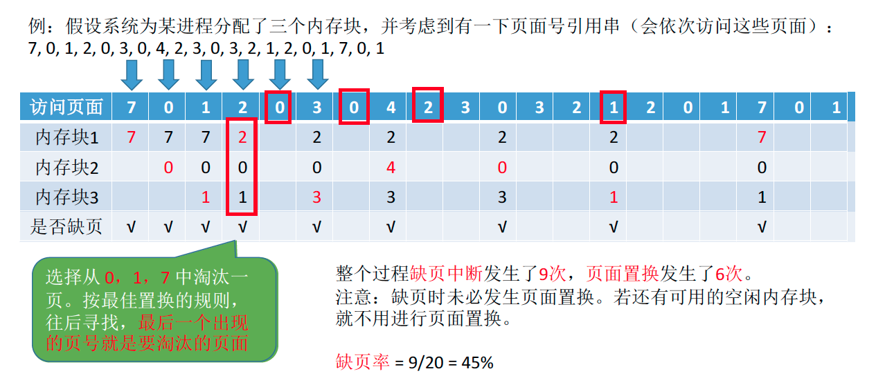
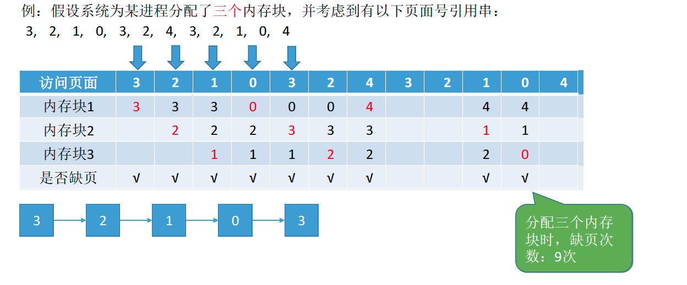
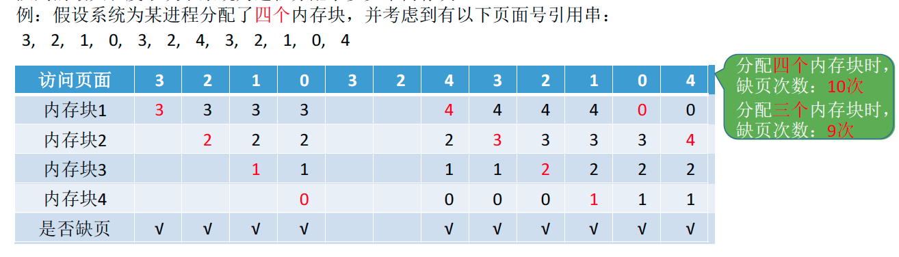
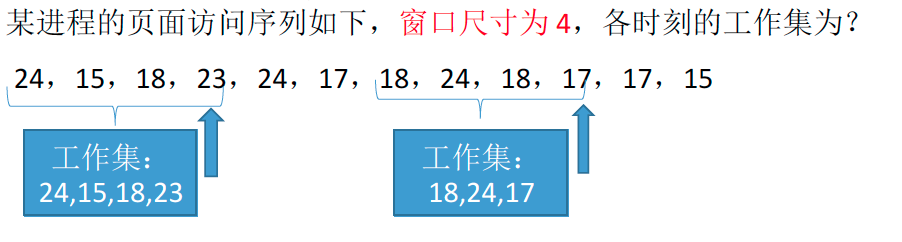

# 页面置换算法与页面分配策略

## 页面置换算法

在程序执行过程中，当所访问的信息不在内存时，由操作系统负责将所需信息从外存调入内存，然后继续执行程序。

若内存空间不够，由操作系统负责将内存中暂时用不到的信息换出到外存。（此时使用页面置换算法决定应该换出哪个页面）

页面的换入、换出需要磁盘 I/O，会有较大的开销，因此好的页面置换算法应该追求更少的缺页率。

### 最佳置换算法（OPT）

最佳置换算法（OPT，Optimal）：每次选择**淘汰的页面**将是**以后永不使用**，或者**在最长时间内不再被访问的页面**，这样可以保证最低的缺页率。

最佳置换算法可以保证最低的缺页率，但实际上，只有在进程执行的过程中才能知道接下来会访问到的是哪个页面。操作系统无法提前预判页面访问序列。因此，最佳置换算法是无法实现的。

### 先进先出置换算法（FIFO）

先进先出置换算法（FIFO）：每次选择淘汰的页面是最早进入内存的页面实现方法：把调入内存的页面根据调入的先后顺序排成一个队列，需要换出页面时选择队头页面即可。 队列的最大长度取决于系统为进程分配了多少个内存块。

**Belady 异常**——当为进程分配的物理块数增大时，缺页次数不减反增的异常现象。

 只有 FIFO 算法会产生 Belady 异常。另外，FIFO算法虽然实现简单，但是该算法与进程实际运行时的规律不适应，因为先进入的页面也有可能最经常被访问。因此，算法性能差。

### 最近最久未使用置换算法（LRU）

最近最久未使用置换算法（LRU , least recently used）：每次淘汰的页面是最近最久未使用的页面实现方法：赋予每个页面对应的页表项中，用访问字段记录该页面自上次被访问以来所经历的时间t。 当需要淘汰一个页面时，选择现有页面中 t 值最大的，即最近最久未使用的页面。(该算法的实现需要专门的硬件支持，虽然算法性能好，但是实现困难，开销大。)

### 时钟置换算法（CLOCK）

最佳置换算法性能最好，但无法实现；先进先出置换算法实现简单，但算法性能差；最近最久未使用 置换算法性能好，是最接近OPT算法性能的，但是实现起来需要专门的硬件支持，算法开销大。 时钟置换算法是一种性能和开销较均衡的算法，又称CLOCK算法，或最近未用算法（NRU，Not Recently Used）。

 简单的CLOCK 算法实现方法：为每个页面设置一个访问位，再将内存中的页面都通过链接指针链接成 一个循环队列。当某页被访问时，其访问位置为1。当需要淘汰一个页面时，只需检查页的访问位。 如果是0，就选择该页换出；如果是1，则将它置为0，暂不换出，继续检查下一个页面，若第一轮扫描中所有页面都是1，则将这些页面的访问位依次置为0后，再进行第二轮扫描（第二轮扫描中一定会有访问位为0的页面，因此简单的CLOCK 算法选择一个淘汰页面最多会经过两轮扫描）

### 改进型的时钟置换算法

简单的时钟置换算法仅考虑到一个页面最近是否被访问过。事实上，如果被淘汰的页面没有被修改过， 就不需要执行I/O操作写回外存。**只有被淘汰的页面被修改过时，才需要写回外存。**因此，除了考虑一个页面最近有没有被访问过之外，操作系统还应考虑页面有没有被修改过。在其他条件都相同时，应优先淘汰没有修改过的页面，避免I/O操作。这就是改进型的时钟置换算法的思想。 

修改位=0，表示页面没有被修改过；修改位=1，表示页面被修改过。为方便讨论，用（访问位，修改位）的形式表示各页面状态。如（1，1）表示一个页面近期被访问过， 且被修改过。 

| 算法规则：将所有可能被置换的页面排成一个循环队列 |      |
| ------------------------------------------------------------ | --------------------------------------- |
| 第一轮：从当前位置开始扫描到第一个（0,0）的帧用于替换。本轮扫描不修改任何标志位 | 第一优先级：最近没访问， 且没修改的页面 |
| 第二轮：若第一轮扫描失败，则重新扫描，查找第一个（0,	1）的帧用于替换。本轮将所有扫描过的帧访问位设为0 | 第二优先级：最近没访问， 但修改过的页面 |
| 第三轮：若第二轮扫描失败，则重新扫描，查找第一个（0,	0）的帧用于替换。本轮扫描不修改任何标志位。 | 第三优先级：最近访问过， 但没修改的页面 |
| 第四轮：若第三轮扫描失败，则重新扫描，查找第一个（0,	1）的帧用于替换。 由于第二轮已将所有帧的访问位设为0，因此经过第三轮、第四轮扫描一定会有一个帧被选中，因此改进型CLOCK置换算法选择一个淘汰页面最多会进行四轮扫描。 | 第四优先级：最近访问过， 且修改过的页面 |

### 四种算法对比

|                          | 算法规则                                                     | 优缺点                                            |
| ------------------------ | ------------------------------------------------------------ | ------------------------------------------------- |
| OPT                      | 优先淘汰最长时间内不会被访问的页面                           | 缺页率最小，性能最好； 但无法实现                 |
| FIFO                     | 优先淘汰最先进入内存的页面                                   | 实现简单；但性能很差，可能出现Belady异常          |
| LRU                      | 优先淘汰最近最久没访问的页面                                 | 性能很好；但需要硬件支持，算法开销大              |
| CLOCK（NRU）             | 循环扫描各页面 第一轮淘汰访问位 = 0的，并将扫描过的页面访问位改为1。若第一轮没选中，则进行第二轮扫描。 | 实现简单，算法开销小； 但未考虑页面是否被修改过。 |
| 改进型CLOCK（改进型NRU） | 若用（访问位, 修改位）的形式表述，则  第一轮：淘汰（0, 0）  第二轮：淘汰（0, 1），并将扫描过的页面访问位都置为0 第三轮：淘汰（0, 0）  第四轮：淘汰（0, 1） |   算法开销较小，性能也不错。            |

## 页面分配策略

### 页面分配、置换策略

#### 驻留集：

指请求分页存储管理中给进程分配的物理块的集合。

在采用了虚拟存储技术的系统中，驻留集大小一般小于进程的总大小。 若驻留集太小，会导致缺页频繁，系统要花大量的时间来处理缺页，实际用于进程推进的时间很少；若驻留集太大，又会导致多道程序并发度下降，资源利用率降低。所以应该选择一个合适的驻留集大小。

【 考虑一个极端情况，若某进程共有100个页面，则该进程的驻留集大小为100时进程可以全部放入内存，运行期间不可能再发生缺页。若驻留集大小为1，则进程运行期间必定会极频繁地缺页。】

#### 固定分配：

操作系统为每个进程分配一组固定数目的物理块，在进程运行期间不再改变。即，**驻留集大小不变**

#### 可变分配：

先为每个进程分配一定数目的物理块，在进程运行期间，可根据情况做适当的增加或减少。即，**驻留集大小可变**

#### 局部置换：

发生缺页时只能选进程自己的物理块进行置换。

#### 全局置换：

可以将操作系统保留的空闲物理块分配给缺页进程，也可以将别的进程持有的物理块置换到外存，再分配给缺页进程。

### 固定分配局部置换：

系统为每个进程分配一定数量的物理块，在整个运行期间都不改变。若进程在运行中发生缺页，则只能从该进程在内存中的页面中选出一页换出，然后再调入需要的页面。这种策略的缺点是：很难在刚开始就确定应为每个进程分配多少个物理块才算合理。（采用这种策略的系统可以根据进程大小、优先级、或是根据程序员给出的参数来确定为一个进程分配的内存块数）

### 可变分配全局置换：

刚开始会为每个进程分配一定数量的物理块。操作系统会保持一个空闲物理块队列。当某进程发生缺页时，从空闲物理块中取出一块分配给该进程；若已无空闲物理块，则可选择一个**未锁定** *【Tips: 系统会锁定一些页面中的内容不能置换出外存（如：重要的内核数据可以设为锁定）】* 的页面换出外存，再将该物理块分配给缺页的进程。采用这种策略时，只要某进程发生缺页，都将获得新的物理块，仅当空闲物理块用完时，系统才选择一个未锁定的页面调出。被选择调出的页可能是系统中任何一个进程中的页，因此这个被选中的进程拥有的物理块会减少，缺页率会增加。

> 只要缺页就给分配新物理块

### 可变的分配局部置换：

刚开始会为每个进程分配一定数量的物理块。当某进程发生缺页时，只允许从该进程自己的物理块中选出一个进行换出外存。如果进程在运行中频繁地缺页，系统会为该进程多分配几个物理块，直至该进程缺页率趋势适当程度；反之，如果进程在运行中缺页率特别低，则可适当减少分配给该进程的物理块。

> 要根据发生缺页的频率来动态地增加或减少进程的物理块

## 何时调入页面

### 预调页策略：

根据局部性原理（主要指空间局部性），一次调入若干个相邻的页面可能比一次调入一个页面更高效。但如果提前调入的页面中大多数都没被访问过，则又是低效的。因此可以预测不久之后可能访问到的页面，将它们预先调入内存，但目前预测成功率只有50%左右。故这种策略主要用于进程的首次调入，由程序员指出应该先调入哪些部分。

> 运行前调入

### 请求调页策略：

进程在运行期间发现缺页时才将所缺页面调入内存。由这种策略调入的页面一定会被访问到，但由于每次只能调入一页，而每次调页都要磁盘I/O操作，因此I/O开销较大。

>  运行后调入

## 从何处调入页面

1. 系统拥有足够的对换区空间：页面的调入、调出都是在内存与对换区之间进行，这样可以保证页面的调入、调出速度很快。在进程运行前，需将进程相关的数据从文件区复制到对换区。
2. 系统缺少足够的对换区空间：凡是不会被修改的数据都直接从文件区调入，由于这些页面不会被修改，因此换出时不必写回磁盘，下次需要时再从文件区调入即可。对于可能被修改的部分，换出时需写回磁盘对换区，下次需要时再从对换区调入。
3.  UNIX 方式：运行之前进程有关的数据全部放在文件区，故未使用过的页面，都可从文件区调入。若被使用过的页面需要换出，则写回对换区，下次需要时从对换区调入。

## 抖动（颠簸）现象

刚刚换出的页面马上又要换入内存，刚刚换入的页面马上又要换出外存，这种频繁的页面调度行为称为抖动，或颠簸。产生抖动的主要原因是进程频繁访问的页面数目高于可用的物理块数（分配给进程的物理块不够）。

为进程分配的物理块太少，会使进程发生抖动现象。为进程分配的物理块太多，又会降低系统整体的并发度，降低某些资源的利用率。

为了研究为应该为每个进程分配多少个物理块，Denning 提出了进程“工作集”的概念

## 工作集

驻留集：指请求分页存储管理中给进程分配的内存块的集合。

工作集：指在某段时间间隔里，进程实际访问页面的集合。

操作系统会根据“窗口尺寸”来算出工作集。

工作集大小可能小于窗口尺寸，实际应用中，操作系统可以统计进程的工作集大小，根据工作集大小给进程分配若干内存块。如：窗口尺寸为5，经过一段时间的监测发现某进程的工作集最大为3，那么说明该进程有很好的局部性，可以给这个进程分配3个以上的内存块即可满足进程的运行需要。一般来说，**驻留集大小不能小于工作集大小，否则进程运行过程中将频繁缺页。**

拓展：基于局部性原理可知，进程在一段时间内访问的页面与不久之后会访问的页面是有相关性的。因此，可以根据进程近期访问的页面集合（工作集）来设计一种页面置换算法——选择一个不在工作集中的页面进行淘汰。

