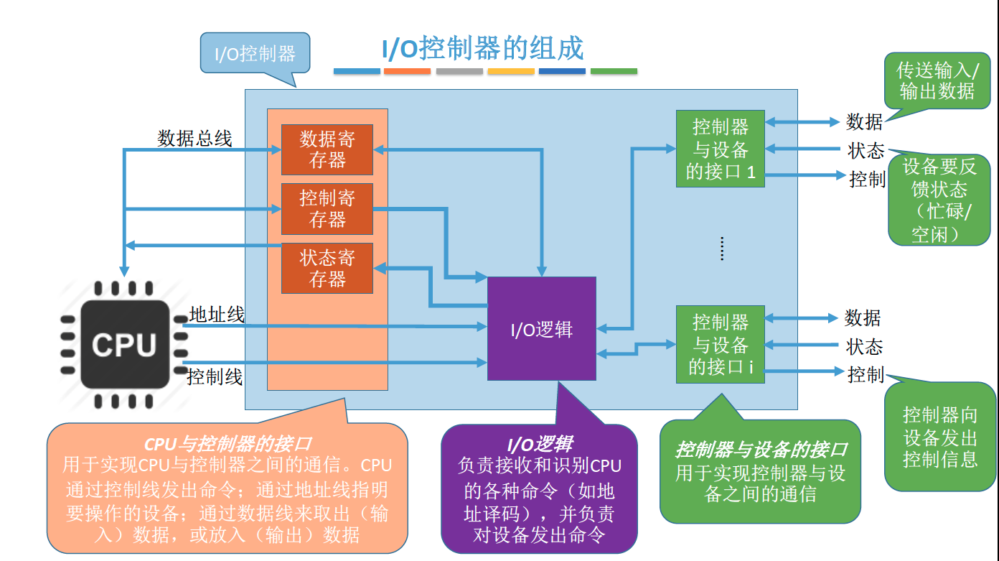

# I/O设备的机械部件

I/O设备的机械部件主要用来执行具体I/O操作。

如我们看得见摸得着的鼠标/键盘的按钮；显示器的LED屏；移动硬盘的磁臂、磁盘盘面。

I/O设备的电子部件通常是一块插入主板扩充槽的印刷电路板。

## I/O设备的电子部件（I/O控制器）

CPU无法直接控制I/O设备的机械部件，因此I/O设备还要有一个电子部件作为CPU和I/O设备机械部件之间的“中介”，用于实现CPU对设备的控制。

这个电子部件就是I/O控制器，又称设备控制器。CPU可控制I/O控制器，又由I/O控制器来控制设备的机械部件

I/O控制器的组成

值得注意的小细节：①一个I/O控制器可能会对应多个设备；

②数据寄存器、控制寄存器、状态寄存器可能有多个（如：每个控制/状态寄存器对应一个具体的设备），且这些寄存器都要有相应的地址，才能方便CPU操作。有的计算机会让这些寄存器占用内存地址的一部分，称为内存映像I/O；另一些计算机则采用I/O专用地址，即寄存器独立编址。

## 内存映像I/O v.s. 寄存器独立编址

# I/O控制方式

## 程序直接控制方式

## 中断驱动方式

引入中断机制。由于I/O设备速度很慢，因此在CPU发出读/写命令后，可将等待I/O的进程阻塞，先切换到别的进程执行。当I/O完成后，控制器会向CPU发出一个中断信号，CPU检测到中断信号后，会保存当前进程的运行环境信息，转去执行中断处理程序处理该中断。处理中断的过程中，CPU从I/O控制器读一个字的数据传送到CPU寄存器，再写入主存。接着，CPU恢复等待I/O的进程（或其他进程）的运行环境，然后继续执行。

## DMA方式

与“中断驱动方式”相比，DMA方式（Direct Memory Access，直接存储器存取。主要用于块设备的I/O控制）有这样几个改进：

①数据的传送单位是“块”。不再是一个字、一个字的传送；

②数据的流向是从设备直接放入内存，或者从内存直接到设备。不再需要CPU作为“快递小哥”。

③仅在传送一个或多个数据块的开始和结束时，才需要CPU干预。

## 通道控制方式

通道：通道可以识别并执行一系列通道指令

## 总结

### 优缺点：

每一个阶段的优点都是解决了上一阶段的最大缺点。总体来说，整个发展过程就是要尽量减少CPU对I/O过程的干预，把CPU从繁杂的I/O控制事务中解脱出来，以便更多地去完成数据处理任务。

|                  | 完成一次读/写的过程                                          | CPU干预频率 | 每次I/O的数据传输单位 | 数据流向                              |
| ---------------- | ------------------------------------------------------------ | ----------- | --------------------- | ------------------------------------- |
| 程序直接控制方式 | CPU发出I/O命令后需要不断轮询                                 | 极高        | 字                    | 设备->CPU->内存  内存->CPU->设备 |
| 中断驱动方式     | CPU发出I/O命令后可以做其他事，本次I/O完成后设备控制器发出中断信号 | 高          | 字                    | 设备->CPU->内存  内存->CPU->设备 |
| DMA方式          | CPU发出I/O命令后可以做其他事，本次I/O完成后DMA控制器发出中断信号 | 中          | 块                    | 设备->内存  内存->设备           |
| 通道控制方式     | CPU发出I/O命令后可以做 其他事。通道会执行通道程序以完成I/O，完成后通道向CPU发出中断信号 | 低          | 一组字                | 设备->内存  内存->设备           |

# I/O软件层次结构

### 设备独立性软件

设备独立性软件需要通过“逻辑设备表（LUT，Logical UnitTable）”来确定逻辑设备对应的物理设备，并找到该设备对应的设备驱动程序

操作系统系统可以采用两种方式管理逻辑设备表（LUT）：

第一种方式，整个系统只设置一张LUT，这就意味着所有用户不能使用相同的逻辑设备名，因此这种方式只适用于单用户操作系统。

第二种方式，为每个用户设置一张LUT，各个用户使用的逻辑设备名可以重复，适用于多用户操作系统。系统会在用户登录时为其建立一个用户管理进程，而LUT就存放在用户管理进程的PCB中。

## 总结

最常考的是设备独立性软件、设备驱动程序这两层。只需理解一个特点即可：直接涉及到硬件具体细节、且与中断无关的操作肯定是在设备驱动程序层完成的；没有涉及硬件的、对各种设备都需要进行的管理工作都是在设备独立性软件层完成的）

# I/O核心子系统

## I/O调度

I/O调度：用某种算法确定一个好的顺序来处理各个I/O请求。

如：磁盘调度（先来先服务算法、最短寻道优先算法、SCAN算法、C-SCAN算法、LOOK算法、C-LOOK算法）。当多个磁盘I/O请求到来时，用某种调度算法确定满足I/O请求的顺序。同理，打印机等设备也可以用先来先服务算法、优先级算法、短作业优先等算法来确定I/O调度顺序。

## 设备保护

操作系统需要实现文件保护功能，不同的用户对各个文件有不同的访问权限（如：只读、读和写等）。

在UNIX系统中，设备被看做是一种特殊的文件，每个设备也会有对应的FCB。当用户请求访问某个设备时，系统根据FCB中记录的信息来判断该用户是否有相应的访问权限，以此实现“设备保护”的功能。（参考“文件保护”）

## 假脱机技术（SPOOLing技术）

### 脱机技术

批处理阶段引入了脱机输入/输出技术（用磁带完成）

引入脱机技术后，缓解了CPU与慢速I/O设备的速度矛盾。另一方面，即使CPU在忙碌，也可以提前将数据输入到磁带；即使慢速的输出设备正在忙碌，也可以提前将数据输出到磁带。

### 假脱机技术——输入井和输出井

### 假脱机技术——输入进程和输出进程

要实现SPOOLing技术，必须要有多道程序技术的支持。系统会建立“输入进程”和“输出进程”。

### 假脱机技术——输入/输出缓冲区

# 设备的分配与回收

## 设备分配时考虑的因素

### 设备的固有属性

设备的固有属性可分为三种：独占设备、共享设备、虚拟设备。

- 独占设备——一个时段只能分配给一个进程（如打印机）

- 共享设备——可同时分配给多个进程使用（如磁盘），各进程往往是宏观上同时共享使用设备，而微观上交替使用。

- 虚拟设备——采用SPOOLing技术将独占设备改造成虚拟的共享设备，可同时分配给多个进程使用（如采用SPOOLing技术实现的共享打印机）

### 设备分配算法

先来先服务

优先级高者优先

短任务优先

……

### 设备分配中的安全性

从进程运行的安全性上考虑，设备分配有两种方式：

安全分配方式：为进程分配一个设备后就将进程阻塞，本次I/O完成后才将进程唤醒。（eg：考虑进程请求打印机打印输出的例子）

【一个时段内每个进程只能使用一个设备

优点：破坏了“请求和保持”条件，不会死锁

缺点：对于一个进程来说，CPU和I/O设备只能串行工作】

不安全分配方式：进程发出I/O请求后，系统为其分配I/O设备，进程可继续执行，之后还可以发出新的I/O请求。只有某个I/O请求得不到满足时才将进程阻塞。

【一个进程可以同时使用多个设备

优点：进程的计算任务和I/O任务可以并行处理，使进程迅速推进

缺点：有可能发生死锁（死锁避免、死锁的检测和解除）】

## 静态分配和动态分配

静态分配：进程运行前为其分配全部所需资源，运行结束后归还资源【破坏了“请求和保持”条件，不会发生死锁】

动态分配：进程运行过程中动态申请设备资源

## 设备分配管理中的数据结构

### 设备控制表（DCT）：

系统为每个设备配置一张DCT，用于记录设备情况

注：“进程管理”章节中曾经提到过“系统会根据阻塞原因不同，将进程PCB挂到不同的阻塞队列中”

### 控制器控制表（COCT）：

每个设备控制器都会对应一张COCT。操作系统根据COCT的信息对控制器进行操作和管理。

### 通道控制表（CHCT）：

每个通道都会对应一张CHCT。操作系统根据CHCT的信息对通道进行操作和管理。

### 系统设备表（SDT）：

记录了系统中全部设备的情况，每个设备对应一个表目。

## 设备分配的步骤

1. 根据进程请求的物理设备名查找SDT（注：物理设备名是进程请求分配设备时提供的参数）
2. 根据SDT找到DCT，若设备忙碌则将进程PCB挂到设备等待队列中，不忙碌则将设备分配给进程。
3. 根据DCT找到COCT，若控制器忙碌则将进程PCB挂到控制器等待队列中，不忙碌则将控制器分配给进程。
4. 根据COCT找到CHCT，若通道忙碌则将进程PCB挂到通道等待队列中，不忙碌则将通道分配给进程。

### 缺点：

1. 用户编程时必须使用“物理设备名”，底层细节对用户不透明，不方便编程
2. 若换了一个物理设备，则程序无法运行
3. 若进程请求的物理设备正在忙碌，则即使系统中还有同类型的设备，进程也必须阻塞等待

改进方法：建立逻辑设备名与物理设备名的映射机制，用户编程时只需提供逻辑设备名

## 设备分配步骤的改进方法

1. 根据进程请求的逻辑设备名查找SDT（注：用户编程时提供的逻辑设备名其实就是“设备类型”）
2. 查找SDT，找到用户进程指定类型的、并且空闲的设备，将其分配给该进程。操作系统在逻辑设备表（LUT）中新增一个表项。
3. 根据DCT找到COCT，若控制器忙碌则将进程PCB挂到控制器等待队列中，不忙碌则将控制器分配给进程。
4. 根据COCT找到CHCT，若通道忙碌则将进程PCB挂到通道等待队列中，不忙碌则将通道分配给进程。

逻辑设备表（LUT）建立了逻辑设备名与物理设备名之间的映射关系。

某用户进程第一次使用设备时使用逻辑设备名向操作系统发出请求，操作系统根据用户进程指定的设备类型（逻辑设备名）查找系统设备表，找到一个空闲设备分配给进程，并在LUT中增加相应表项。

如果之后用户进程再次通过相同的逻辑设备名请求使用设备，则操作系统通过LUT表即可知道用户进程实际要使用的是哪个物理设备了，并且也能知道该设备的驱动程序入口地址。

逻辑设备表的设置问题：

整个系统只有一张LUT：各用户所用的逻辑设备名不允许重复，适用于单用户操作系统

每个用户一张LUT：不同用户的逻辑设备名可重复，适用于多用户操作系统

# 缓冲区管理

缓冲区是一个存储区域，可以由专门的硬件寄存器组成，也可利用内存作为缓冲区。

使用**硬件作为缓冲区的成本较高**，容量也较小，一般仅用在对速度要求非常高的场合（如存储器管理中所用的联想寄存器，由于对页表的访问频率极高，因此使用速度很快的联想寄存器来存放页表项的副本）

一般情况下，更多的是利用内存作为缓冲区，“设备独立性软件”的缓冲区管理就是要组织管理好这些缓冲区

## 缓冲区的作用

- 缓和CPU与I/O设备之间速度不匹配的矛盾
- 减少对CPU的中断频率，放宽对CPU中断响应时间的限制
- 解决数据粒度不匹配的问题
- 提高CPU与I/O设备之间的并行性

## 单缓冲

假设某用户进程请求某种块设备读入若干块的数据。若采用单缓冲的策略，操作系统会在主存中为其分配一个缓冲区（若题目中没有特别说明，一个缓冲区的大小就是一个块）。

注意：当缓冲区数据非空时，不能往缓冲区冲入数据，只能从缓冲区把数据传出；当缓冲区为空时，可以往缓冲区冲入数据，但必须把缓冲区充满以后，才能从缓冲区把数据传出。

结论：采用单缓冲策略，处理一块数据平均耗时Max(C, T)+M

## 双缓冲

假设某用户进程请求某种块设备读入若干块的数据。若采用双缓冲的策略，操作系统会在主存中为其分配两个缓冲区（若题目中没有特别说明，一个缓冲区的大小就是一个块）

双缓冲题目中，假设初始状态为：工作区空，其中一个缓冲区满，另一个缓冲区空

结论：采用双缓冲策略，处理一个数据块的平均耗时为Max (T, C+M)

## 使用单/双缓冲在通信时的区别

若两个相互通信的机器只设置单缓冲区，在任一时刻只能实现数据的单向传输。

若两个相互通信的机器设置双缓冲区，则同一时刻可以实现双向的数据传输。

注：管道通信中的“管道”其实就是缓冲区。要实现数据的双向传输，必须设置两个管道

## 循环缓冲

将多个大小相等的缓冲区链接成一个循环队列。

## 缓冲池

缓冲池由系统中共用的缓冲区组成。这些缓冲区按使用状况可以分为：空缓冲队列、装满输入数据的缓冲队列（输入队列）、装满输出数据的缓冲队列（输出队列）。

另外，根据一个缓冲区在实际运算中扮演的功能不同，又设置了四种工作缓冲区：用于收容输入数据的工作缓冲区（hin）、用于提取输入数据的工作缓冲区（sin）、用于收容输出数据的工作缓冲区（hout）、用于提取输出数据的工作缓冲区（sout）

①输入进程请求输入数据

②计算进程想要取得一块输入数据

③计算进程想要将准备好的数据冲入缓冲区

④输出进程请求输出数据

