# 信号量机制

用户进程可以通过使用操作系统提供的一对原语来对信号量进行操作，从而很方便的实现了进程互斥、进程同步。

**信号量**其实就是一个变量（可以是一个整数，也可以是更复杂的记录型变量），可以用一个信号量来**表示系统中某种资源的数量**，比如：系统中只有一台打印机，就可以设置一个初值为1 的信号量。

**原语**是一种特殊的程序段，其**执行只能一气呵成，不可被中断**。原语是由**关中断/开中断**指令实现的。软件解决方案的主要问题是由“进入区的各种操作无法一气呵成”，因此如果能把进入区、退出区的操作都用“原语”实现，使这些操作能“一气呵成”就能避免问题。

一对原语：wait(S) 原语和signal(S) 原语，可以把原语理解为我们自己写的函数，函数名分别为wait和signal，括号里的信号量S 其实就是函数调用时传入的一个参数。wait、signal 原语常简称为**P、V操作**（来自荷兰语proberen 和verhogen）。因此，做题的时候常把wait(S)、signal(S) 两个操作分别写为P(S)、V(S)。

## 整型信号量

用一个整数型的变量作为信号量，用来表示系统中某种资源的数量。

Eg ：某计算机系统中有一台打印机…

```c
int S = 1; //初始化整型信号量s,表示当前系统中可用的打印机资源数

void wait (int S) { //wait 原语，相当于“进入区” 【“检查”和“上锁”一气呵成，避免了并发、异步导致的问题。】
	while(S <= 0); //如果资源数不够，就一直循环等待 【存在的问题:不满足“让权等待”原则，会发生“忙等”。】
	S = S-1; //如果资源数够，则占用一个资源
}

void signal (int S) { //signal 原语，相当于“退出区”
  S = S+1; //使用完资源后，在退出区释放资源
}

进程P0:																	进程Pn:
....																		....
wait(S); // 进入区，申请资源							wait(S);
使用打印机资源... //临界区，访问资源				 使用打印机资源...
signal(S); //退出区，释放资源							signal(S);
....																		....
```

## 记录型信号量

整型信号量的缺陷是存在“忙等”问题，因此人们又提出了“记录型信号量”，即用记录型数据结构表示的信号量。

```C
/*记录型信号量的定义*/
typedef struct {
  int value;     			//剩余资源数
  struct process *L;  //等待队列
} semaphore;

/*某进程需要使用资源时，通过wait原语申请*/
void wait(semaphore S) {
  S.value--;
  if(S.value < 0){
    block(S.L);  //如果剩余如果剩余资源数不够，使用block原语使进程从运行态进入阻塞态，并把挂到信号量S的等待队列（即阻塞队列）中。
  }
}

/*进程使用完资源后，通过signal原语释放*/
void signal (semaphore S){
  S.value++;
  if (S.value <= 0){
    wakeup(S.L);  //释放资源后，若还有别的进程在等待这种资源，则使用wakeup原语唤醒等待队列中的一个进程，该进程从阻塞态变为就绪态
  }
}

```

在考研题目中wait(S)、signal(S) 也可以记为P(S)、V(S)，这对原语可用于实现系统资源的“申请”和“释放”。

S.value 的初值表示系统中某种资源的数目。

对信号量S 的一次P操作意味着进程请求一个单位的该类资源，因此需要执行S.value--，表示资源数减1，当S.value < 0 时表示该类资源已分配完毕，因此进程应调用block 原语进行自我阻塞（当前运行的进程从运行态 - > 阻塞态），主动放弃处理机，并插入该类资源的等待队列S.L 中。可见，该机制遵循了“让权等待”原则，不会出现“忙等”现象。

对信号量S 的一次V 操作意味着进程释放一个单位的该类资源，因此需要执行S.value++，表示资源数加1，若加1后仍是S.value <= 0，表示依然有进程在等待该类资源，因此应调用wakeup 原语唤醒等待队列中的第一个进程（被唤醒进程从阻塞态à就绪态）。


## 用信机制实现进程互斥、同步、前驱关系

```c
/*记录型信号量的定义*/
typedef struct {
  int value;     			//剩余资源数
  struct process *L;  //等待队列
} semaphore;

/*信号量机制实现互斥*/
semaphore mutex = 1; //初始化信号量

P1(){
  ...
  P(mutex);    //使用临界资源前需要加锁
  临界区代码段...
  V(mutex);		 //使用临界资源后需要解锁
  ...
}

P2(){
  ...
  P(mutex);    //使用临界资源前需要加锁
  临界区代码段...
  V(mutex);		 //使用临界资源后需要解锁
  ...
}
```

1. 分析并发进程的关键活动，划定临界区（如：对临界资源打印机的访问就应放在临界区）

2. 设置互斥信号量mutex，初值为1

3. 在进入区P(mutex)——申请资源

4. 在退出区V(mutex)——释放资源

**注意**：对不同的临界资源需要设置不同的互斥信号量。P、V操作必须成对出现。缺少P(mutex) 就不能保证临界资源的互斥访问。缺少V(mutex) 会导致资源永不被释放，等待进程永不被唤醒。

## 信号量机制实现进程同步

```c
P1(){								P2(){
  代码1;							代码1;					
  代码2;							代码2;
  代码3;							代码3;
}										}
```

进程同步：要让各并发进程按要求有序地推进。比如，P1、P2 并发执行，由于存在异步性，因此二者交替推进的次序是不确定的。若P2 的“代码4”要基于P1 的“代码1”和“代码2”的运行结果才能执行，那么我们就必须保证“代码4”一定是在“代码2”之后才会执行。这就是进程同步问题，让本来异步并发的进程互相配合，有序推进。

### 如何用信号量实现进程同步：

1. 分析什么地方需要实现“同步关系”，即必须保证“**一前一后**”执行的两个操作（或两句代码）
2. 设置同步信号量S, 初始为0
3. 在“前操作”之后执行V(S)
4. 在“后操作”之前执行P(S)

【口诀：前V后P】

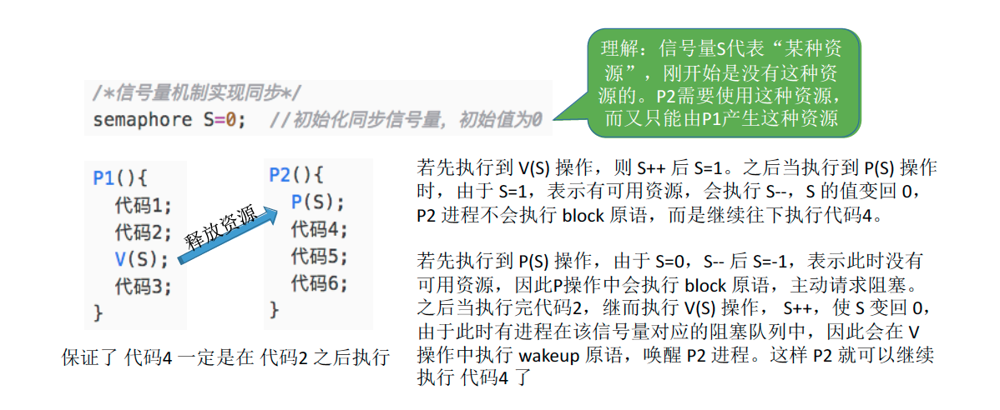

#### 例题

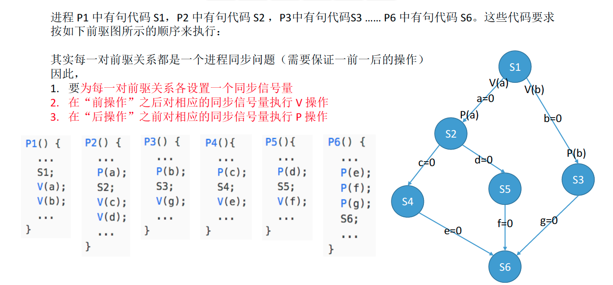


# 生产者消费者问题

## 问题描述

系统中有一组生产者进程和一组消费者进程，生产者进程每次生产一个产品放入缓冲区，消费者

进程每次从缓冲区中取出一个产品并使用。（注：这里的“产品”理解为某种数据）

生产者、消费者共享一个初始为空、大小为n的缓冲区。

只有缓冲区没满时，生产者才能把产品放入缓冲区，否则必须等待。【缓冲区没满 -> 生产者生产】

只有缓冲区不空时，消费者才能从中取出产品，否则必须等待。【缓冲区没空 -> 消费者消费】

缓冲区是临界资源，各进程必须互斥地访问。【互斥关系】

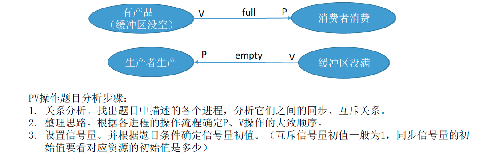

生产者、消费者共享一个初始为空、大小为n的缓冲区。

只有缓冲区没满时，生产者才能把产品放入缓冲区，否则必须等待。

只有缓冲区不空时，消费者才能从中取出产品，否则必须等待。

缓冲区是临界资源，各进程必须互斥地访问。

```c
semaphore mutex = 1; //互斥信号量，实现对缓冲区的互斥访问
semaphore empty = n; //同步信号量，表示空闲缓冲区的数量
semaphore full = 0; //同步信号量，表示产品的数量，也即非空缓冲区的数量
producer (){
	while(1){
		生产一个产品;
		P(empty);//消耗一个空闲缓冲区
		P(mutex);
		把产品放入缓冲区;
		V(mutex);
		V(full);//增加一个产品  --------------------|实现两进程的同步关系，
	}																						|是在其中一个进程中执行P，
}																							|另一个进程中执行V
consumer (){																	|
	while(1){																		|
		P(full);//消耗一个产品(非空缓冲区)				<----|
		P(mutex);
		从缓冲区取出一个产品;
		V(mutex);
		V(empty);//增加一个空闲缓冲区
		使用产品;
}
```

### 能否改变相邻P、V操作的顺序？

若将mutex 的P操作在前，若此时缓冲区内已经放满产品，则empty=0，full=n。则生产者进程执行① 使mutex变为0，再执行②，由于已没有空闲缓冲区，因此生产者被阻塞。由于生产者阻塞，因此切换回消费者进程。消费者进程执行③，由于mutex为0，即生产者还没释放对临界资源的“锁”，因此消费者也被阻塞。这就造成了生产者等待消费者释放空闲缓冲区，而消费者又等待生产者释放临界区的情况，生产者和消费者循环等待被对方唤醒，出现“死锁”。同样的，若缓冲区中没有产品，即full=0，empty=n。按③④① 的顺序执行就会发生死锁。因此，**实现互斥的P操作一定要在实现同步的P操作之后**。

**V操作不会导致进程阻塞，因此两个V操作顺序可以交换。**


# 多生产者-多消费者问题

## 问题描述

桌子上有一只盘子，每次只能向其中放入一个水果。爸爸专向盘子中放苹果，妈妈专向盘子中放橘子，儿子专等着吃盘子中的橘子，女儿专等着吃盘子中的苹果。只有盘子空时，爸爸或妈妈才可向盘子中放一个水果。仅当盘子中有自己需要的水果时，儿子或女儿可以从盘子中取出水果。用PV操作实现上述过程。

## 问题分析

桌子上有一只盘子，每次只能向其中放入一个水果。爸爸专向盘子中放苹果，妈妈专向盘子中放橘子，儿子专等着吃盘子中的橘子，女儿专等着吃盘子中的苹果。只有盘子空时，爸爸或妈妈才可向盘子中放一个水果。仅当盘子中有自己需要的水果时，儿子或女儿可以从盘子中取出水果。

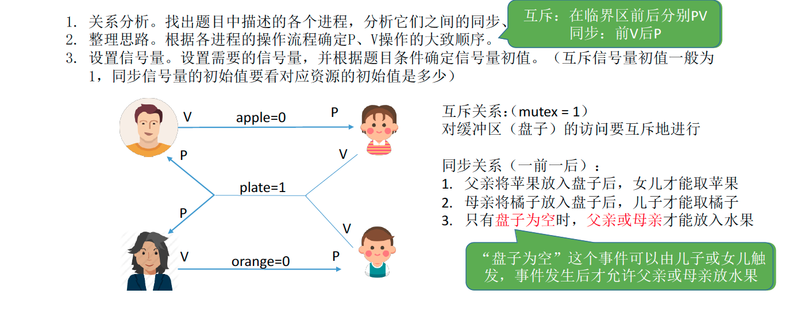

## 实现

```c
semaphore mutex = 1; //实现互斥访问盘子（缓冲区）
semaphore apple = 0; //盘子中有几个苹果
semaphore orange = 0; //盘子中有几个橘子
semaphore plate = 1; //盘子中还可以放多少个水果

dad (){
	while(1){
		准备一个苹果;
		P(plate);
		P(mutex);
		把苹果放入盘子;
		V(mutex);
		V(apple);
	}
}
mom (){
	while(1){
		准备一个橘子;
		P(plate);
		P(mutex);
		把橘子放入盘子;
		V(mutex);
		V(orange);
	}
}
daughter (){
	while(1){
		P(apple);
		P(mutex);
		从盘中取出苹果;
		V(mutex);
		V(plate);
		吃掉苹果;
	}
}
son (){
	while(1){
		P(orange);
		P(mutex);
		从盘中取出橘子;
		V(mutex);
		V(plate);
		吃掉橘子;
	}
}
```

## 可不可以不用互斥信号量？

本题中的缓冲区大小为1，在任何时刻，apple、orange、plate 三个同步信号量中最多只有一个是1。因此在任何时刻，最多只有一个进程的P操作不会被阻塞，并顺利地进入临界区。如果盘子容量为2，可能会出现了两个进程同时访问缓冲区的情况，有可能导致两个进程写入缓冲区的数据相互覆盖的情况。因此，如果缓冲区大小大于1，就必须专门设置一个互斥信号量mutex 来保证互斥访问缓冲区。

总结：在生产者-消费者问题中，如果缓冲区大小为1，那么有可能不需要设置互斥信号量就可以实现互斥访问缓冲区的功能。当然，这不是绝对的，要具体问题具体分析。

建议：在考试中如果来不及仔细分析，可以加上互斥信号量，保证各进程一定会互斥地访问缓冲区。但需要注意的是，实现互斥的P操作一定要在实现同步的P操作之后，否则可能引起“死锁”。


# 吸烟者问题

## 问题描述

假设一个系统有三个抽烟者进程和一个供应者进程。每个抽烟者不停地卷烟并抽掉它，但是要卷起并抽掉一支烟，抽烟者需要有三种材料：烟草、纸和胶水。三个抽烟者中，第一个拥有烟草、 第二个拥有纸、第三个拥有胶水。供应者进程无限地ᨀ供三种材料，供应者每次将两种材料放桌子上，拥有剩下那种材料的抽烟者卷一根烟并抽掉它，并给供应者进程一个信号告诉完成了，供应者就会放另外两种材料再桌上，这个过程一直重复（让三个抽烟者轮流地抽烟）。

## 问题分析

本质上这题也属于“生产者-消费者”问题，更详细的说应该是“可生产多种产品的单生产者-多消费者”。

1. 关系分析。找出题目中描述的各个进程，分析它们之间的同步、互斥关系。
2. 整理思路。根据各进程的操作流程确定P、V操作的大致顺序 
3. 设置信号量。设置需要的信号量，并根据题目条件确定信号量初值。（互斥信号量初值一般为1，同步信号量的初始值要看对应资源的初始值是多少）

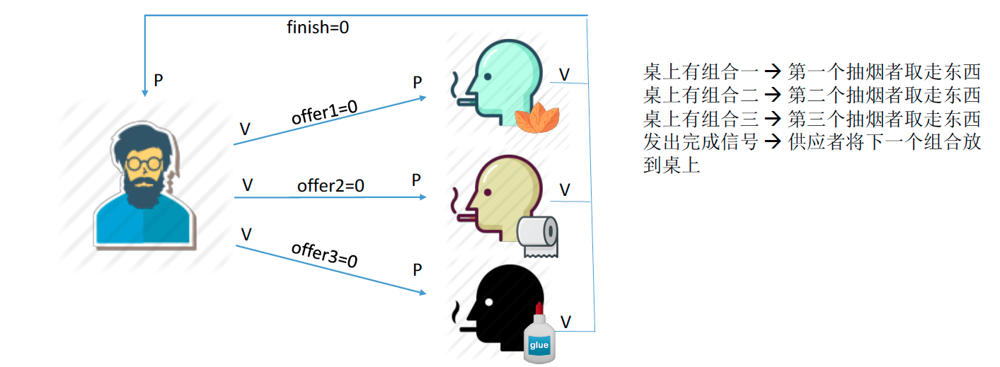

## 如何实现

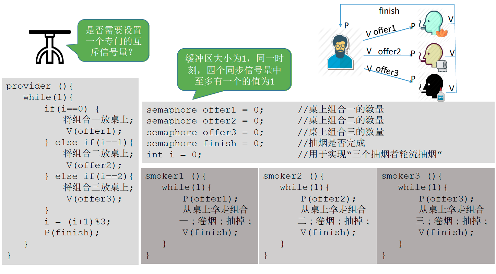


# 读者-写者问题

## 问题描述

有读者和写者两组并发进程，共享一个文件，当两个或两个以上的读进程同时访问共享数据时不 会产生副作用，但若某个写进程和其他进程（读进程或写进程）同时访问共享数据时则可能导致数据不一致的错误。因此要求：①允许多个读者可以同时对文件执行读操作；②只允许一个写者往文件中写信息；③任一写者在完成写操作之前不允许其他读者或写者工作；④写者执行写操作前，应让已有的读者和写者全部退出。

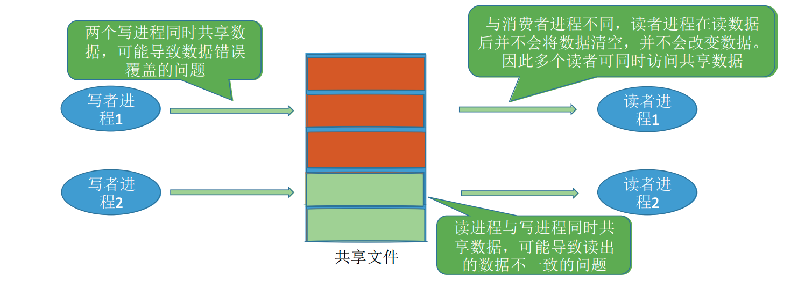

## 问题分析

两类进程：写进程、读进程 

互斥关系：写进程—写进程、写进程—读进程。读进程与读进程不存在互斥问题。

## 如何实现

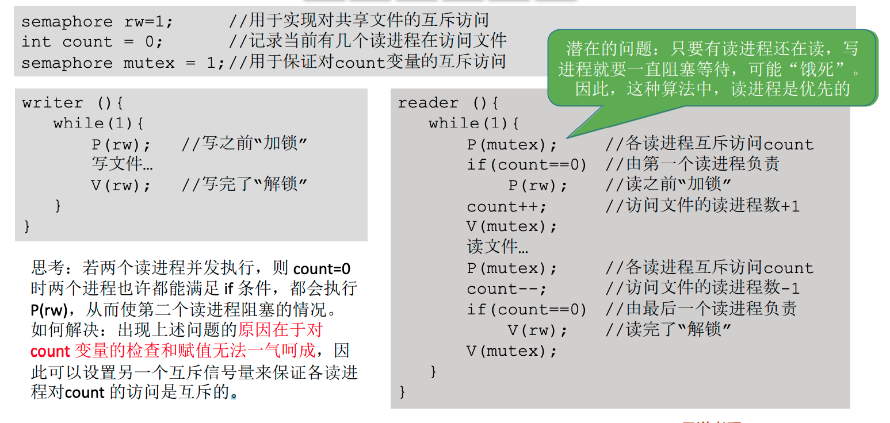

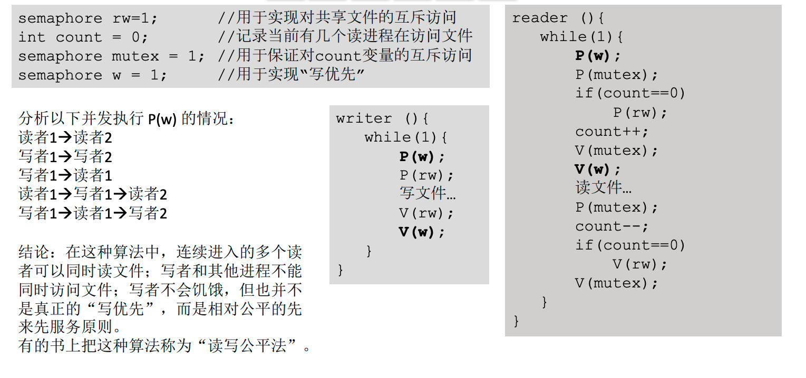

## 总结

读者-写者问题为我们解决复杂的互斥问题ᨀ供了一个参考思路。

其核心思想在于设置了一个计数器 count 用来记录当前正在访问共享文件的读进程数。我们可以用 count 的值来判断当前进入的进程是否是第一个/最后一个读进程，从而做出不同的处理。 另外，对 count 变量的检查和赋值不能一气呵成导致了一些错误，如果需要实现“一气呵成”，自然应该想到**用互斥信号量**。 最后，还要认真体会我们是如何解决“写进程饥饿”问题的。 绝大多数的考研PV操作大题都可以用之前介绍的几种生产者-消费者问题的思想来解决，如果遇到更复杂的问题，可以想想能否用读者写者问题的这几个思想来解决。

# 哲学家进餐问题

## 问题描述

一张圆桌上坐着5名哲学家，每两个哲学家之间的桌上摆一根筷子，桌子的中间是一碗米饭。哲学家们倾注毕生的精力用于思考和进餐，哲学家在思考时，并不影响他人。只有当哲学家饥饿时，才试图拿起左、右两根筷子（一根一根地拿起）。如果筷子已在他人手上，则需等待。饥饿的哲学家只有同时拿起两根筷子才可以开始进餐，当进餐完毕后，放下筷子继续思考。

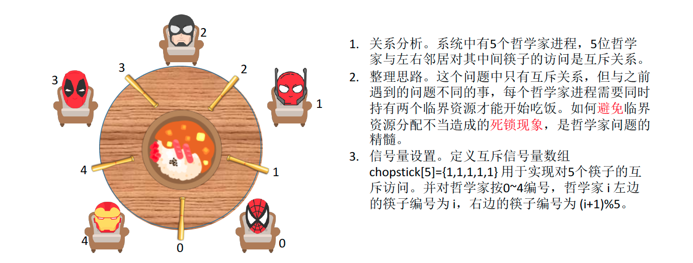

## 问题分析

如果5个哲学家并发地拿起了自己左手边的筷子，于是每位哲学家循环等待右边的人放下筷子（阻塞）。 就发生“死锁”

### 如何防止死锁的发生呢？

①可以对哲学家进程施加一些限制条件，比如最多允许四个哲学家同时进餐。这样可以保证至少有一个哲学家是可以拿到左右两只筷子的

②要求奇数号哲学家先拿左边的筷子，然后再拿右边的筷子，而偶数号哲学家刚好相反。用这种方法可以保证如果相邻的两个奇偶号哲学家都想吃饭，那么只会有其中一个可以拿起第一只筷子，另一个会直接阻塞。这就避免了占有一支后再等待另一只的情况。

③仅当一个哲学家左右两支筷子都可用时才允许他抓起筷子。

## 如何实现

```c
semaphore chopstick[5]={1,1,1,1,1};
semaphore mutex = 1; 		//互斥地取筷子
Pi (){ 									//i号哲学家的进程
	while(1){
		P(mutex);
		P(chopstick[i]); 					//拿左
		P(chopstick[(i+1)%5]);	 //拿右
		V(mutex);
		吃饭…
		V(chopstick[i]); 					//放左
		V(chopstick[(i+1)%5]);	 //放右
		思考…
	}
}
//各哲学家拿筷子这件事必须互斥的执行。这就保证了即使一个哲学家在拿筷子拿到一半时被阻塞，也不会有别的哲学家会继续尝试拿筷子。这样的话，当前正在吃饭的哲学家放下筷子后，被阻塞的哲学家就可以获得等待的筷子了。
```

## 总结

哲学家进餐问题的关键在于解决进程死锁。

这些进程之间只存在互斥关系，但是与之前接触到的互斥关系不同的是，每个进程都需要同时持有两个临界资源，因此就有“死锁”问题的隐患。

如果在考试中遇到了一个进程需要同时持有多个临界资源的情况，应该参考哲学家问题的思想，分析题中给出的进程之间是否会发生循环等待，是否会发生死锁。

可以参考哲学家就餐问题解决死锁的三种思路。


# 管程

## 管程的定义

管程是一种特殊的软件模块，有这些部分组成：

1. 局部于管程的共享数据结构说明； 

2.  对该数据结构进行操作的一组过程； 

3. 对局部于管程的共享数据设置初始值的语句；

4. 管程有一个名字。

   

## 管程的基本特征： 

   1. 局部于管程的数据只能被局部于管程的过程所访问；
      2. 一个进程只有通过调用管程内的过程才能进入管程访问共享数据；
      3. 每次仅允许一个进程在管程内执行某个内部过程。

## 用管程解决生产者消费者问题

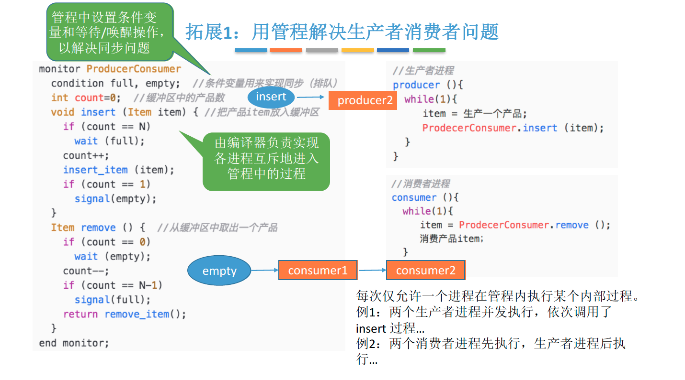

引入管程的目的无非就是要更方便地实现进程互斥和同步。

1. 需要在管程中定义共享数据（如生产者消费者问题的缓冲区）

2. 需要在管程中定义用于访问这些共享数据的“入口”——其实就是一些函数（如生产者消费者 问题中，可以定义一个函数用于将产品放入缓冲区，再定义一个函数用于从缓冲区取出产品）。

3. 只有通过这些特定的“入口”才能访问共享数据 

4. 管程中有很多“入口”，但是每次只能开放其中一个“入口”，并且只能让一个进程或线程进 入（如生产者消费者问题中，各进程需要互斥地访问共享缓冲区。管程的这种特性即可保证一 个时间段内最多只会有一个进程在访问缓冲区。注意：这种互斥特性是由编译器负责实现的， 程序员不用关心）

5. 可在管程中设置条件变量及等待/唤醒操作以解决同步问题。可以让一个进程或线程在条件变量 上等待（此时，该进程应先释放管程的使用权，也就是让出“入口”）；可以通过唤醒操作将 等待在条件变量上的进程或线程唤醒。

   

   程序员可以用某种特殊的语法定义一个管程（比如: monitor ProducerConsumer …… end monitor;），之后其他程序员就可以使用这个管程提供的特定“入口”【封装的思想】很方便地使用实现进程同步/互斥了。

## Java 中类似于管程的机制

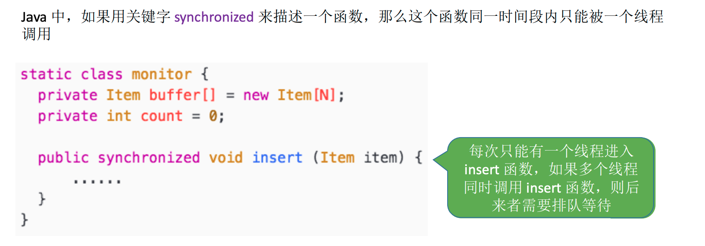

