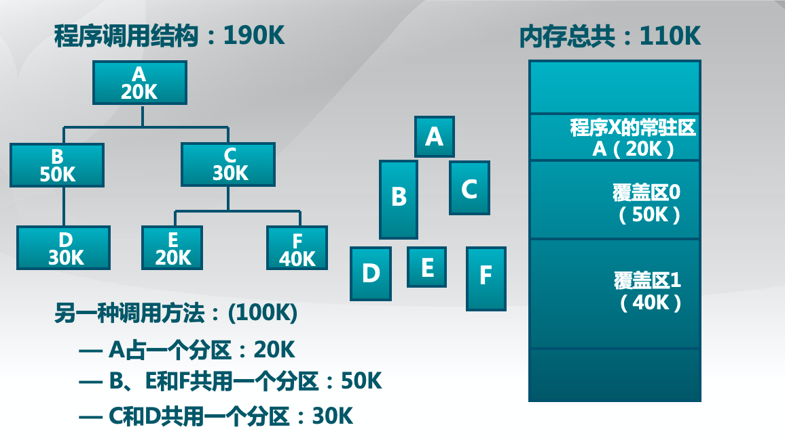
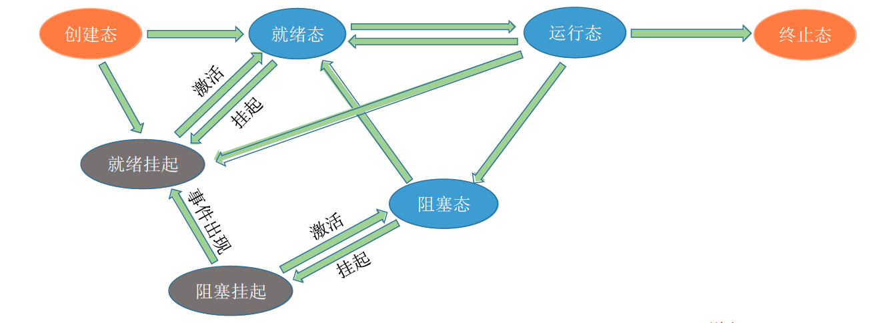
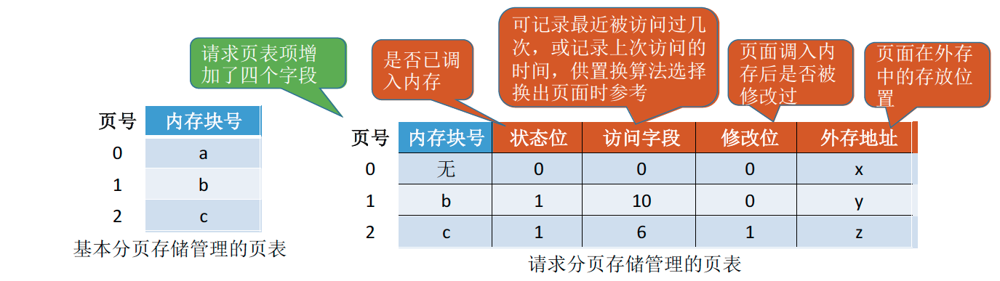
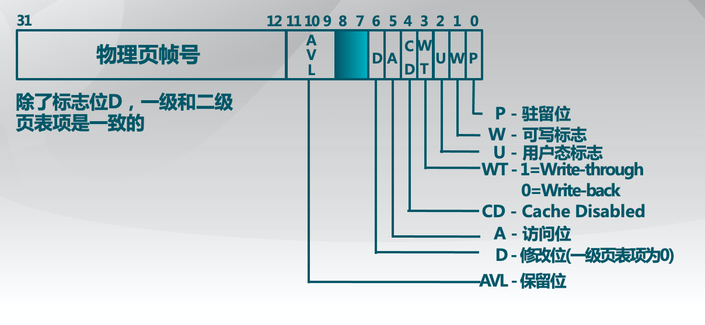
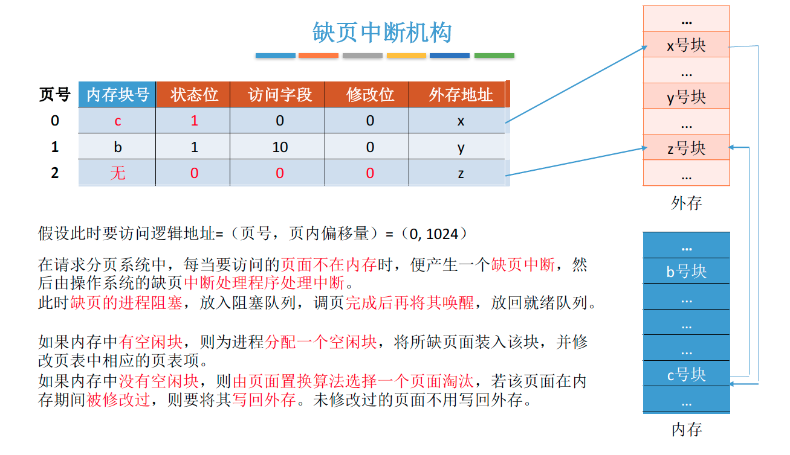
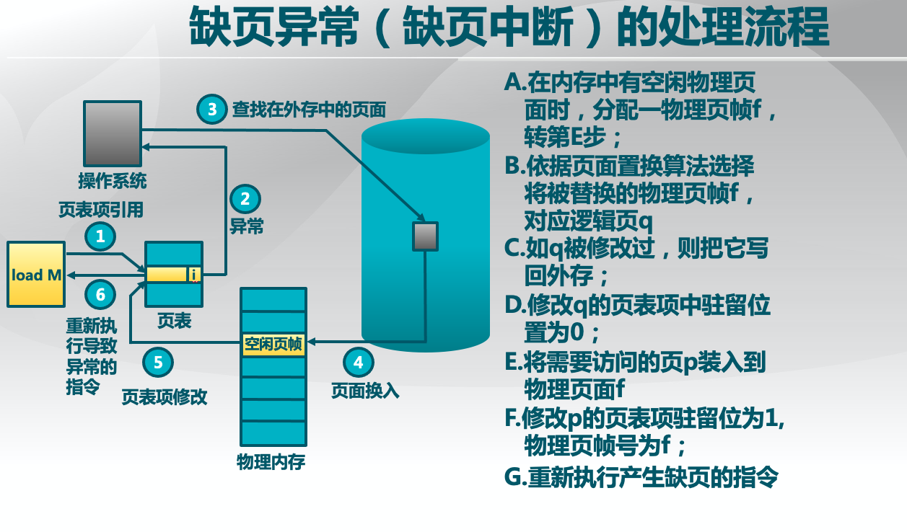
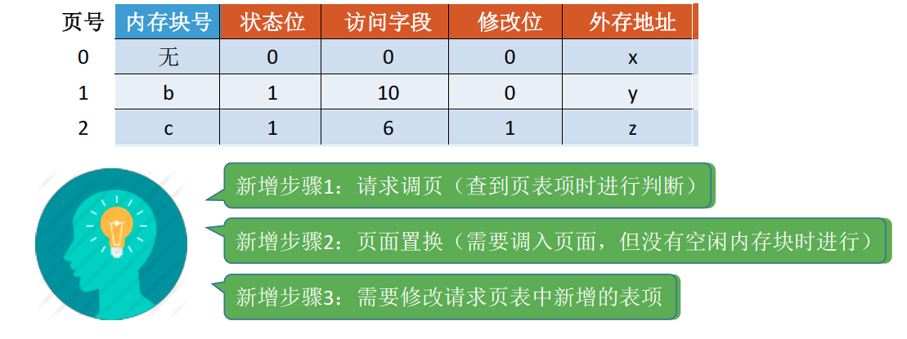
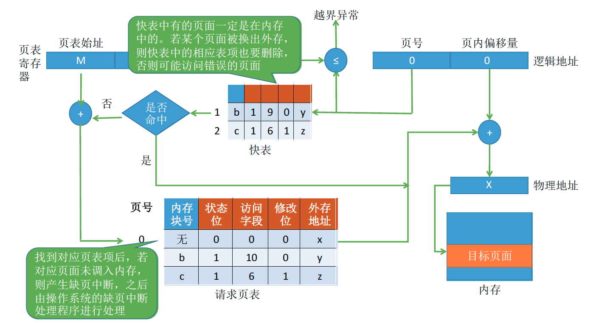
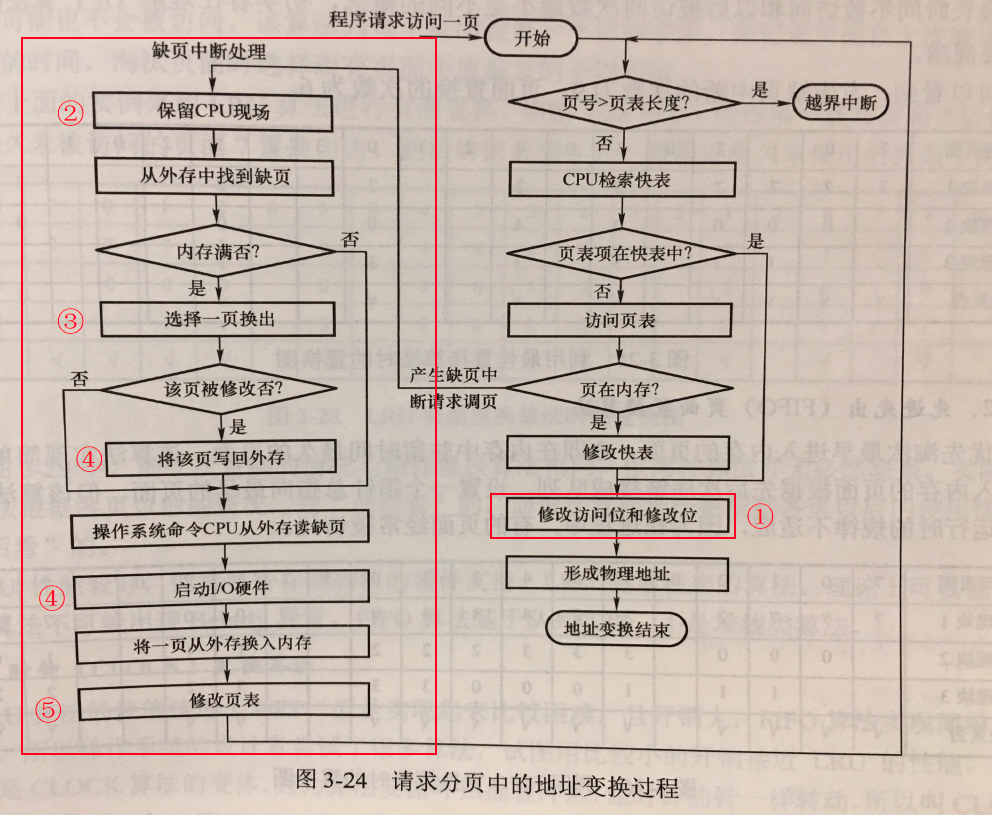
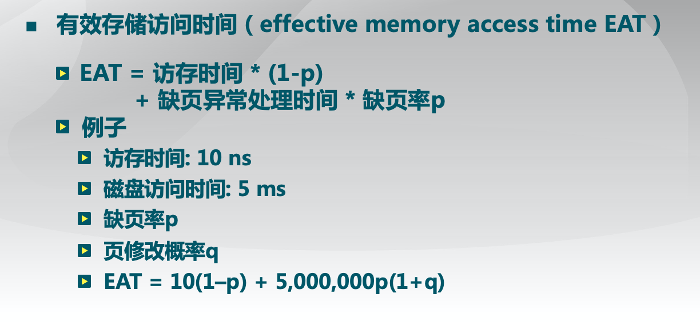

# 内存空间的扩充

## 覆盖技术

早期的计算机内存很小，比如IBM 推出的第一台PC机最大只支持1MB 大小的内存。因此经常会出现内存大小不够的情况。后来人们引入了覆盖技术，用来解决“程序大小超过物理内存总和”的问题

### 覆盖技术的思想：

将程序分为多个段（多个模块）。常用的段常驻内存，不常用的段在需要时调入内存。内存中分为一个“固定区”和若干个“覆盖区”。需要常驻内存的段放在“固定区”中，调入后就不再调出（除非运行结束）不常用的段放在“覆盖区”，需要用到时调入内存，用不到时调出内存。必须由程序员声明覆盖结构，操作系统完成自动覆盖。**缺点**：对用户不透明，增加了用户编程负担。覆盖技术只用于早期的操作系统中，现在已成为历史。

## 交换技术

### 交换（对换）技术的设计思想：

内存空间紧张时，系统将内存中某些进程暂时换出外存，把外存中某些已具备运行条件的进程换入内存（进程在内存与磁盘间动态调度）。 中级调度（内存调度），就是要决定将哪个处于挂起状态的进程重新调入内存。
暂时换出外存等待的进程状态为挂起状态（挂起态，suspend）
挂起态又可以进一步细分为就绪挂起、阻塞挂起两种状态

### 交换技术面临的问题

#### 1. 应该在外存（磁盘）的什么位置保存被换出的进程？

具有对换功能的操作系统中，通常把磁盘空间分为文件区和对换区两部分。文件区主要用于存放文件，主要追求存储空间的利用率，因此对文件区空间的管理采用离散分配方式；对换区空间只占磁盘空间的小部分，被换出的进程数据就存放在对换区。由于对换的速度直接影响到系统的整体速度，因此对换区空间的管理主要追求换入换出速度，因此通常对换区采用连续分配方式（学过文件管理章节后即可理解）。总之，对换区的I/O速度比文件区的更快。

#### 2. 什么时候应该交换？

交换通常在许多进程运行且内存吃紧时进行，而系统负荷降低就暂停。例如：在发现许多进程运行时经常发生缺页，就说明内存紧张，此时可以换出一些进程；如果缺页率明显下降，就可以暂停换出。

#### 3. 应该换出哪些进程？

可优先换出阻塞进程；可换出优先级低的进程；为了防止优先级低的进程在被调入内存后很快又被换出，有的系统还会考虑进程在内存的驻留时间…

（注意：PCB 会常驻内存，不会被换出外存）

## 虚拟存储技术

### 传统存储管理方式的特征、缺点

很多暂时用不到的数据也会长期占用内存，导致内存利用率不高

**一次性**：作业必须一次性全部装入内存后才能开始运行。这会造成两个问题：①作业很大时，不能全部装入内存，导致大作业无法运行；②当大量作业要求运行时，由于内存无法容纳所有作业，因此只有少量作业能运行，导致多道程序并发度下降。**<u>【可用虚拟存储技术解决问题】</u>**

**驻留性**：一旦作业被装入内存，就会一直驻留在内存中，直至作业运行结束。事实上，在一个时间段内，只需要访问作业的一小部分数据即可正常运行，这就导致了内存中会驻留大量的、暂时用不到的数据，浪费了宝贵的内存资源。

### 局部性原理

程序在执行过程中的一个较短时期，所执行的指令地址和指令的操作数地址，分别局限于一定区域

**时间局部性**：如果执行了程序中的某条指令，那么不久后这条指令很有可能再次执行；如果某个数据被访问过，不久之后该数据很可能再次被访问。（因为程序中存在大量的循环）

**空间局部性**：一旦程序访问了某个存储单元，在不久之后，其附近的存储单元也很有可能被访问。（因为很多数据在内存中都是连续存放的，并且程序的指令也是顺序地在内存中存放的）

**分支局部性**： 一条跳转指令的两次执行，很可能跳到相同的内存位置

### 虚拟内存的定义和特征

基于局部性原理，在程序装入时，可以将程序中很快会用到的部分装入内存，暂时用不到的部分留在外存，就可以让程序开始执行。

在程序执行过程中，当所访问的信息不在内存时，由操作系统负责将所需信息从外存调入内存，然后继续执行程序。

若内存空间不够，由操作系统负责将内存中暂时用不到的信息换出到外存。

在操作系统的管理下，在用户看来似乎有一个比实际内存大得多的内存，这就是虚拟内存。（操作系统虚拟性的一个体现，实际的物理内存大小没有变，只是在逻辑上进行了扩充。）

#### 易混知识点：

虚拟内存的最大容量是由计算机的地址结构（CPU寻址范围）确定的。虚拟内存的实际容量= min（内存和外存容量之和，CPU寻址范围）

如：某计算机地址结构为32位，按字节编址，内存大小为512MB，外存大小为2GB。则虚拟内存的最大容量为2的32方 B = 4GB

虚拟内存的实际容量= min (2的32方B, 512MB+2GB) = 2GB+512MB

#### 虚拟内存的三个主要特征：

**多次性**：无需在作业运行时一次性全部装入内存，而是允许被分成多次调入内存。

**对换性**：在作业运行时无需一直常驻内存，而是允许在作业运行过程中，将作业换入、换出。

**虚拟性**：从逻辑上扩充了内存的容量，使用户看到的内存容量，远大于实际的容量。

### 如何实现虚拟内存技术

虚拟内存技术，允许一个作业分多次调入内存。如果采用连续分配方式，会不方便实现。因此，虚拟内存的实现需要建立在离散分配的内存管理方式基础上。

- 请求分区存储管理
- 请求分段存储管理
- 请求段页式存储管理

## 请求分区管理方式

### 页表机制

与基本分页管理相比，请求分页管理中，为了实现“请求调页”，操作系统需要知道每个页面是否已经调入内存；如果还没调入，那么也需要知道该页面在外存中存放的位置。

当内存空间不够时，要实现“页面置换”，操作系统需要通过某些指标来决定到底换出哪个页面；有的页面没有被修改过，就不用再浪费时间写回外存。有的页面修改过，就需要将外存中的旧数据覆盖，因此，操作系统也需要记录各个页面是否被修改的信息。

### X86页表结构

### 缺页中断机构

假设此时要访问逻辑地址=（页号，页内偏移量）=（0, 1024）
在请求分页系统中，每当要访问的页面不在内存时，便产生一个缺页中断，然后由操作系统的缺页中断处理程序处理中断。
此时缺页的进程阻塞，放入阻塞队列，调页完成后再将其唤醒，放回就绪队列。
如果内存中有空闲块，则为进程分配一个空闲块，将所缺页面装入该块，并修改页表中相应的页表项。
如果内存中没有空闲块，则由页面置换算法选择一个页面淘汰，若该页面在内存期间被修改过，则要将其写回外存。未修改过的页面不用写回外存。

缺页中断是因为当前执行的指令想要访问的目标页面未调入内存而产生的，因此属于内中断一条指令在执行期间，可能产生多次缺页中断。（如：copy A to B，即将逻辑地址A中的数据复制到逻辑地址B，而A、B属于不同的页面，则有可能产生两次中断）

### 地址变换机构

#### 请求分页存储管理与基本分页存储管理的主要区别：

在程序执行过程中，当所访问的信息不在内存时，由操作系统负责将所需信息从外存调入内存，然后继续执行程序。（操作系统要提供请求调页（或请求调段）功能）

若内存空间不够，由操作系统负责将内存中暂时用不到的信息换出到外存。（操作系统要提供页面置换（或段置换）的功能）

### 补充细节：

1. 只有“写指令”才需要修改“修改位”。并且，一般来说只需修改快表中的数据，只有要将快表项删除时才需要写回内存中的慢表。这样可以减少访存次数
2. 和普通的中断处理一样，缺页中断处理依然需要保留CPU现场。
3. 需要用某种“页面置换算法” 来决定一个换出页面（下节内容）
4. 换入/换出页面都需要启动慢速的I/O操作，可见，如果换入/换出太频繁，会有很大的开销。
5. 页面调入内存后，需要修改慢表，同时也需要将表项复制到快表中。（在具有快表机构的请求分页系统中，访问一个逻辑地址时，若发生缺页，则地址变换步骤是：
   查快表(未命中)——查慢表(发现未调入内存)——调页(调入的页面对应的表项会直接加入快表)——查快表(命中)——访问目标内存单元）

## 虚拟页式存储管理的性能

