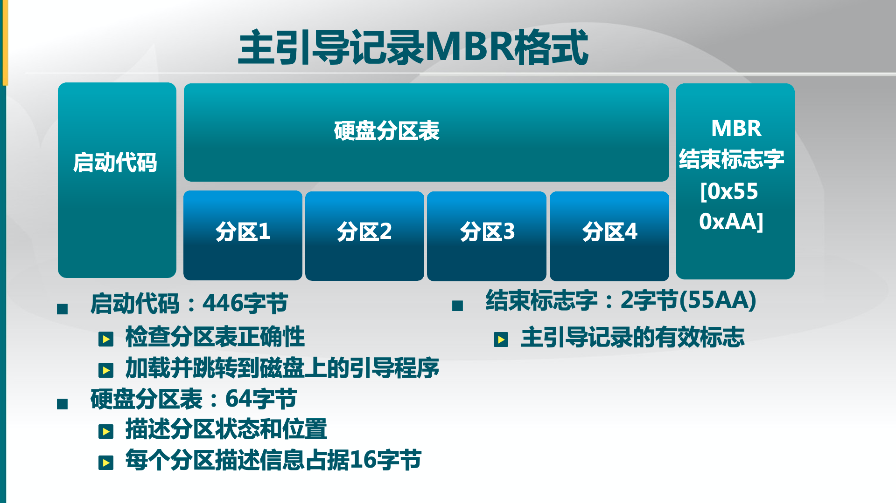

# 启动、中断、异常和系统调用

## 一、操作系统的启动流程

### BIOS自检

在计算机开机时，boot被自动执行，指引CPU把操作系统从大容量存储器中传送到主存储器的易失区  。BIOS的功能由两部分组成，分别是POST码和Runtime服务。POST阶段完成后它将从存储器中被清除，而Runtime服务会被一直保留，用于目标操作系统的启动。BIOS两个阶段所做的详细工作如下：

**步骤1**：上电自检POST(Power-on self test)，主要负责检测系统外围关键设备（如：CPU、内存、显卡、I/O、键盘鼠标等）是否正常。例如，最常见的是内存松动的情况，BIOS自检阶段会报错，系统就无法启动起来；

**步骤2**：步骤1成功后，便会执行一段小程序用来枚举本地设备并对其初始化。这一步主要是根据我们在BIOS中设置的系统启动顺序来搜索用于启动系统的驱动器，如硬盘、光盘、U盘、软盘和网络等。我们以硬盘启动为例，BIOS此时去读取硬盘驱动器的第一个扇区(MBR，512字节)，然后执行里面的代码。实际上这里BIOS并不关心启动设备第一个扇区中是什么内容，它只是负责读取该扇区内容、并执行。

至此，BIOS的任务就完成了，此后将系统启动的控制权移交到MBR部分的代码。

Linux的启动是从0xFFFF0地址开始的，该地址位于FLASH memory中，是BIOS的入口。然后会选择引导设将其第一个扇面（可能是MBR或GRUB）的内容读到0x7C00处，并跳转到该位置。

### 系统引导

我们首先来了解一下MBR，它是Master Boot Record的缩写。硬盘的0柱面、0磁头、1扇区称为主引导扇区。它由三个部分组成，主引导程序(Bootloader)、 硬盘分区表DPT（Disk Partition table）和硬盘有效标志（55AA），其结构图如下所示 ：

引导程序的核心工作是将内核从外存读入内存，并将其放在合适的位置中。

由于处理器最开始运行在实模式下，内存空间只有1MB（20位地址总线8086体系）

引导程序必须将内核的实模式下的初始化程序放在基本内存中，应将内核镜像放在1MB以上的位置。

同时为了缩减内核规模，实现内核的灵活性和适应性，内核被分为两部分：基础部分（bzImage）和扩展部分（busybox等）。基本内核实现内核最基本的管理功能，不随计算机的变化而变化；扩展功能实现内核一些独立的模块（如驱动和文件系统），会发生变化，被放在initrd中，需要引导程序一并读入。在qemu中使用 qemu-systems-i386 -kernel bzImage -initrd busybox命令载入基本内核和扩展内核。

### 启动内核

当处理器离开引导程序的时候，它处于实模式下面，需要执行实模式下面的引导程序后，跳转到保护模式解压内核镜像。

在实模式中，引导程序进行三项工作：

1）收集系统参数

2）设置基本环境

3）切换处理器操作模式

### 解压内核

linux在内存中的为内存镜像，需要进行解压，解压后需要把内核放在适当的位置。这个位置在老的版本为0x100000（1MB）处，新版本要求在物理内存的0x1000000（16MB）处，这样可以节省16MB以下的内存空间给DMA使用。借此就进入了保护模式的内核初始化下了。

## 二、 中断、异常和系统调用

### 简介

- 系统调用 ( system call ):

  应用程序主动向操作系统发出服务请求

- 异常 ( exception ):

  异常也称内中断

  非法指令或者其他坏的处理状态(如:内存出错)

- 中断 ( hardware interrupt ):

  来源于不同的硬件设备的计时器和网络中断

### 三者的区别和特点：

#### 产生的源头：

- 中断：外设(键盘/鼠标/网卡/声卡/显卡，可以产生各种事件)
- 异常：应用程序意想不到的行为(e.g.异常，恶意程序，应用程序需要的资源未得到满足)
- 系统调用(system call)：应用程序请求操作提供服务(e.g.打开/关闭/读写文件，发送网络包)

#### 处理时间：

- 中断：异步；
- 异常：同步；
- 系统调用：同步或异步。

#### 响应：

- 中断：持续，对用户应用程序时透明的
- 异常：杀死或者重新执行意想不到的应用程序指令
- 系统调用：等待和持续

### 用户态，内核态（核心态）

- 用户态：应用程序在执行的过程中，CPU执行的特权级的状态(很低，不能访问特殊机器指令和IO)。
- 内核态：应用程序在执行的过程中，CPU执行的特权级的状态(高，操作系统可以执行CPU任何一条指令)。
- 系统调用时涉及到特权级从用户态到内核态的转换，应用程序和操作系统有各自的堆栈，这两个变化比函数调用的开销更大，但更安全和可靠。(而程序调用是在一个栈空间实现参数的调用和返回)。

### 中断的概念和作用

发生了中断,就意味着需要操作系统介入,开展管理工作。 由于操作系统的管理工作(比如进程切换、分配I/O设备等)需要使用特权指令,因此CPU要从用户态转为核心态。 中断可以使CPU从用户态切换为核心态,使操作系统获得计算机的控制权。有了中断才能实现多道程序并发执行。 中断是CPU从用户态->核心态切换的唯一途径。 核心态->用户态切换只需要执行一个特权指令，将PSW设置为0

### 系统调用的概念和作用

系统调用”是操作系统提供给应用程序(程序员/编程人员)使用的接口,可以理解为一种可供应用程序调用的特殊函数,应用程序可以发出系统调用请求来获得操作系统的服务。 应用程序通过系统调用请求操作系统的服务。 系统中的各种共享资源都由操作系统统一掌管,因此在用户程序中,凡是与资源有关的操作(如存储分配、I/O操作、文件管理等) ,都必须通过系统调用的方式向操作系统提出服务请求,由操作系统代为完成。这样可以保证系统的稳定性和安全性,防止用户进行非法操作。 系统调用相关的处理需要在内核态下完成。

#### 跨越操作系统边界的开销

在执行时间上超过程序调用

##### 开销包括：

- 建立中断/异常/系统调用号与对应服务例程映射关系的初始化开销；
- 建立内核堆栈(操作系统和应用程序的堆栈不一样)；
- 验证参数(操作系统会检查数据)；
- 内核态映射到用户态的地址空间，更新页面映射权限(内存拷贝开销)；
- 内核态独立地址空间TLB

