# 文件的逻辑结构

所谓的“逻辑结构”，就是指在用户看来，文件内部的数据应该是如何组织起来的。而“物理结构”指的是在操作系统看来，文件的数据是如何存放在外存中的。

类似于数据结构的“逻辑结构”和“物理结构”。

如“线性表”就是一种逻辑结构，在用户角度看来，线性表就是一组有先后关系的元素序列，如：a,b, c, d, e ……

“线性表”这种逻辑结构可以用不同的物理结构实现，如：顺序表/链表。顺序表的各个元素在逻辑上相邻，在物理上也相邻；而链表的各个元素在物理上可以是不相邻的。因此，顺序表可以实现“随机访问”，而“链表”无法实现随机访问。

可见，算法的具体实现与逻辑结构、物理结构都有关（文件也一样，文件操作的具体实现与文件的逻辑结构、物理结构都有关）

## 文件结构的分类

按文件是否有结构分类，可以分为无结构文件、有结构文件两种。

### 无结构文件

无结构文件：文件内部的数据就是一系列二进制流或字符流组成。又称“流式文件”。如：Windows操作系统中的.txt文件。

### 有结构文件

有结构文件：由一组相似的记录组成，又称“记录式文件”。每条记录又若干个数据项组成。如：数据库表文件。一般来说，每条记录有一个数据项可作为关键字（作为识别不同记录的ID），根据各条记录的长度（占用的存储空间）是否相等，又可分为**定长记录**和**可变长记录**两种。

### 有结构文件的逻辑结构

#### 顺序文件

顺序文件：文件中的记录一个接一个地顺序排列（逻辑上），记录可以是定长的或可变长的。各个记录在物理上可以顺序存储或链式存储。

定长记录的顺序文件，若物理上采用顺序存储，则可实现随机存取；若能再保证记录的顺序结构，则可实现快速检索（即根据关键字快速找到对应记录）

一般来说，考试题目中所说的“顺序文件”指的是物理上顺序存储的顺序文件。可见，顺序文件的缺点是增加/删除一个记录比较困难（如果是串结构则相对简单）

#### 索引文件

**索引表**本身是**定长记录的顺序文件**。因此可以快速找到第i个记录对应的索引项。可将关键字作为索引号内容，若按关键字顺序排列，则还可以支持按照关键字折半查找。每当要增加/删除一个记录时，需要对索引表进行修改。由于索引文件有很快的检索速度，因此主要用于对信息处理的及时性要求比较高的场合。

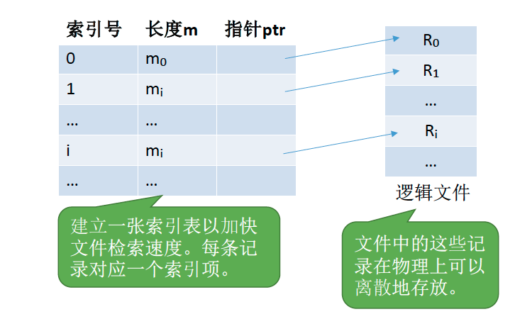

另外，可以用不同的数据项建立多个索引表。如：

学生信息表中，可用关键字“学号”建立一张索引表。也可用“姓名”建立一张索引表。这样就可以根据“姓名”快速地检索文件了。

（Eg：SQL就支持根据某个数据项建立索引的功能）

#### 索引顺序文件

索引顺序文件是索引文件和顺序文件思想的结合。索引顺序文件中，同样会为文件建立一张索引表，但不同的是：并不是每个记录对应一个索引表项，而是一组记录对应一个索引表项。

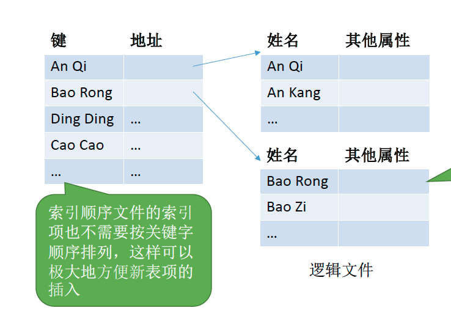

##### 索引顺序文件（检索效率分析）

若一个顺序文件有10000个记录，则根据关键字检索文件，只能从头开始顺序查找（这里指的并不是定长记录、顺序结构的顺序文件），平均须查找5000个记录。

若采用索引顺序文件结构，可把10000个记录分为√10000 = 100 组，每组100个记录。则需要先顺序查找索引表找到分组（共100个分组，因此索引表长度为100，平均需要查50次），找到分组后，再在分组中顺序查找记录（每个分组100个记录，因此平均需要查50次）。可见，采用索引顺序文件结构后，平均查找次数减少为50+50 = 100次。同理，若文件共有106个记录，则可分为1000个分组，每个分组1000个记录。根据关键字检索一个记录平均需要查找500+500 = 1000次。这个查找次数依然很多，如何解决呢？

#### 多级索引顺序文件

为了进一步提高检索效率，可以为顺序文件建立多级索引表。例如，对于一个含106个记录的文件，可先为该文件建立一张低级索引表，每100个记录为一组，故低级索引表中共有10000个表项（即10000个定长记录），再把这10000个定长记录分组，每组100个，为其建立顶级索引表，故顶级索引表中共有100个表项。

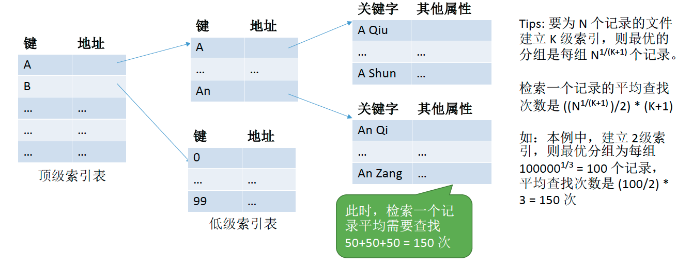

# 文件目录

## 文件控制块

FCB的有序集合称为“文件目录”，一个FCB就是一个文件目录项。FCB中包含了文件的基本信息（文件名、物理地址、逻辑结构、物理结构等），存取控制信息（是否可读/可写、禁止访问的用户名单等），使用信息（如文件的建立时间、修改时间等）。最重要，最基本的还是文件名、文件存放的物理地址。

【FCB实现了文件名和文件之间的映射。使用户（用户程序）可以实现“按名存取”】

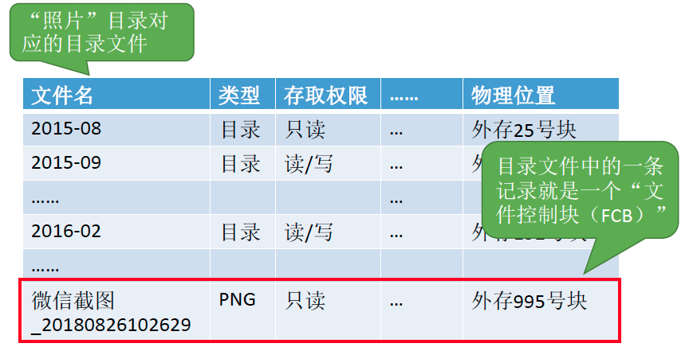

### 需要对目录进行哪些操作？

- 搜索：当用户要使用一个文件时，系统要根据文件名搜索目录，找到该文件对应的目录项

- 创建文件：创建一个新文件时，需要在其所属的目录中增加一个目录项
- 删除文件：当删除一个文件时，需要在目录中删除相应的目录项
- 显示目录：用户可以请求显示目录的内容，如显示该目录中的所有文件及相应属性
- 修改目录：某些文件属性保存在目录中，因此这些属性变化时需要修改相应的目录项（如：文件重命名）

## 目录结构

### 单级目录结构

早期操作系统并不支持多级目录，整个系统中只建立一张目录表，每个文件占一个目录项。单级目录实现了“按名存取”，但是不允许文件重名。

在创建一个文件时，需要先检查目录表中有没有重名文件，确定不重名后才能允许建立文件，并将新文件对应的目录项插入目录表中。

显然，单级目录结构**不适用于多用户操作系统**。

### 两级目录结构

早期的多用户操作系统，采用两级目录结构。分为主文件目录（MFD，Master File Directory）和用户文件目录（UFD，User Flie Directory）。

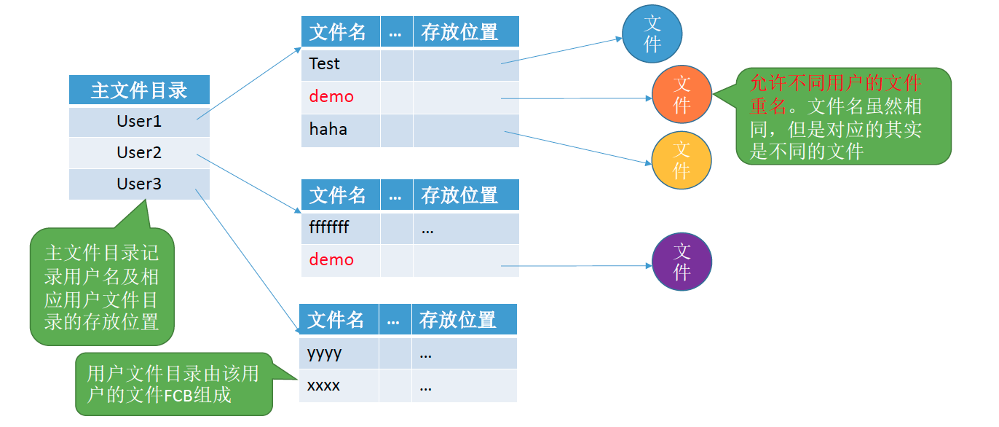

两级目录结构允许不同用户的文件重名，也可以在目录上实现实现访问限制（检查此时登录的用户名是否匹配）。但是两级目录结构依然缺乏灵活性，用户不能对自己的文件进行分类

### 多级目录结构

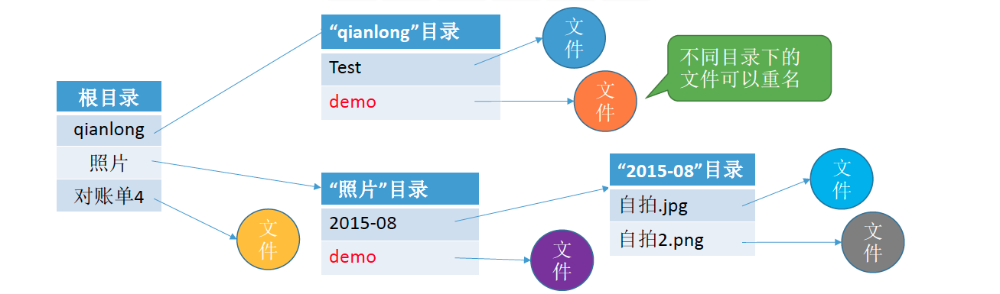

用户（或用户进程）要访问某个文件时要用文件路径名标识文件，文件路径名是个字符串。各级目录之间用“/”隔开。从根目录出发的路径称为绝对路径。例如：自拍.jpg的绝对路径是“/照片/2015-08/自拍.jpg”

每次都从根目录开始查找，是很低效的。因此可以设置一个“当前目录”。例如，此时已经打开了“照片”的目录文件，也就是说，这张目录表已调入内存，那么可以把它设置为“当前目录”。当用户想要访问某个文件时，可以使用从当前目录出发的“相对路径”。

在Linux中，“.”表示当前目录，因此如果“照片”是当前目录，则”自拍.jpg”的相对路径为：“./2015-08/自拍.jpg”。

树形目录结构可以很方便地对文件进行分类，层次结构清晰，也能够更有效地进行文件的管理和保护。但是，树形结构**不便于实现文件的共享**。为此，提出了“无环图目录结构”。

### 无环图目录结构

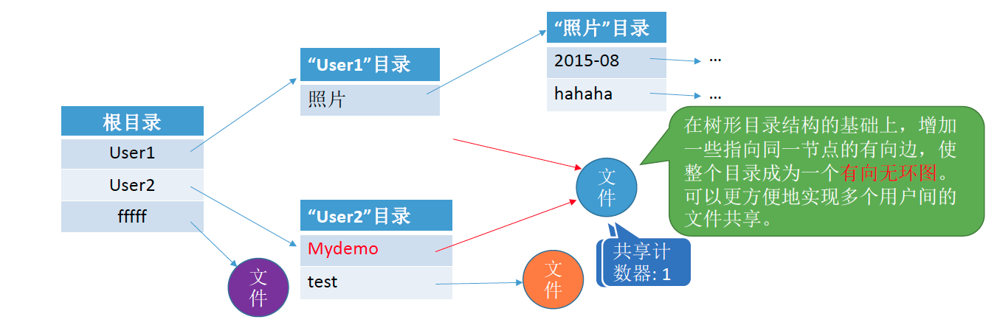

可以用不同的文件名指向同一个文件，甚至可以指向同一个目录（共享同一目录下的所有内容）。

需要为每个共享结点设置一个共享计数器，用于记录此时有多少个地方在共享该结点。用户提出删除结点的请求时，只是删除该用户的FCB、并使共享计数器减1，并不会直接删除共享结点。只有共享计数器减为0时，才删除结点。

注意：共享文件不同于复制文件。在共享文件中，由于各用户指向的是同一个文件，因此只要其中一个用户修改了文件数据，那么所有用户都可以看到文件数据的变化。

## 索引结点（FCB的改进）

在查找各级目录的过程中只需要用到“文件名”这个信息，只有文件名匹配时，才需要读出文件的其他信息。因此可以考虑让目录表“瘦身”来提升效率。

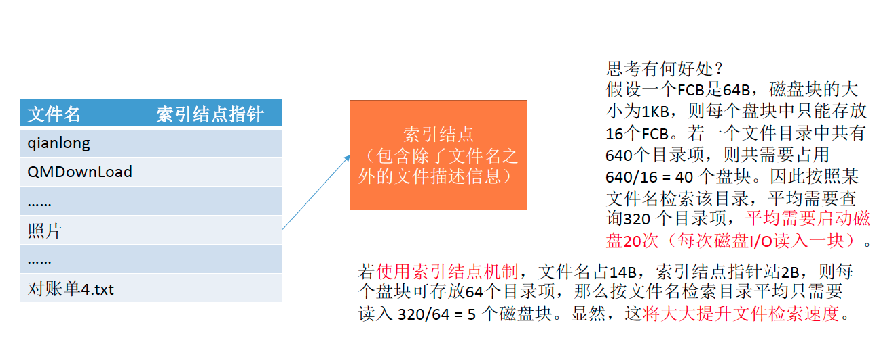

使用索引结点机制，按文件名检索目录，文件检索速度将大大提升。

当找到文件名对应的目录项时，才需要将索引结点调入内存，索引结点中记录了文件的各种信息，包括文件在外存中的存放位置，根据“存放位置”即可找到文件。

存放在外存中的索引结点称为“磁盘索引结点”，当索引结点放入内存后称为“内存索引结点”。

相比之下内存索引结点中需要增加一些信息，比如：文件是否被修改、此时有几个进程正在访问该文件等。

# 文件的物理结构（文件分配方式）

## 文件块、磁盘块

类似于内存分页，磁盘中的存储单元也会被分为一个个“块/磁盘块/物理块”。很多操作系统中，磁盘块的大小与内存块、页面的大小相同

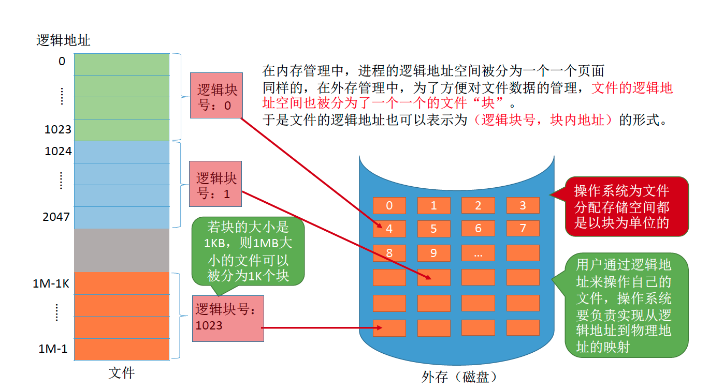

## 文件分配方式——连续分配

连续分配方式要求每个文件在磁盘上占有一组连续的块。

### 如何实现文件的逻辑块号到物理块号的转变

用户给出要访问的逻辑块号，操作系统找到该文件对应的目录项（FCB）…物理块号=起始块号+逻辑块号当然，还需要检查用户提供的逻辑块号是否合法（逻辑块号≥ 长度就不合法）【可以直接算出逻辑块号对应的物理块号，因此连续分配支持顺序访问和直接访问（即随机访问）】

读取某个磁盘块时，需要移动磁头。访问的两个磁盘块相隔越远，移动磁头所需时间就越长。所以**连续分配的文件在顺序读/写时速度最快**

### 是否方便拓展文件？

**物理上采用连续分配的文件不方便拓展。**

物理上采用连续分配，存储空间利用率低，**会产生难以利用的磁盘碎片**，可以用紧凑来处理碎片，但是需要耗费很大的时间代价。

### 总结

优点：支持顺序访问和直接访问（即随机访问）；连续分配的文件在顺序访问时速度最快

缺点：不方便文件拓展；存储空间利用率低，会产生磁盘碎片

## 文件分配方式——链接分配

链接分配采取离散分配的方式，可以为文件分配离散的磁盘块。分为**隐式链接**和**显式链接**两种。

### 链接分配——隐式链接

#### 如何实现文件的逻辑块号到物理块号的转变

#### 是否方便拓展文件？

若要拓展文件，可以随便找一个空闲磁盘块，挂到文件的磁盘块链尾，并修改文件的FCB。

所以采用隐式链接的链接分配方式，很**方便文件拓展**。另外，所有的空闲磁盘块都可以被利用，不会有碎片问题，**外存利用率高**。

### 链接分配——显式链接

把用于链接文件各物理块的指针显式地存放在一张表中。即文件分配表（FAT，File Allocation Table）

一个磁盘仅设置一张FAT。

开机时，将FAT读入内存，并常驻内存。FAT的各个表项在物理上连续存储，且每一个表项长度相同，因此“物理块号”字段可以是隐含的。

#### 如何实现文件的逻辑块号到物理块号的转变

### 链接分配（总结）

链接分配采取离散分配的方式，可以为文件分配离散的磁盘块。分为隐式链接和显式链接两种。

隐式链接——除文件的最后一个盘块之外，每个盘块中都存有指向下一个盘块的指针。文件目录包括文件第一块的指针和最后一块的指针。

优点：很方便文件拓展，不会有碎片问题，外存利用率高。

缺点：只支持顺序访问，不支持随机访问，查找效率低，指向下一个盘块的指针也需要耗费少量的存储空间。

显式链接——把用于链接文件各物理块的指针显式地存放在一张表中，即文件分配表（FAT，FileAllocation Table）。一个磁盘只会建立一张文件分配表。开机时文件分配表放入内存，并常驻内存。

优点：很方便文件拓展，不会有碎片问题，外存利用率高，并且支持随机访问。相比于隐式链接来说，地址转换时不需要访问磁盘，因此文件的访问效率更高。

缺点：文件分配表的需要占用一定的存储空间。

## 文件分配方式——索引分配

索引分配允许文件离散地分配在各个磁盘块中，系统会为每个文件建立一张索引表，索引表中记录了文件的各个逻辑块对应的物理块（索引表的功能类似于内存管理中的页表——建立逻辑页面到物理页之间的映射关系）。索引表存放的磁盘块称为索引块。文件数据存放的磁盘块称为数据块。

### 如何实现文件的逻辑块号到物理块号的转换？

若每个磁盘块1KB，一个索引表项4B，则一个磁盘块只能存放256个索引项。如果一个文件的大小超过了256块，那么一个磁盘块是装不下文件的整张索引表的，如何解决这个问题？

### ①链接方案

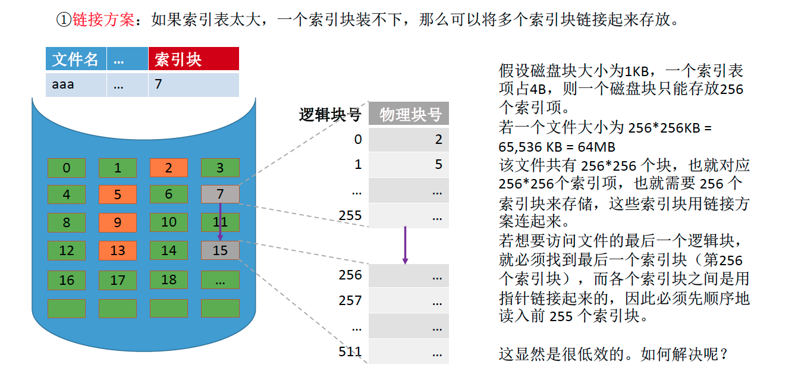

### ②多层索引

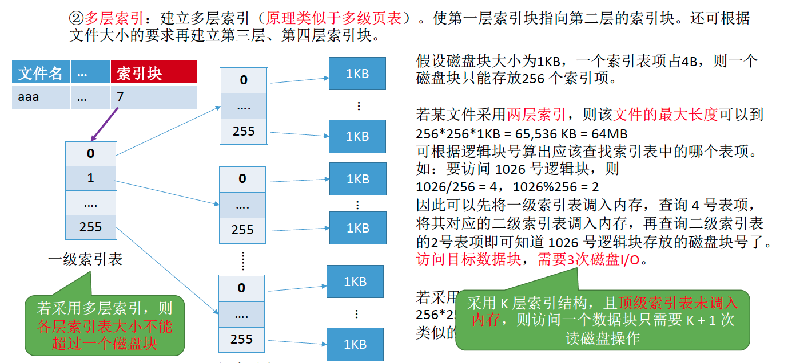

### ③混合索引

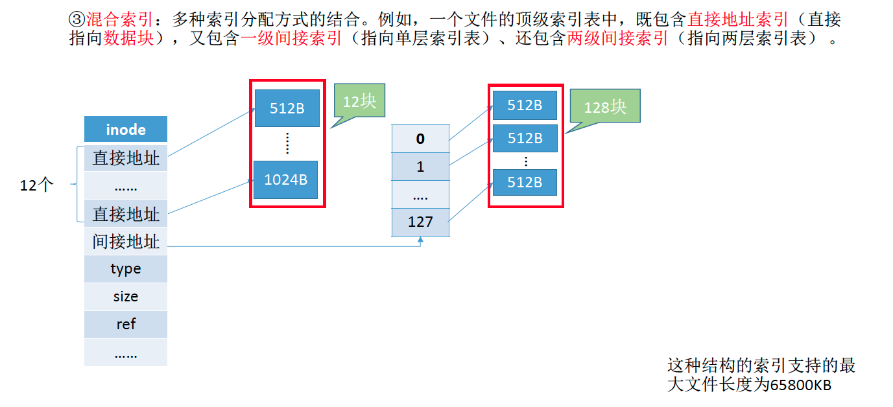

### 索引分配（总结）

索引分配允许文件离散地分配在各个磁盘块中，系统会为每个文件建立一张索引表，索引表中记录了文件的各个逻辑块对应的物理块（索引表的功能类似于内存管理中的页表——建立逻辑页面到物理页之间的映射关系）。索引表存放的磁盘块称为索引块。文件数据存放的磁盘块称为数据块。若文件太大，索引表项太多，可以采取以下三种方法解决：

①链接方案：如果索引表太大，一个索引块装不下，那么可以将多个索引块链接起来存放。缺点：若文件很大，索引表很长，就需要将很多个索引块链接起来。想要找到i号索引块，必须先依次读入0~i-1号索引块，这就导致磁盘I/O次数过多，查找效率低下。

②多层索引：建立多层索引（原理类似于多级页表）。使第一层索引块指向第二层的索引块。还可根据文件大小的要求再建立第三层、第四层索引块。采用K层索引结构，且顶级索引表未调入内存，则访问一个数据块只需要K + 1次读磁盘操作。缺点：即使是小文件，访问一个数据块依然需要K+1次读磁盘。

③混合索引：多种索引分配方式的结合。例如，一个文件的顶级索引表中，既包含直接地址索引（直接指向数据块），又包含一级间接索引（指向单层索引表）、还包含两级间接索引（指向两层索引表）。优点：对于小文件来说，访问一个数据块所需的读磁盘次数更少。

超级超级超级重要考点：①要会根据多层索引、混合索引的结构计算出文件的最大长度（Key：各级索引表最大不能超过一个块）；②要能自己分析访问某个数据块所需要的读磁盘次数（Key：FCB中会存有指向顶级索引块的指针，因此可以根据FCB读入顶级索引块。每次读入下一级的索引块都需要一次读磁盘操作。另外，要注意题目条件——顶级索引块是否已调入内存）

## 知识汇总

|          | How                                                          | 目录项内容                                                   | 优点                                                         | 缺点                                                         |
| -------- | ------------------------------------------------------------ | ------------------------------------------------------------ | ------------------------------------------------------------ | ------------------------------------------------------------ |
| 顺序分配 | 为文件分配的必须是连续的磁盘块                               | 起始块号、文件长度                                           | 顺序存取速度快，支持随机访问                                 | 会产生碎片，不利于文件扩展                                   |
| 隐式链接 | 除文件的最后一个盘块之外，每个盘块中都存有指向下一个盘块的指针 | 起始块号、结束块号                                           | 可解决碎片问题，外存利用率高，文件拓展实现方便               | 只能顺序访问，不能随机访问                                   |
| 显式链接 | 建立一张文件分配表(FAT)，显式记录盘块的先后关系（开机后FAT常驻内存） | 起始块号                                                     | 除了拥有隐式链接的优点之外，还可通过查询内存中的FAT实现随机访问 | FAT需要占用一定的存储空间                                    |
| 索引分配 | 为文件数据块建立索引表。若文件太大，可采用链接方案、多层索引、混合索引 | 链接方案记录的是第一个索引块的块号，多层/混合索引记录的是顶级索引块的块号 | 支持随机访问，易于实现文件的拓展                             | 索引表需占用一定的存储空间。访问数据块前需要先读入索引块。若采用链接方案，查找索引块时可能需要很多次读磁盘操作。 |

# 文件的基本操作

# 文件存储空间管理

## 存储空间的划分与初始化

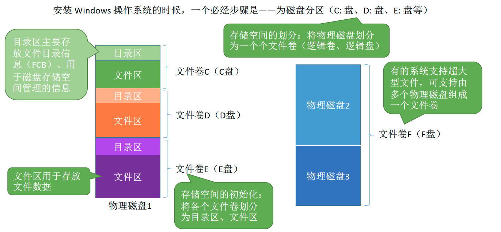

## 存储空间管理——空闲表法

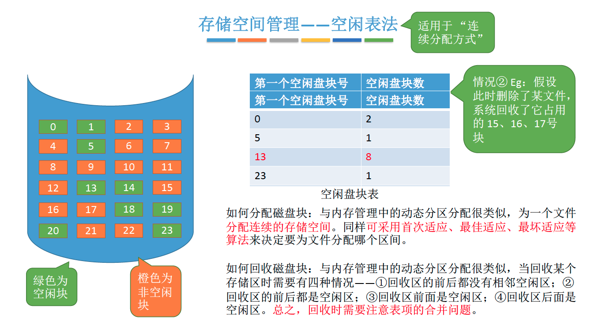

如何分配磁盘块：与内存管理中的动态分区分配很类似，为一个文件分配连续的存储空间。同样可采用首次适应、最佳适应、最坏适应等算法来决定要为文件分配哪个区间。

如何回收磁盘块：与内存管理中的动态分区分配很类似，当回收某个存储区时需要有四种情况——①回收区的前后都没有相邻空闲区；②回收区的前后都是空闲区；③回收区前面是空闲区；④回收区后面是空闲区。总之，回收时需要注意表项的合并问题。

## 存储空间管理——空闲链表法

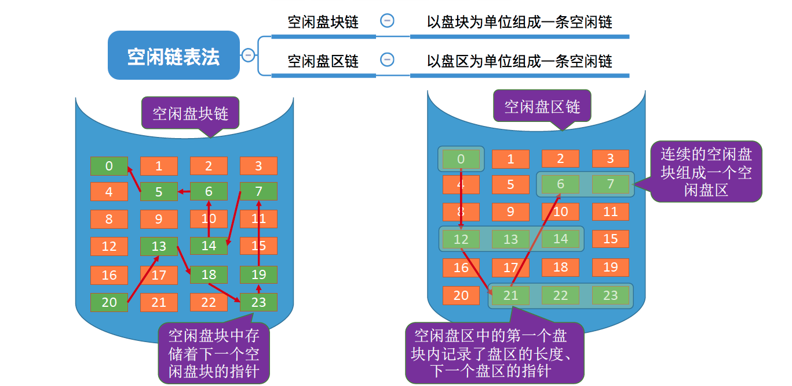

### 空闲盘块链：

操作系统保存着链头、链尾指针。

如何分配：若某文件申请K个盘块，则从链头开始依次摘下K个盘块分配，并修改空闲链的链头指针。

如何回收：回收的盘块依次挂到链尾，并修改空闲链的链尾指针。

【适用于离散分配的物理结构。为文件分配多个盘块时可能要重复多次操作】

### 空闲盘区链：

操作系统保存着链头、链尾指针。

如何分配：若某文件申请K个盘块，则可以采用首次适应、最佳适应等算法，从链头开始检索，按照算法规则找到一个大小符合要求的空闲盘区，分配给文件。若没有合适的连续空闲块，也可以将不同盘区的盘块同时分配给一个文件，注意分配后可能要修改相应的链指针、盘区大小等数据。

如何回收：若回收区和某个空闲盘区相邻，则需要将回收区合并到空闲盘区中。若回收区没有和任何空闲区相邻，将回收区作为单独的一个空闲盘区挂到链尾。

【离散分配、连续分配都适用。为一个文件分配多个盘块时效率更高】

## 存储空间管理——位示图法

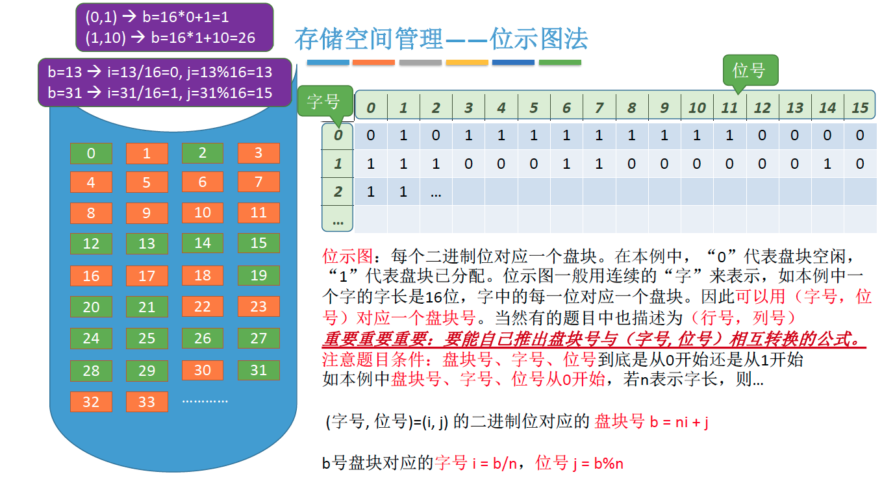

## 存储空间管理——成组链接法

空闲表法、空闲链表法不适用于大型文件系统，因为空闲表或空闲链表可能过大。UNIX系统中采用了成组链接法对磁盘空闲块进行管理。

文件卷的目录区中专门用一个磁盘块作为“超级块”，当系统启动时需要将超级块读入内存。并且要保证内存与外存中的“超级块”数据一致。

### 如何分配

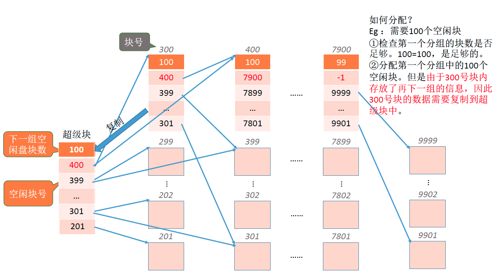

### 如何回收

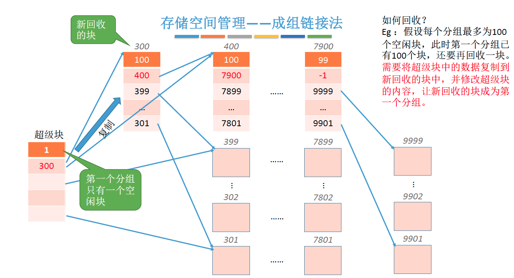

# 文件共享

# 文件保护

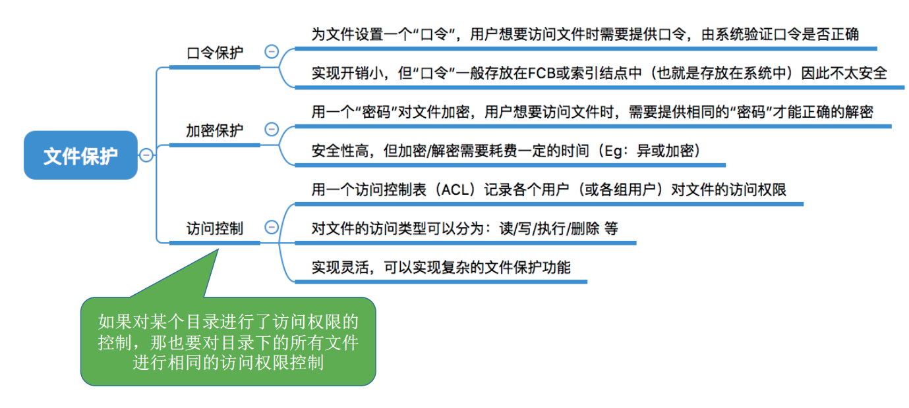

# 文件系统的层次结构

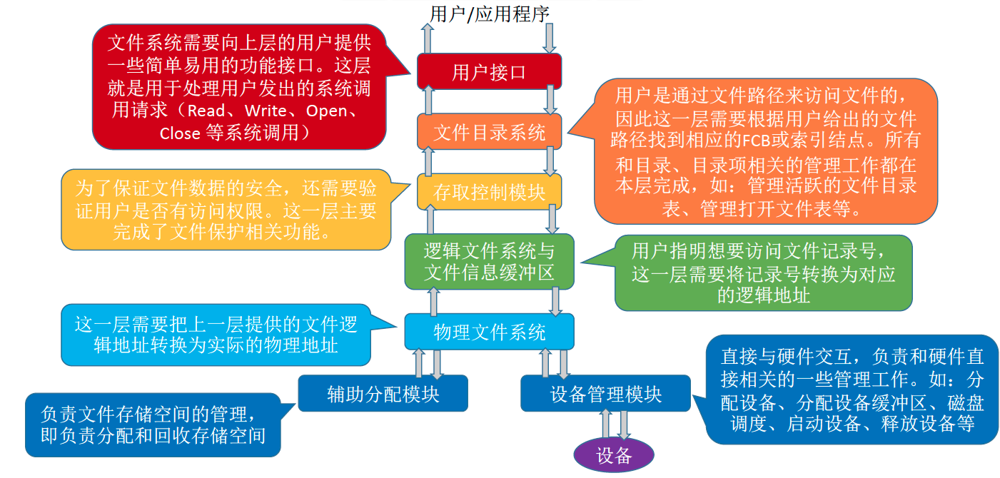

用一个例子来辅助记忆文件系统的层次结构：

假设某用户请求删除文件“D:/工作目录/学生信息.xlsx”的最后100条记录。

1. 用户需要通过操作系统提供的接口发出上述请求——用户接口

2. 由于用户提供的是文件的存放路径，因此需要操作系统一层一层地查找目录，找到对应的目录项——文件目录系统

3. 不同的用户对文件有不同的操作权限，因此为了保证安全，需要检查用户是否有访问权限——存取控制模块（存取控制验证层）

4. 验证了用户的访问权限之后，需要把用户提供的“记录号”转变为对应的逻辑地址——逻辑文件系统与文件信息缓冲区

5. 知道了目标记录对应的逻辑地址后，还需要转换成实际的物理地址——物理文件系统

6. 要删除这条记录，必定要对磁盘设备发出请求——设备管理程序模块

7. 删除这些记录后，会有一些盘块空闲，因此要将这些空闲盘块回收——辅助分配模块

# 磁盘的结构

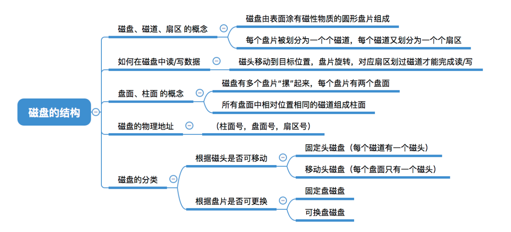

# 磁盘调度算法

## 一次磁盘读/写操作需要的时间

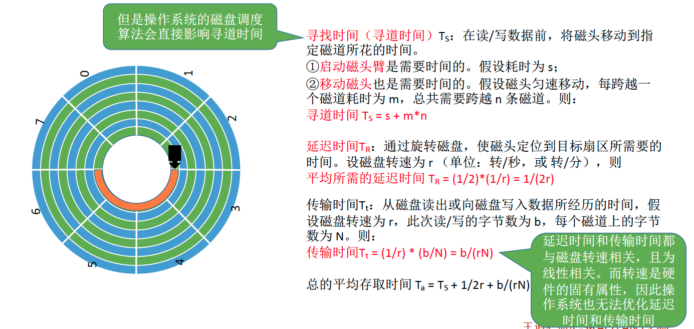

## 先来先服务算法（FCFS）

根据进程请求访问磁盘的先后顺序进行调度。

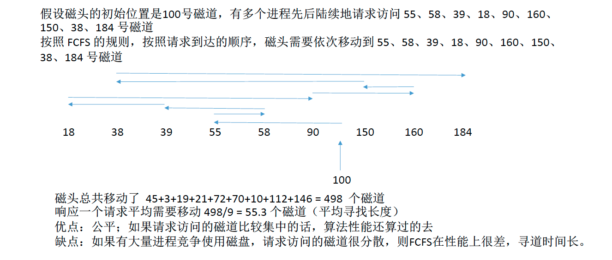

## 最短寻找时间优先（SSTF）

SSTF算法会优先处理的磁道是与当前磁头最近的磁道。可以保证每次的寻道时间最短，但是并不能保证总的寻道时间最短。（其实就是贪心算法的思想，只是选择眼前最优，但是总体未必最优）

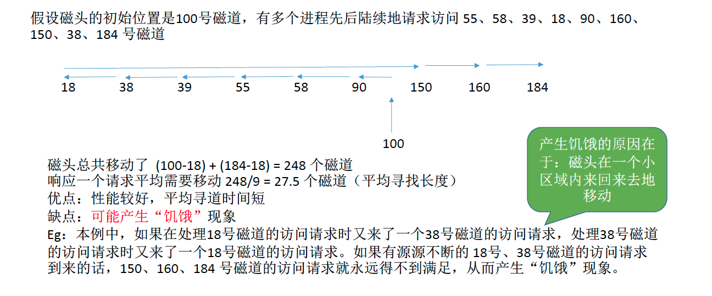

## 扫描算法（SCAN）

SSTF算法会产生饥饿的原因在于：磁头有可能在一个小区域内来回来去地移动。为了防止这个问题，

可以规定，只有磁头移动到最外侧磁道的时候才能往内移动，移动到最内侧磁道的时候才能往外移动。这就是扫描算法（SCAN）的思想。由于磁头移动的方式很像电梯，因此也叫电梯算法。

## LOOK调度算法

扫描算法（SCAN）中，只有到达最边上的磁道时才能改变磁头移动方向，事实上，处理了184号磁道的访问请求之后就不需要再往右移动磁头了。LOOK调度算法就是为了解决这个问题，如果在磁头移动方向上已经没有别的请求，就可以立即改变磁头移动方向。（边移动边观察，因此叫LOOK）

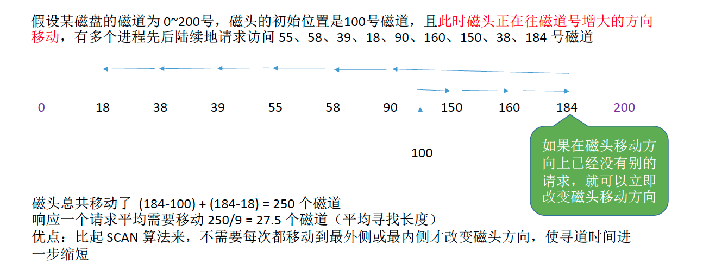

## 循环扫描算法（C-SCAN）

SCAN算法对于各个位置磁道的响应频率不平均，而C-SCAN算法就是为了解决这个问题。规定只有磁头朝某个特定方向移动时才处理磁道访问请求，而返回时直接快速移动至起始端而不处理任何请求。

## C-LOOK调度算法

C-SCAN算法的主要缺点是只有到达最边上的磁道时才能改变磁头移动方向，并且磁头返回时不一定需要返回到最边缘的磁道上。C-LOOK算法就是为了解决这个问题。如果磁头移动的方向上已经没有磁道访问请求了，就可以立即让磁头返回，并且磁头只需要返回到有磁道访问请求的位置即可。

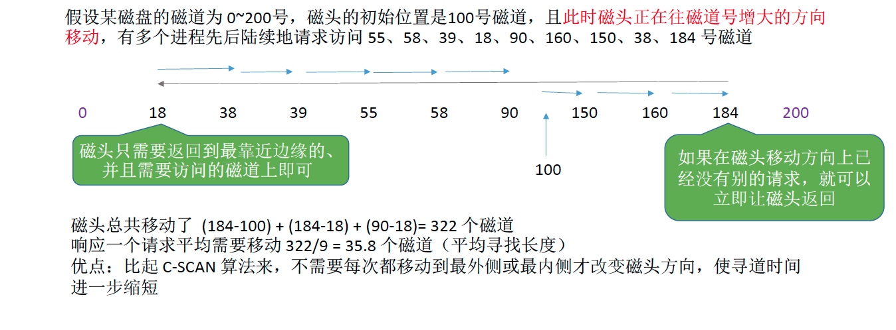

## 减少延迟时间的方法

### 交替编号

若采用交替编号的策略，即让逻辑上相邻的扇区在物理上有一定的间隔，可以使读取连续的逻辑扇区所需要的延迟时间更小。

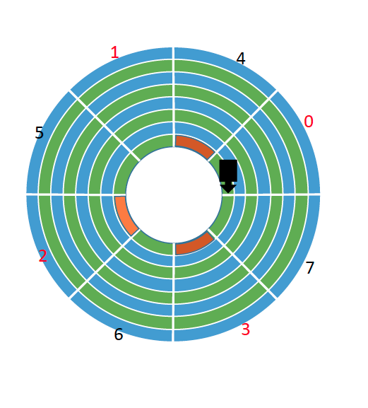

### 磁盘地址结构的设计

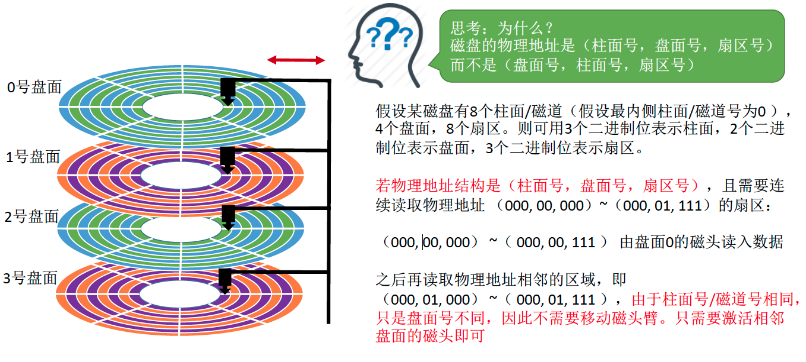

为什么磁盘的物理地址是（柱面号，盘面号，扇区号）而不是（盘面号，柱面号，扇区号）？

读取地址连续的磁盘块时，采用（柱面号，盘面号，扇区号）的地址结构可以减少磁头移动消耗的时间

### 错位命名

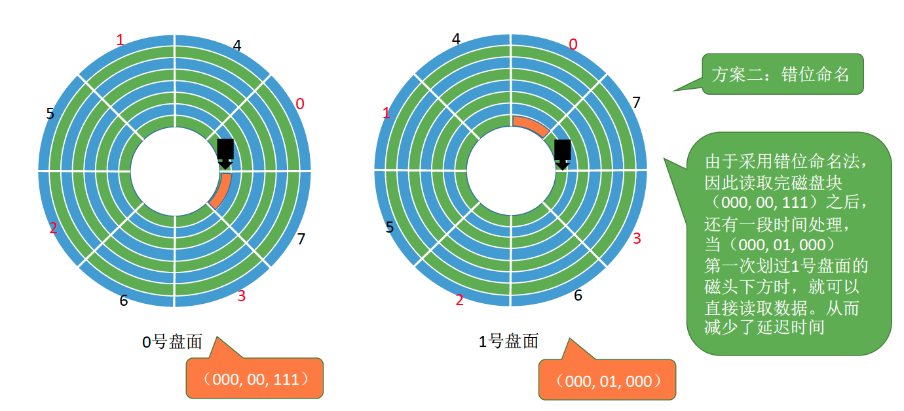

# 磁盘的管理

## 磁盘初始化

Step 1：进行低级格式化（物理格式化），将磁盘的各个磁道划分为扇区。一个扇区通常可分为头、数据区域（如512B大小）、尾三个部分组成。管理扇区所需要的各种数据结构一般存放在头、尾两个部分，包括扇区校验码（如奇偶校验、CRC循环冗余校验码等，校验码用于校验扇区中的数据是否发生错误）

Step 2：将磁盘分区，每个分区由若干柱面组成（即分为我们熟悉的C盘、D盘、E盘）

Step 3：进行逻辑格式化，创建文件系统。包括创建文件系统的根目录、初始化存储空间管理所用的数据结构（如位示图、空闲分区表）

## 坏块的管理

坏了、无法正常使用的扇区就是“坏块”。这属于硬件故障，操作系统是无法修复的。应该将坏块标记出来，以免错误地使用到它。

对于简单的磁盘，可以在逻辑格式化时（建立文件系统时）对整个磁盘进行坏块检查，标明哪些扇区是坏扇区，

比如：在FAT表上标明。（在这种方式中，坏块对操作系统不透明）

对于复杂的磁盘，磁盘控制器（磁盘设备内部的一个硬件部件）会维护一个坏块链表。在磁盘出厂前进行低级格式化（物理格式化）时就将坏块链进行初始化。

会保留一些“备用扇区”，用于替换坏块。这种方案称为扇区备用。且这种处理方式中，坏块对操作系统透明。

