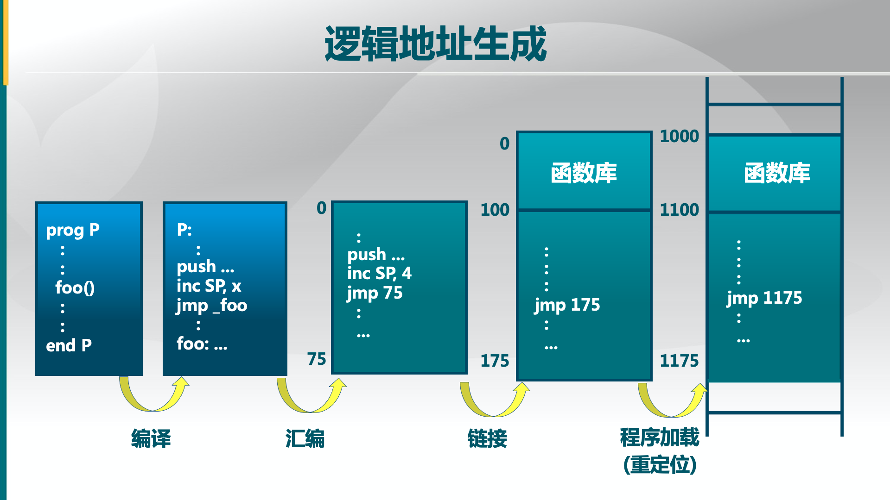
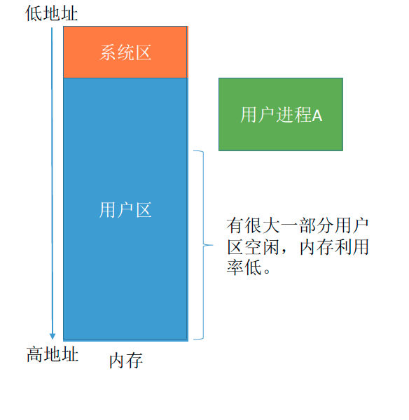
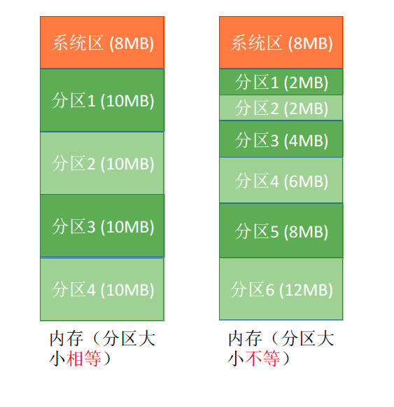
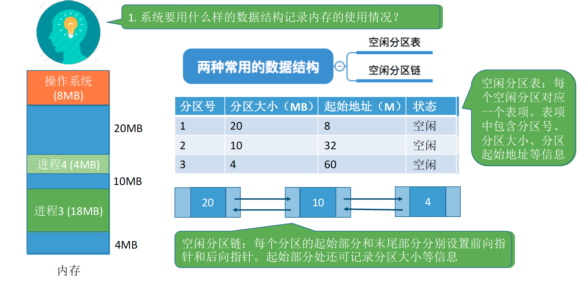

# 物理内存管理：连续内存分配

## 计算机体系结构：

基本硬件结构: CPU（程序执行处），内存（放置了代码和处理的数据），设备（I/O）

### 内存的层次结构: 

CPU的数据放的位置，寄存器和CACHE都在CPU内部，速度快容量小，主存（物理内存）放操作系统本身和应用，通过交换/分页和磁盘交互，将永久保存的数据放到磁盘中（虚拟内存），慢而容量大，5ms寻道时间。

## 操作系统的内存管理

- 抽象，逻辑地址空间；
- 保护，独立地址空间；
- 共享，访问相同内存；
- 虚拟化，更多的地址空间，对应用程序透明

### 操作系统中采用的内存管理方式

- 重定位
- 分段
- 分页
- 虚拟存储
  - **目前多数系统(如 Linux)采用按需页式虚拟存储**

### 实现高度依赖硬件

- 与计算机存储架构紧耦合
- MMU (内存管理单元): 处理CPU存储访问请求的硬件

## 地址空间与地址生成

### 地址空间的定义

- 物理地址空间：硬件支持的地址空间
- 逻辑地址空间：一个运行的程序所拥有的内存范围

### 逻辑地址生成

##  进程运行的基本原理

### 指令的工作原理

CPU按照程序段的指令去内存某个位置存取数据，一条指令由操作码+若干参数组成 编译生成的指令中一般使用逻辑地址

### 从写程序到程序运行

#### ● 编辑源文件

#### ● 编译

源代码文件(.c)生成目标模块(.o)，将高级语言翻译为机器语言 每一个目标模块都具有独立的逻辑地址 0-xxx

#### ● 链接

目标模块生成装入模块(可执行文件,如.exe)，链接完成使得各模块形成整体的链接地址

#### ● 装入(载)

将装入模块装入内存运行，装入后形成物理地址

### 三种链接方式

#### ● 静态链接

装入前链接成一个完整模块

#### ● 装入时动态链接

运行前边装入边链接

#### ● 运行时动态链接

运行时需要什么模块才装入并链接

### 地址重定位的三种装入方式

为了使编程更方便，程序员写程序时应该只需要关注指令、数据的逻辑地址。而逻辑地址到物理地址

的转换（这个过程称为地址重定位）应该由操作系统负责，这样就保证了程序员写程序时不需要关注

物理内存的实际情况。

#### ● 绝对装入

编译时产生绝对地址，只适用于单道程序环境(那时候还没有操作系统，编译器负责实现)

#### ● 可重定位装入(静态重定位)

编译链接后的装入模块地址是逻辑地址，装入时进行重定位，将指令中逻辑地址+装入的起始物理地址得到真实的物理地址 一个作业装入内存时，必需分配其要求的全部内存空间，内存不够就不能装入 作业一旦进入内存，运行期间就不能再移动，也不能再申请内存空间，因为地址都写死了 早期多道批处理操作系统使用

#### ● 动态运行时装入(动态重定位)

运行时才将逻辑地址转换为物理地址，需要设置重定位寄存器(或者叫基址寄存器) 允许程序在内存中发生移动，而且程序可以分配到不连续的储存区，也支持动态申请内存 只需装入部分代码即可投入运行，可以向用户提供一个比存储空间大得多的地址空间 现代操作系统使用

### 内存保护

内存保护可采取两种方法：

#### 方法一：

在CPU中设置一对上、下限寄存器，存放进程的上、下限地址。进程的指令要访问某个地址时，CPU检查是否越界。

#### 方法二：

采用重定位寄存器（又称基址寄存器）和界地址寄存器（又称限长寄存器）进行越界检查。

重定位寄存器中存放的是进程的起始物理地址。界地址寄存器中存放的是进程的最大逻辑地址。

## 连续内存分配管理方式

连续分配：指为用户进程分配的必须是一个连续的内存空间。

### 单一连续分配

在单一连续分配方式中，内存被分为系统区和用户区。在单一连续分配方式中，内存被分为系统区和用户区。系统区通常位于内存的低地址部分，用于存放操作系统相关数据；用户区用于存放用户进程相关数据。内存中只能有一道用户程序，用户程序独占整个用户区空间。

优点：实现简单；无外部碎片；可以采用覆盖技术扩充内存；不一定需要采取内存保护（eg：早期的PC 操作系统MS-DOS）。

缺点：只能用于单用户、单任务的操作系统中；有内部碎片（分配给某进程的内存区域中，如果有些部分没有用上，就是“内部碎片”）；存储器利用率极低。

### 固定分区分配

20世纪60年代出现了支持多道程序的系统，为了能在内存中装入多道程序，且这些程序之间又不会相互干扰，于是将整个用户空间划分为若干个固定大小的分区，在每个分区中只装入一道作业，这样就形成了最早的、最简单的一种可运行多道程序的内存管理方式。

分区大小相等：缺乏灵活性，但是很适合用于用一台计算机控制多个相同对象的场合（比如：钢铁厂有n个相同的炼钢炉，就可把内存分为n个大小相等的区域存放n个炼钢炉控制程序）

分区大小不等：增加了灵活性，可以满足不同大小的进程需求。根据常在系统中运行的作业大小情况进行划分（比如：划分多个小分区、适量中等分区、少量大分区）

操作系统需要建立一个数据结构——分区说明表，来实现各个分区的分配与回收。每个表项对应一个分区，通常按分区大小排列。每个表项包括对应分区的大小、起始地址、状态（是否已分配）。

当某用户程序要装入内存时，由操作系统内核程序根据用户程序大小检索该表，从中找到一个能满足大小的、未分配的分区，将之分配给该程序，然后修改状态为“已分配”。

优点：实现简单，无外部碎片。

缺点：a. 当用户程序太大时，可能所有的分区都不能满足需求，此时不得不采用覆盖技术来解决，但这又会降低性能；b. 会产生内部碎片，内存利用率低。

### 动态分区分配

动态分区分配又称为可变分区分配。这种分配方式不会预先划分内存分区，而是在进程装入内存时，根据进程的大小动态地建立分区，并使分区的大小正好适合进程的需要。因此系统分区的大小和数目是可变的。

把一个新作业装入内存时，须按照一定的动态分区分配算法，从空闲分区表（或空闲分区链）中选出一个分区分配给该作业。由于分配算法算法对系统性能有很大的影响，因此人们对它进行了广泛的研究。

动态分区分配又称为可变分区分配。这种分配方式不会预先划分内存分区，而是在进程装入内存时，根据进程的大小动态地建立分区，并使分区的大小正好适合进程的需要。因此系统分区的大小和数目是可变的。

动态分区分配没有内部碎片，但是有外部碎片。

内部碎片，分配给某进程的内存区域中，如果有些部分没有用上。

外部碎片，是指内存中的某些空闲分区由于太小而难以利用。

如果内存中空闲空间的总和本来可以满足某进程的要求，但由于进程需要的是一整块连续的内存空间，因此这些“碎片”不能满足进程的需求。可以通过紧凑（拼凑，Compaction）技术来解决外部碎片。