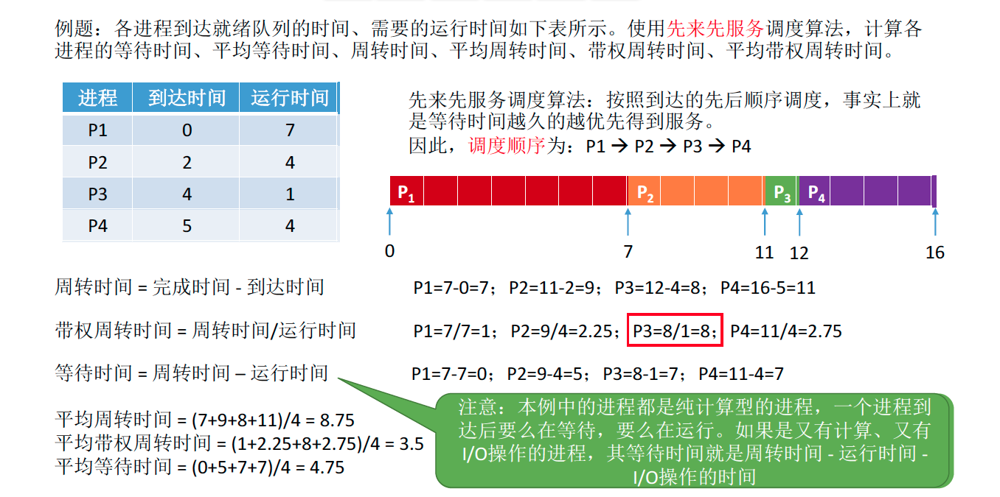
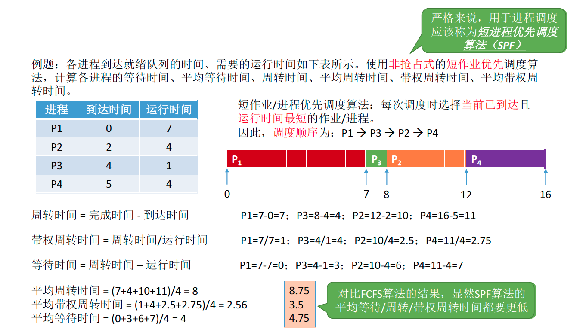
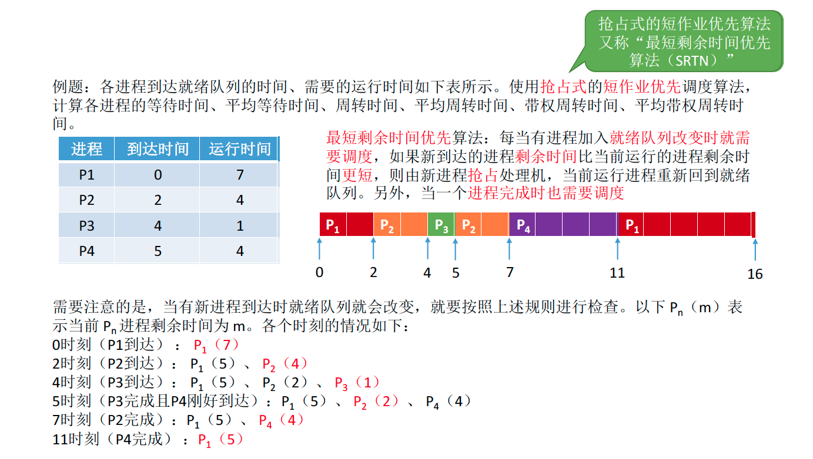
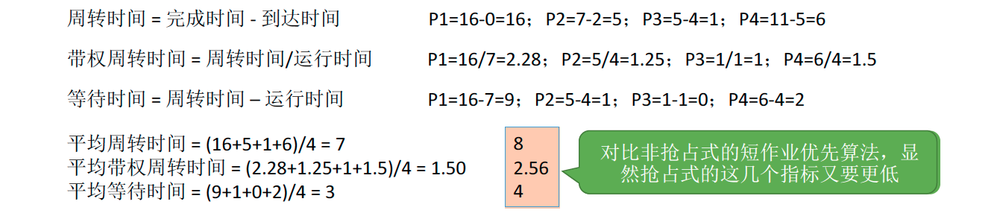
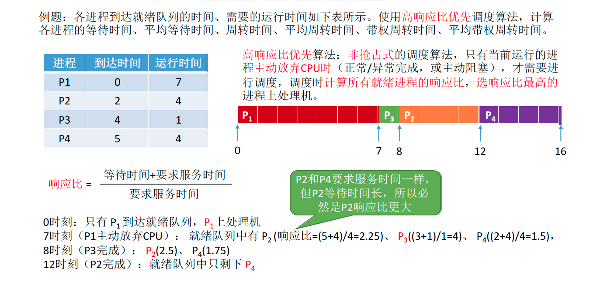

# 进程调度算法

## 调度算法的评价指标

### CPU利用率

由于早期的CPU造价极其昂贵，因此人们会希望**让CPU尽可能多地工作**

CPU利用率：指CPU “忙碌”的时间占总时间的比例。

利用率 = 忙碌的时间/总时间

Tips: 有的题目还会要求计算某种设备的利用率

Eg：某计算机只支持单道程序，某个作业刚开始需要在CPU上运行5秒，再用打印机打印输出5秒，之后再执行5秒，才能结束。在此过程中，

CPU利用率、打印机利用率分别是多少？

CPU利用率 = ( 5+5 ) / ( 5+5+5 ) = 66.66%

打印机利用率 = 5 / 15 = 33.33%

Tips:  通常会考察多道程序并发执行的情况，可以用“甘特图”来辅助计算

### 系统吞吐量

对于计算机来说，希望能用尽可能少的时间处理完尽可能多的作业

系统吞吐量：单位时间内完成作业的数量

系统吞吐量=总共完成了多少道作业 / 总共花了多少时间

Eg：某计算机系统处理完10道作业，共花费100秒，则系统吞吐量为？

10 / 100 = 0.1 道/秒

### 周转时间

对于计算机的用户来说，他很关心自己的作业从提交到完成花了多少时间。

周转时间，是指从作业被提交给系统开始，到作业完成为止的这段时间间隔。

它包括四个部分：作业在外存后备队列上等待作业调度（高级调度）的时间、进程在就绪队列上等待进程调度（低级调度）的时间、进程在CPU上执行的时间、进程等待I/O操作完成的时间。后三项在一个作业的整个处理过程中，可能发生多次。

（作业）周转时间= 作业完成时间 – 作业提交时间

【对于用户来说，更关心自己的单个作业的周转时间】

平均周转时间 = 各作业周转时间之和 / 作业数

【对于操作系统来说，更关心系统的整体表现，因此更关心所有作业周转时间的平均值】

带权周转时间 = 作业周转时间 / 作业实际运行的时间 = ( 作业完成时间 – 作业提交时间 ) / 作业实际运行的时间

【带权周转时间与周转时间都是越小越好】

平均带权周转时间 = 各作业带权周转时间之和 / 作业数

【对于周转时间相同的两个作业，实际运行时间长的作业在相同时间内被服务的时间更多，带权周转时间更小，用户满意度更高。】

【对于实际运行时间相同的两个作业，周转时间短的带权周转时间更小，用户满意度更高】

### 等待时间

计算机的用户希望自己的作业尽可能少的等待处理机

等待时间，指进程/作业处于等待处理机状态时间之和，等待时间越长，用户满意度越低。

对于进程来说，等待时间就是指进程建立后**等待被服务的时间之和**，在等待I/O完成的期间其实进程也是在被服务的，所以不计入等待时间。

对于作业来说，不仅要考虑建立进程后的等待时间，还要加上作业在外存后备队列中等待的时间。

一个作业总共需要被CPU服务多久，被I/O设备服务多久一般是确定不变的，因此调度算法其实只会影响作业/进程的等待时间。当然，与前面指标类似，也有“**平均等待时间**”来评价整体性能。

### 响应时间

对于计算机用户来说，会希望自己的提交的请求（比如通过键盘输入了一个调试命令）尽早地开始被系统服务、回应。

响应时间，指从用户提交请求到首次产生响应所用的时间。

## 先来先服务算法（FCFS, First Come First Serve）

### 算法思想

主要从“公平”的角度考虑（类似于我们生活中排队买东西的例子）

### 算法规则

按照作业/进程到达的先后顺序进行服务

### 用于作业/进程调度

用于作业调度时，考虑的是哪个作业先到达后备队列；用于进程调度时，考虑的是哪个进程先到达就绪队列

### 是否可抢占

非抢占式的算法

### 优缺点

优点：公平、算法实现简单

缺点：排在长作业（进程）后面的短作业需要等待很长时间，带权周转时间很大，对短作业来说用户体验不好。即，FCFS算法对长作业有利，对短作业不利（Eg ：排队买奶茶…）

### 是否会导致饥饿

不会

### 例题

## 短作业优先（SJF, Shortest Job First）

### 算法思想

追求最少的平均等待时间，最少的平均周转时间、最少的平均平均带权周转时间

### 算法规则

最短的作业/进程优先得到服务（所谓“最短”，是指要求服务时间最短）

### 用于作业/进程调度

即可用于作业调度，也可用于进程调度。用于进程调度时称为“短进程优先（SPF, Shortest Process First）算法”

### 是否可抢占

SJF和SPF是非抢占式的算法。但是也有抢占式的版本——最短剩余时间优先算法（SRTN, Shortest Remaining Time Next）

### 优缺点

优点：“最短的”平均等待时间、平均周转时间

缺点：不公平。对短作业有利，对长作业不利。可能产生饥饿现象。另外，作业/进程的运行时间是由用户提供的，并不一定真实，不一定能做到真正的短作业优先

### 是否会导致饥饿

会。如果源源不断地有短作业/进程到来，可能使长作业/进程长时间得不到服务，产生“饥饿”现象。如果一直得不到服务，则称为“饿死”

### 例题

### 注意细节

1. 如果题目中未特别说明，所提到的“短作业/进程优先算法”默认是非抢占式的
2. 很多书上都会说“SJF 调度算法的平均等待时间、平均周转时间最少”

严格来说，这个表述是错误的，不严谨的。之前的例子表明，最短剩余时间优先算法得到的平均等待时间、平均周转时间还要更少应该加上一个条件“在所有进程同时可运行时，采用SJF调度算法的平均等待时间、平均周转时间最少”；

或者说“在所有进程都几乎同时到达时，采用SJF调度算法的平均等待时间、平均周转时间最少”；

如果不加上述前提条件，则应该说“抢占式的短作业/进程优先调度算法（最短剩余时间优先, SRNT算法）的平均等待时间、平均周转时间最少”

3. 虽然严格来说，SJF的平均等待时间、平均周转时间并不一定最少，但相比于其他算法（如FCFS），SJF依然可以获得较少的平均等待时间、平均周转时间

4. 如果选择题中遇到“SJF 算法的平均等待时间、平均周转时间最少”的选项，那最好判断其他选项是不是有很明显的错误，如果没有更合适的选项，那也应该选择该选项。

## 高响应比优先（HRRN,Highest Response Ratio Next）

### 算法思想

要综合考虑作业/进程的等待时间和要求服务的时间

### 算法规则

在每次调度时先计算各个作业/进程的响应比，选择响应比最高的作业/进程为其服务

响应比 = ( 等待时间 + 要求服务时间 ) / 要求服务时间

### 用于作业/进程调度

即可用于作业调度，也可用于进程调度

### 是否可抢占

非抢占式的算法。因此只有当前运行的作业/进程主动放弃处理机时，才需要调度，才需要计算响应比

### 优缺点

综合考虑了等待时间和运行时间（要求服务时间）

等待时间相同时，要求服务时间短的优先（SJF 的优点）

要求服务时间相同时，等待时间长的优先（FCFS 的优点）

对于长作业来说，随着等待时间越来越久，其响应比也会越来越大，从而避免了长作业饥饿的问题

### 是否会导致饥饿

不会

### 例题

## FCFS、SJF、HRRN对比

这几种算法主要关心对用户的公平性、平均周转时间、平均等待时间等评价系统整体性能的指标，但是不关心“响应时间”，也并不区分任务的紧急程度，因此对于用户来说，交互性很糟糕。因此这三种算法一般适合用于早期的批处理系统，当然，FCFS算法也常结合其他的算法使用，在现在也扮演着很重要的角色。

